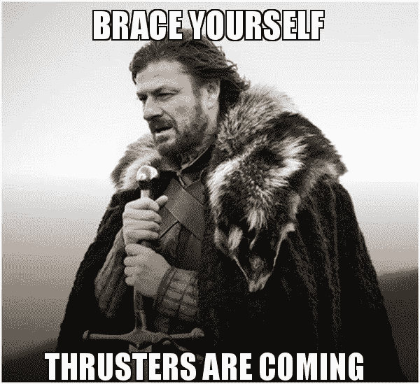
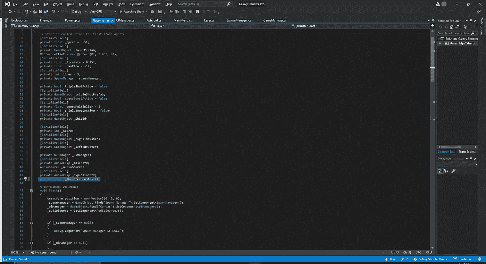
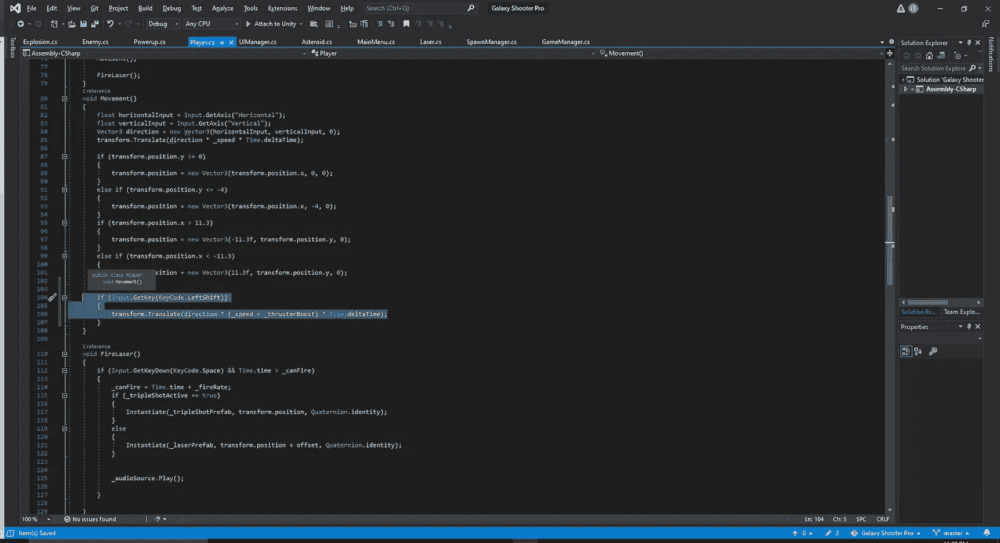
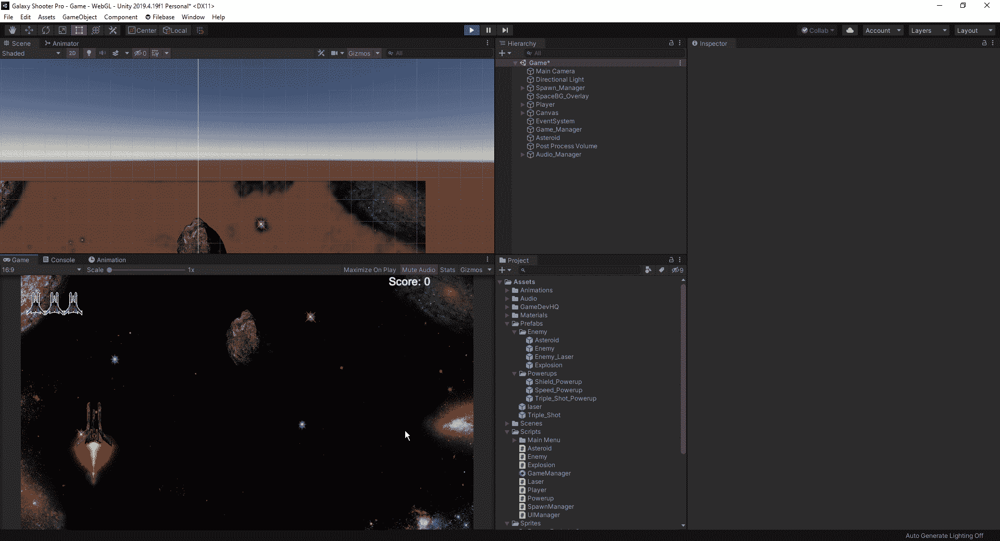

# 让我们添加一些玩家推进器

> 原文：<https://medium.com/nerd-for-tech/lets-add-some-player-thrusters-357403aeab91?source=collection_archive---------21----------------------->

现在我们已经完成了游戏的核心部分，让我们回过头来在游戏的各个部分做一些小的补丁来给它一个更新的感觉。四处移动并依靠速度提升来获得额外的小爆发速度是不错的，但今天我们将增加推进器的能力，所以我们有一个“冲刺”的功能。
首先，我们可以打开玩家脚本，创建一个新的变量:

从这里，我们可以向下移动到脚本的移动空白部分，只需添加一条快速线来表示当我们按住左移位时，我们希望推进器比我们没有激活它们时移动得更快:

当我们执行一个需要一直按下按键的动作时，我们可以简单地输入一个 GetKey 代码。这样，只要我们按下指定的键，我们就会激活我们的动作。
最后，我们可以看看它是如何在我们的游戏中实现的:

正如我们所看到的，推进器将增加我们的玩家速度，作为对潜力的进一步测试，它叠加在我们获得的速度提升上，并且当动力提升结束时，或者当我们决定放开换档按钮时，将正确地结束额外的提升。