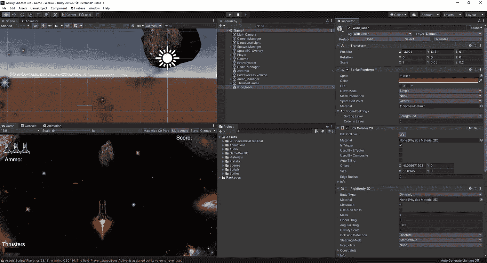
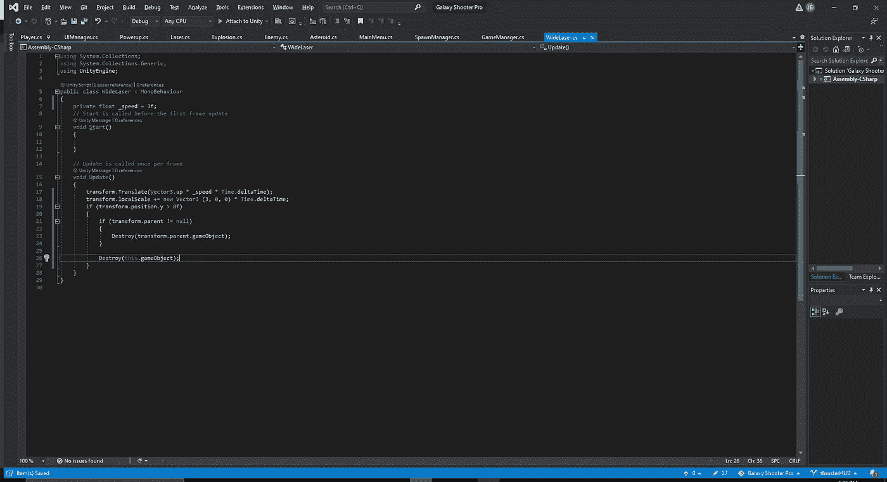
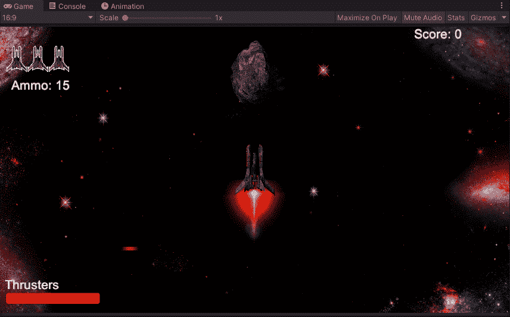
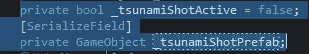
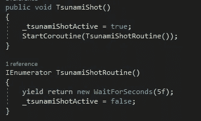
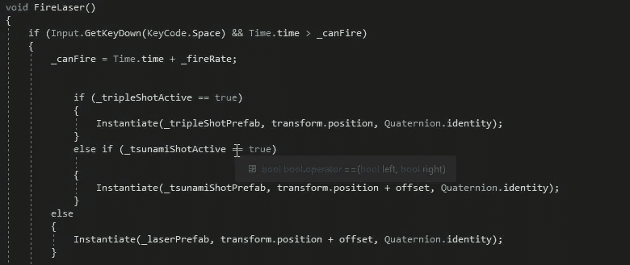
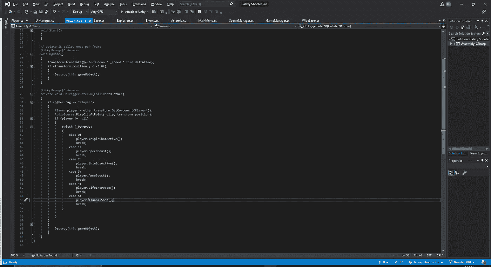
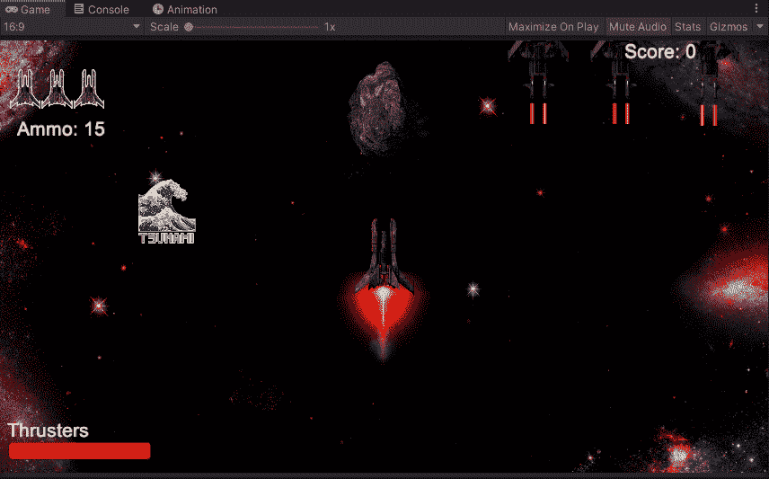

# 让我们添加一些“津神”的镜头

> 原文：<https://medium.com/nerd-for-tech/lets-add-some-tsumani-shots-32d0cb364671?source=collection_archive---------23----------------------->

今天我们将看看为我们的球员增加一种新的射击方式。我们已经有了基本镜头和三倍镜头，但现在我们要添加一个激光，它会在行进时扩大宽度，并摧毁它路径上的一切。这相对容易调整，因为我们只需将新激光器标记为“海啸”,并在敌人脚本中添加一行新代码，以说明与新激光器的交互。然而，在我们这样做之前，我们需要实际制作我们的激光预制品。我们所要做的就是创建一个当前激光预制组件的副本，并调整它的比例:

从这里开始，我们想要为海啸制作一个新的脚本，因为我们将有新的本能来运行它:

因为我们将让激光在行进过程中增长长度，所以我们将让它以一个缓慢的速率向上移动，以便让它有时间增长，最重要的是，当它出现在屏幕上时，我们将调整它的比例:

接下来，我们将需要在我们的播放器上创建一个变量来连接这个新的激光器，以及一个新的 bool，让我们知道是否已经收集了加电:

从这里，我们将创建一个新的协程和 void，类似于我们如何制作三重镜头，并将其附加到我们的 Fire() void:

从这里开始，我们可以向我们的 fire 方法添加一个新的 if 语句:

从这里开始，我们只需在 powerups 脚本的 switch 语句中添加一个新行，并在 spawn manager 脚本中更改我们的范围，以考虑新的 powerup 来生成和触发适当的函数。

现在，我们可以回到我们的编辑器，看看它是否如预期的那样工作:

好了，我们稍微调整了我们的精灵，让它看起来更像“海啸”,一次射击将会增长并摧毁其路径上的一切，而不会被摧毁。