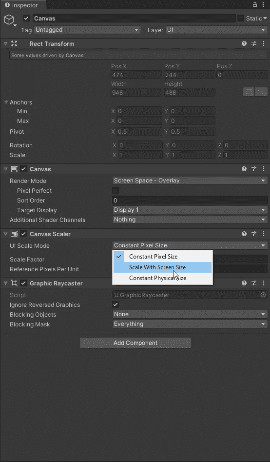
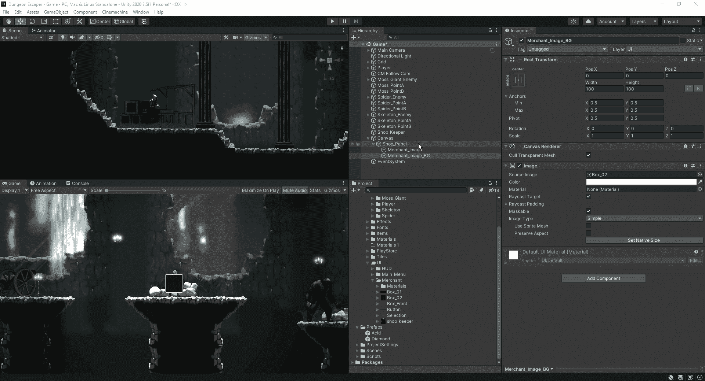
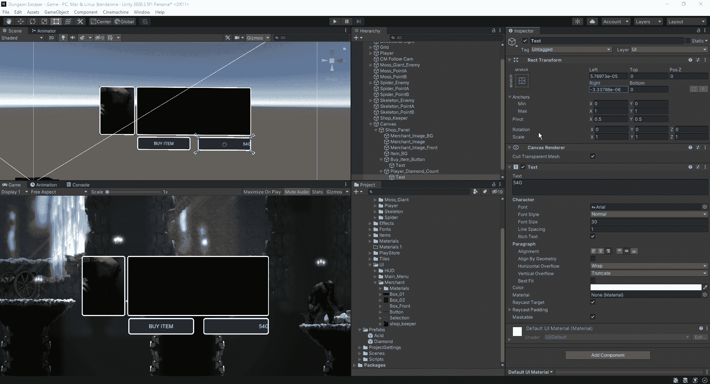
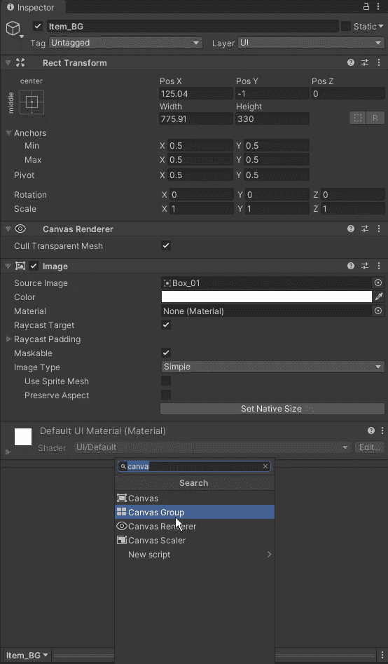
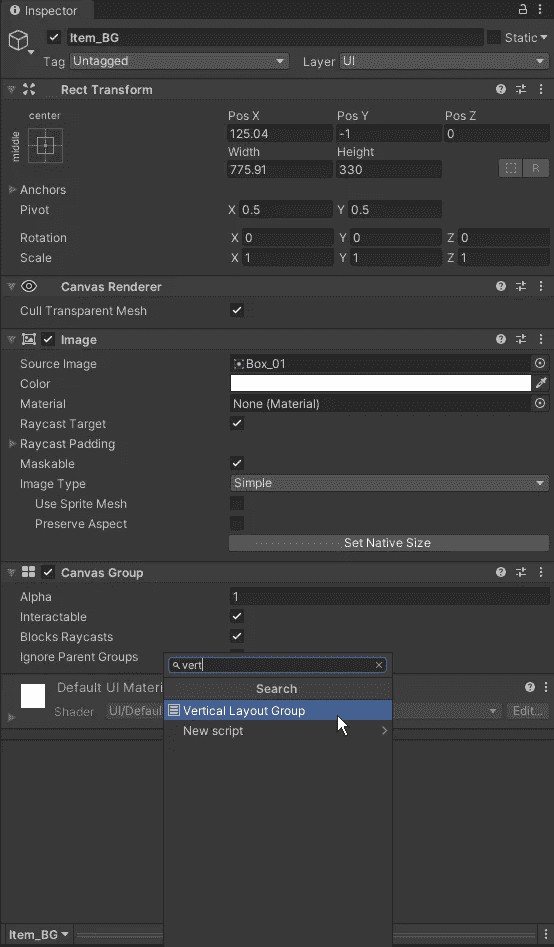
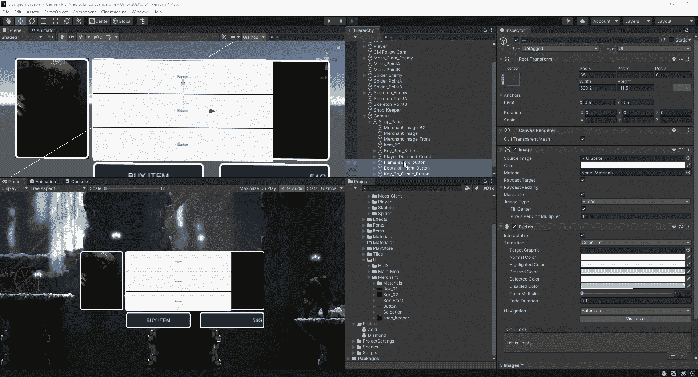
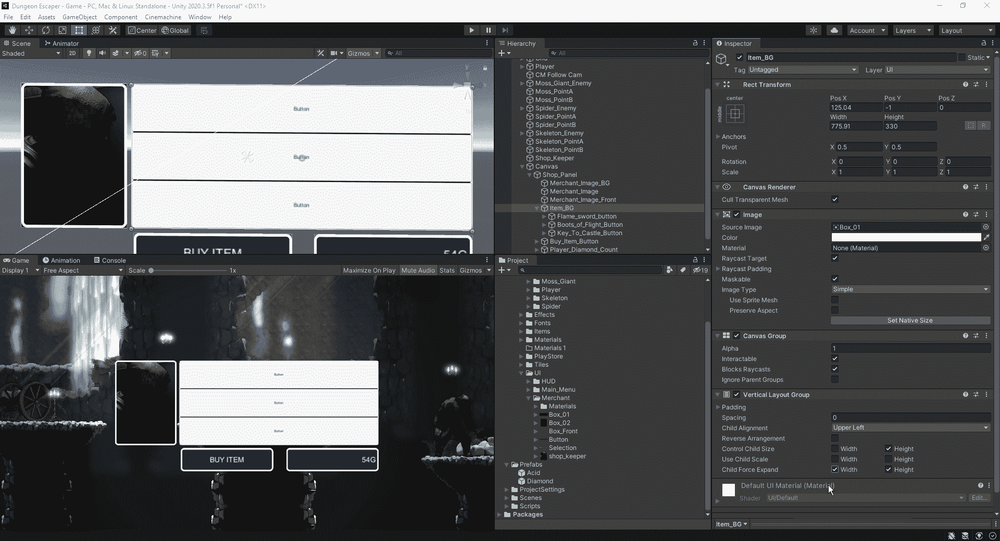
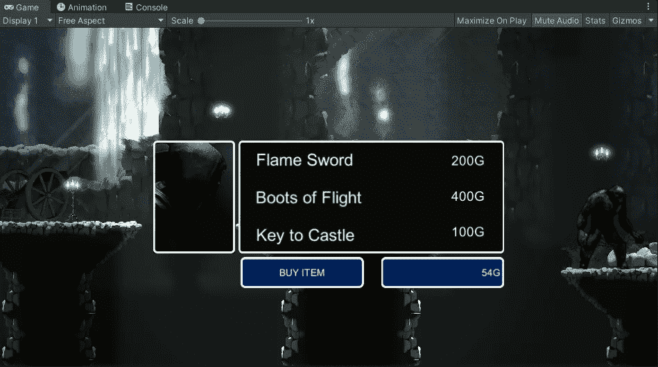
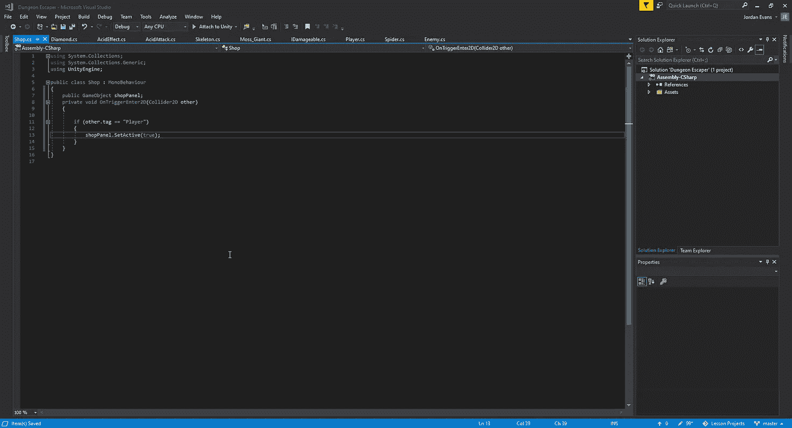
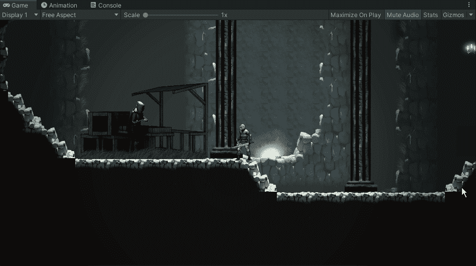

# 让我们建造我们的商店

> 原文：<https://medium.com/nerd-for-tech/lets-build-our-shop-6d6c3fd40d6f?source=collection_archive---------8----------------------->

所以，现在我们的游戏中有钻石可以收集，我们需要一些东西来花掉它们。我们接下来要建立的是一个商店系统，如果我们想继续种植这些物品的话，我们可以用这些辛苦赚来的钻石和其他一些物品来换取逃跑的钥匙。
首先，我们将在我们的层次结构中创建一个画布，并确保将我们的比例因子设置为与屏幕大小成比例:

从这里，我们可以创建我们的商人窗口，当我们与它交谈。当我们的窗口有多个层时，它们在层级中出现的顺序将决定它们在游戏中的顺序:

接下来，当我们处理商店的按钮时，我们希望确保将按钮中的文本设置到盒子的特定边缘。为了创建一个小的缓冲区，使它不会溢出按钮区域的边缘，我们可以调整它的位置:

现在，当我们决定在窗口区域内创建多个按钮时，我们可以移动它们，使它们成为所述图像的子图像，并且能够对它们进行同等的调整和缩放。首先，我们想要添加一个画布组，以及一个垂直布局组到我们的对象:

从这里开始，我们可以以相同的速度调整不同按钮的间距，这样我们就不用花费时间来修改以确保它看起来是相等的:

接下来，我们可以调整所有按钮在正方形中的大小，并通过控制孩子的大小来统一改变它们的大小，同时强制其扩展以适应正方形:

完成后，我们可以移除按钮的图像，并将过渡调整为无，这样我们就有了一个简单的商店窗口，可以与以下内容进行交互:

最后，让我们得到它，以便当我们的玩家进入我们商店的触发区域时，商店菜单打开。要做到这一点，我们需要添加一个碰撞器，一个刚体和一个商店脚本到我们的商店管理员。从那里，在我们的脚本中，我们将创建一个 OnTrigger 事件来打开我们的商店橱窗:

最后，让我们看看它在我们的游戏中是如何进行的:

现在我们已经设计并设置好了商店橱窗，我们将在下一个游戏的创建中看看如何开始我的 OnClick 事件。