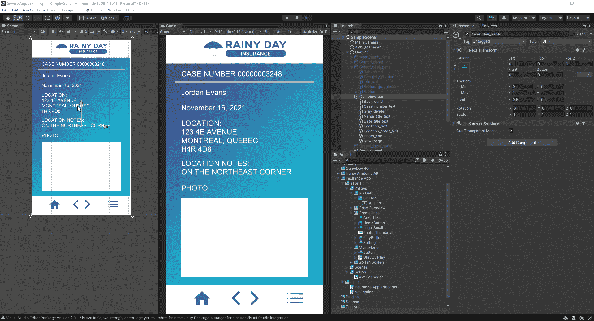
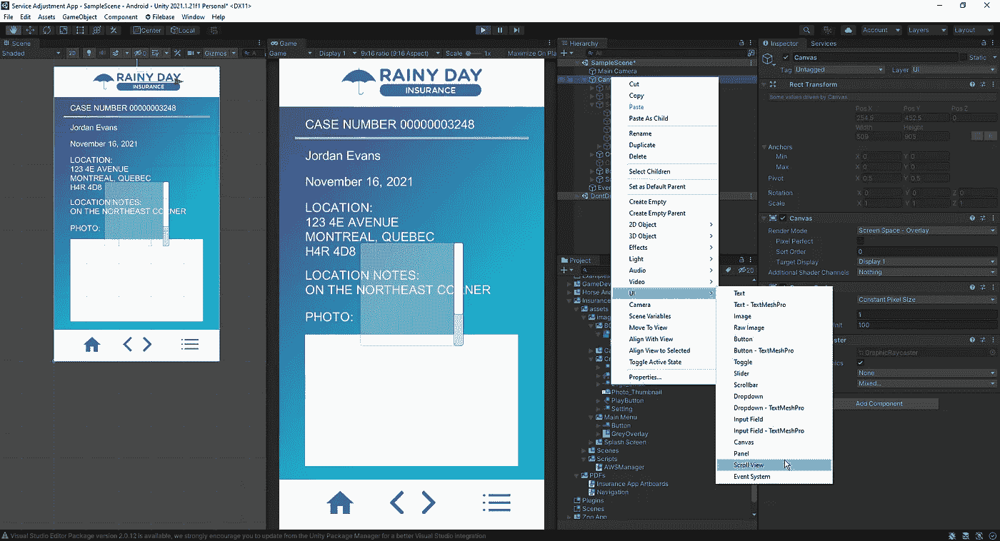
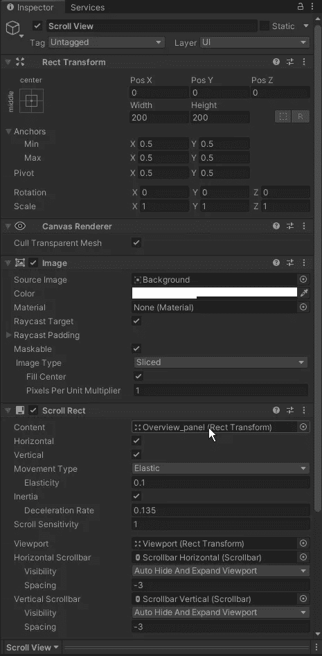
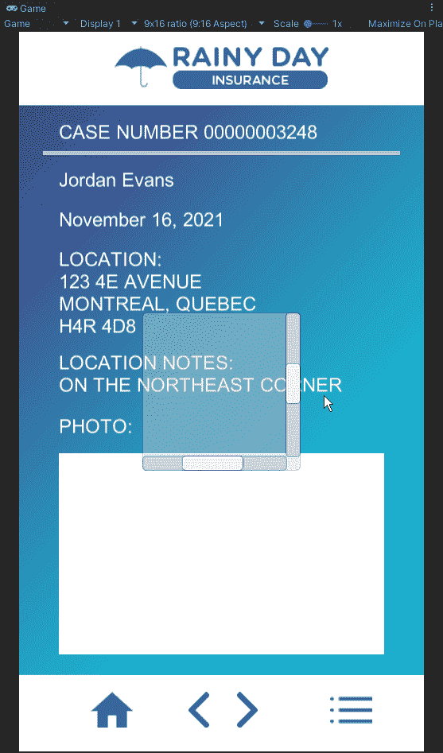
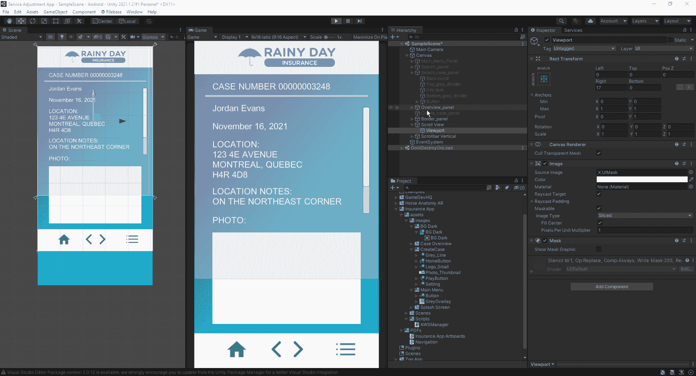
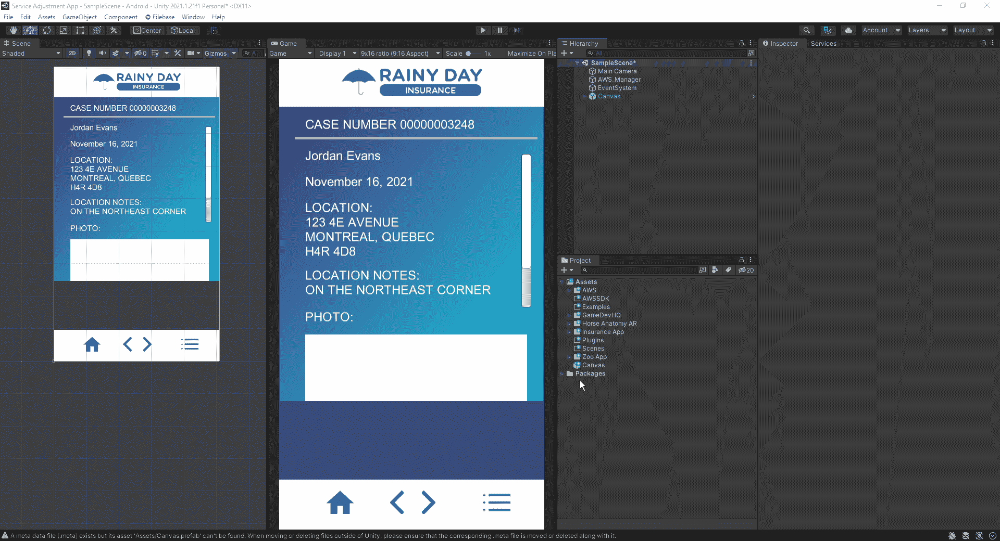
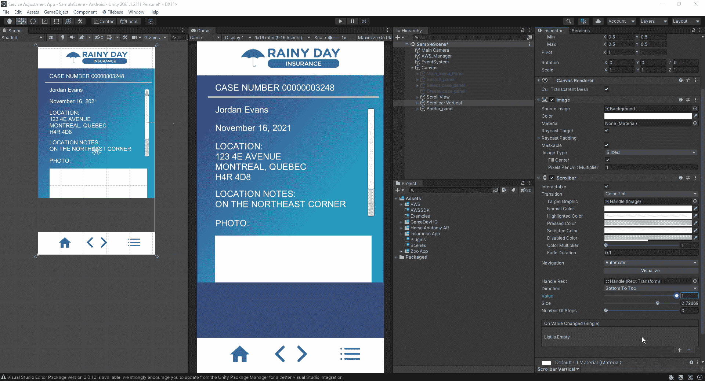
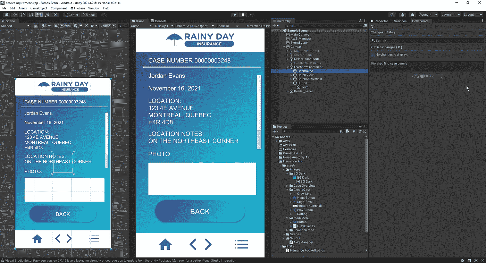

# 让我们创建一个滚动面板

> 原文：<https://medium.com/nerd-for-tech/lets-create-a-scrolling-panel-77b977588d0c?source=collection_archive---------6----------------------->

在我们开始将面板链接在一起之前，让我们快速地看一下如何创建一个面板，使我们能够向上滚动以查看更多信息:

正如我们在当前面板中看到的，如果我们想要向上滚动，有一些事情需要解决。首先，我们需要实际放置一个滚动方法，而不仅仅是我们从场景视图中自己移动它:

为了让这个工作更容易开始，我们将在程序运行时构建所有这些。这将允许我们在实际的游戏视图中使用滚动选项，而不必在层级中的不同对象之间不停地旋转。一旦我们创建了我们的滚动视图，我们将希望把我们想要滚动的面板附加到 scroll rect，并查看它是否如我们所希望的那样工作:

通过将面板移动到视口中，我们能够在屏幕底部为我们想要放置的后退按钮创建一个死区。

在我们在游戏视图中做了任何额外的修改后，我们将需要保存这些修改，因为一旦我们停止游戏，层级中的所有修改都将被恢复。要做到这一点，我们只是要把我们的画布移动到项目文件夹，并把它变成一个预置。一旦我们停止游戏，画布将恢复到其原始视图:

一旦我们删除了我们的旧画布并拖动到预设中，我们就会想要删除那个预设。当这种情况发生时，我们将希望在层级上解包我们的预置，这样它就不再被认为是一个预置对象。修复后，我们可以继续在场景视图中进行进一步的更改，为了检查这些更改，我们可以简单地更改层次结构中 scroll rect 的值来移动我们的视图:

为了让我们的背景留在整个面板上，而不仅仅是视口，我们将希望从视口中移除背景图像，并将其插入到一个新的空对象中，该对象将容纳该面板的所有部分。然后我们也可以为底部的空白区域创建一个按钮:

既然我们已经知道了如何创建一个滚动面板，我们将看看如何创建添加图片的功能，并集成 gps 位置标记，然后通过代码将它们链接在一起，这样我们就可以访问我们想要的面板。