# 让我们用 GitLab 页面创建一个网站

> 原文：<https://medium.com/nerd-for-tech/lets-create-a-website-with-gitlab-pages-4ed9d5860446?source=collection_archive---------3----------------------->

图片来源:Unsplash 的 Christopher Gower

是时候探索 DevOps 的另一个重要方面了:CI/CD！

这个项目任务提供了一个机会来实现我到目前为止所学到的关于 CI/CD 流程的知识，并接触到 GitLab 平台上的网站托管。这个项目的灵感来自于通过编程 Liftoff 观看一个 You Tube [视频](https://www.youtube.com/watch?v=cERdbQ-GgOo)。

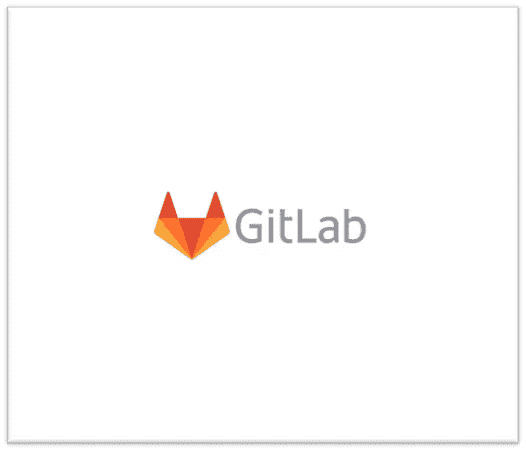

**什么是 CI/CD？**

根据用户的偏好，CI/CD 是代表“持续集成/持续交付”或“持续部署”的首字母缩写词抛开语义不谈，CI/CD 是 DevOps 的核心支柱之一。CI/CD 方法通过管道将自动化和代码集成结合起来，向最终用户交付内容。这个过程包括四个部分:

**来源:**管道的初始化，由代码库提示

**构建:**融合源代码创建一个功能实例

测试:验证我们代码的各个方面

**部署:**代码的部署(也称为“生产”)

**git lab 是什么？**

在其网站上， [GitLab](https://about.gitlab.com/what-is-gitlab/) 将自己描述为“开放的 DevOps 平台，作为单一应用交付。”这种区别使 GitLab 独一无二，并创建了一个简化的软件工作流程。“作为一名新的 GitLab 用户，我注意到 GitLab 不仅仅是作为项目的存储库，还提供 CI/CD 特性。在其众多功能中，GitLab 还具有安全措施和监控项目分析的能力。

**集结地**

GitLab 账户

如果您没有 GitLab 帐户，请点击此处的[创建一个。](https://gitlab.com/users/sign_up)

第一步:创建一个新项目

登录 GitLab 帐户后，选择“创建新项目”选项，然后单击“创建空白项目”图标。

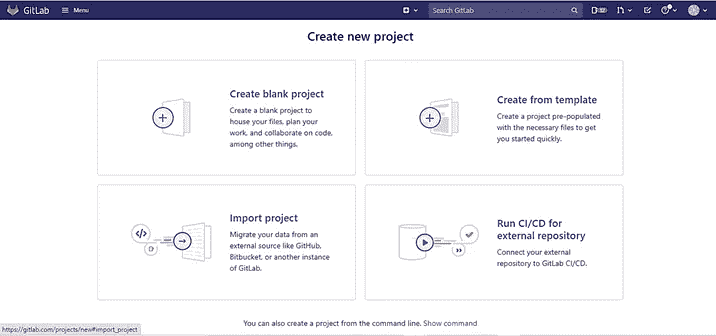

GitLab 的“创建新项目”页面截图。

此时，我们将输入我们的项目名称。您还可以选择键入描述和创建“自述”文件。完成后，点击“创建项目”

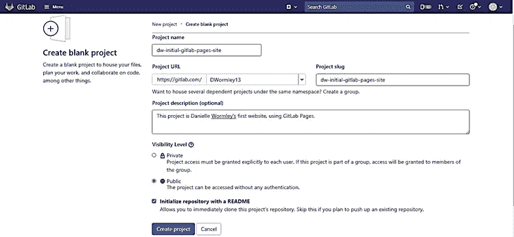

“创建空白项目”页面的图像，带有该项目的名称、URL、slug、描述和可见性。

我们成功地创建了项目。此时，我们不需要为我们的任务使用“SSH”选项。

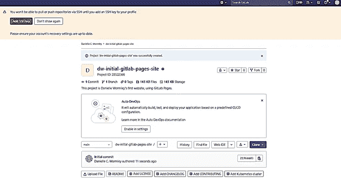

成功创建的项目的屏幕截图，带有关于 SSH 功能的通知。

现在，让我们点击“+”按钮，将出现一个下拉菜单。选择“新建文件”开始创建 HTML 文件的过程。

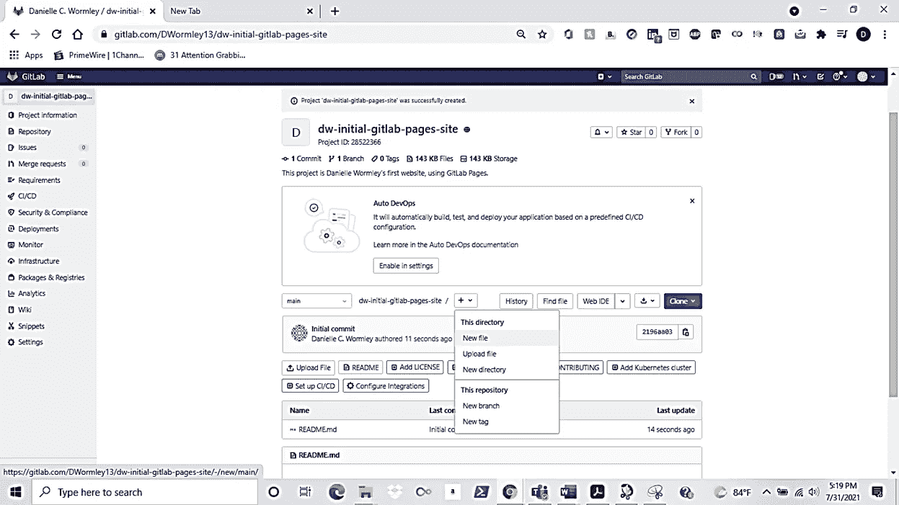

选择“新建文件”选项开始创建“index.html”文件的图片。

一旦页面出现，我们将使用 HTML 输入我们希望网站显示的内容。在这个页面上，我们需要包含一个提交消息，并将这个文件定位到主分支。请注意这个项目中的“主要”一词。在结束项目演练之前，我们将再次讨论这个问题。

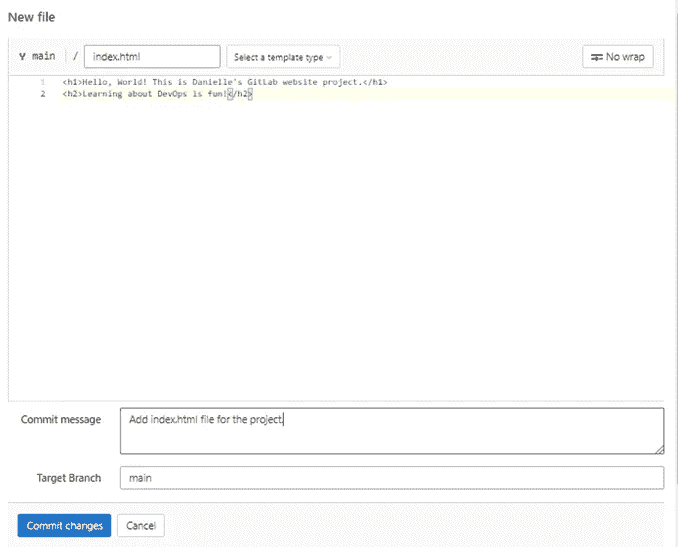

“新文件”页面的图像，开始构建我们的“index.html”文件。

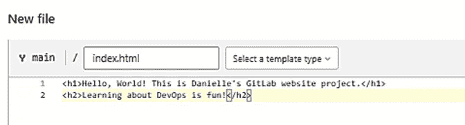

网站将向浏览者显示的信息的特写。

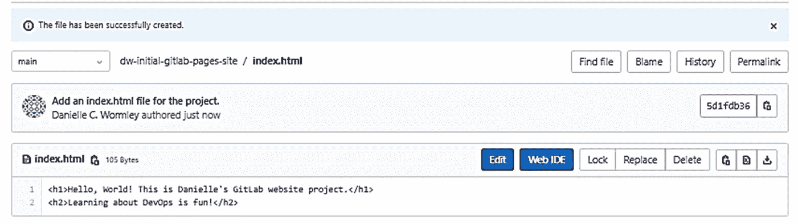

转发了关于在 GitLab 中成功创建文件的消息。

在为这个项目创建了一个 html 文件之后，我们将返回到这个项目的存储库页面，看到我们已经正确地生成了两个文件:README 和 index.html

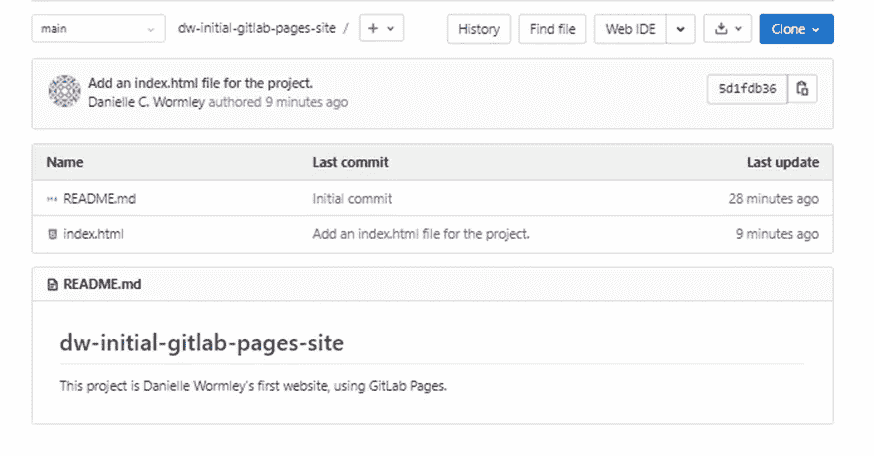

**第二步:** **生成配置文件**

我们的项目要求我们生成一个单独的配置文件，以确保成功的部署。这个新文件将指导 GitLab 将“index.html”文件视为一个网站。我们跟随的教程指引我们访问:[https://about . git lab . com/blog/2016/04/07/git lab-pages-setup/](https://about.gitlab.com/blog/2016/04/07/gitlab-pages-setup/)获取设置我们配置文件的信息。我们可以简单地复制并粘贴“步骤 2:添加配置文件:”中的内容。gitlab-ci.yml”页面。

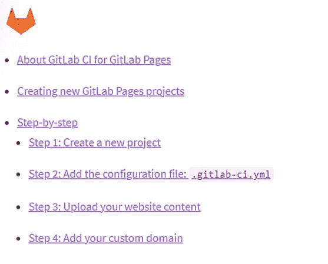

GitLab 网页网站

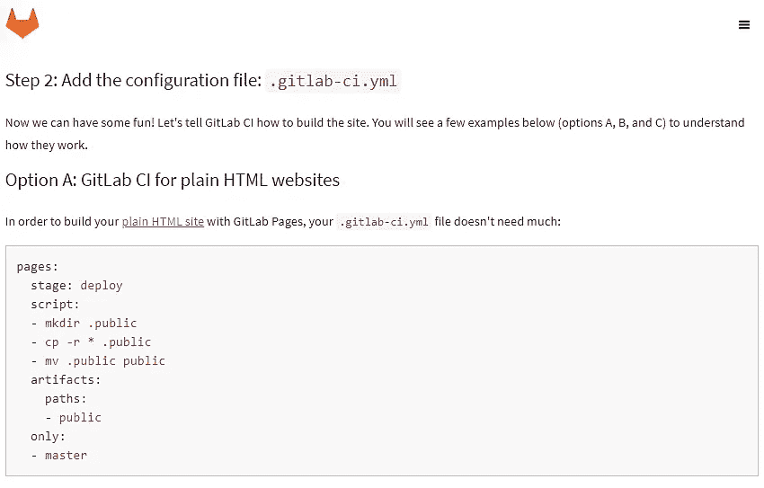

创建所需的内容。我们网站项目的 yml 文件。

在 GitLab 项目窗口的左侧，您会看到关于 CI/CD 的选项。继续导航，直到看到为管线创建新文件的提示。

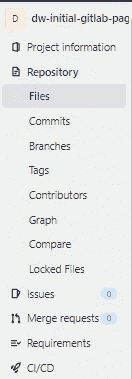

GitLab 项目窗口左侧的图像。

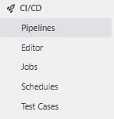

CI/CD 管道的下拉菜单。

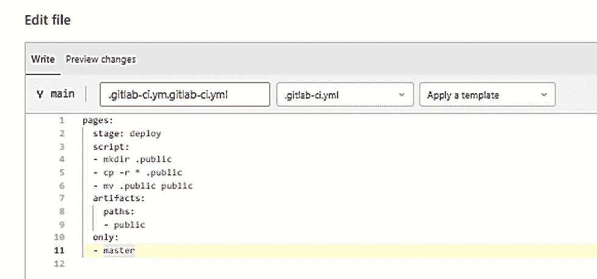

网站项目的配置文件内容。

**第三步:** **检查我们的工作**

创建完我们所有需要的文件后，是时候看看我们的新网站了！要查看我们的网站，我们必须遵循视频中分享的命名约定:[https://[用户名]. git lab . io/[项目名称]](/[username].gitlab.io/[projectname])

在这种情况下，这里是我们项目的具体网址:https://dwormley 13 . git lab . io/dw-initial-git lab-pages-website

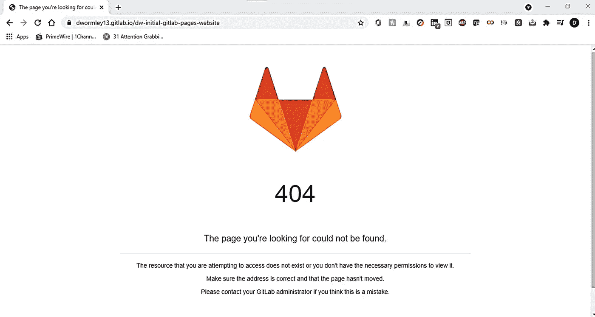

臭名昭著的“404”警告网页在互联网上找不到了。

不幸的是，我们的网站没有出现。让我们进行一些故障排除并确定错误！

**第四步:** **回顾并排查我们的工作**

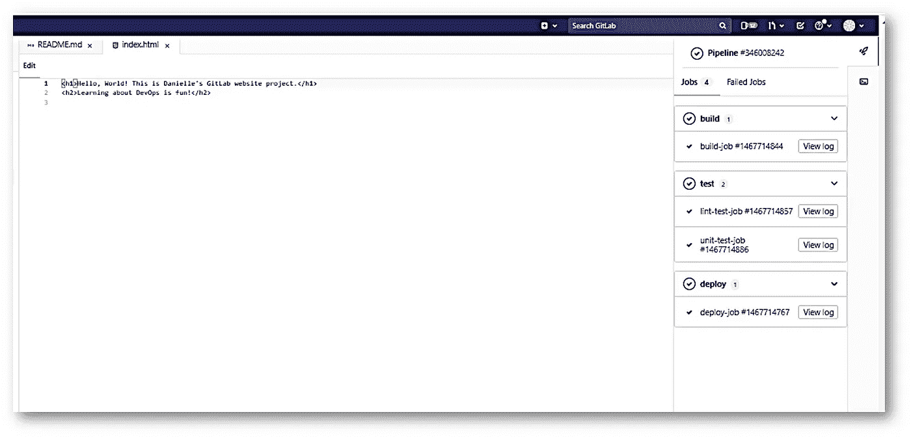

详细描述源、构建、测试和部署作业的输出屏幕不显示任何失败。

我决定查看的第一个地方是项目的 CI/CD 部分。对所有四项工作(源、构建、测试和部署)的审查没有发现任何失败。如果没有失败，那为什么网站没有出现？结果我完全被难倒了。

有什么问题吗？

思考了一个小时后，我想起了一位在 Tech 中处于[级别的教练最近告诉我们，GitLab 开始使用术语“main”，而不是“master”。语义能在 CI/CD 过程中发挥那么大的作用吗？让我们回到配置文件，更改代码的最后一个字，看看结果会怎样。](https://www.levelupintech.com/)

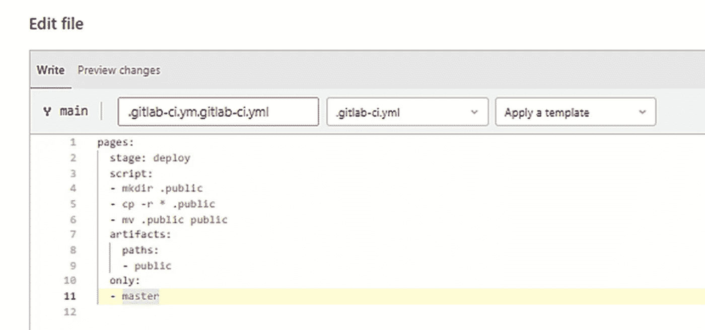

教程中建议的语言包括一个贬义词“master”

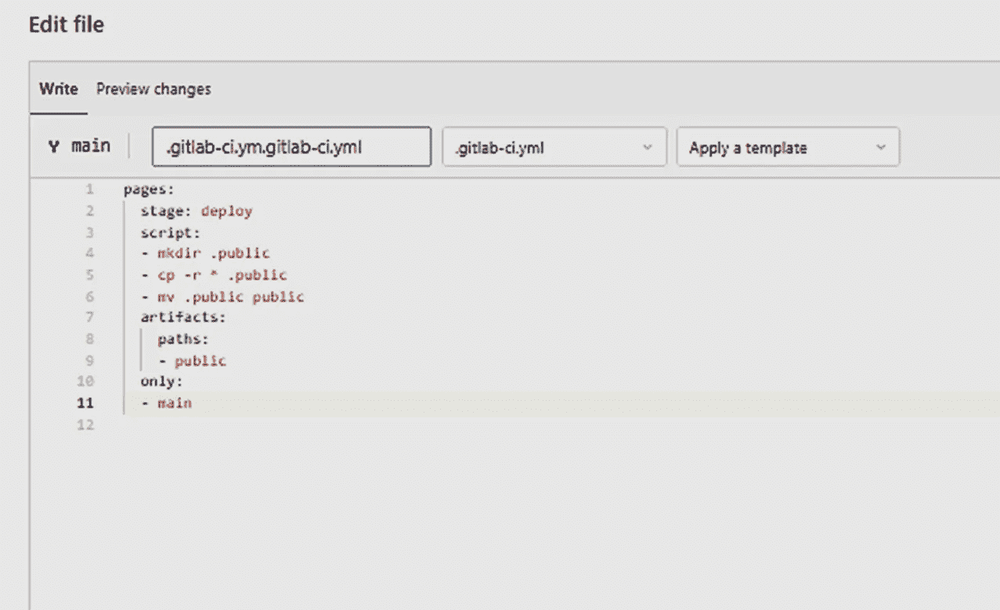

不要用“主”这个词，而要用“主”来代替。

**第五步:** **结束故障排除，再次检查我们的工作**

我们已经通过用新术语替换旧术语更新了配置文件。现在，我们将在[https://dwormley13.gitlab.io/dw-initial-gitlab-pages-site](https://dwormley13.gitlab.io/dw-initial-gitlab-pages-site)再跑一次，看看在这次尝试中会发生什么。

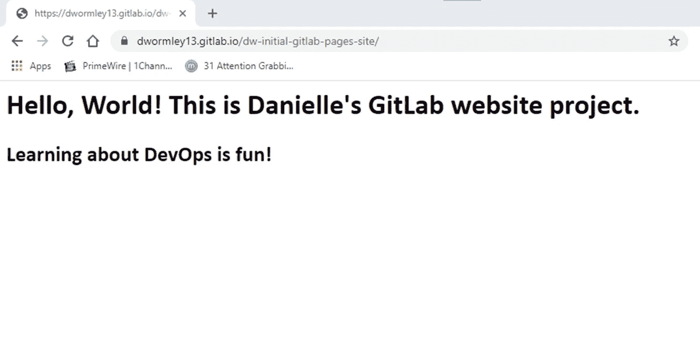

对 GitLab 项目中的错误进行故障排除和解决后的输出。

事实证明，语言真的很重要！我们已经使用 GitLab 上的 CI/CD 功能成功部署了我们的网站。

作为一个以前只用 HTML 和文件传输协议(FTP)建立过网站的人，我觉得这个项目很有见地。它就 CI/CD 流程所有四个步骤的重要性提供了实践学习体验。实施 CI/CD 对于高流量网站至关重要，因为它允许稳定的访问和内容交付。将来，我可能会使用 GitLab 来托管另一个更复杂的网站，除了 CI/CD 组件之外，还会强调它的分析功能。