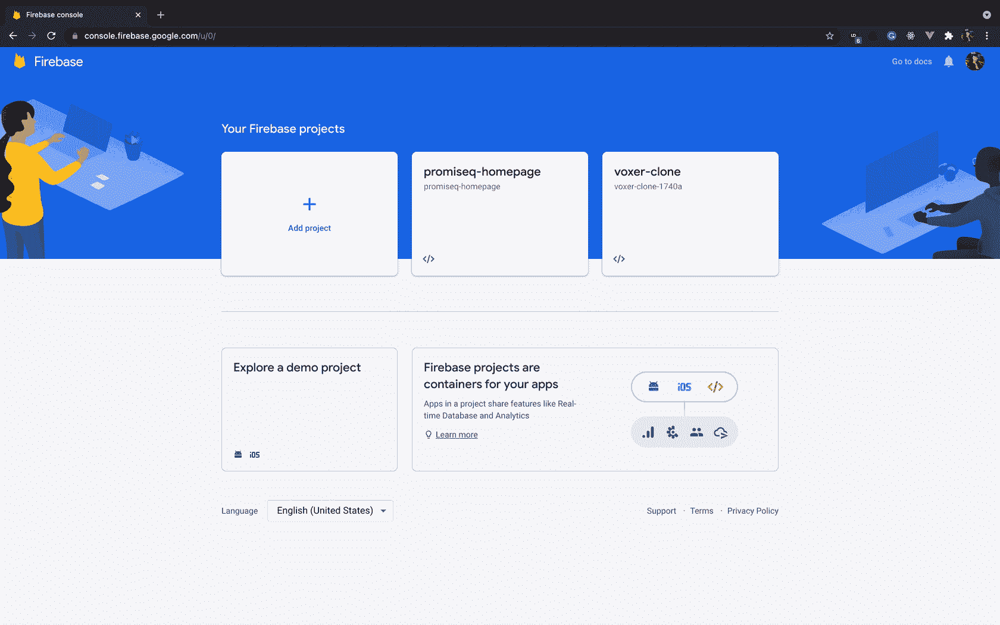
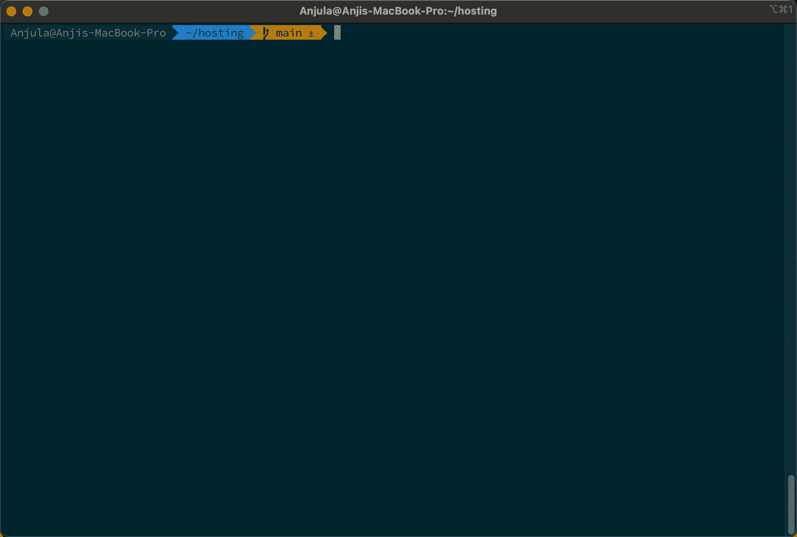
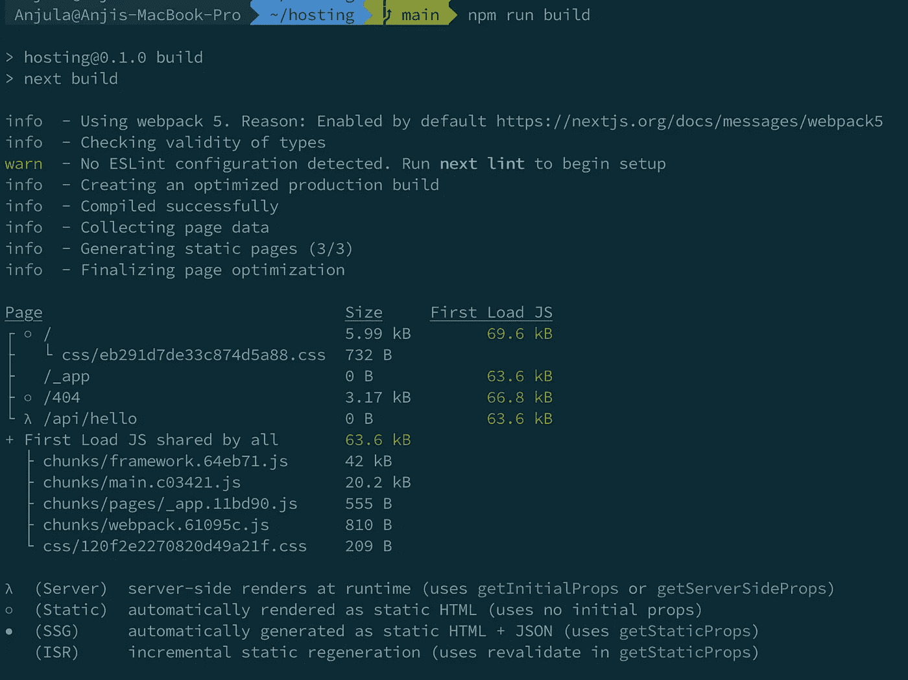
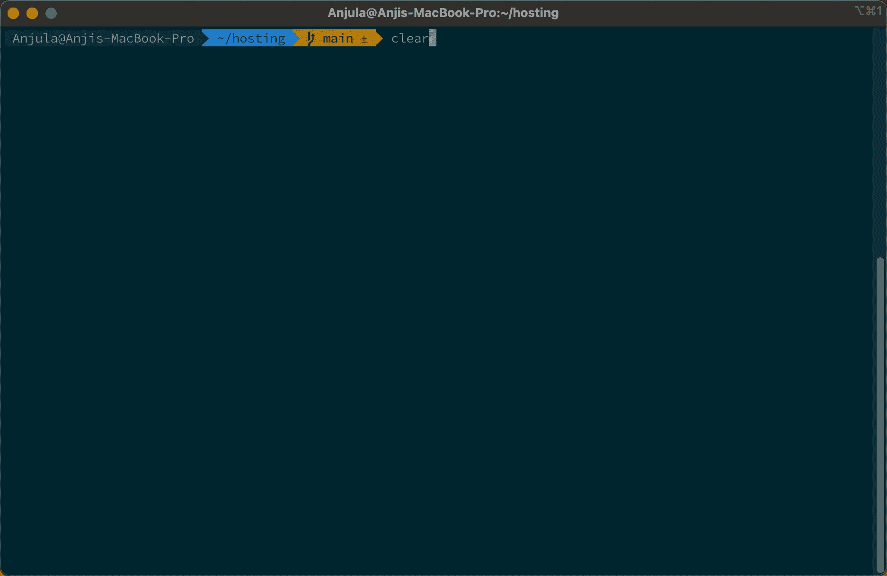
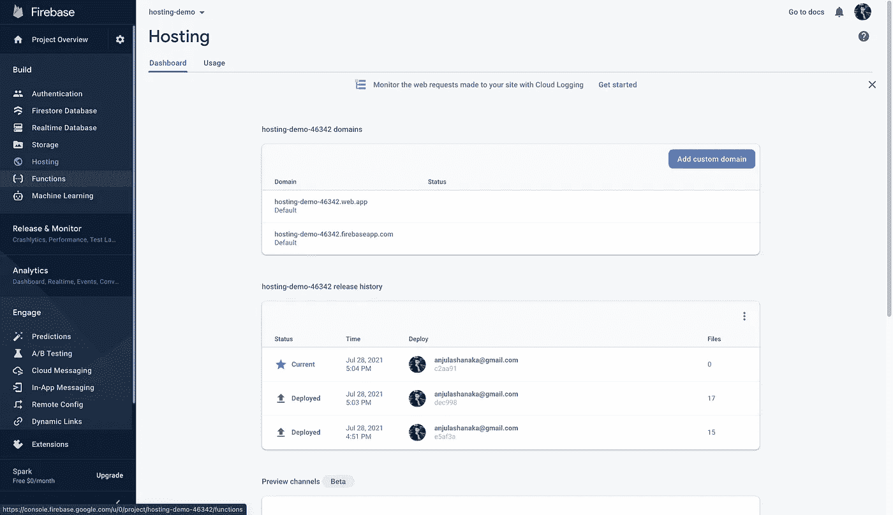

# 让我们部署下一个。带有 firebase 主机的 Js 应用程序

> 原文：<https://medium.com/nerd-for-tech/lets-deploy-a-next-js-app-with-firebase-hosting-e070b3aecd04?source=collection_archive---------0----------------------->

irebase 是谷歌开发的一个平台，用于创建移动和网络应用，它通过有用的服务让我们的生活变得更加轻松。我最近开始使用 firebase，我很喜欢它。今天我们将看看 firebase 托管，我们将托管一个 [Next.js](https://nextjs.org/) 应用程序。没有别的事了，让我们开始吧。

## 什么是 firebase 托管？

Firebase 托管为您的 web 应用程序、静态和动态内容以及微服务提供快速、安全的托管。

## 为什么选择 firebase 托管？

firebase 托管有一些关键功能。

*   通过安全连接提供内容
*   托管静态和动态内容以及微服务
*   快速交付内容
*   在上线之前，模仿甚至分享您的更改
*   用一个命令部署新版本

现在我们知道了 firebase 托管，让我们尝试使用 firebase 托管一个 web 应用程序。

1.  创建一个 firebase 帐户
2.  创建新项目

3.使用终端
`npm install -g firebase-tools`安装 Firebase CLI 工具

4.登录您的账户
`firebase login`

5.转到您的项目并启动 firebase
`firebase init`

6.选择 firebase hosting 并选择`out`作为构建文件夹

7.更新您的构建脚本并运行`npm run build`
`“build”: “next build && next export”,`

8.最后运行`firebase deploy — only hosting`

最后一步

就这样，你成功地在 firebase 中部署了下一个应用。你会得到一个像这样的链接[https://hosting-demo-46342.web.app/](https://hosting-demo-46342.web.app/)，你可以从控制台连接一个自定义域。

使用控制台，您可以看到您的构建历史和使用细节。

说完，我们来到了文章的结尾。别忘了看看我的其他文章。下次再见了。在那之前保持安全！✌️

# 参考资料:

[1].火焰基地。[2021]文档[在线]。可在:[https://firebase.google.com/docs/hosting](https://firebase.google.com/docs/hosting)【2021 年 7 月 28 日获取】