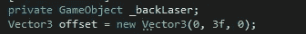
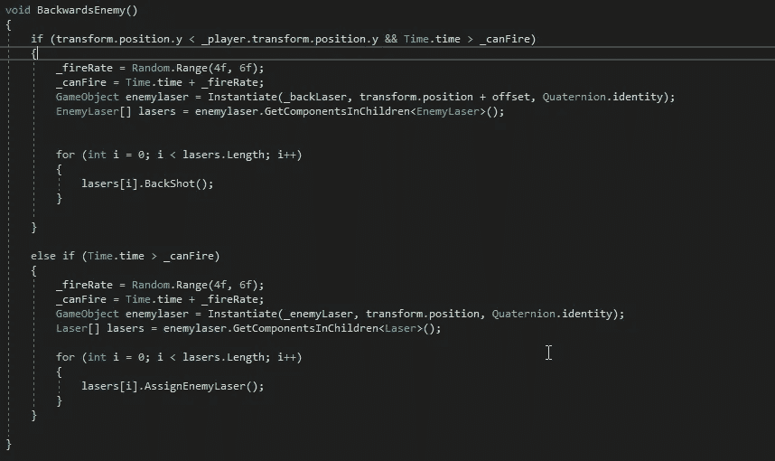
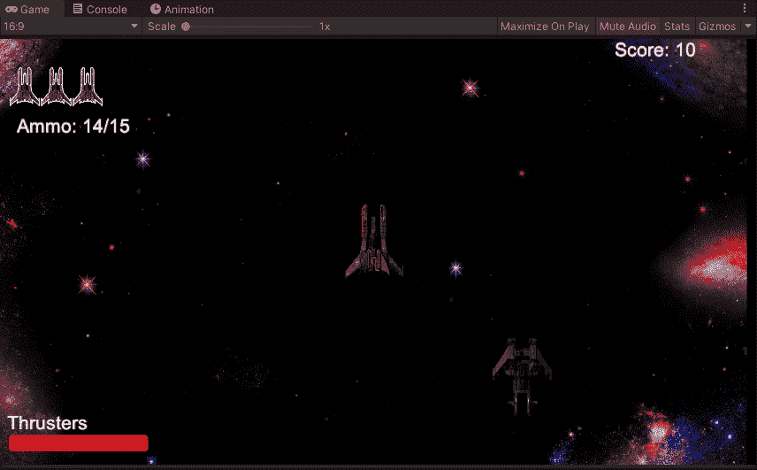

# 让我们的敌人自食其果吧

> 原文：<https://medium.com/nerd-for-tech/lets-get-backfire-on-our-enemies-826eeb35b59e?source=collection_archive---------18----------------------->

我们将在游戏中加入的下一个敌人类型是 1，它知道当它在玩家身后时，它会在自己身后开枪。首先，我们将为敌人的背部激光器创建一个新的游戏对象，并为它们创建一个偏移量，以便它们在正确的位置发射:

从这里，我们可以创建敌人激光的副本，并将它们附加到敌人的脚本中。接下来，我们将创建一个新的敌人类型，就像我们对冲撞敌人所做的那样，并创建它的新方法:

为了让我们的敌人知道它是否在玩家身后，我们必须创建 if 语句，如果敌人的位置低于玩家的位置，我们希望它向后射击。从代码中我们可以看到，激光器是从一个新的脚本类中提取出来的，名为 EnemyLaser。在尝试了许多不同的方法，但收效甚微之后，目前我还没有足够的工作来将一个脚本转换成一个类并使其全部工作，我决定创建一个激光脚本的副本，但改变一些部分使其适合敌人的激光。现在，它将只是设置为背面拍摄，但我们可能会使用这个新的脚本来添加独特类型的激光射击只是敌人。从这里开始，我们必须进入我们新创建的激光器，把我们的新脚本附加到它们上面，同时改变它们的激光器。一旦我们设置好所有这些，我们就可以检查它是否在我们的游戏中工作:

现在我们终于弄清楚了如何让激光恢复工作，这比我预期的要花更多的时间，我们可以调整我们的敌人类型 spawn 的开关声明，这样这个新的敌人类型就可以发挥作用了。
接下来，我们将考虑加入另一种新的敌人类型，同时创建一个产卵率调节器，这样我们就可以选择我们想要以更高的比率产卵的敌人。