# 我们走吧

> 原文：<https://medium.com/nerd-for-tech/lets-get-moving-7c378e88866b?source=collection_archive---------25----------------------->

今天我们将复习一些基本动作，以及几个生活质量过程。

根据你要制作的游戏类型，有时我们需要调整背景。我们所要做的只是切换到我们的主摄像头，在清晰的旗帜下，我们将它改为纯色，然后选择最适合的颜色。

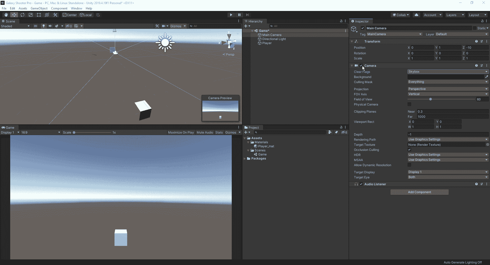

色变化

我们应该在早期做的另一件事是调整纵横比，以便我们可以将它放在任何我们想要的设备上。我们通常希望选择 16:9 的比例，因为这是标准的高清宽高比。

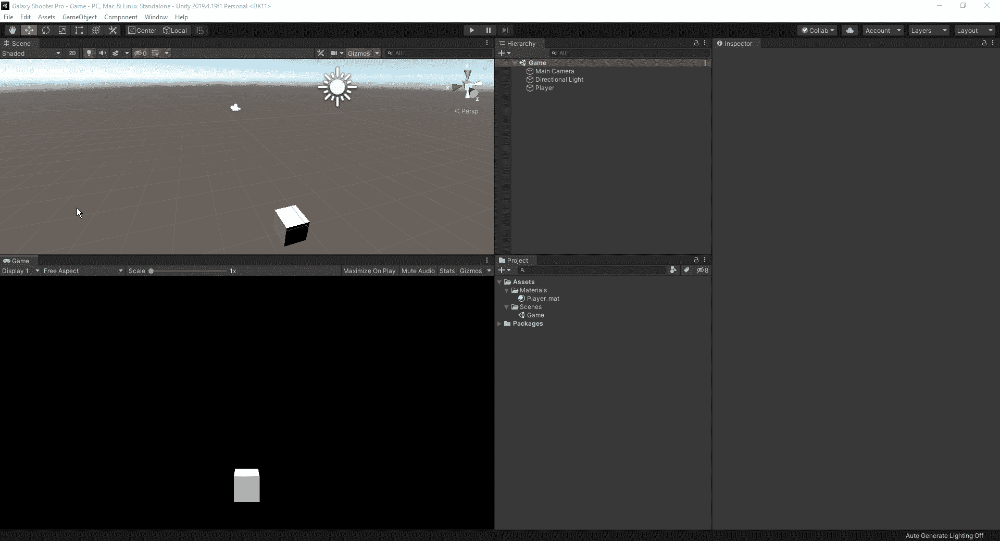

更改纵横比

现在我们将开始为玩家制作脚本。首先，我们希望在 assets 下的项目视图中创建一个新文件夹，并将其命名为 Scripts。从这里，我们可以创建一个新的 C#脚本，并将其命名为 player。

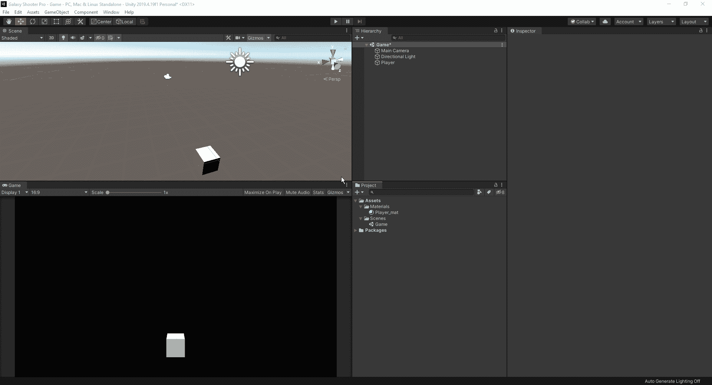

在给你的脚本命名时，重要的是确保在你最初创建它的时候就给它命名，否则你以后可能会遇到一些问题。当我们单击项目选项卡中的脚本时，它将显示脚本中的内容，在这里我们可以看到公共类是 player。

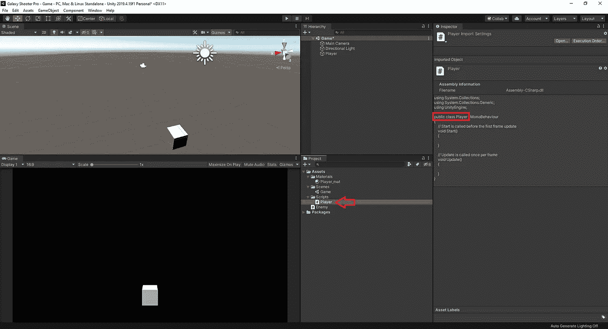

如果我们忘记马上给它命名，而是在事后才这样做，那么公共类将会不同。当使用脚本时，Unity 会给出一个错误。

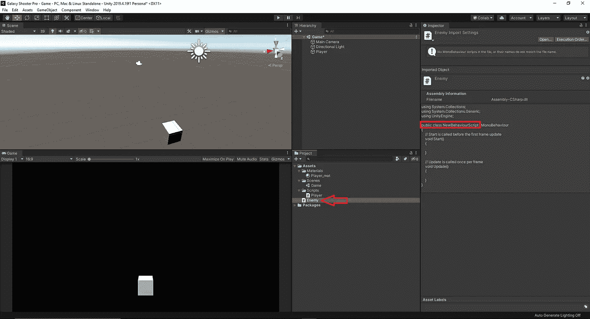

# ***脚本***

现在，我们开始使用脚本进入它的本质部分。首先，我们将从一些基础开始，但随着事情的发展，将会有更多的东西。

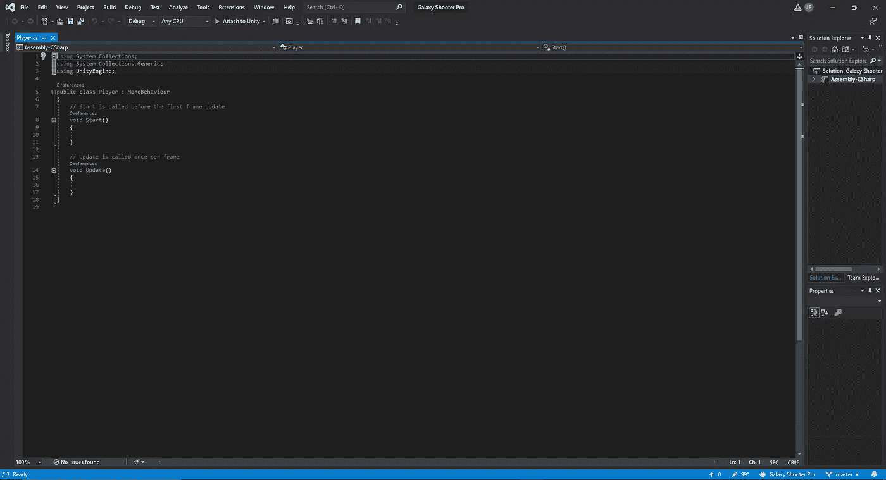

空白脚本

正如我们从上图中看到的，脚本中没有太多东西可以开始。

**public class Player:MonoBehaviour**→这是一个 Unity 特有的术语，用于允许我们将脚本拖放到我们的对象上。 **":"** 代表继承或扩展。如果我们想定制类，我们只需删除“:MonoBehaviour”。
**【void Start()**→这是一个当你开始游戏时从 Unity 自动调用的方法。

**void Update()** →这是一个被认为是游戏循环的方法，通常以 60fps 运行，我们放在那里的东西会每帧运行，除非我们另外限制。

**//** →我们在脚本中输入这些内容，以便为自己添加注释。这不会在 Unity 中运行，而仅仅是一种我们可以用来作为未来参考的记事本。

# ***设定位置***

如果我们想为一个对象设置一个位置，使用的代码行相当简单。

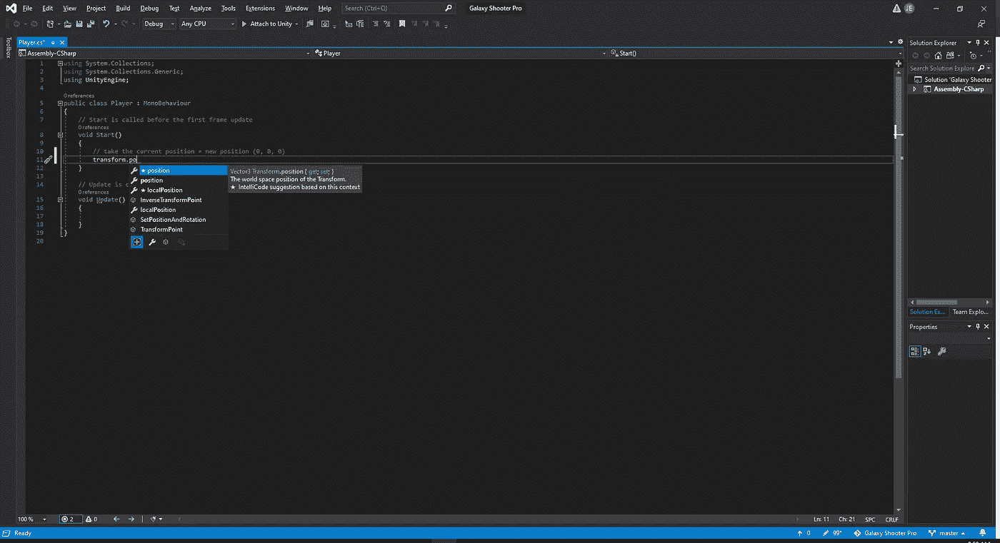

有一件事我们应该养成习惯，除非你已经数不清使用特定代码行的次数了，那就是阅读工具提示来了解你正在编写的特定代码行将会做什么。

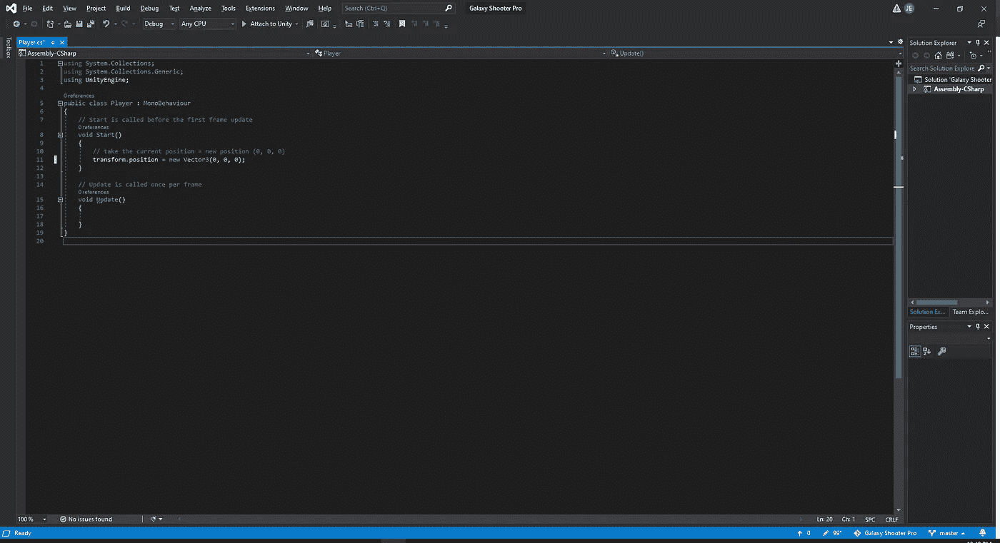

玩家开始位置

正如你在上面看到的，这 1 行代码将为玩家创建一个起始位置。至于代码本身，transform.position 告诉 Unity 你希望得到什么信息。“新矢量 3”用于设置我们想要的位置。Vector3 表示对象在 3D 空间上的位置。(0，0，0)表示沿(x，y，z)轴的玩家对象。

你要永远记住的一件关键事情是，当你完成一行代码时，你总是，总是，总是以；。这让 Unity 知道这条线已经结束，不再继续。如果您忘记放置；然后，您将看到一条错误消息，并在受影响的区域下方显示红线。

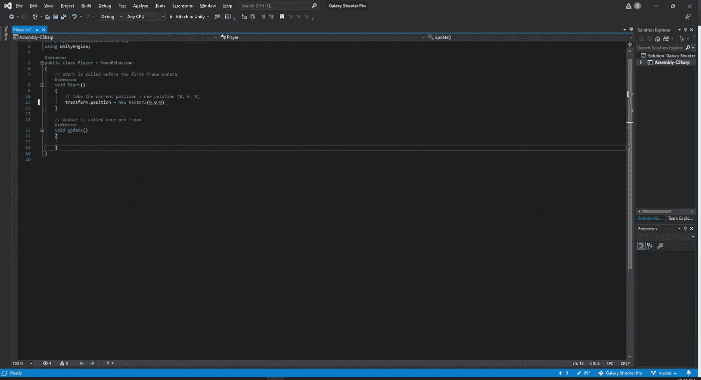

失踪的例子；

如果我们要创建一个有传送效果的游戏，这也是我们会使用的方法。我们所做的就是告诉 Unity 把我们的对象的位置改变到我们想要的位置。现在，如果我们想看看我们所做的是否有效，我们必须确保将我们的脚本附加到 player 对象并按 play。

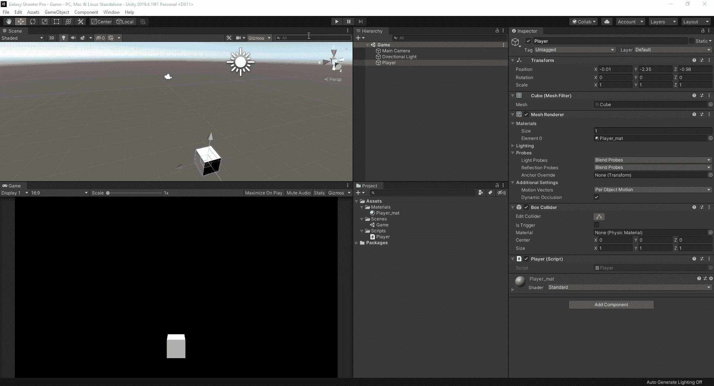

显示位置的变化

从上面的例子中我们可以看到，当我们按下 play 时，我们的 player 对象的位置会改变到我们设置的位置。

# 游戏内运动

为了让我们开始行动起来，我们必须学会如何研究我们需要写什么样的剧本。有了 Unity，我们可以轻松访问手册和所有可用的脚本 API。

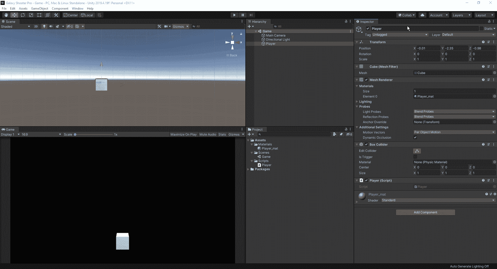

要打开文档，只需点击小？为所有信息开放网站。然后，切换到脚本 API 并键入您要搜索的内容。在这种情况下，我们正在寻找改变我们的对象的变换，所以一旦我们搜索变换，然后我们去翻译，这是移动变换。从那里，我们可以看到我们需要使用的脚本结构。

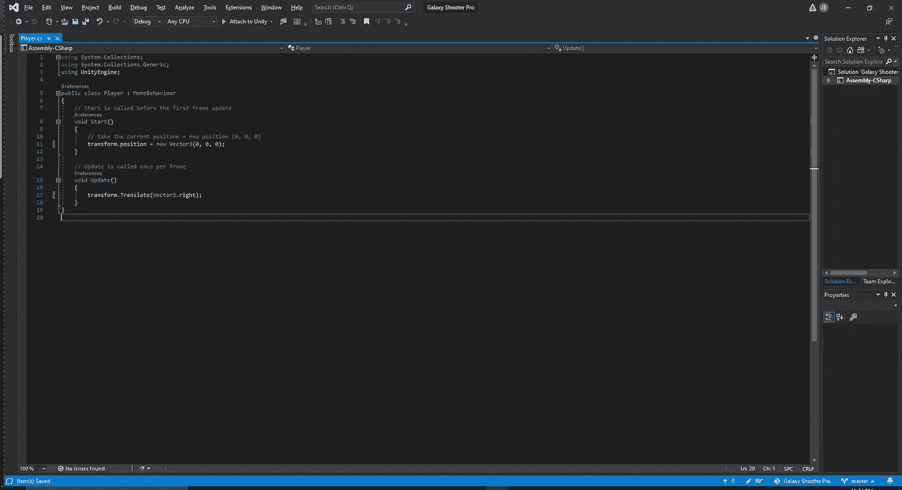

移动我们的玩家

如您所见，我们使用了手册中的结构，并将其应用到我们的脚本中。我们键入(Vector3.right)来告诉 Unity 我们希望我们的对象向右移动。

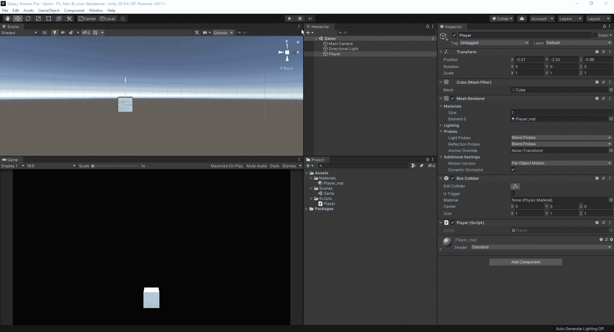

现在我们有了移动，我们必须找出如何改变速度，允许用户输入而不是它自己移动，并设置一个边界，以便我们留在游戏屏幕内。下次请加入我，我们将弄清楚如何将所有这些脚本应用到我们的项目中。