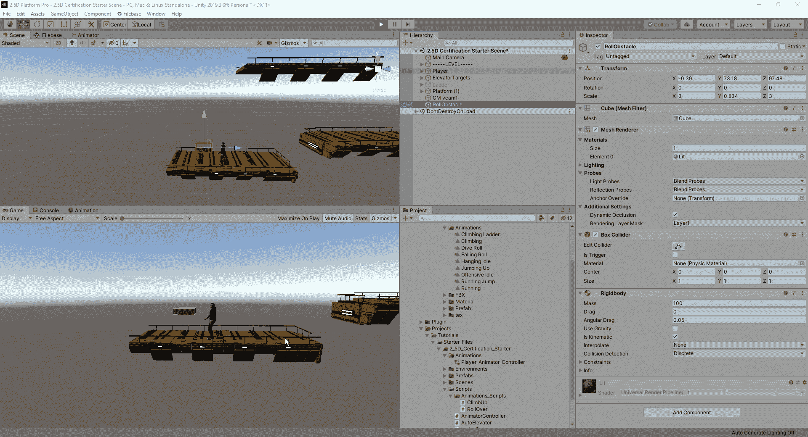
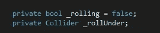
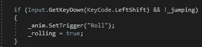
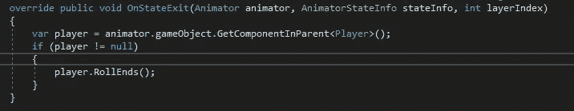
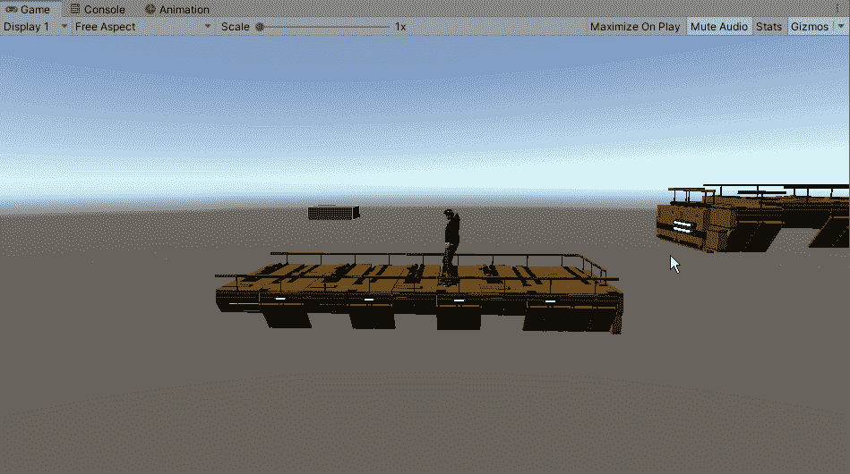
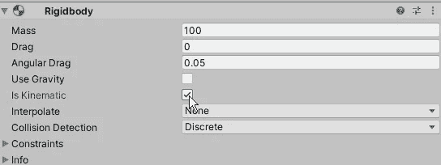
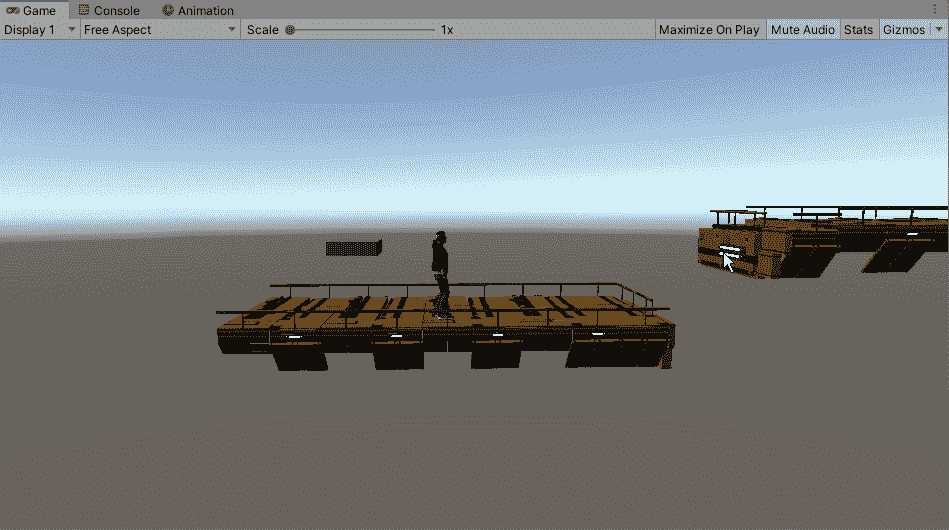

# 让我们开始吧

> 原文：<https://medium.com/nerd-for-tech/lets-get-rolling-85bf31167690?source=collection_archive---------14----------------------->

在我继续扩展课程的同时，我将花一点时间来构建一个滚动系统。这将让我看到创造的路径对于玩家来说太大而无法通过。首先，我们必须回到 Mixamo，找到一部动画作品。从那里，我们将想要重复我们以前做过的同样的过程，以便在我们的游戏中恰当地利用它。一旦我们都设置好了，我们将需要制定一些代码，让我们可以滚动我们的角色。作为一个测试，以确保它的工作，我们将使用一个正方形作为我们的障碍，并允许我们的角色在它下面滚动。然后，我们将创建一个标签下滚动，以便我们的角色能够在特定的障碍下滚动:

正如你所看到的，我们可以让我们的角色在这个障碍下滚动，但至于如何滚动，我们将不得不查看这个过程的代码:

我们首先需要处理几个变量:

然后，我们希望创建输入动作，该动作在我们不跳跃时起作用，并将触发动画，同时将我们的滚动设置为 true:

在这里，我们将让我们的角色能够检测到我们试图滚动的对象是否有正确的标签。如果是这样，那么我们就能在物体下面滚动。至于 RollEnds 部分，这是我们的动画结束例程:

这样做的目的是让动画播放完，然后退出到我们想要的动画序列中。现在这一切都完成了，我们可以在我们的游戏中测试它:

现在我们有一个小问题，当我们的角色停在物体下面时，他会把物体推开。要解决这个问题，我们需要确保在障碍物的刚体上，我们检查的是运动学:

现在，我们的球员不会推开障碍，我们可以继续我们的项目和通过课程所需的新的运动方法。