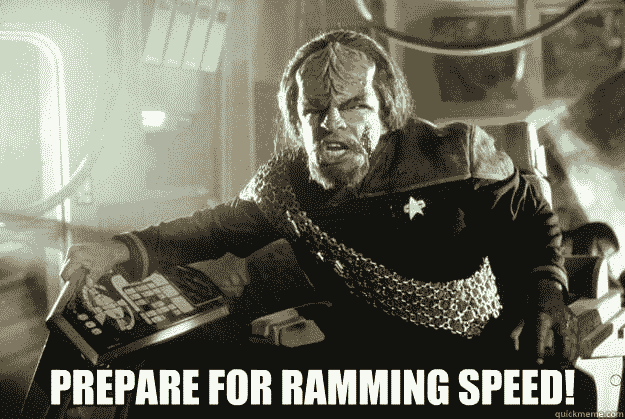
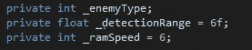
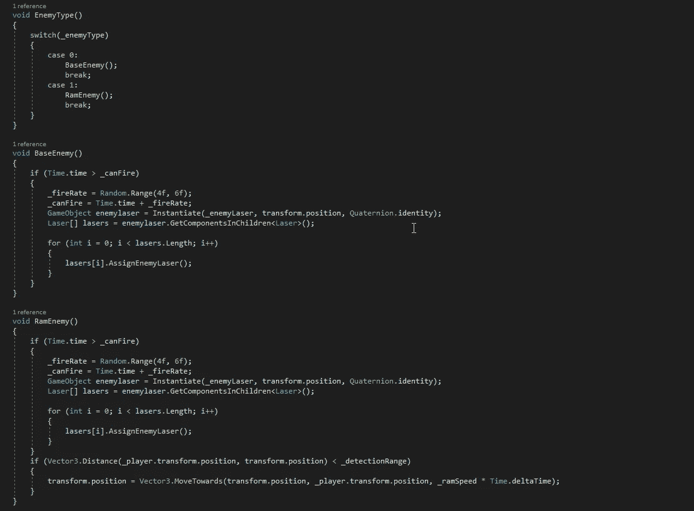
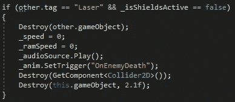
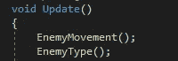
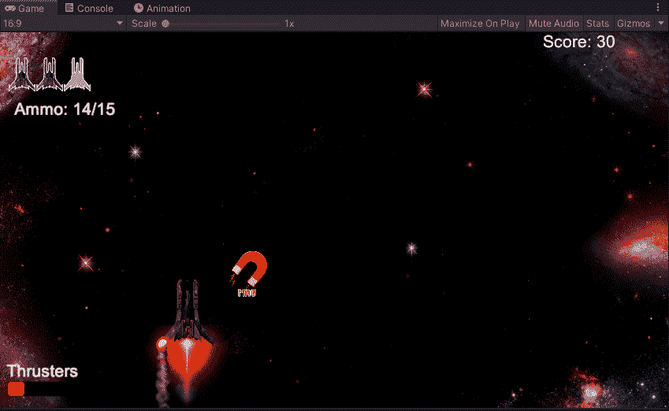

# 我们去拿些夯锤

> 原文：<https://medium.com/nerd-for-tech/lets-get-some-rammers-f66f5edd6985?source=collection_archive---------20----------------------->

我们要介绍的第一个新的敌人类型是敌人的冲击风格。为了做到这一点，我们需要首先创建一个变量，它将决定我们希望我们的敌人从多远的距离开始攻击我们，然后是我们希望他们移动的新速度。由于我们将创建一些新的敌人类型，我们将为我们的敌人类型创建一个新的空白，通过使用开关语句来确定，就像我们之前对移动类型所做的那样:

从这里，我们可以进入我们的 void start 并设置 _enemyType = Random。目前的范围是(0，2)。随着我们慢慢地增加新的敌人类型，我们可以增加我们想要选择的数量范围。最后，我们将建立我们的开关声明，就像我们如何建立我们的电源，但现在我们将保持产卵赔率均匀一致。
接下来，我们将采用我们为敌人创造的火焰方法，如图所示[这里的](/nerd-for-tech/bug-fixing-and-adding-enemy-fire-295aa0e9d808)，并将它添加到我们新的冲撞敌人和我们基地敌人的新虚空中:

接下来，我们将使用新的探测范围变量创建一个方法，告诉 Unity 当敌人进入我们玩家的一定距离内时，我们希望它开始尝试撞击我们的玩家。当我们提高速度时，我们需要确保进入脚本的死亡部分，并在所有方法中添加 in _ramSpeed = 0，这样，如果我们在船撞上我们之前摧毁它，就不会有一个漂浮的火球追着我们的船:

接下来，我们需要做的就是在 void 更新中调用我们的 EnemyType()方法，我们可以在我们的游戏中测试它:

正如我们所看到的，敌人会追赶我们的玩家，直到距离太远，它无法跟上，然后它会继续向下走。现在我们已经有了一个新的敌人类型，我们可以期待在未来增加更多。