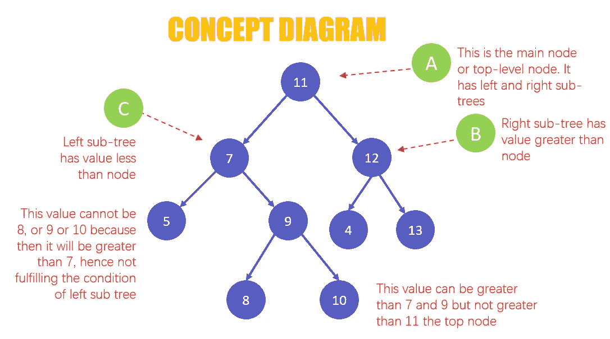
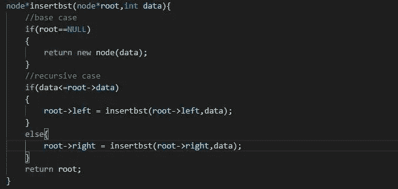
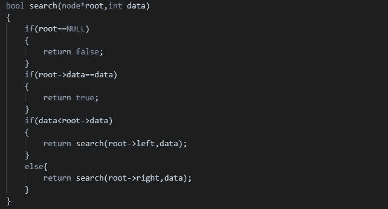
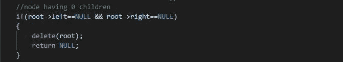
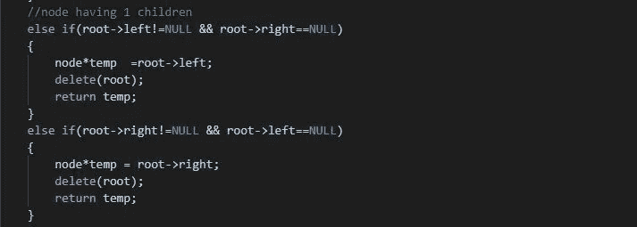
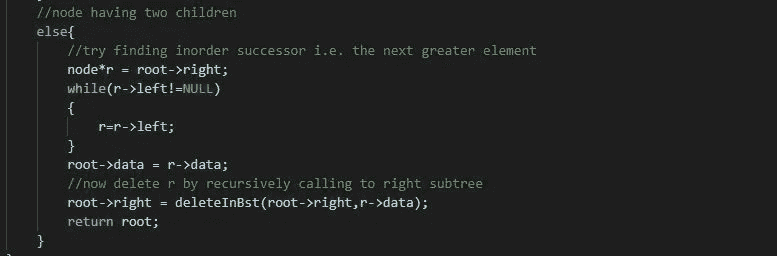
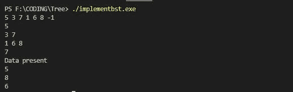
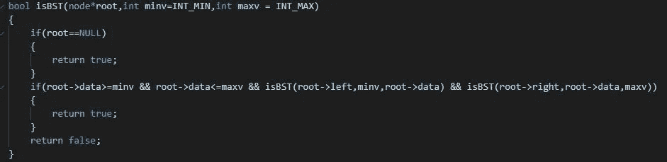

# 让我们实现一个二叉查找树

> 原文：<https://medium.com/nerd-for-tech/lets-implement-binary-search-tree-6a8f7f34f67f?source=collection_archive---------2----------------------->

## 简介:

二叉查找树是二叉树，其中左子树的每个节点的值小于或等于父节点，而右子树的每个节点的值大于或等于父节点。同时，每个子树也是一个二叉查找树。

那么，我们为什么需要二叉查找树呢？？

因为从二叉树中搜索、插入或删除任何元素在任何情况下都需要 O(n)时间，即使该树是平衡的。然而，在最佳情况下的二叉查找树的情况下，它需要 O(深度),这是 O(log N)时间复杂度。这是因为我们可以将键值与根节点的值进行比较，如果它小于根节点，它将在左子树中搜索，否则在右子树中搜索。

## **实施二叉查找树:**

1) **用给定的元素建造一个二叉查找树**:

构建 bst 的代码

2) **在二叉查找树中查找键值**:

在 bst 中搜索元素的代码

3) **在二叉查找树**中删除一个元素:首先使用上面的代码搜索要删除的元素，然后根据节点的类型将其删除。

**情况 1** :如果包含键值的节点是一个**叶节点**，我们可以简单地删除它并向父节点返回 null

叶节点删除

**情况 2** :如果包含键值的节点有**一个子节点**，则为该子节点分配一个指针，并将其返回给父节点

删除带有 1 个子节点的节点

**情况 3** :如果一个包含 key-value 的节点有**两个子节点**找到该节点的下级后继节点并替换数据，然后删除替换了根节点数据的后继节点。

删除带有 2 个子节点的节点

构建搜索和删除所有类型节点的输出

## 检查给定的树是否是二叉查找树:

我们可以采用自上而下的方法，为每个节点分配一个最大值和最小值，并检查该节点的值是否在该范围内。对于该树中的每个节点，它都是二叉查找树

检查树是否为 bst 的代码

如果二叉查找树是平衡的，我们可以在 O(log N)时间复杂度内执行插入、搜索和删除，其中 N 是节点的数量，在偏斜 BST 的情况下，它是 O(n)。

文章结尾。

谢谢你

快乐编码:)