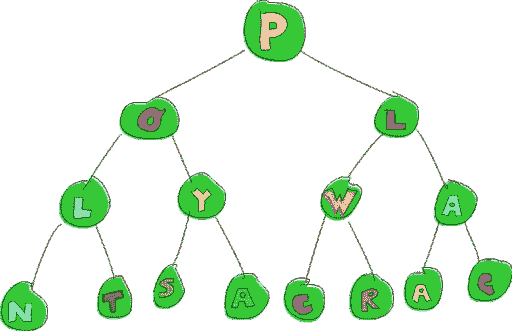
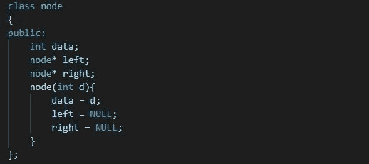
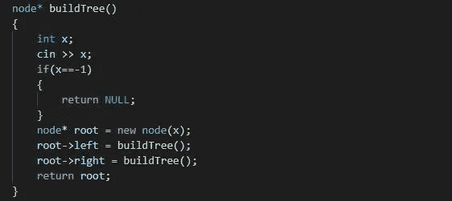
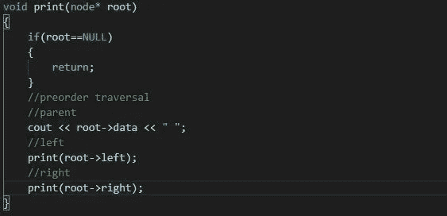
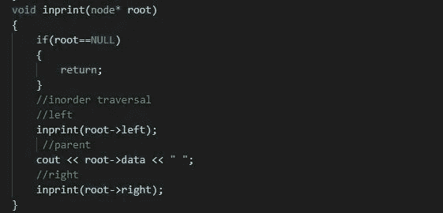
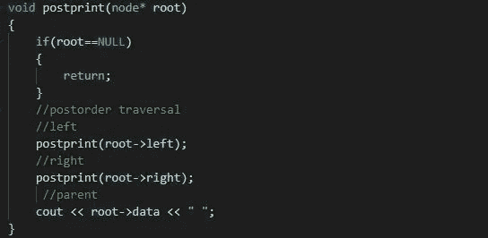
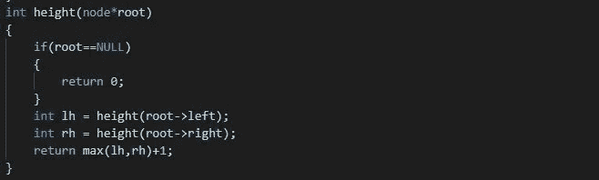
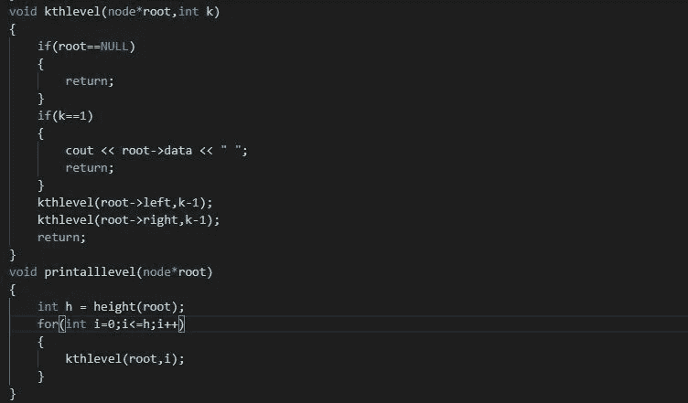
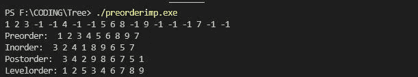
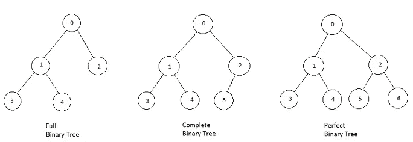

# 让我们实现一个二叉树:

> 原文：<https://medium.com/nerd-for-tech/lets-implement-binary-tree-fe290e3deff3?source=collection_archive---------3----------------------->

图像源拉链

## 简介:

它是一种用于存储分层数据的树形数据结构。二叉树的任何节点最多只能有两个子节点。任何树节点都由一个数据部分、一个指向其左侧子树的指针和一个指向其右侧子树的指针组成。

**节点类的实现:**

节点类的实现

**根据给定数据构建树的实现:**

虚拟代码

## 有不同的方法可以遍历二叉树。

1.  **前序遍历**:以这种方式遍历，首先打印父节点，然后是它的左子节点，最后是它的右子节点。下面是实现前序遍历的代码:

前序遍历

2. **Inorder Traversal** :以这种方式遍历，它首先打印左边的子节点，然后是它的父节点，最后是右边的子节点。下面是实现有序遍历的代码:

有序遍历

3.**后序遍历**:以这种方式遍历，首先打印左边的子节点，然后是右边的子节点，最后是父节点。下面是实现后序遍历的代码:

后序遍历

4.**级别顺序遍历**:这里我们在移动到孙节点之前遍历所有的子节点。即我们逐层遍历所有节点。

有两种方法可以逐级打印节点的级别:

a) **递归法**:求树的高度即可。然后，对于所有级别，打印该级别的节点。这将花费 O(n)时间复杂度。下面是相同的实现:

*第一步*:求树的高度:

树的高度

*第二步:*逐级打印各级节点:

层次顺序遍历递归方法

b) **迭代方法**:当我们使用队列迭代地执行层次顺序遍历时，我们可以以 O(n)时间复杂度执行任务。这也被称为广度优先搜索。下面是执行广度优先搜索的代码:

横向优先搜索

以上按顺序、前序、后序和级别顺序遍历给出了以下输出:

不同遍历的输出

## 二叉树的类型:

1.  严格/适当/完全二叉树:在这种二叉树中，每个节点可以有 0 或 2 个子节点。
2.  **完全二叉树**:除了最后一层和尽可能留下的叶节点区域，所有层都被完全填充。
3.  **完美二叉树**:所有层级完全填充，所有叶节点在同一层级。
4.  **平衡二叉树**:如果对于每个节点，左右子树之差不超过 k(k 大多为 1)，则二叉树是平衡的。

文章结尾..

希望对读者有所帮助..

谢谢

快乐编码:)