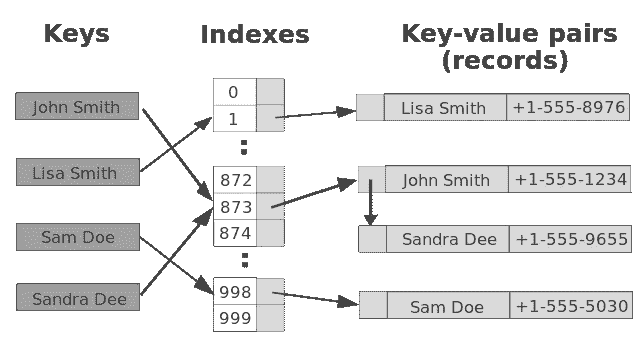
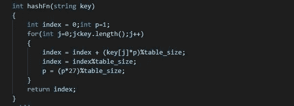
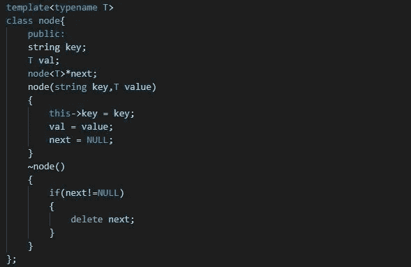
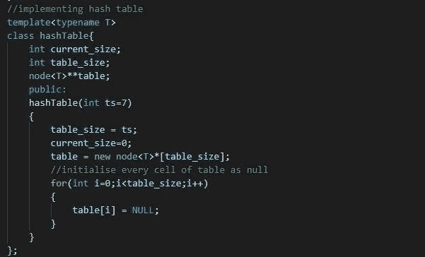
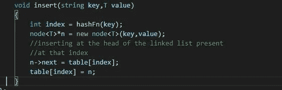
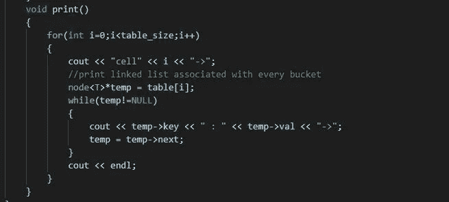
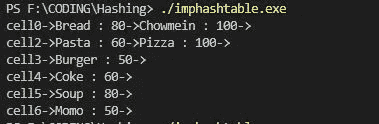
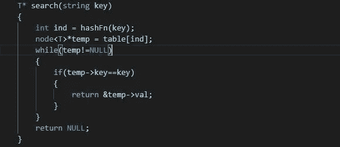

# 让我们实现哈希和哈希表:

> 原文：<https://medium.com/nerd-for-tech/lets-implement-hashing-hashtable-1ba5ceaec12b?source=collection_archive---------0----------------------->

图像源您的基本

## 什么时候以及为什么我们需要 HashTable？？

当我们在键-值对中有元素，并且我们想要在平均常数时间内搜索、插入或删除任何对时，使用哈希表数据结构。

但是，我们应该记住，在哈希表中，元素是以任何不相关的顺序排列的。

**哈希所需的关键组件:**

1.  **散列函数**:该函数将一个键转换成整数值，作为存储对应于该键的键-值对的位置(数组索引)。好的哈希函数是计算速度快的函数，如果使用这个哈希函数，冲突的几率会更小。

a) ***一个带有整数关键字的散列函数*** :

在这种情况下，散列函数将: `hash(key) = key%tablesize.`尝试将表的大小保持为一个质数，而不是 10 的倍数，这样可以减少冲突的机会

b) ***关键字为字符串时的哈希函数:***

我们可以将字符串映射到它们的 ASCII 值之和，但是字谜会导致冲突。更好的方法是处理以 27 或 37 或任何质数为基数的字符串的字符，并应用这个函数。

哈希(字符串密钥)= `sum for all i from 0 to length of string -1 (string[length-i-1]*27^i]%tablesize`

字符串关键字哈希函数的实现

2.**哈希表**:它是实际存储那些键值对的数据结构。它是一个数组，其中的键被映射到数组索引。

**3。冲突处理**:由于内存有限，所以有时哈希函数会生成对应于不同键的相同整数值，即存储多个键-值对的相同位置，这就是冲突，我们会尽量减少这种冲突。

分离通道是处理冲突的好方法:如果不止一个键值对被映射到同一个索引，我们可以维护一个链表来存储。那么链表头的地址将被存储在表中。因此该表将存储 node*类型的元素，那么指向散列表的指针将是 node**类型的。

## 独立通道链表节点的实现；

实现节点类

## hashTable 的类实现:

哈希表的实现

**在哈希表中插入键值对:**

它遵循以下步骤:

1.  只需借助哈希函数找到该键对应的索引即可
2.  创建一个新节点，将键-值对传递给它
3.  使节点指向被映射表的索引
4.  将对应于该索引的链表头的地址存储在该单元格中。

在哈希表中插入键值对

**打印哈希表的元素:**

打印哈希表的元素

上面代码的输出

**在哈希表中搜索元素:**

为了减少冲突，我们甚至可以实现重新散列，也就是说，一旦表的当前大小与固定大小的比率超过特定的限制。然后创建一个双倍大小的新表，并将所有元素从旧表转移到新表。这个概念被称为**老调重弹。**

文章结尾。

谢谢你。

希望会有帮助..

快乐编码:)