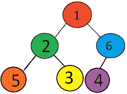
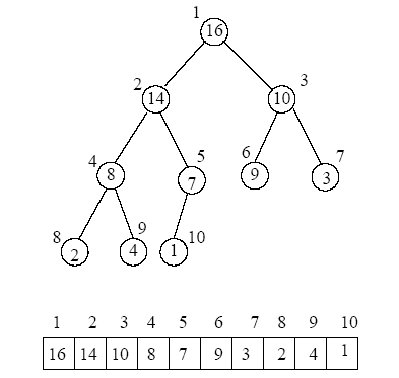
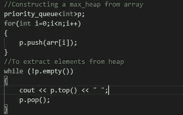
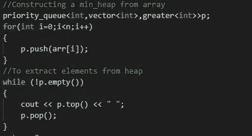
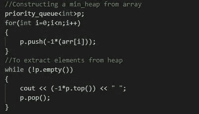

# 让我们实现堆 DS:

> 原文：<https://medium.com/nerd-for-tech/lets-implement-heap-ds-2a95a4853552?source=collection_archive---------3----------------------->

## 简介:

堆或优先级队列是一回事。于是问题出现了

什么是优先级队列？？

优先级队列是这样一种队列，其中有一个标准，根据该标准，哪些元素被赋予优先级，优先级最高的元素首先被弹出。

那么，为什么我们需要一个优先级队列或堆呢？？

它主要用于在比其他数据结构更好的时间复杂度下寻找最大或最小元素。

**什么时候一棵树可以被称为一堆？？**

如果一棵树满足以下三个条件，它就可以被称为堆:

1.  该树应该有近 2 个孩子，即它应该是一个**二叉树。**
2.  它必须是一个**完整的二叉树**，也就是说，除了最后一层可以部分填充之外，所有层都必须完全填充，但是最后一层应该按照从左到右的顺序填充。
3.  它应该遵循**堆顺序属性**，即要么每个父代都应该大于其子代(最大堆)，要么每个父代都应该小于其子代(最小堆)。

**如何从给定的数组构造堆？**

必须谨记以下规则:

1.  堆的根在数组的索引 0 处
2.  第 I 个节点的左子节点是(2*i+1)
3.  第 I 个节点的右子节点是(2*i+2)
4.  第 I 个节点的父节点是(i-1)/2

图片来源- cse.hut.fi

## 使用 stl 实现最小堆和最大堆:

**最大堆**:我们可以使用优先级队列将元素推入其中来实现。默认情况下，它会创建一个最大堆。

使用优先级队列的最大堆

**最小堆**:从优先级队列中创建最小堆有两种方法

1.  除了元素类型，还要传递两个参数，即向量<type>和比较类型</type>

使用具有多个参数的优先级队列的 Min_heap

2.只需将它构造成与 max heap 相同，只在将元素乘以-1 后传递它们，并在再次访问它们时乘以-1

使用带有一个参数的优先级队列的最小堆

文章结尾

编码快乐！！

谢谢你