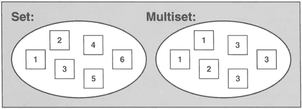
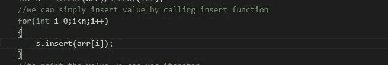
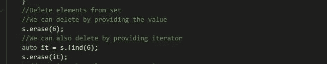
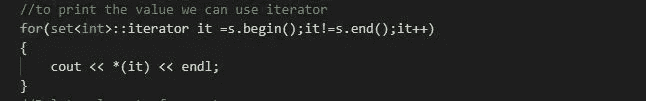
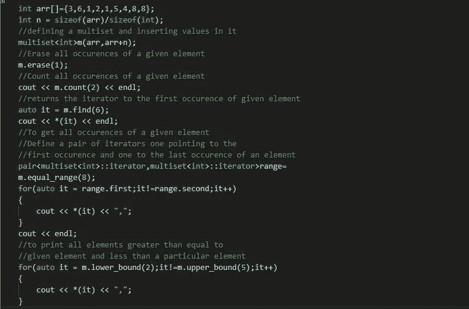
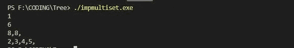

# 让我们实现集合和多重集合:

> 原文：<https://medium.com/nerd-for-tech/lets-implement-sets-multisets-e91eefb4e1c2?source=collection_archive---------0----------------------->

图像来源 ccplusplus

## 设置了什么以及我们为什么需要它们:

Set 是一个用于存储唯一元素的容器。默认情况下，它是有序的，并且在我们想要删除重复元素时使用。我们不能更新集合中的任何元素，唯一的方法是移除该元素并插入另一个元素。

## set stl 的实现:

**在集合中插入元素:**

我们可以使用 insert 函数直接在集合中插入值:

在集合中插入值

**从集合中删除元素:**

我们可以通过传递值或者绕过迭代器，使用 erase 函数从集合中删除元素。

使用擦除删除元素

**打印元素集合:**

我们可以在迭代器的帮助下简单地打印这些值:

打印集合中的元素

→ Lower bound 将返回一个迭代器到大于或等于给定元素的元素位置。

→上界将返回一个迭代器到大于给定元素的元素位置。

## 多重集的属性:

1.  它是一个类似容器的集合，可以存储具有相同值的多个元素。
2.  这些元素根据内部比较对象进行排序，但默认情况下是按升序排序的
3.  就像这里设置的一样，这些值也不能更新
4.  它是一个关联容器，因为元素通过它们的值来引用。
5.  多重集使用的底层数据结构是二叉查找树。

**多集上一些操作的实现:**

上面代码的输出:

上述代码的输出

文章结尾

希望这将有助于获得一个集和多集的概述

谢谢你

快乐编码