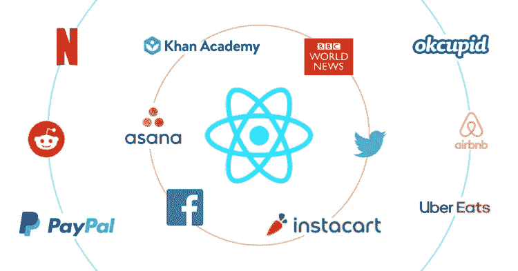
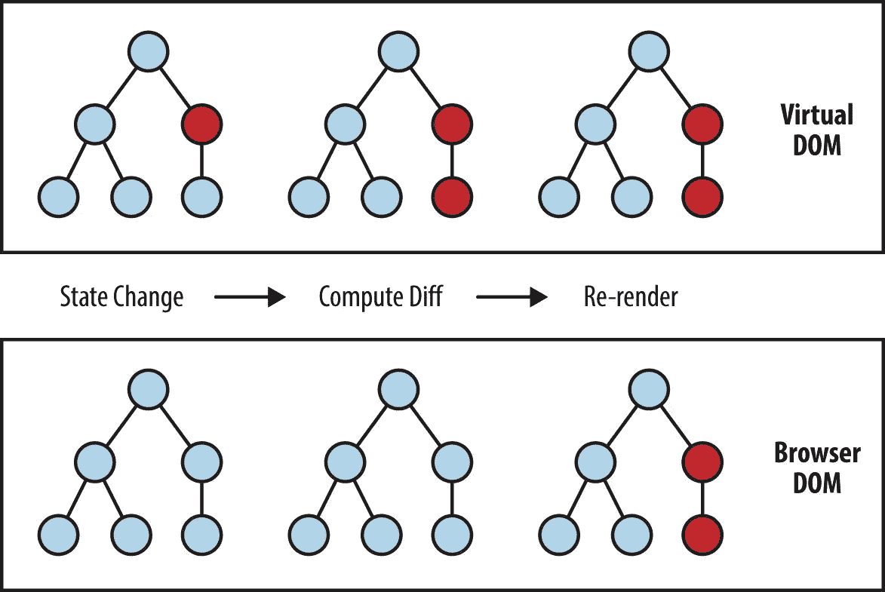
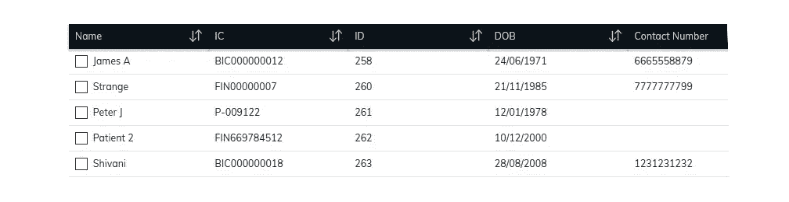
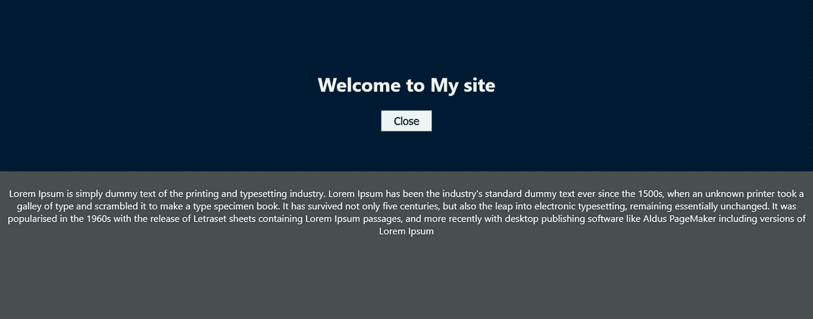
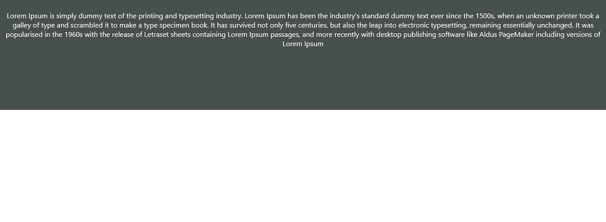
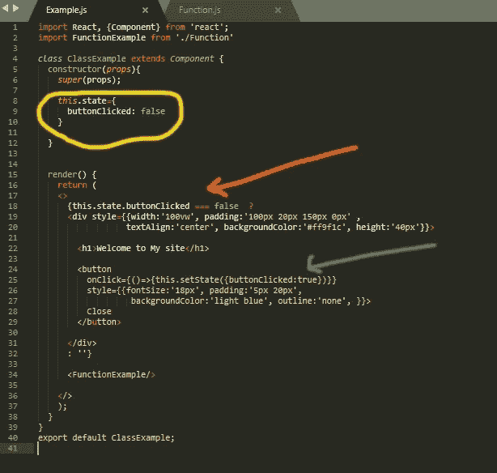

# 让我们从头开始学习反应

> 原文：<https://medium.com/nerd-for-tech/lets-learn-react-from-scratch-cae320f75cb5?source=collection_archive---------9----------------------->


如果你对 web 开发感兴趣或者正在学习 web 开发，你可能会经常听到 ***React*** 或者 ***React JS*** 这个名字。因此，你可能想知道为什么它在 web 开发社区中如此受欢迎，或者当我们有 HTML、CSS&JavaScript 时，为什么我们需要这样的东西，或者如果我使用 React 而不是其他语言或框架，我会得到什么好处。如果你脑子里有那些烦人的小问题，这篇文章特别适合你。在我们继续阅读本文时，您可以克服这些小问题。

**因此，让我们从 React 基础知识开始您的旅程。👏**


**什么是 React？**

React 是 JavaScript 库，由脸书创建，用于处理他们数十亿的帖子、评论和用户活动。由于它在处理数十亿次用户交互方面的成功表现，它于 2013 年向公众发布。之后，它在 web 开发社区中非常流行。除了脸书之外，还有许多网站运行 React。网飞、PayPal、Instagram、Reddit、优步和 WhatsApp 就是其中的几个著名网站。



[https://www . sim form . com/WP-content/uploads/2020/01/React-websites . png](https://www.simform.com/wp-content/uploads/2020/01/React-websites.png)

你知道吗？我敢打赌，你会发现这非常令人惊讶。😉

在那些网站中，我们可以看到一个共同的特点。也就是说，全世界有数十亿用户使用这些网站。所以，你就能理解 React 为什么很受欢迎了。因为它可以成功处理数十亿次复杂的用户交互。⚡️

## 为什么要反应？

1.**处理复杂数据**

这是一个被证实的事实。我们都知道在脸书一次可以发生多少用户交互。因此使用 React 可以有效地处理这些问题。因此，如果您正在创建 CMS，React 是一个非常好的前端库，用于在前端处理这些数据。

**2。可重复使用的组件**

在大多数网站上，你可以看到不同数据的相同布局。例如，所有脸书的帖子都使用相同的布局，但内容不同。在 React 中，我们不必每次都创建布局。我们可以为同一个布局创建一个可重用的组件，然后我们可以用不同的数据填充这些布局。它为我们节省了大量的 web 开发时间。

使用下面的代码片段，我们可以通过在代码的任何地方调用 ***RenderCard*** 组件来呈现无限数量的姓名和年龄细节。这就是 React 的妙处。❤️

```
function RenderCard(card){
 return(
   <>
     <div><h4>{card.name}</h4></div> 
     <div><h6>{card.age}</h6></div>
   </>
 )
}
```

想象一下，如果脸书的开发者需要为每个帖子一次又一次地创建相同的布局。😳挺吓人的吧…😂

**3。可以正常使用 JavaScript&CSS**

我们可以在 React 中使用与普通网站相同的 CSS 和 JavaScript。如果你知道 JavaScript 函数，我们也可以很容易地在 React 代码中使用它们。它将与正常的网站功能相同。😊

举个例子，这些。map()和。filter()函数可以在 React 的数组中使用，它将给出与 JavaScript 相同的结果。

```
const items = array.map((item)=>{return(item)})
const filterItem = array.filter((item)=> 'john' === item.name)
```

再举一个例子，我们也可以在 React 中使用 CSS 类和 id。但是请记住，不要使用 class React，而要使用“className”。因为 class 是 React 中预定义的词。

```
/*In CSS*/
<div class='mydiv' id='first'>Hello</div>/*In React*/
<div className='mydiv' id='second'>Hello</div>
```

## React 的特点？

1.**虚拟 DOM**

在普通网站中，当用户与网站交互以编辑、添加或删除内容时，它会使用浏览器 DOM。在浏览器 DOM 中，当用户改变像表单输入这样的元素时，DOM 必须重新呈现整个网页以向用户反映这种变化。

在虚拟 DOM (VDOM)概念中，React 在内存中创建浏览器 DOM 的精确副本。因此，当用户作出反应改变时，不会影响正常的 DOM。它适用于虚拟 DOM。然后将 VDOM 与浏览器中的浏览器 DOM 进行比较。因此，如果发现这两者之间有任何差异，VDOM 只更新浏览器 DOM 中的 ***确切的*** 元素。因此，在 VDOM 的概念中，它只重新呈现精确的元素。

正因为如此，性能远远高于正常的网站。



[https://i0 . WP . com/programmingwithmosh . com/WP-content/uploads/2018/11/lnrn _ 0201 . png？ssl=1](https://i0.wp.com/programmingwithmosh.com/wp-content/uploads/2018/11/lnrn_0201.png?ssl=1)

**2。生命周期方法**

另一个特性是开发者可以完全控制 React 组件。这意味着我们可以从组件开始挂载到 DOM 的确切时间开始跟踪组件状态。所以这些方法中的一些，

```
componentDidMount(
    /*This method is called after the component is rendered. We can do anything immediately after the component is finished render.*/
)componentDidUpdate(
    /*This method is called after the component is updated in the DOM.*/
)componentWillUnmount(
    /*This method is  called when the component is about to be removed from the DOM.*/
)
```

**3。不同提案的不同模块数量**

这是我最喜欢的功能之一。React 有许多不同用途的模块。你不必从头开始做。您可以通过一行代码拥有这些模块。

举个例子，如果你需要一个有排序功能的数据表，我们可以不用用、、

| 、 | 之类的来做..废话…废话…😟 |

我们只需要安装模块并向表提供数据。😄



使用这个 [***链接***](https://www.npmjs.com/) 你可以探索许多模块，并使用下面的代码片段为 React 安装它们。

```
/*If you are using npm*/
npm install <package name>@<package version>/*If you are using yarn*/
yarn add <package name>@<package version>
```

## 组件类型



假设我们需要设计一个像上面这样的网站。所以当用户来到网站时。当他/她点击关闭按钮时，我们需要关闭蓝色部分。这样做后，它将看起来像下面的页面。



正如你在两个例子中看到的，灰色部分没有变化。所以它是一个静态部分。蓝色部分随着用户交互而变化。这就是我们的组件提供帮助的地方。

React 中有两种类型的组件。他们中的每一个都用于不同的场景。

1.  **类组件**

这是我们与用户交互时使用的组件类型。所以这个组件类型有一个用户行为的状态。例如，当用户点击一个按钮时，这些组件可以捕获并存储该点击。所以我们可以根据用户的点击来制作页面的外观

请看下面的代码片段。

让我们不要害怕那个代码片段。我们进行的时候你可以了解一下。🙌



看那个黄色的圆。

```
this.state={
      buttonClicked: false
    }
```

这里我们把点击了的*按钮定义为 false。所以这意味着此刻按钮没有被按下。然后检查橙色箭头。*

```
{this.state.buttonClicked === false  ? .......
```

所以我们在这里检查点击的*按钮*是假还是假。如果此时' *buttonClicked* 为假，该语句将被触发并渲染到 DOM 中。然后检查绿色箭头。

```
onClick={()=>{this.setState({buttonClicked:true})}}
```

这里说，如果用户点击关闭按钮，这将设置'*按钮点击*'为真。

**那么，我们来总结一下从一开始学到的东西。**

我们了解到，如果用户与服务器进行了交互，虚拟 DOM 将会发生变化，如果与浏览器 DOM 存在差异，浏览器 DOM 也会发生变化。这就是这里发生的事情。

当用户点击“*关闭*按钮时，onClick 函数将被触发，并将“*按钮点击*设置为真。因此，这意味着用户对某个元素进行了更改。然后，虚拟 DOM 将使用类组件的新状态重新呈现。也就是说，

```
this.state={
      buttonClicked: true
    }
```

然后下面的函数不会在 VDOM 中呈现，因为现在' *buttonClicked'* 为*真。*

```
{this.state.buttonClicked === false  ? .......
```

所以，在新的渲染中，没有蓝色部分。这意味着 VDOM 不同于浏览器 DOM。不同的是在 VDOM 没有蓝色的 div。因此，VDOM 将从浏览器 DOM 中移除蓝色 div，而不从头重新呈现。

这就是关于类组件的全部内容。在 React 中，类组件有自己的状态管理。并且根据该状态呈现视图。

**2。功能组件**

所以，更重要的是，不同于类组件。

> 简单地说，功能组件没有管理内部状态。

对于功能组件，用户对网页做什么并不重要。这些保持不变。但是记住，类组件可以根据用户交互来控制功能组件。现在不要担心那个。我们可以在进行的时候学习。

现在变得有点乱了，是吧…😧

为了更好的理解，请看下面的片段。


看…

在这里你只能看到一些 div 元素和一些样式。这是因为功能组件不管理状态。它就像一个简单的静态网页。

我确实有个问题要问你。

> **如果我们想在束编码完成后管理功能组件中的状态，该怎么办？我们需要将功能组件转换成包含所有代码的类组件吗？**

其实答案是一个大大的**号**那就是 React hooks 登场的地方。但这是另一天的话题。

现在你知道了一些关于 React 的基本知识。这对初学者来说绰绰有余。所以这里是 [***React 官网***](https://reactjs.org/) 。参考文档，自己尝试一下。那是你学习的地方。而不是到处阅读关于 React 或其他东西的文章。

> 所以，自己去尝试，犯了错误，从中吸取教训。当你对 React 越来越熟悉的时候，你在编码的时候真的会很有趣。🎧

回头见，我会写另一篇关于 React 的文章！❤️