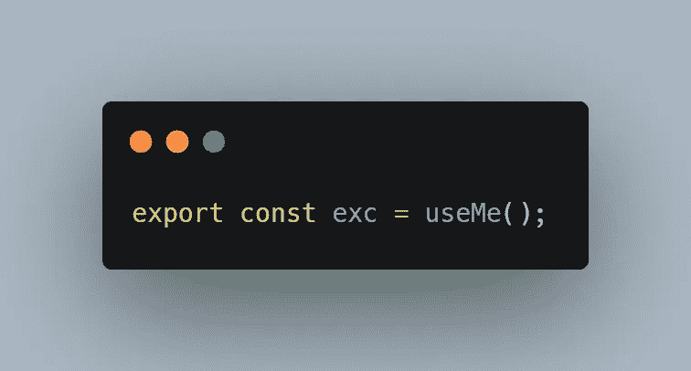

# 让我们做一个钩子系列第一部分——去抖钩子

> 原文：<https://medium.com/nerd-for-tech/lets-make-a-hook-series-part-1-debounce-hook-b6c4697f39d7?source=collection_archive---------13----------------------->

钩子真的很神奇。它们使您能够分离组件的状态和逻辑。这确实有助于使用定制钩子编写可重用的逻辑。

因此，在我最近的 React 项目中，我为去抖动和消费 axios 请求定制了钩子。我想我们还能用钩子做什么。所以，我会与你分享我的钩子，然后你可以写一个评论，如果你想实现一些其他的钩子，我会非常乐意合作，把它们添加到这个系列中，或者只是给我一个挑战。

# 什么是去抖？

大多数人对去抖都很熟悉。这是一个限制函数被调用的速率的过程。例如，实现一个文本搜索，调用一个 API 来获得结果。您不希望在每次击键时都调用 API，因此您可以通过设置一个时间段来限制调用 API 的频率，在该时间段之后，将使用最后一次文本输入来调用 API。

# 去抖钩

我们可以通过使用 NodeJS setTimeout 函数来实现去抖行为。NodeJS setTimeout 函数返回一个数字，该数字可用于通过清除“我们的意思是它将在超时时间段后不再运行”来清除超时。因此，我们要做的是在调用函数时创建一个 NodeJS 超时，如果函数在超时前再次被调用，我们清除以前的超时并创建一个新的超时。这样，先前的函数调用将被丢弃，一段时间后将调用新的函数。因此，如果用户在去抖时间段内输入“America ”,该函数将只对整个文本“America”调用一次，而不是对每个字母都调用该函数。让我们开始实施吧。

## 第一步

创建一个状态来记住由 setTimeout 函数返回的 NodeJS setTimeout id。

## 第二步

创建去抖功能。我们将使用 useCallback，所以如果反跳函数出现在钩子的依赖数组中，它不会导致任何不必要的渲染。

## 第三步

再次调用该函数时清除超时。

在这里，您可以看到我们正在清除超时。但是你会看到我们在 useEffect 的返回函数中清除它，而不是在 useEffect 块中。这是因为从 useEffect 返回的函数在下一次 useEffect 运行之前运行，这是我们希望在设置新计时器之前清除计时器的功能。在 useEffect 块中写它将清除新的超时，这不是我们想要的。

## 第四步

在任何你想的地方使用钩子。

## 完全解

正如您所看到的性能优势。写 Tommie 不会触发对 Tommie 的每个字母的 API 调用，这将是 6 次。它只在单词 Tommie 完成时调用，这为我们节省了五次 API 调用。