# 让我们在 Unity 中制作一个战利品系统！

> 原文：<https://medium.com/nerd-for-tech/lets-make-a-loot-system-in-unity-b50931adb75?source=collection_archive---------9----------------------->

我们现在可以杀死敌人了，所以让他们掉落一些宝石，让这成为一次有意义的经历吧！

我们得到了一个钻石的动画帧，所以让我们假设我们已经实现了钻石精灵，作为一个触发器添加了 boxcollider2D，并给了它刚体。

我在刚体 2D 中打开了重力，关闭了 z 旋转，我还给了它一个小的盒子碰撞 2D，它不是触发器，因为我要做的事情和作业要求的有点不同。

## 任务要求:

-让敌人丢 1 颗钻石
-让敌人给钻石分配一个数量。
-让玩家收集钻石并将其添加到物品清单中。

## 我要做的是:

*   让敌人在“LootSplash”中丢尽可能多的宝石。
*   让玩家收集钻石并将其添加到他们的库存中。

你已经在许多电子游戏中看到了战利品和硬币飞溅，当一个敌人死亡时，他们所有的东西就像皮纳塔一样从他们身上爆炸出来，我喜欢这种效果，所以我要把它放在这里！

有了钻石，我创作了一个钻石剧本:

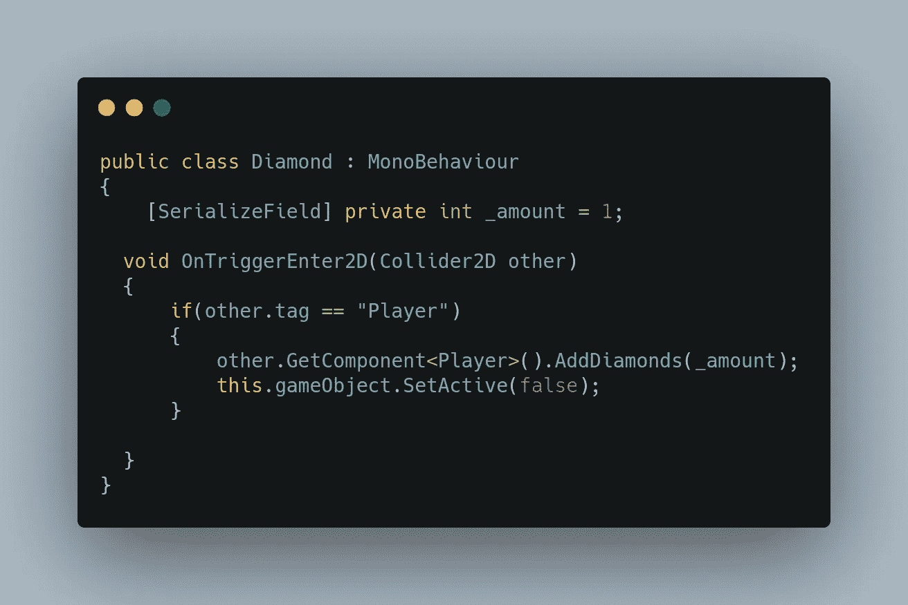

_amount 是钻石的价值，我可以硬编码它，但也许我们可能想在某个时候给出多个价值不同的版本。

有一个 OnTriggerEnter，它检查另一个碰撞器是否是玩家，如果是，它将访问他们的 AddDiamonds 函数并向他们发送数量，然后它将变为非活动状态。有时你不想摧毁一个物体，也许如果你重置等级而不重装，你可以再次激活所有的钻石。我试着提前考虑，也许我们不会这样做。

玩家脚本中的下一步:

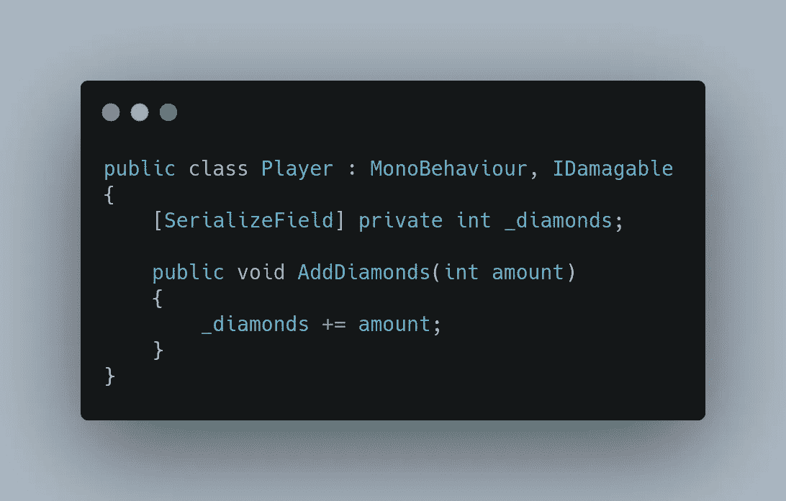

我们创建一个整数变量 _diamonds，然后添加通过参数发送的数量。很简单！

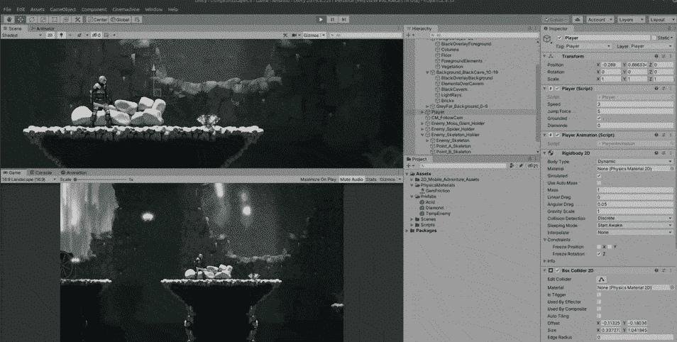

一切正常！现在让我们把它给一个敌人。我们将使用一个临时的。

但是首先我们要把持有者放到敌人的基本职业中:

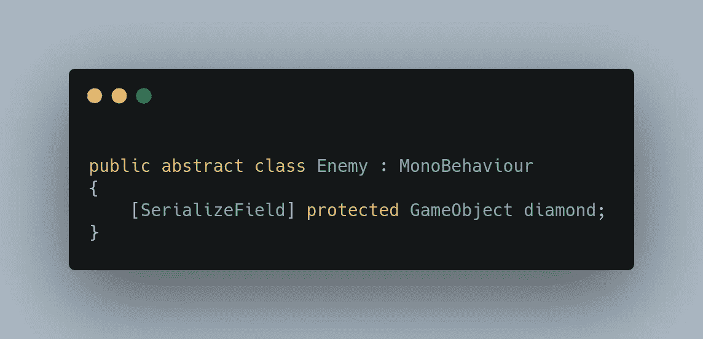

我们将为我们的临时敌人创建一个新的脚本，使用敌人作为它的基类。现在我们把钻石拖进去。

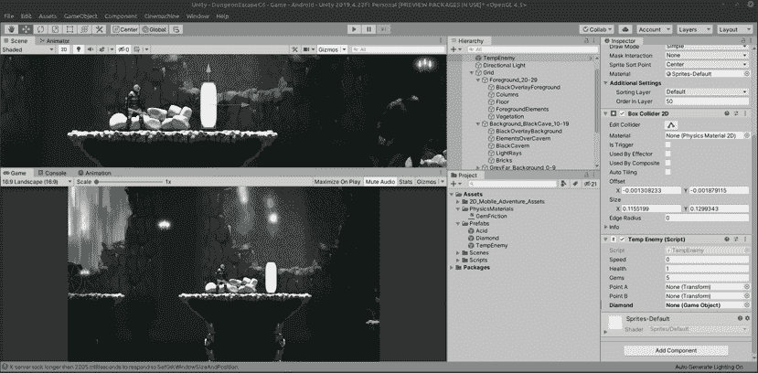

神奇的事情就发生在这里！基本敌人类有一个 gems 变量，表示敌人持有多少钻石，所以我们将创建一个 for-next 循环，该循环将到达该变量，并且每个循环都将实例化一个 gem。

在 InstantiateGem 函数中，我们将实例化的钻石放入一个新变量中，我们称之为 Gem。然后我们使用刚体。AddForce 函数使宝石从实例化点“弹出”,在 x 轴上，向左或向右移动 3 个单位，向上移动 1-4 个单位，这样就有一个漂亮的弧线。

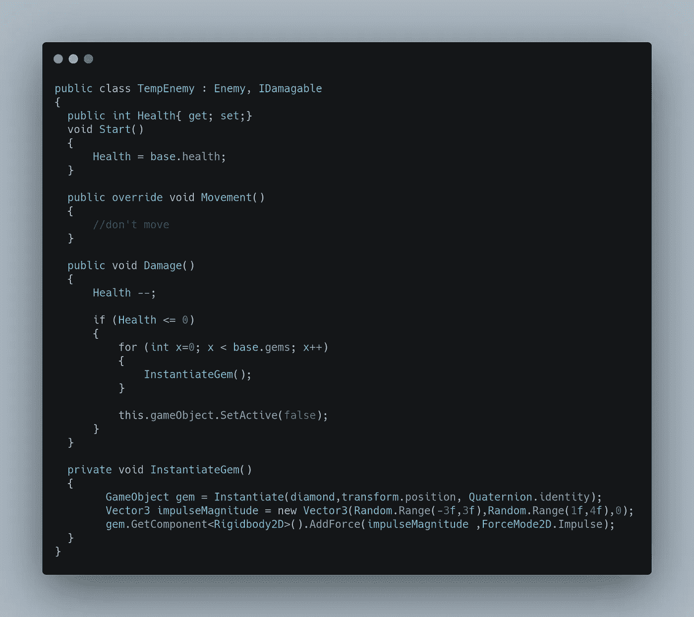

我有一些钻石在地面上滑动的问题，所以我给了钻石一个物理材质，并调整了刚体 2D 设置:

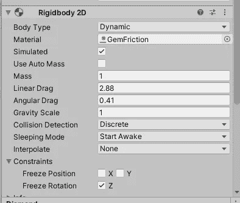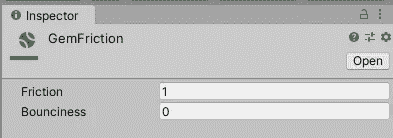

结果是这样的！

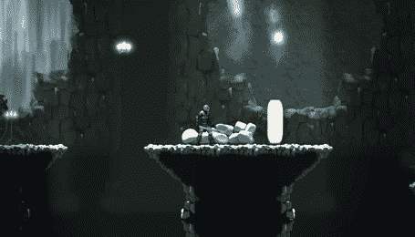

LOOTSPLASH！！！

因为我们所有的敌人都会掉落钻石，所以让我们把这个伤害代码移动到基类中，就像我们在战斗模式敌人翻转中所做的那样:

在我们的敌人代码中，让我们创建一个名为 GemSplash 的新函数:

现在我们的敌人…

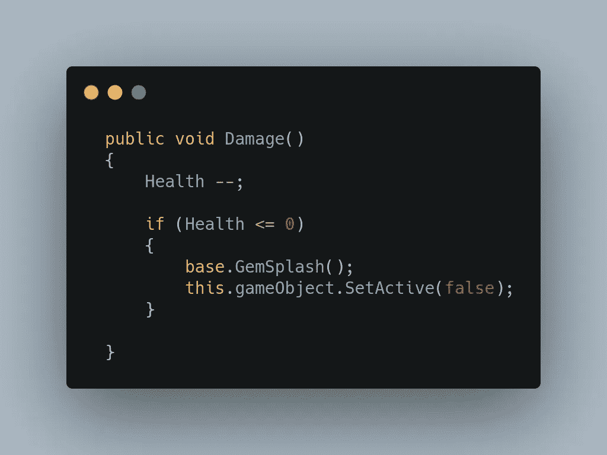

让我们看看结果！

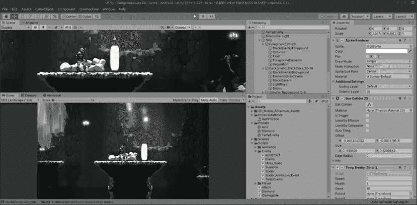

精彩！如果它在这里起作用，它应该对其他敌人起作用，只要给我一点时间把钻石拖到他们身上，设置他们的宝石数量以及添加基础。GemSplash()所有的死亡选项。但这里有一个例子。GemSplash 应该进入死亡检查功能:

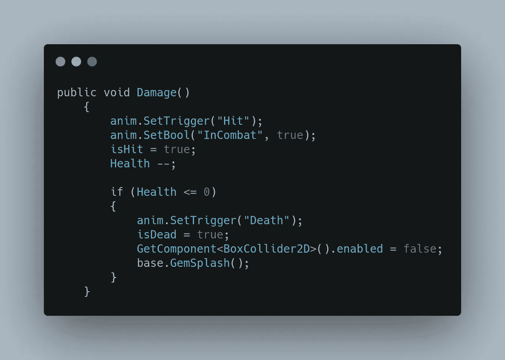

那是苔藓巨人的代码，让我们把它放入蜘蛛和骨骼伤害函数中…

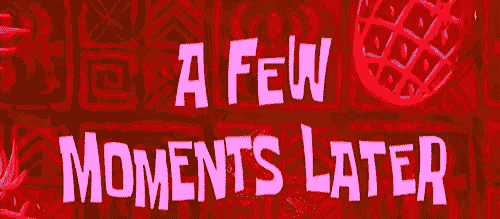

好了，一切都设置好了，我们来测试一下吧！

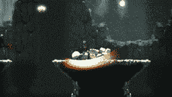

所有的敌人都在掉落钻石，而且数量不同，太棒了！今天的文章到此结束！接下来，我们将讨论 onClick 事件！