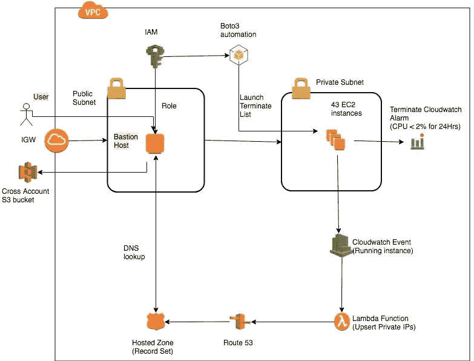
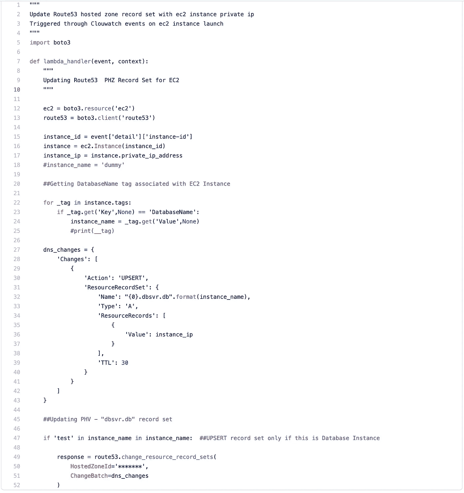

# 让我们构建经济高效的 AWS 架构

> 原文：<https://medium.com/nerd-for-tech/lets-make-aws-architecture-cost-effective-65625e45ea46?source=collection_archive---------13----------------------->

**场景:**
我们有 43 个静态数据库(不再有数据更改)运行在 EC2 实例上，每个数据库的大小约为 20TB，但是这些数据库每月只需要查询一次。从成本效率的角度来看，使用这些大型 EBS 卷全天候运行 EC2 实例没有意义，因此我们考虑进行一些成本优化。

**成本考虑:**
我们采用了那些 EC2 机器的 ami，每当应用程序团队需要查询数据库时，这些都可以从 ami 中恢复。这样，在大多数情况下，我们只需要支付 AMIs 快照成本，然后每当出于查询目的从 AMIs 恢复数据库时，我们只需要支付 EC2 计算和 EBS 卷成本。因为这些 EC2 机器一年的总运行时间非常少，所以没有必要购买任何保留实例。

**挑战:**
我们将 EC2 机器放在私有子网中，以使其更加安全。
无论何时从 AMI 启动 EC2 实例，它们都将获得一个新的私有 DNS/IP，这将改变数据库连接属性(对于 Oracle 的情况是 ex-TN sentry)。

**解决方案:**
这里，我们需要为每个数据库主机提供某种固定的 dns 名称，这样，无论何时从 AMI 启动这些主机，它们都可以动态地指向新的私有 ip。我们最初的想法是 python 脚本将启动 ec2 实例(我们创建了 boto3 脚本来自动从 AMIs 启动 EC2 机器),并在日志文件中记录所有 DB 名称和私有 IP 详细信息。每当应用程序需要查询数据库时，它们都需要检查日志文件，以查找与数据库名称对应的新私有 IP。后来，我们开始使用**route 53——私有托管区域**来修复 DNS。

**解决方案工作流程:**

**建筑**

*   用户登录公共子网中的堡垒主机并运行 python 脚本。这个脚本从私有子网中的 ami 启动这 43 个 EC2 实例。该脚本基于 AWS boto3 模块，该模块与 AWS 端点交互以启动基础设施。IAM 角色被附加到堡垒主机，以具有足够的权限来完成所有这些基础结构构建活动。
*   这个脚本还将在 ec2 机器上配置 cloudwatch 警报。这些警报被配置为，如果没有人查询数据库(CPU 在 24 小时内低于 2%)，那么 ec2 主机将被终止。
*   一旦 ec2 进入运行状态，它就发出 cloudwatch 事件，该事件为每个 ec2 实例触发 lambda 函数。
*   Lambda 函数获取 ec2 主机的私有 dns，并检查主机上的标记以了解数据库名称(ami 已经标记了各自的数据库名称)。
*   Lambda 分别插入/更新私有托管区域记录集。

**对于 ex** —我们可以使用以下别名访问 TEST1 DB 主机。
**test1.dbsvr.db** 指向< < TEST1 实例私有 DNS > >

**代码片段**

**结束语:**
由于法律原因，我们无法将数据迁移到其他存储。当然，会有更好的选择，使这更具成本效益和更简单。

*   **Amazon Aurora 无服务器** —使用此选项，AWS 会在数据库处于活动状态时收费，如果数据库上没有查询，我们不需要支付计算费用。
*   **S3 和雅典娜** —对于数据是静态的且偶尔需要查询功能的用例，这将是最具成本效益的方式。在这种情况下，我们将大大降低存储成本，因为 S3 更便宜，然后支付雅典娜数据扫描费用。
*   **S3 上的本机逻辑备份** —这将降低存储成本，但缺点是从逻辑备份中恢复这些大型数据库将是一个耗时的过程。

撰稿人:维伦德·辛拉，拉胡尔·帕瓦尔