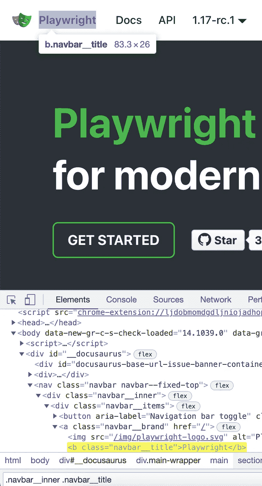
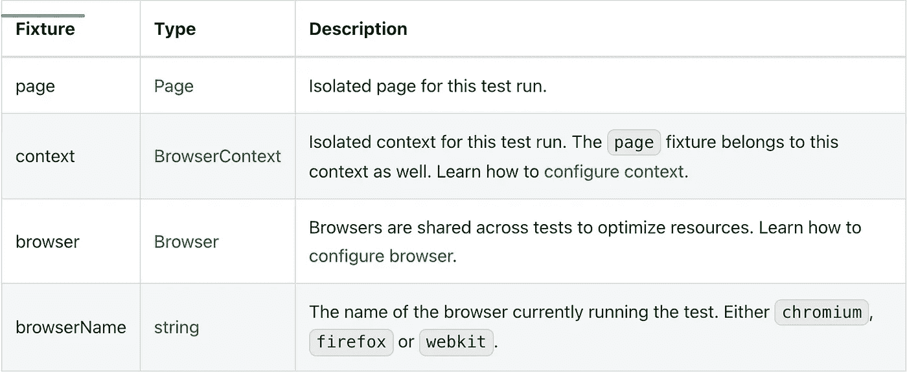

# 让我们来玩玩剧作家框架

> 原文：<https://medium.com/nerd-for-tech/lets-play-around-with-playwright-framework-f08d4f6ff2a?source=collection_archive---------2----------------------->

剧作家测试主要是为了满足端到端测试的需求而设计的。它执行标准测试运行程序的所有功能，甚至更多。剧作家测试使您能够做到以下几点:

*   在所有浏览器上运行测试。
*   并行执行测试。
*   享受开箱即用的环境隔离。
*   捕捉视频、截图和其他关于失败的人工制品。
*   将您的 POM 集成为可扩展的设备。

# 装置

创建一个名为“剧作家 _ 框架”的空文件夹。然后键入 **npm init -y** 来初始化项目。

然后安装下面的节点模块，开始我们的测试。

```
#Playwright has its own end-to-end test runner, which we call Playwright Test.
npm i -D [@playwright/test](http://twitter.com/playwright/test)
# install supported browsers
npx playwright install
```

安装完成后，您可以看到如下所示的 package.json 文件:

```
{
  "name": "playwright_framework",
  "version": "1.0.0",
  "description": "",
  "main": "index.js",
  "scripts": {
    "test": "echo \"Error: no test specified\" && exit 1"
  },
  "keywords": [],
  "author": "",
  "license": "ISC",
  "devDependencies": {
    "@playwright/test": "^1.16.3"
  }
}
```

# 编写我们的第一个测试

创建`tests/demo.spec.js`来定义你的测试。请注意，我使用 WebStrom 作为我的 IDE。然后创建第一个测试来验证图标附近的文本，如下所示:



```
*const* { test, expect } = require('@playwright/test'); 
test('demo test', *async* ({ page }) => {  
*await* page.goto('https://playwright.dev/');  
*const* title = page.locator('.navbar__inner .navbar__title');  
*await* expect(title).toHaveText('Playwright');});
```

现在，使用下面的命令运行您的测试，假设测试文件在 tests 目录中。剧作家测试刚刚使用 Chromium 浏览器在无头模式下进行了一次测试。

```
npx playwright testyaseen@342-MC-C02PPBQ5G8WN playwright_framework % npx playwright testRunning 1 test using 1 worker✓  tests/demo.spec.js:3:1 › demo test (6s)1 passed (7s)
yaseen@342-MC-C02PPBQ5G8WN playwright_framework %
```

让我们指导它使用带标题的浏览器:

```
npx playwright test --headed
```

# 配置文件简介

为了享受剧作家测试提供的所有特性，您需要创建一个配置文件剧作家.配置. js

```
const { devices } = require('@playwright/test');

const config = {
    forbidOnly: !!process.env.CI, *//Whether to exit with an error if any tests or groups are marked as test.only(title, testFunction) or test.describe.only(title, callback). Useful on CI.* retries: process.env.CI ? 2 : 0, *//The maximum number of retry attempts given to failed tests.* use: {
        trace: 'retain-on-failure', *//Playwright Trace Viewer is a GUI tool that helps exploring recorded Playwright traces after the script ran. Record a trace for each test, but remove it from successful test runs.* },
    projects: [
        {
            name: 'chromium',
            use: { ...devices['Desktop Chrome'] },
        },
        {
            name: 'firefox',
            use: { ...devices['Desktop Firefox'] },
        },
        {
            name: 'webkit',
            use: { ...devices['Desktop Safari'] },
        },
    ],
};

module.exports = config;
```

默认情况下，测试应该在不同的浏览器中进行。

```
yaseen@342-MC-C02PPBQ5G8WN playwright_framework % npx playwright test
Using config at /Users/yaseen/Desktop/Code Tutorials/playwright_framework/playwright.config.jsRunning 3 tests using 3 workers✓  [chromium] › tests/demo.spec.js:3:1 › demo test (4s)
  ✓  [firefox] › tests/demo.spec.js:3:1 › demo test (7s)
  ✓  [webkit] › tests/demo.spec.js:3:1 › demo test (13s)3 passed (15s)
```

使用`--project`命令行选项运行单个项目。

```
yaseen@342-MC-C02PPBQ5G8WN playwright_framework % npx playwright test --project=firefox
Using config at /Users/yaseen/Desktop/Code Tutorials/playwright_framework/playwright.config.jsRunning 1 test using 1 worker✓  [firefox] › tests/demo.spec.js:3:1 › demo test (4s)1 passed (5s)
```

# 玩弄断言

对于测试断言，剧作家测试利用了 expect 库。它用特定于剧作家的匹配来增强它，以提高测试的便利性。

```
const { test, expect } = require('@playwright/test');

test('demo test', async ({ page }) => {
    await page.goto('https://playwright.dev/');

    *// Expect a title "to contain" a substring.* await expect(page).toHaveTitle(/Playwright/);

    *// Expect an attribute "to be strictly equal" to the value.* await expect(page.locator('text=Get Started').first()).toHaveAttribute('href', '/docs/intro');

    *// Expect an element "to be visible".* await expect(page.locator('text=Learn more').first()).toBeVisible();

    await page.click('text=Get Started');
    *// Expect some text to be visible on the page.* await expect(page.locator('text=Introduction').first()).toBeVisible();
});
```

# 测试夹具介绍

```
test('basic test', *async* ({ page }) => {
// Here {page} is fixture
```

装置是为每个测试运行产生的对象。剧作家测试预装了这些装置，您也可以添加自己的装置。当执行测试时，剧作家测试检查每个测试声明，分析测试所需的夹具集合，并准备这些夹具，特别是为测试。



# 剧作家测试挂钩简介

要建立和分解测试之间共享的资源，使用“test.beforeAll”和“test.afterAll”钩子。您还可以使用“test.beforeEach”和“test.afterEach”挂钩来分别构建和分解每个测试的资源。

```
const { test, expect } = require('@playwright/test');

test.describe('demo feature', () => {
    test.beforeEach(async ({ page }) => {
        *// Go to the starting url before each test.* await page.goto('https://playwright.dev/');
    });

    test('demo test', async ({ page }) => {
        *// Assertions use the expect API.* await expect(page).toHaveURL('https://playwright.dev/');
    });
});
```

# 配置 NPM 脚本

剧作家测试将默认检测剧作家.配置. js。

修改 package.json 以配置

```
{
  "name": "playwright_framework",
  "version": "1.0.0",
  "description": "",
  "main": "index.js",
  "scripts": {
    "test": "playwright test"
  },
  "keywords": [],
  "author": "",
  "license": "ISC",
  "devDependencies": {
    "@playwright/test": "^1.16.3"
  }
}
```

我们跑吧

```
yaseen@342-MC-C02PPBQ5G8WN playwright_framework % npm test> playwright_framework@1.0.0 test /Users/yaseen/Desktop/Code Tutorials/playwright_framework
> playwright testUsing config at /Users/yaseen/Desktop/Code Tutorials/playwright_framework/playwright.config.jsRunning 3 tests using 3 workers✓  [chromium] › tests/demo.spec.js:9:5 › demo feature › demo test (4s)
  ✓  [firefox] › tests/demo.spec.js:9:5 › demo feature › demo test (5s)
  ✓  [webkit] › tests/demo.spec.js:9:5 › demo feature › demo test (3s)3 passed (7s)
```

如果您想将配置文件放在其他地方，请使用--config 选项。

```
{
  "name": "playwright_framework",
  "version": "1.0.0",
  "description": "",
  "main": "index.js",
  "scripts": {
    "test": "playwright test --config=tests/example.config.js"
  },
  "keywords": [],
  "author": "",
  "license": "ISC",
  "devDependencies": {
    "@playwright/test": "^1.16.3"
  }
}
```

如果您想使用 npm 在带标题的浏览器中运行，请使用以下命令:

```
npm run test -- --headed.
#To pass options through npm script, use double dashes:
```