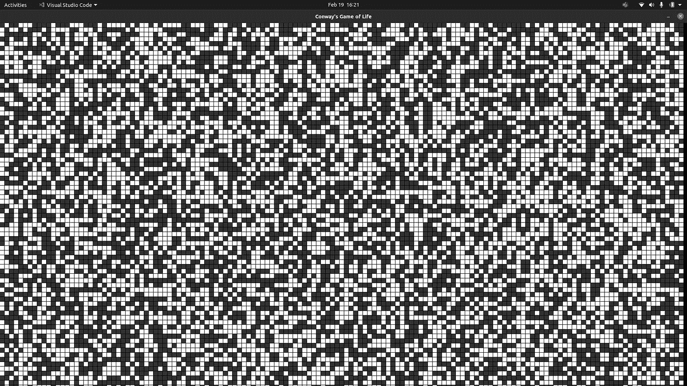
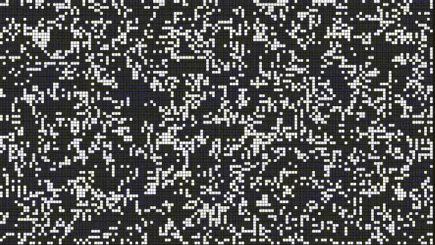

# 让我们用 Python 来玩生命游戏吧

> 原文：<https://medium.com/nerd-for-tech/lets-play-game-of-life-with-python-ec3e5ae00e6?source=collection_archive---------1----------------------->


在 [Unsplash](https://unsplash.com?utm_source=medium&utm_medium=referral) 上由 [James Wainscoat](https://unsplash.com/@tumbao1949?utm_source=medium&utm_medium=referral) 拍摄

看到简单的规则如何导致如此复杂的事情是不是很有趣？例如，像鸟群或鱼群。对它们来说规则很简单，如果它们能够避开捕食者，它们就能生存下来。[动物学家韦恩·波茨在 1984 年的《自然》杂志上提出了鸟类如何群居的一种解释。他的工作表明，成群的鸟不只是跟随一个领导者或他们的邻居。相反，它们预测鸟群运动方向的突然变化。所以，如果鸟群边缘的一只鸟改变了方向，其余的也会像波浪一样跟着改变方向。](https://earthsky.org/earth/how-do-flocking-birds-move-in-unison#:~:text=His%20work%20showed%20that%20bird,View%20larger.)

成群结队的规则可以归结为三个主要规则:

1.  分离—避免拥挤邻居(短程排斥)
2.  对齐-转向邻居的平均航向
3.  凝聚力——转向邻居的平均位置(远距离吸引)

因为这三个规则，我们可以看到令人震惊的鸟类齐奏运动；它美妙、优雅、同步的展示。但是这些鸟所做的只是努力活下去。

现在，我们将看到简单的规则如何能导致一个复杂而有趣的系统。但是我们不会在自然界看到，我们会通过编程模拟在我们的屏幕上看到。是时候说说*康威的人生游戏*了。

# 背景

在我们进入编码阶段之前，先了解一些背景知识。

引自维基百科:

```
The **Game of Life**, also known simply as **Life**, is a [cellular automaton](https://en.wikipedia.org/wiki/Cellular_automaton) devised by the British [mathematician](https://en.wikipedia.org/wiki/Mathematician) [John Horton Conway](https://en.wikipedia.org/wiki/John_Horton_Conway) in 1970\. It is a [zero-player game](https://en.wikipedia.org/wiki/Zero-player_game), meaning that its evolution is determined by its initial state, requiring no further input. One interacts with the Game of Life by creating an initial configuration and observing how it evolves. It is [Turing complete](https://en.wikipedia.org/wiki/Turing_complete) and can simulate a [universal constructor](https://en.wikipedia.org/wiki/Von_Neumann_universal_constructor) or any other [Turing machine](https://en.wikipedia.org/wiki/Turing_machine).
```

*康威生命的游戏*宇宙是一个无限的二维网格，每个网格都有两种状态，活着或死了，或人口稠密或人口稀少。每个细胞被八个邻居包围，这将决定中心细胞在下一段时间内是活的、死的还是保持活的。

这些是支配康威生命游戏宇宙的过渡规则:

1.  任何少于两个活邻居的活细胞都会死亡，就好像是由于人口减少。
2.  任何有两个或三个活邻居的活细胞都会延续到下一代。
3.  任何有三个以上活邻居的活细胞都会死亡，好像是由于人口过多。
4.  任何一个死细胞，只要有三个活的邻居，就会变成活细胞，就像通过繁殖一样。

只有四条规则，生命的游戏能够创造许多形式，一些是静态的(静物)，另一些是原地静态振荡的(振荡器)，还有移动的物体(宇宙飞船)。结果将是如此惊人的网格显示。

# 编码会话

将使用 Python 中的 *pygame* 制作*康威的《生命的游戏*的模拟。我们将通过 *pygame，*的基础，然后开始全面实现它。但是，如果您想立即开始实现，可以跳过基础部分。

## Pygame 的基本

让我们从让我们创建模拟的 *pygame* 的基础开始。对于我们的极简模拟，我们只需要学习一小部分 *pygame* 提供的工具。所以如果你想了解更多关于 *pygame，*我会在文末列出你需要的资源。

在我们开始编码之前，您必须确保您的环境中安装了 pygame。之后，我们就可以开始写代码了。

首先，我们在第 1 行导入 pygame 模块，在第 3 行初始化 *pygame* 模块，并在第 8 行创建一个屏幕作为我们绘图的画布。同样，我们在第 5 行和第 6 行定义了屏幕宽度和屏幕高度，然后我们将它们作为`set_mode`方法参数。如果运行这段代码，会发生什么？等待，它会打开一个新窗口，但这个窗口会立即关闭。

这就是无限循环派上用场的地方。因为如果我们想保持窗口打开，我们将需要一个无限循环，这样程序就没有时间到达进程的末尾。但是，如果我们不给它提供停止条件，无限循环将是一件坏事，否则，它将永远运行下去。现在，让我们对代码做一些修改。

我们看到从第 11 行开始到代码结尾，我们添加了一个无限 while 循环，使用事件侦听器作为停止条件。`pygame.event.get()`将为我们提供事件对象，在本例中，它监听的事件是当窗口关闭按钮被按下时。如果按下窗口关闭按钮，无限循环将终止。注意，我见过其他几种编写无限循环的方法，比如使用标志`is_run`，或者`pygame.quit`。但是，上面的代码对我来说很好。

屏幕的默认背景颜色是黑色，但是我们可以改变它。比如我们想把它改成白色。

在第 17 行，我们提供了一个 RGB 值(255，255，255 ),这意味着白色进入`screen.fill,`,所以我们可以有一个白色的背景。注意，我们还添加了第 18 行，因为如果你忘记添加这一行，背景色不会变成白色。如果我们想更新我们的屏幕，我们总是需要这一行。

在这一小节的最后一部分，我们将在屏幕上绘制一个矩形。

在第 19 行中，调用了 drawing 方法。这里，我们用深蓝色画了一个矩形。我们必须向 draw-rectangle 方法提供的第一个参数是我们想要在其上绘图的表面(或画布)。第二个参数是我们想要使用的颜色，最后一个参数是由左上角的坐标(x 和 y)组成的列表，后面是矩形的大小(宽度和高度)。

## 实施

这是我们创建模拟所需要的最基本的东西。现在，我们将逐一实现它。

现在，让我们创建放置运行程序的主文件(`main.py`)。

上面的代码和学习基础部分的最后一个代码差别不大，对吗？主要区别在第 13 行和第 28 行。我们将在不同的文件中创建`GameOfLife`类，并尝试理解它是如何工作的。注意，如果你对第 6 行是做什么的感到困惑，这一行是提供一个运行窗口，有一个好的标题。

让我们从创建类及其构造函数开始。

这里，我们定义了构造函数及其所有参数(主要是关键字参数，因为我不想在试图调用它时指定很多参数)。表面是我们用来绘图的屏幕，宽度和高度是屏幕的属性，比例将决定我们网格的缩放级别(它越大，网格就越大)，偏移是指定单元格之间的空间，活动颜色和非活动颜色是不言自明的对吗？列、行和网格可能是最重要的组件。因此，在创建对象时，网格将由 True 和 False 随机填充(由 NumPy 模块提供),网格的大小等于列和行的值。

我们仍然看不到我们的代码将如何向我们展示结果。现在，让我们将另一段代码放入我们的类定义中。

方法`run`是我们在主文件中调用的方法。方法`draw_grid`将绘制网格的当前状态。这里，我们定义了两个 for 循环，它们将遍历每个单元格，并将它们绘制在屏幕上。在第 9 行，我们检查位置`row`和`col`的值是真还是假。如果是真的，那么我们用活跃的颜色来画，如果是假的，我们用不活跃的颜色来画。然后，让我们通过键入`python main.py.`来运行代码，您可能会看到这样的结果。



很好，我们有坐标了。但是我们仍然错过了进化的部分。

这两个方法的工作是更新我们当前的网格值。在`update_grid,`中，首先，我们复制当前网格，因为我们不想在循环遍历每个单元格时逐个更新它，网格将在所有单元格更新后更新。在第 6 行中，`updated_grid`的`row`位和`col`位的值将通过`update_cell`方法改变。

这就是康威的生活游戏规则实施的地方。从第 16 行到第 25 行，我们检查当前单元周围有多少活着的邻居。在第 28 到 37 行，我们决定了当前单元格的下一个值会变成什么。

*   如果当前单元是活的，并且活邻居的数量小于 2，则当前单元将像人口不足一样死亡。
*   如果当前单元是活动的，并且活动邻居的数量是 2 或 3，则当前单元将保持活动。
*   如果当前单元是活的，并且活邻居的数量大于 3，则当前单元将像由于人口过多而死亡。
*   最后，如果当前细胞死亡，周围有 3 个活着的邻居，它将变得活着，就像通过繁殖一样。

现在让我们改变`run`方法，这样我们可以看到我们的网格更新。

运行`python main.py`看看是什么样子。



很酷吧？我觉得这很酷。

# 结论

我构建这个编程模拟有几个原因。首先，我很久以前就知道康威的《生活的游戏》,甚至在我知道如何编码之前，我对它的样子感到惊讶。第二，对我来说，这是一个伟大而简单的编码挑战，让我的手脏起来并有一些娱乐是很好的。很可能下一个与此类似的项目是模拟一群鸟是如何工作的，或者病毒是如何在人群中传播的。在那之前，下次见，感谢您的阅读。

如果您有任何问题或反馈，请告诉我。

你可以在这里找到完整的代码:[https://github . com/agusrichard/python-workbook/tree/master/game-of-life](https://github.com/agusrichard/python-workbook/tree/master/game-of-life)

资源:

[](https://en.wikipedia.org/wiki/Conway%27s_Game_of_Life) [## 康威的生活游戏

### 生命的游戏，也简称为生命，是由英国数学家约翰·霍顿设计的细胞自动机…

en.wikipedia.org](https://en.wikipedia.org/wiki/Conway%27s_Game_of_Life)