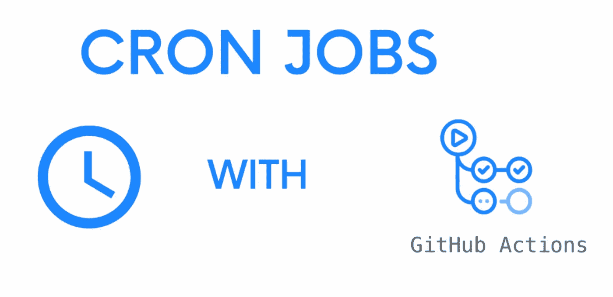
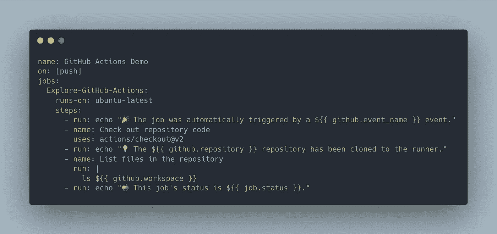
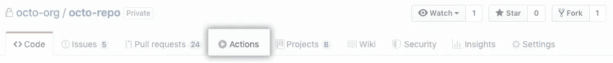
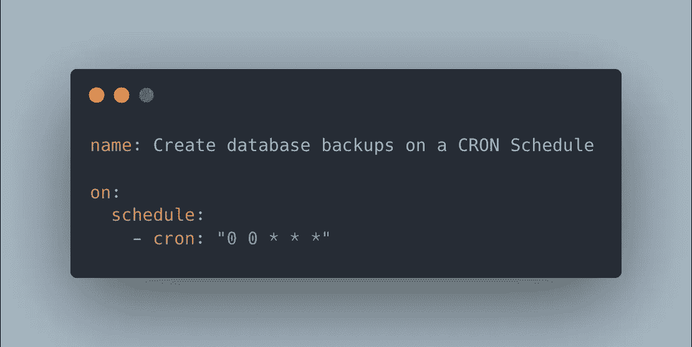
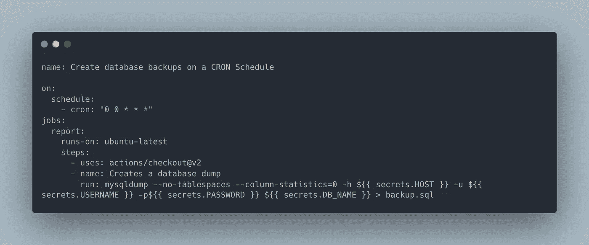
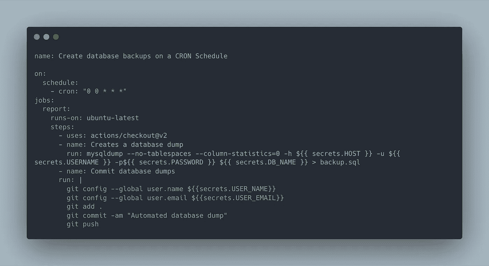
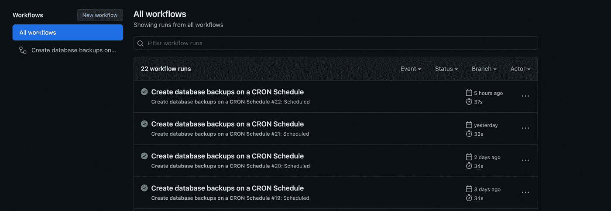

# 让我们使用 Github 操作来运行 cron 作业

> 原文：<https://medium.com/nerd-for-tech/lets-run-cron-jobs-using-github-actions-df64496ffc4a?source=collection_archive---------0----------------------->

大约两年前，我写了一篇关于 cron 作业以及我如何实现一个简单的 cron 作业来备份数据库的文章。你可以在这里找到那篇文章。在本文中，我们将使用 [Github Actions](https://github.com/features/actions) 来运行 cron 作业，并将备份提交给一个存储库。

**什么是 Github 动作？**

> GitHub Actions 现在拥有世界一流的 CI/CD，可以轻松实现所有软件工作流程的自动化。直接从 GitHub 构建、测试和部署您的代码。

Github Actions 提供了各种各样的功能，让我们的生活更加轻松。比如，

*   对任何 GitHub 事件运行工作流(推送、问题创建、拉取请求)
*   可以使用任何语言(支持 Node.js，Python，Java，Ruby，PHP，Go，Rust，。NET 等)
*   Linux、macOS、Windows、ARM 和容器
*   实时日志

**让我们创建我们的工作流**

1.  在 GitHub 的存储库中创建一个`.github/workflows`目录，如果这个目录还不存在的话。
2.  在`.github/workflows`目录下，创建一个名为`github-actions.yml`的文件。更多信息，请参见“[创建新文件](https://docs.github.com/en/github/managing-files-in-a-repository/creating-new-files)”
3.  将以下 YAML 内容复制到`github-actions.yml`文件中

4.将工作流文件提交到存储库中的一个分支会触发`push`事件并运行您的工作流。

5.转至“活动”标签以查看工作流信息

现在让我们根据我们的需要改变我们的工作流程

首先，我们需要将事件触发器更改为 cron 作业。安排 cron 作业很容易。您可以使用 [crontab guru](https://crontab.guru/) 来创建您的 cron 计划表达式。根据这个示例，作业将在每天午夜执行。

让我们考虑一个 MySQL 数据库来创建一个转储，在这种情况下，命令是，

`mysqldump -h hostname-of-the-server -u mysql_user -p database_name > file.sql`

如你所见，它包含一些敏感数据。所以硬编码不会做得很好。那解决办法是什么？

**行动秘密**

> 机密是加密的环境变量。任何拥有此存储库的协作者访问权限的人都可以使用这些机密来执行操作。

您可以通过进入 Repo 设置->机密->操作来添加您的环境变量。

现在我们的工作流程是这样的，

现在我们有了`backup.sql`文件，我们需要将它提交给回购。让我们添加它来结束我们的工作流程。

提交更改后。您将能够看到您的工作流按照给定的时间表执行。

就这样，我们来到了本文的结尾。你可以通过[文档](https://docs.github.com/en/actions/learn-github-actions/understanding-github-actions)获得更多信息。别忘了看看我的其他文章。下次再见了。在那之前保持安全！✌️

# 参考资料:

[1].GitHub 动作快速入门。[2022]文档[在线]。可在 https://docs.github.com/en/actions/quickstart[获得](https://docs.github.com/en/actions/quickstart)【2022 年 2 月 22 日获得】

[2] GitHub 预定动作。可在:【https://jasonet.co/posts/scheduled-actions/ 【2022 年 2 月 22 日访问】