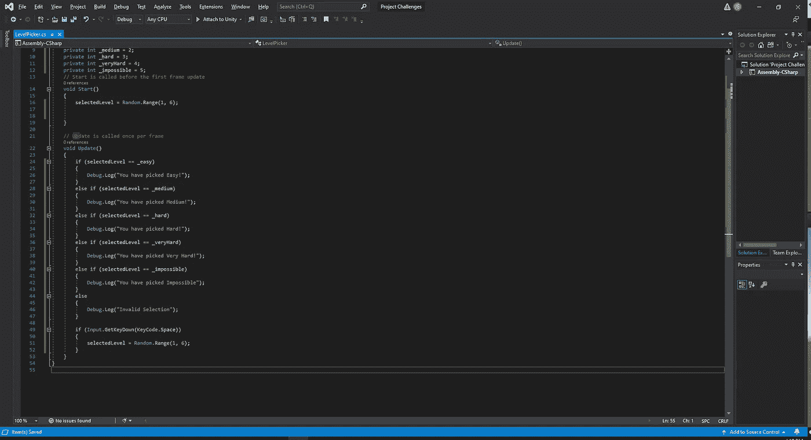
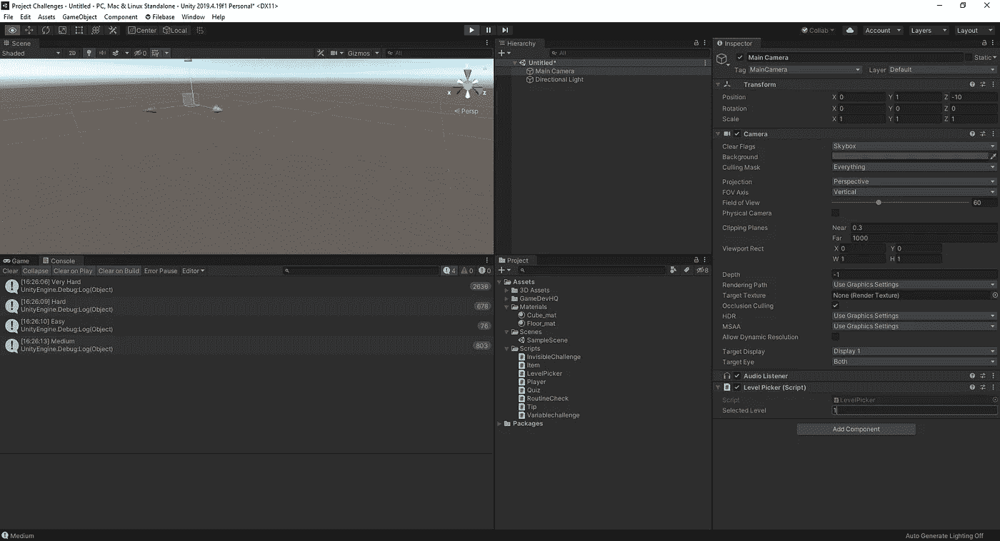
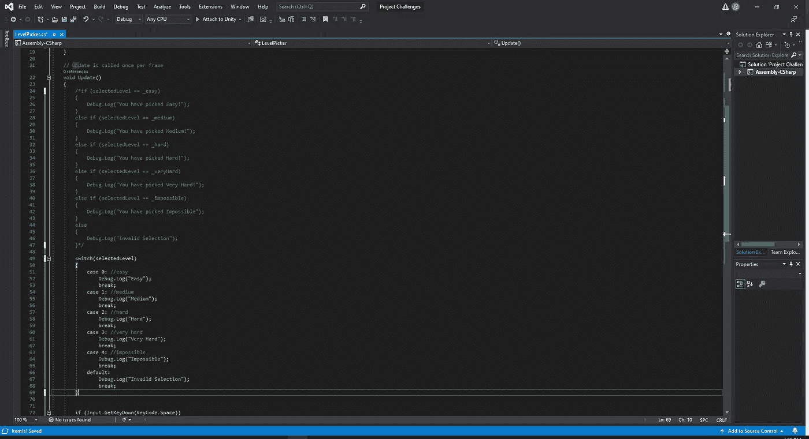
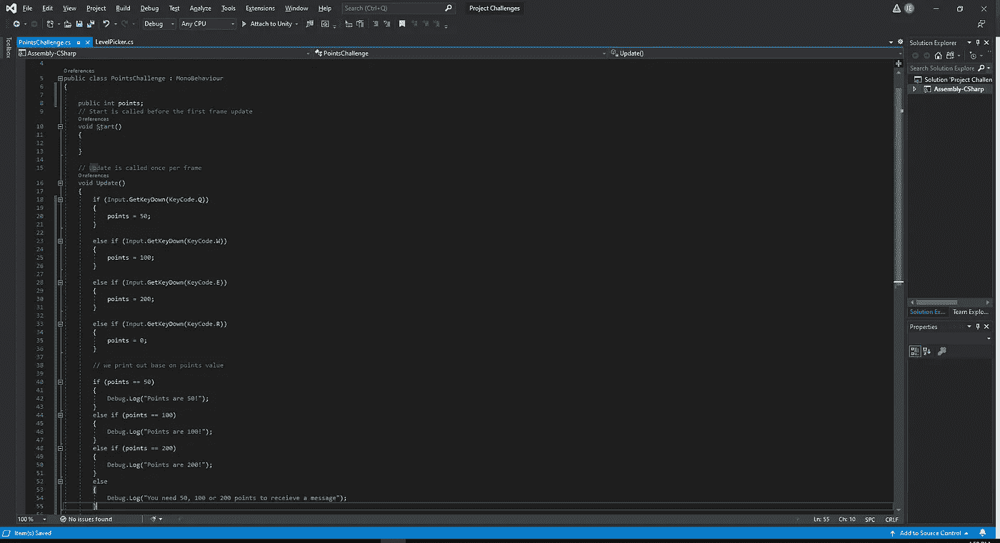
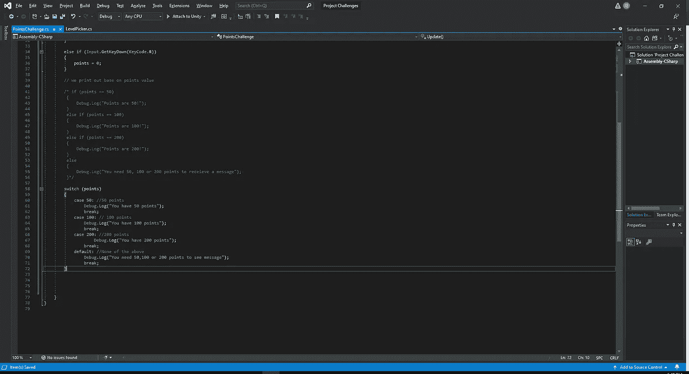
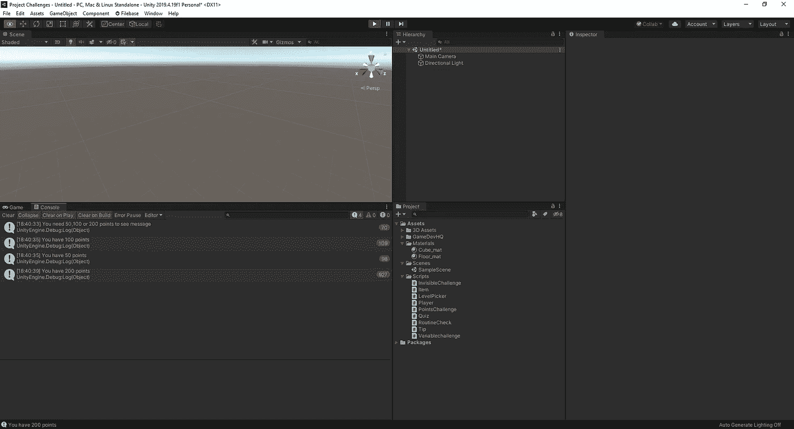
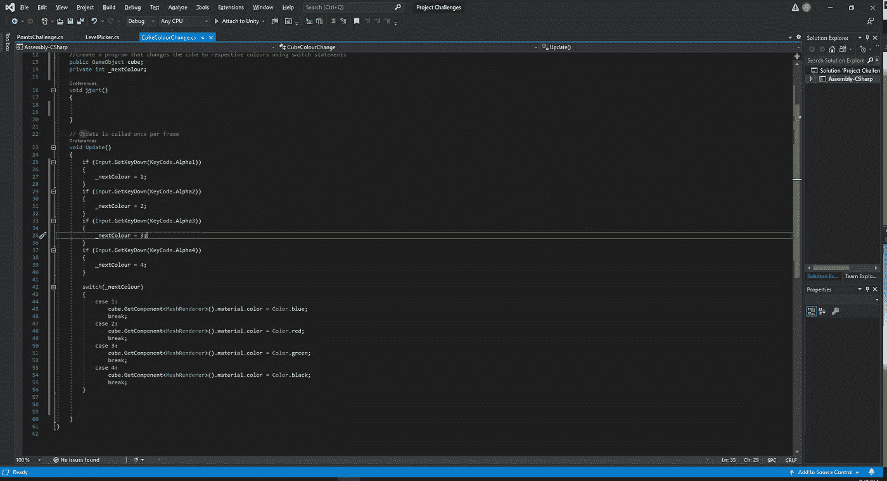
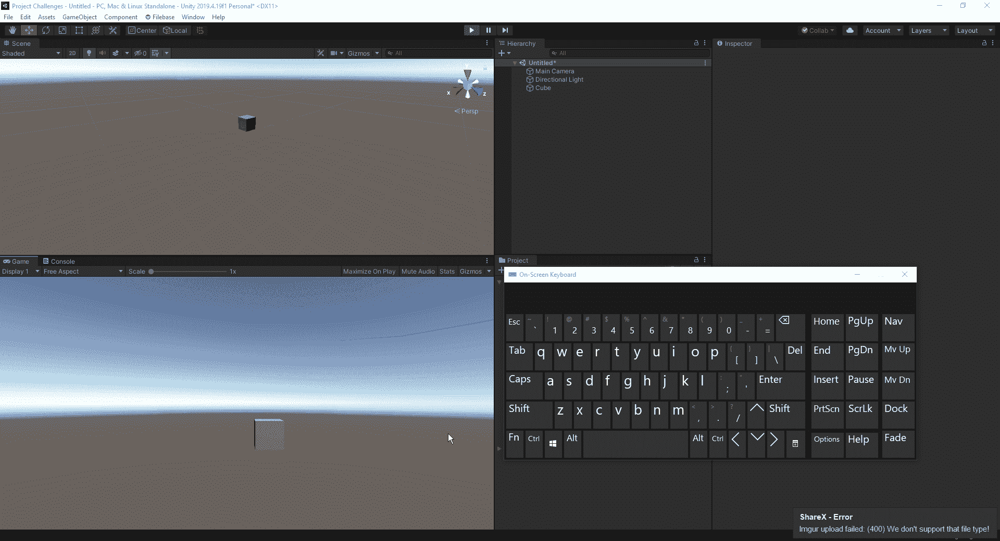

# 让我们用 switch 语句把事情调换一下

> 原文：<https://medium.com/nerd-for-tech/lets-switch-things-up-with-switch-statements-8ba92821b8f1?source=collection_archive---------26----------------------->

当我们想清理使用大量 else if 语句的代码时，Switch 语句是一个不可思议的工具。thump 的一个好的规则是，如果您有两个以上的 else if 语句来检查不同响应的相同条件，我们应该考虑使用 switch 语句来使它更简洁。让我们来看一个包含一堆 else if 代码行的例子，看看我们能做些什么来使它看起来更简洁:

正如我们所看到的，有许多不同的 else if 语句。现在，如果我们在编辑器中测试它，我们会得到:

正如我们所看到的，这些语句起作用，并让我们知道选择了哪个难度，但这需要大量的输入。因此，如果我们将它转换为 switch 语句，它将减少我们必须键入的数量，同时获得相同的结果。

从上面的差异中我们可以看出，我们的 switch 语句比 else if 语句要小得多。它看起来也比我们上面那些多余的文字更有吸引力。另外，如果我们想注释掉一段代码，我们只需在代码的开头键入/*，然后在代码的结尾键入*/。介于两者之间的所有东西在代码中都是不活动的，因为我们已经指定不希望它成为实际代码的一部分。
现在我们来看另一个例子:

正如我们所看到的，代码中有很多混乱的地方，我们可以对其进行修改，使其看起来更整洁。现在，看看上面的例子，我们可以看到 2 组 if 语句正在被实现，您可能想知道我们是否可以将输入语句转换成 switch 语句。答案是否定的，因为我们没有检查那组语句中的逻辑。对于按键，将它设为 else if 是非常好的，因为我们只能按有限数量的键。

正如我们从上面看到的，对于我们来说，要运行这个 switch 例程，我们只需将我们分配给键的值作为 case，当我们在游戏中运行它时，我们会得到我们编码的结果。

# 用开关改变立方体颜色

让我们把我们所学的知识应用到我们编辑器中的一个游戏对象上。我们的目标是，当我们按下 1、2、3 或 4 时，我们的立方体颜色分别变为蓝色、红色、绿色或黑色。首先，我们将制作一个立方体，一个新的脚本，并打开我们的脚本:

变色立方体脚本

正如我们从上面看到的，我们只需要编写几行代码就可以让它工作。理论上，我们可以将颜色变化附加到 if 语句上，并得到相同的结果，但我们在这里想要采取的行动是处理 switch 语句。所以，我们所做的就是给我们的 nextcolour 赋值，用这些数字，我们产生了我们的 case 值。现在，我们可以通过获取网格渲染器组件并告诉 unity 我们想要的材质颜色来创建颜色变化脚本。完成所有这些后，我们可以在编辑器中检查我们的结果:

色变化

现在我们已经基本掌握了创建 switch 语句的方法，我们可以切换到我们的游戏，看看如何在代码中实现它。