# 让我们来谈谈条形图

> 原文：<https://medium.com/nerd-for-tech/lets-talk-about-bar-charts-f9a394d8052e?source=collection_archive---------17----------------------->

## **沉默的超级英雄**

像 Tableau、Power BI 这样的工具让我们的可视化变得更加容易。有了这些工具，我们可以做任何事情。但即使在那之后，条形图也是最常用的图表，尤其是在商业仪表盘上。

# 你应该什么时候使用它？

它最适合用于显示数据点的分布以及比较维度上的值。

让我们举一个例子，如果您正在查看出货模式的销售额，并且需要了解哪种模式的销售额最高，那么条形图是最合适的。

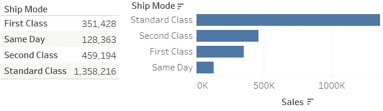

# 不要做什么？

如果用在正确的地方，以正确的方式使用，它们是非常强大的。

来说说一些不该做的事吧。

1.  **未排序的柱状图**:柱状图对于找出最高点和最低点非常有用，但是你在下面的图表中看到了吗？你花了多长时间找到最高和最低的销售额？

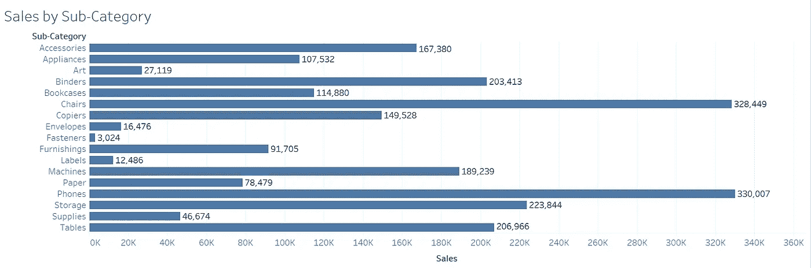

这是一个没有正确使用条形图的例子。让我们把它打扫干净

现在好点了吗？我想你已经答应了。嗯，就这么简单。

但是有例外吗？是的，有。有时客户希望图表按字母顺序或他们所指的特定顺序排序。在这种情况下，可以按维度而不是按度量来排序。

现在谈下一点。上图中有些东西是多余的。你能猜出它是什么吗？

是轴心！当我在每个条上添加标签时，保持轴是没有意义的。让我们摆脱它和网格线。

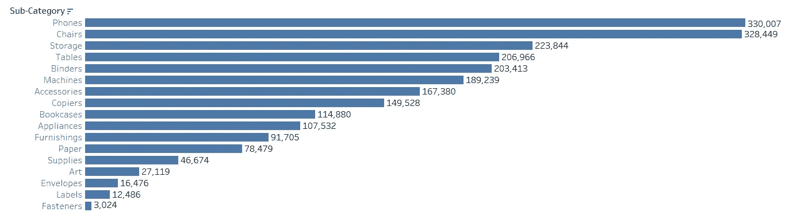

那是一笔交易！

2.**颜色**:让我们来看下一个例子，条形图上的颜色。

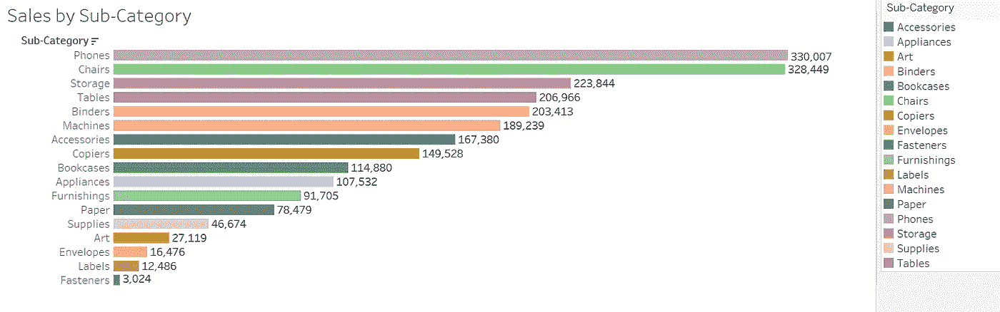

太花花绿绿了吧？但我看到这种事经常发生。我们的大脑已经非常有效地识别长度差异，我们真的需要颜色吗？绝对不行。对于一个人来说，超过两三种颜色是很难理解的。

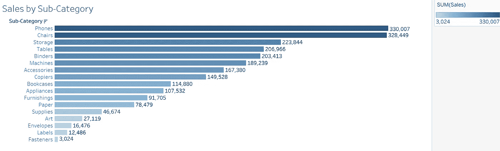

另一个关于颜色的例子——使用彩色销售。当你已经有了不同长度的条，添加它到颜色是多余的，至少对我来说有点分散注意力。

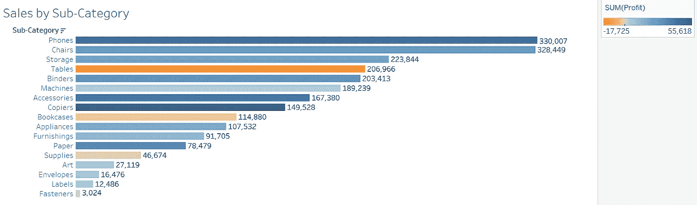

但是在这种情况下，我们在颜色和长度上获利。现在，这是一个有效的情况。它清楚地向我展示了“桌子”可能有很好的销售，但却有负利润。

# 美化你的条形图

条形图也可以很美！我知道你一定花了一整天在一个有条形图的仪表盘上工作，这可能是你最不想听到的。当我开始着手改造周一挑战时，我会尽量不使用条形图。但是后来我惊讶于一点点格式怎么能美化条形图。

分享一些来自数据社区的例子:)

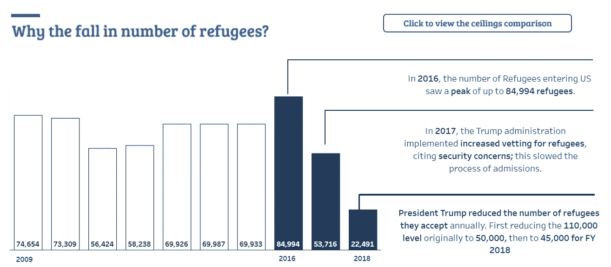

快照来自 [Meera](https://public.tableau.com/app/profile/meera6133/viz/IronVizRefugeeMigrationtotheUS/IronVizRefugeeMigrationtotheUS) 的 viz

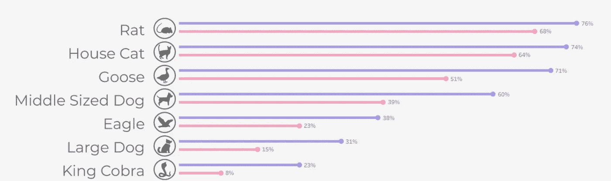

来自[马尔顿·巴拉](https://public.tableau.com/app/profile/martonballa/viz/Whatanimalcouldyoubeatinafight-MakeoverMonday2021W20/Whatanimalcouldyoubeatinafight)的快照

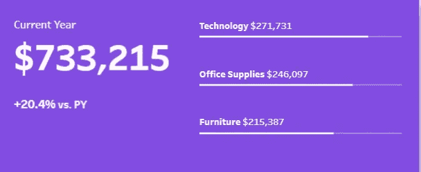

快照来自[奥卢索拉·奥洛霍](https://public.tableau.com/app/profile/olushola.olojo/viz/SalesPerformance_MapLayers/SalesOverview)的

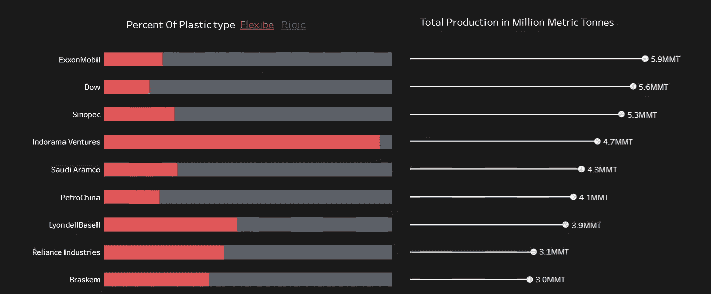

快照来自[萨维里奥·罗凯蒂](https://public.tableau.com/app/profile/saveriorocchetti/viz/PLASTICWASTEMAKERSINDEX/Dashboard1)的

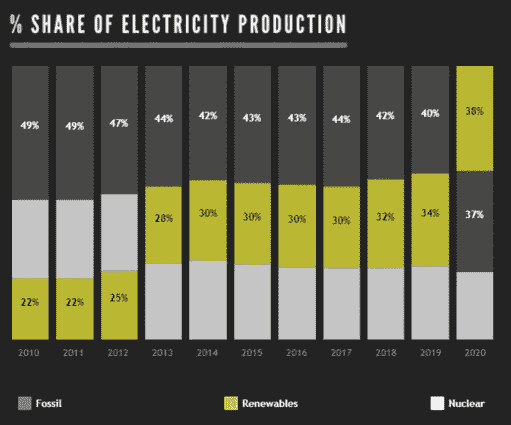

来自 [Aashique](https://public.tableau.com/app/profile/aashique.s/viz/RisingRenewablesFallingFossils_16122744180110/RisingRenewablesFallingFossils) 的快照

一点格式化可以创造奇迹！现在我希望你看到条形图的力量。

下次当你有这种感觉“我能用什么来代替条形图？”如果你真的需要的话，一定要考虑一下。如果你只是为了“酷”而用一些花哨的东西来代替它，请三思。条形图在我们所有的仪表盘中都是一个沉默的英雄。今天让我们承认这个事实:)

只是一个快速方便的指南，我正在为 Tableau 中的[条形图](https://public.tableau.com/app/profile/priyanka.dobhal0993/viz/HowToVizBarCharts/HowToVizBarCharts)工作。有什么好的条形图的例子吗？请在评论区与我分享。

谢谢你的阅读。