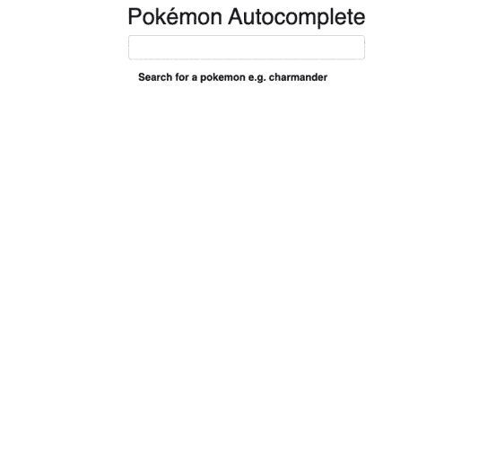
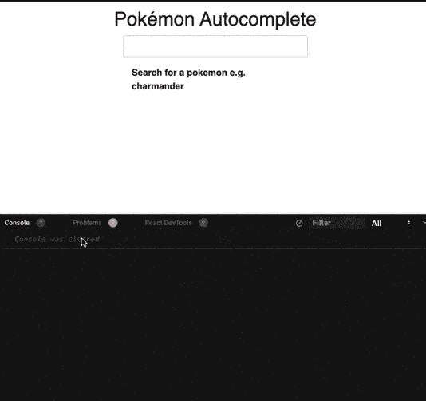
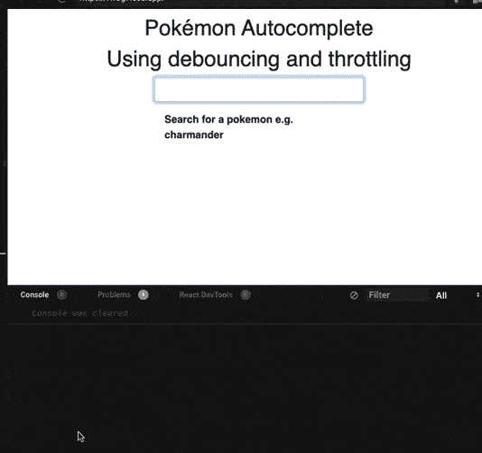
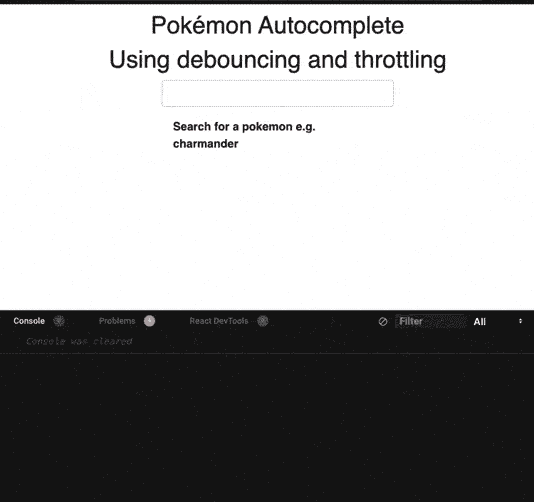

# 让我们来谈谈去抖动和节流，以及它们如何增强 react 应用程序的性能。

> 原文：<https://medium.com/nerd-for-tech/lets-talk-about-debouncing-and-throttling-and-how-they-can-enhance-your-react-app-s-performance-10fba026d126?source=collection_archive---------7----------------------->

> 去抖动和节流是用于性能优化的 JS 模式，用于控制用户在特定时间段内执行动作的速率。

# 嗯...什么？？

## 场景 1

想象一下，你正在一个网站上搜索某样东西。每次击键时，应用程序都会向服务器发出请求并获取结果。但是我们关心每次击键得到的结果吗？也许不是..我们只关心完成输入后的结果，或者可能在输入一些内容后暂停以获取相关结果。这就是去抖动和节流技术派上用场的时候。

## 场景 2

想象一下另一个场景，你在玩一个多人射击游戏，你用鼠标控制射击。一旦你点击鼠标按钮，玩家射击，在幕后一个 API 被调用来发送更新的统计数据(例如，你剩下的子弹总数或你的健康百分比)到服务器。一旦你完成射击，发送更新的数据是有意义的，而不是每次点击鼠标都发送。最后，重要的是(对你这个玩家来说)你开枪后剩下的子弹数量。

# 好吧，现在怎么办？

像这样的动作和一些更像例如滚动、调整大小等的动作是由用户决定执行的。有时，用户可能比实际需要更频繁地触发它。如果所有这些操作都涉及繁重的计算操作，它可能会降低应用程序的性能。这时去抖动和节流技术就派上了用场。

# 听起来很棒..但是，我们如何使用它呢？

在开始实现之前，让我们先了解一下什么是去抖动，什么是节流，以及它们各自的用法。

## 去抖:

在去抖中，我们只在用户完成触发后的特定时间触发一次用户动作。换句话说，忽略所有之前的用户操作，只考虑用户完成触发后的最后一个操作。

**示例 1:** 如果你连续点击一个按钮，比如说 10 次，你的按钮动作将只被调用一次，在你第 10 次点击按钮后过了一段时间，而不是被调用 10 次。

**例子 2:** 当你去一家餐馆时，服务员不是冲到厨房告诉厨师你点的菜，而是等着记下你点的菜，直到你点完，让他把菜加进去。服务员去厨房把你点的菜递给厨师。

## 节流:

在节流中，我们在特定的时间间隔过后定期触发用户事件。

例如:我们在 100 毫秒的间隔内连续点击一个按钮 10 次。如果我们每 200 毫秒限制一次这个动作，按钮动作将被调用 5 次而不是 10 次。

# 凉爽的..但是现在我们如何实现它们呢？

我们将通过 follg 实现去抖动和节流。方式:

*   构建我们的`custom implementation`去抖和节流功能。
*   使用定制钩子`useDebounce()`和`useThrottle().`转换上述定制实现

# 那么我们在建造什么？



口袋妖怪名称自动完成文本框

这个应用程序非常简单。我们希望创建一个自动完成框，当我们在框中键入神奇宝贝的名称时，它会建议/自动完成它们的名称。

# kickstarter 代码

你可以从[这个链接](https://gist.github.com/mistryakshar54/dc1d2d615fd4738cf46f01e1b2d171e4)获得`./mockData.json`的模拟数据，从[这个链接](https://gist.github.com/mistryakshar54/d849194747d88062683f594127cc525a)获得所需的 css。

现在我们可以走了..该应用程序应该如下所示:



注意控制台中的`**filter pokemon**`。`filterPokemon()`通过从搜索框的文本中过滤口袋妖怪的名字来激活我们的自动完成框。我们每击一次键，就会调用`filterPokemons()`。想象一下，如果这个方法做了大量的计算，它将降低我们的应用程序的性能！！！

这正是去抖动和节流等技术大放异彩的时候！！

## 实现去抖:

```
const customDebounce = (fn, timer = 1000) => { let timeOutValue = null; return (...args) => { if (timeOutValue) {
      clearTimeout(timeOutValue);
    } timeOutValue = setTimeout(() => {
      fn(...args);
      clearTimeout(timeOutValue);
    }, timer); };};
```

这里发生的是，我们的`customDebounce()`接受两个参数，要调用的回调函数(在我们的例子中是`filterPokemon()`)和一个定时器值(用户停止执行动作后要等待的毫秒数)。

`customDebounce()`返回一个匿名函数。匿名函数负责在`setTimeout`的帮助下跟踪用户是否还在打字。怎么会？

如果用户输入了什么，我们用一个新的 setTimeout 调用来重置计时器。一旦用户停止输入并且`setTimeout`调用被触发，我们的回调函数就会被执行。

因此，在这个`customDebounce()`的帮助下，我们的函数(`filterPokemon()`)将只在用户停止输入时被调用，而不是在每次击键时被调用。

# 在我们的应用中安装我们的`customDebounce()`:

```
//imports here...**const customDebounce = (fn, timer = 1000) => {
  let timeOutValue = null;
  return (...args) => {
    if (timeOutValue) {
      clearTimeout(timeOutValue);
    }
    timeOutValue = setTimeout(() => {
      fn(...args);
      clearTimeout(timeOutValue);
    }, timer);
  };
};**export default function App() {
  // useStates here // filterPokemon() logic here...**const memoizedDebounce = useCallback(customDebounce(filterPokemons), []);**const handleChange = (e) => {
    // handleChange logic
 **memoizedDebounce(newVal);**
  };return (
    //component logic here...
  );
}
```

我们在声明组件之前添加了`**customDebounce()**` 。我们使用`useCallback`钩子来记忆我们的`**customDebounce()**` ，并向它传递我们的回调函数(`filterPokemons()`)。

## 但是为什么我们需要用 **useCallback** 来记忆它呢？

答案很简单。

```
<input value={autocompleteInput} onChange={handleChange} />
```

每当输入框的值改变时，`onChange()` 重新创建`handleChange()`的新副本。因此，去抖方法总是被重新创建，因此我们无法判断`setTimeout`是否被设置。

整个代码看起来应该像这样:



带去抖功能的应用

**请注意，这一次 filterPokemon 控制台仅在我们停止/暂停输入后才被调用。这真的很棒，因为我们现在可以更少地调用** `**filterPokemon()**` **并节省计算时间！！**

让我们更进一步..让我们创建一个钩子吧！！

# useDebounce 钩子[完全可选]！！

我们将创建一个名为`useDebounce.js`的独立钩子文件

实现相当简单。我们把`customDebounce()`变成一个钩子。我们的`timeout`变量将使用`useState()`转换成状态变量，其余一切都是一样的。

我们现在如何使用它？

```
We replace :
**const memoizedDebounce = useCallback(customDebounce(filterPokemons), []);**with 
**const debouncedFn = useDebounce(filterPokemons);
const memoizedDebounce = useCallback(debouncedFn, [debouncedFn]);**
```

我们现在可以去🥳 🥳了

## 实施节流:

节流的实现就像用 catch 去抖一样..我们不等待暂停..相反，我们等到超时结束，调用回调函数，我们再次设置超时。这让用户可以在一定的时间间隔内调用回调，并看到一些结果，而不是在最后(在用户完成输入之后)得到输出

```
const customThrottle = (fn, timer = 1000) => {
let timeOutValue = null;
return (...args) => {
if (timeOutValue) { return; }
 timeOutValue = setTimeout(() => {
      fn(...args);
      clearTimeout(timeOutValue);
    }, timer);
 };
};
```

这里发生了什么事？

当用户输入时，`customThrottle`被触发调用，设置
`timeOutValue`。`setTimeout`将为`timeOutValue`设置一个 id。

第二次触发`customThrottle`时，`timeOutValue`将不为空，因此将退出函数执行(返回语句)。

一旦`setTimeout`被调用(在特定的毫秒之后)，回调函数(`filterPokemon`)将被执行，并且`timeOutValue`被设置为空。

因此，当`customThrottle`被触发时，`timeOutValue`将为空，因此`setTimeout`将被执行。

这就是`debounce`和`throttle`的关键区别

让我们直接把它实现为一个钩子:

我们现在如何使用它？

```
We replace :
**const debouncedFn = useDebounce(filterPokemons);** with 
**const debouncedFn = useThrottle(filterPokemons);** 
```



请注意，节流不会等待用户停止绑定，也不会在每次击键时触发。相反，它以特定的时间间隔调用`filterPokemon`(我们将默认值设置为 1000 毫秒)。

# 如果我想两个都用呢？我能同时使用两个吗？

是的，去抖动和节流的结合是可能的。

**为什么？:**只有在用户键入后，去抖动才会起作用，而节流只会在特定的时间间隔起作用。可能有这样一种情况，用户需要在键入一些键击以获得相关数据时看到建议，并且可能希望在键入后获得确切的结果。然而这种情况不太可能发生。

**如何？:**我们可以将节流和去抖结合起来，在特定条件下工作。例如，执行节流，直到用户键入 5-6 个字符，然后依靠去抖动获得准确的结果。

注意:

```
**newVal.length > 3 ? memoizedDebounce(newVal) : memoizedThrottle(newVal);**
```

我们一直节流到输入长度为 3，一旦输入长度大于 3，我们就切换到去抖。

## [链接到 codesandbox](https://codesandbox.io/s/peaceful-burnell-rw0g7?file=/src/App.js)

# 结论:

去抖动和节流是提高应用程序性能的好方法。在对钩子、闭包和超时了解不多的情况下，我们可以见证如何节省大量计算时间并改善用户体验。