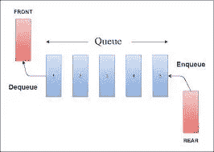
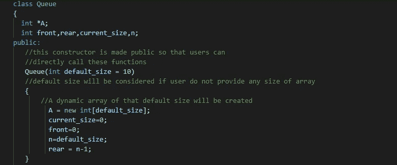
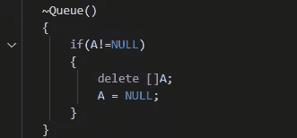
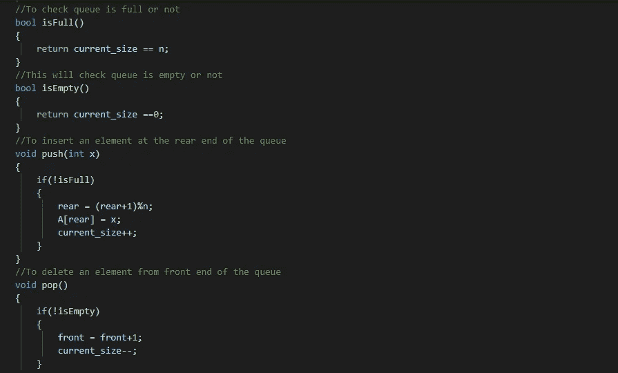
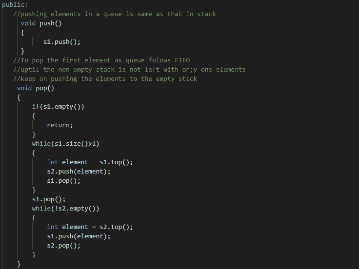

# 让我们来谈谈排队

> 原文：<https://medium.com/nerd-for-tech/lets-talk-about-queue-efac6a416bf1?source=collection_archive---------2----------------------->

来源谷歌图片

## 队列数据结构介绍:

它是一个列表或受限制的数组，限制是可以在一端(后端)执行插入，在另一端(前端)执行删除。它遵循 FIFO 排序，即首先添加的元素将首先被删除。

队列的应用包括:

1.  一种队列由操作系统在调度进程到 CPU 时维护
2.  树数据结构使用它来执行层次顺序遍历
3.  图形数据结构使用它来执行广度优先搜索。

**队列上经常执行的操作:**

1.  IsFull:如果队列的当前大小等于最大大小，则队列已满。
2.  IsEmpty:如果队列的当前大小为零
3.  Push(Enqueue):这将在后端插入一个元素。
4.  Pop(出列):这是从前端删除一个元素。

## 队列类及其操作的实现:

1) **使用数组实现循环队列:**

队列类别

在上面的代码中，我们使用动态分配的数组实现了一个循环队列。因为我们在做动态分配，所以我们需要一个析构函数在函数调用结束后删除所有的数据成员。

破坏者

不同操作的实现:

对队列执行了不同的操作

**2)使用链表 stl 实现队列:**

在这种情况下，如果我们通过在尾部插入一个节点来推动元素，那么 tail 就变成了使用 list stl 的后端，我们可以通过:`list<int>l`来完成

`if(!empty){void push(){ l.push_back(); current_size++;}}`

从我们移除节点的位置开始，head 成为前端。

`if(!full){void pop(){ l.pop_front(); current_size--;}}`

**3)使用堆栈实现队列:**

我们可以使用两个栈来实现一个队列来执行推送操作，我们可以简单地将元素推入一个栈中。要从队列中执行弹出操作，首先我们必须将除最后一个元素之外的所有元素从非空堆栈推入空堆栈。然后，我们可以弹出该元素，并再次将这些元素传输回最初非空的堆栈。为了更清楚，请看一下代码。

使用堆栈实现队列

# 出列:

→它代表双端队列。顾名思义，我们可以从两端执行插入和删除。

→它的一些功能与 vector 相同，一些功能与 list 相同。它具有像向量一样的随机存取特性和像链表一样的末端增长功能。

→每当我们希望从两个元素中展开元素时，出列是最好的数据结构。然而，当我们想要从中间插入或删除元素时，使用向量或列表会更好。

文章结尾。

谢谢各位读者。

希望有帮助:)

快乐编码。