# 让我们来谈谈智能手机上的传感器

> 原文：<https://medium.com/nerd-for-tech/lets-talk-about-sensors-present-on-a-smartphone-bda696421ade?source=collection_archive---------8----------------------->

> “人类现在面临的挑战是，让另一个人比他或她的智能手机更感兴趣。”— **阿兰·德波顿**

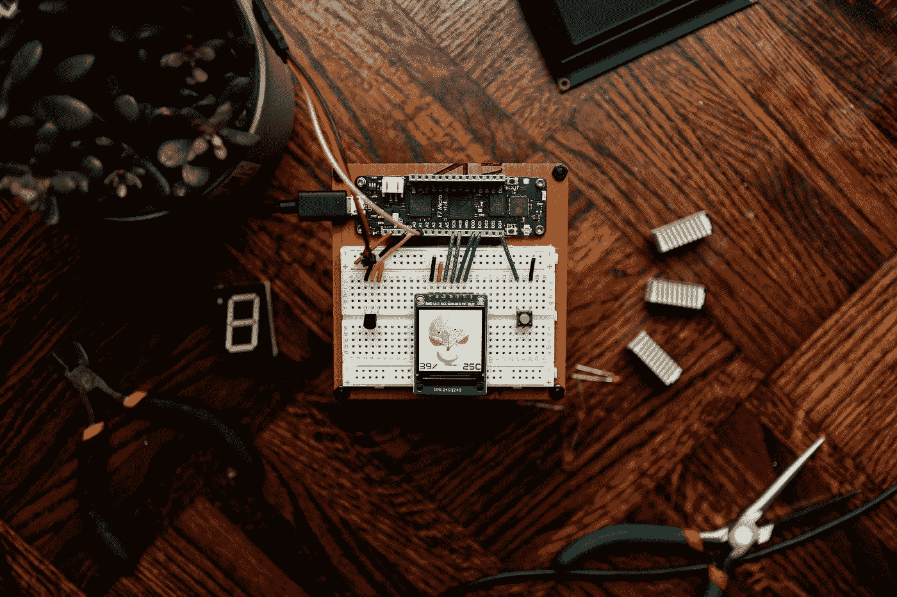

照片由 [Jorge Ramirez](https://unsplash.com/@jorgedevs?utm_source=medium&utm_medium=referral) 在 [Unsplash](https://unsplash.com?utm_source=medium&utm_medium=referral) 上拍摄

在进入主题之前，我将尝试解释一些关于传感器及其工作的信息。由于我对传感器的了解有限，建议你自己去研究一下，以便有更深入的了解。

**什么是传感器，它是如何工作的？？** 传感器是检测或测量大气中存在的物理量、元素或能量的变化，并将其转化为人类可读信号的装置。它们也被称为传感器。

**工作方法**

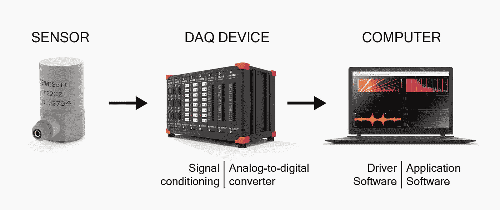

传感器工作— [脱水](https://dewesoft.com/upload/news/daq/what-is-daq/daq-system-shceme.jpg)

上图显示了第一个传感器检测任何量的任何变化/波动，如温度、压力、速度，并将它们作为电信号发送到数据采集设备(data 该设备将模拟信号转换为数字信号]。最后，DAQ 设备将输出传输到使用该信息的应用程序。

理想情况下，您可能对传感器是什么以及它们如何工作有一个精确的轮廓。不久，我们将了解我们的手机有什么样的传感器，以及它们每天是如何帮助我们的。

## 1.接近传感器

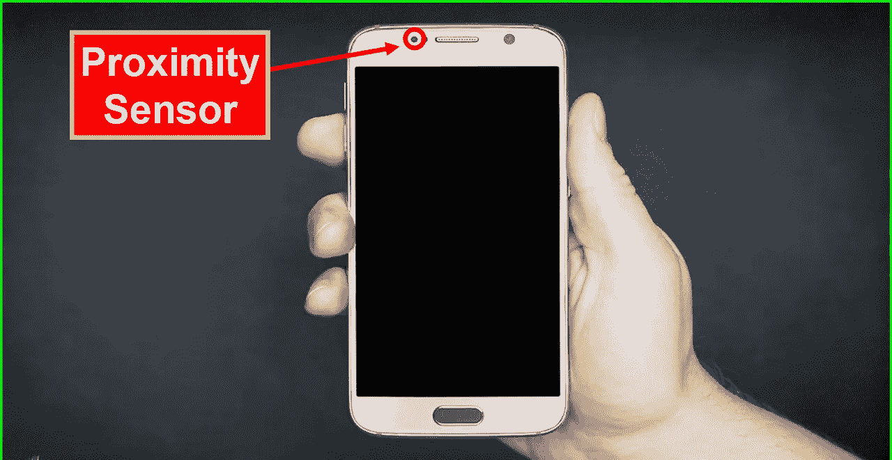

智能手机中的近程传感器— [手机维修](https://www.google.com/url?sa=i&url=http%3A%2F%2Fwww.mobilecellphonerepairing.com%2Fproximity-sensor-not-working-problem-and-solution-to-fix.html&psig=AOvVaw3fAeRGIPT1XmFQfKEaK3zc&ust=1629524199330000&source=images&cd=vfe&ved=0CAoQjRxqFwoTCNi32fLwvvICFQAAAAAdAAAAABAX)

接近传感器在手机顶部，听筒旁边【普通音箱】。在正常运行中，它可以探测到雷达上接触到的任何物体。在通话时，该传感器会自动关闭屏幕以防止意外触摸，并减少电池消耗..

## 2.环境光传感器

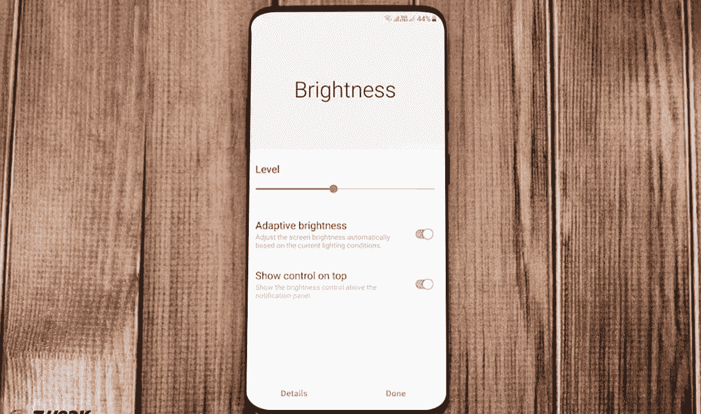

自动/自适应亮度— [调整库](https://y31uv4ra1.vo.llnwd.net/content/wp/tweaklibrary_com/uploads/2020/08/How-to-fix-Android-brightness-problems.jpg)

环境光线传感器检测移动屏幕[LCD、AMOLED、有机发光二极管]的背光，并根据周围环境的光线控制设备的亮度，以及控制手机的应用程序。在自动亮度设置期间，您可能会不知不觉地使用该传感器。

## 3.磁力计

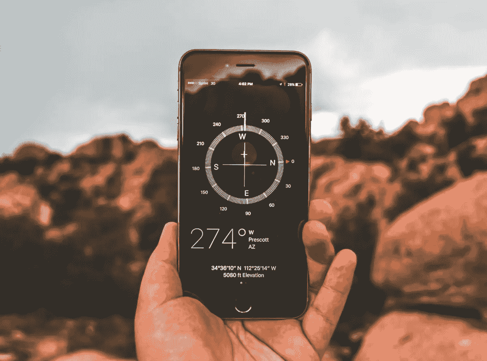

指南针— [移动](https://mobiforge.com/wp-content/uploads/2018/07/iphone-compass.jpg)

磁力计传感器用于通过智能手机检测或估计方向。通过改变智能手机的电压输出，它就像一个数字指南针一样工作，使其与地球的北极保持一致。当我们使用谷歌地图、苹果地图或任何其他基于位置的应用程序等导航应用程序时，这些传感器将被触发，以预测正确的方向。此外，这些传感器还可以作为金属探测器来探测金属。

## 4.指纹传感器

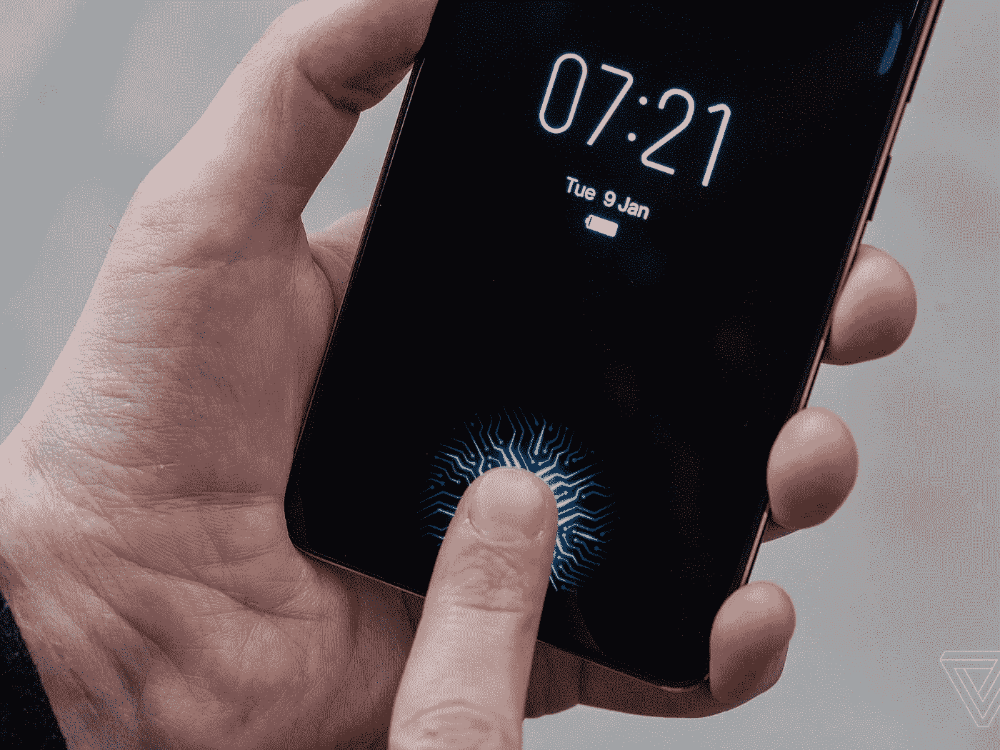

显示指纹识别器— [The Verge](https://cdn.vox-cdn.com/thumbor/Fcih2yNNJyCkDN1W50HCWlPJuuc=/1400x1050/filters:format(jpeg)/cdn.vox-cdn.com/uploads/chorus_asset/file/10001467/jbareham_180108_2234_0109.jpg)

生物传感器使解锁设备变得更加容易。如今，每部智能手机都配有指纹传感器(背面、侧面或屏幕内/显示屏内)，它可以扫描我们的指纹，并通过将其处理为二进制代码来存储指纹，以便稍后对设备进行认证。是不是很美？显然，这让我们的工作变得容易得多，因为我们不必记住 pin 或模式，也不用担心我们的朋友会解锁设备。因此，这项技术提供了更好的安全性。

## 5.加速计

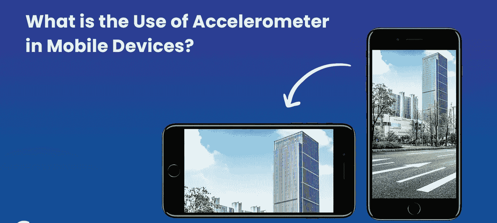

自动旋转模式— [密令解](https://media.credencys.com/wp-content/uploads/2019/09/Accelerometer-in-Mobile.jpg)

加速度计是一种传感器，用于根据基于轴运动的机制来保持设备的 UI 方向。通过在设备设置中选择自动旋转，我们可以使用该传感器自动旋转设备的屏幕[UI]。在赛车游戏或需要计算运动物体速度的应用中，这种传感器非常有用。此外，摩托罗拉等手机制造商使用这种传感器来调整一些手势，如换歌、截图和打开闪光灯。

## 6.陀螺仪

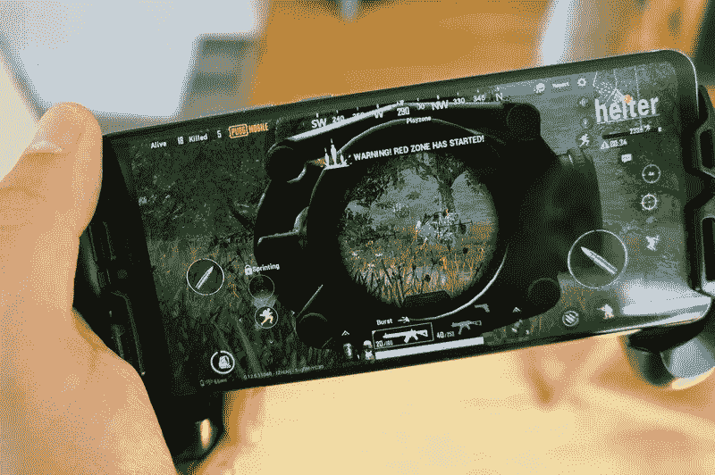

陀螺仪在 PUBG 中的使用— [Android Central](https://www.google.com/url?sa=i&url=https%3A%2F%2Fwww.androidcentral.com%2Fhow-use-gyroscope-controls-aiming-pubg-mobile&psig=AOvVaw3lIbI3ZB-ZBcPTBnUDUtvW&ust=1629542435069000&source=images&cd=vfe&ved=0CAoQjRxqFwoTCPjJx-K0v_ICFQAAAAAdAAAAABAD)

陀螺仪传感器为智能手机提供 360 度倾斜和方向控制。提高了导航的精度水平。特别是在赛车游戏中，甚至在 PUBG 中，你可能会在肾上腺素激增时向各个方向倾斜设备。传感器在三次旋转中的每一次都保持轴的原点对齐，因此无论您在什么位置，您的屏幕都将保持对齐。陀螺仪传感器在增强现实和虚拟现实应用中起着至关重要的作用。

## 7.晴雨表

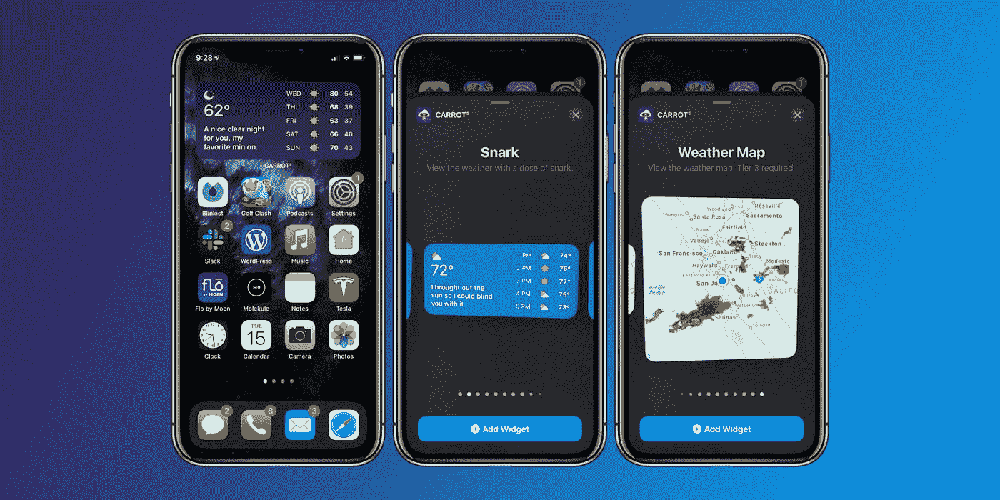

天气 App—[9 到 5 分钟](https://www.google.com/url?sa=i&url=https%3A%2F%2F9to5mac.com%2F2020%2F09%2F16%2Fcarrot-weather-shines-on-ios-14-with-12-rich-widgets-25-apple-watch-complications-more%2F&psig=AOvVaw0SvS71EuR3ottIi4qOTNYx&ust=1629544132671000&source=images&cd=vfe&ved=0CAoQjRxqFwoTCIjKp427v_ICFQAAAAAdAAAAABAf)

气压计传感器基于大气中的压力差来检测大气中的变化。它提供关于您的位置的准确信息，允许您在需要时识别他们激活的 GPS 组件。气象应用程序使用气压计传感器来预测气候条件。

## 8.计步器传感器

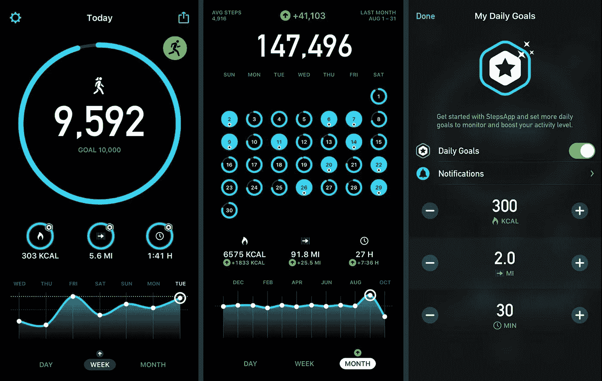

计步器传感器应用— [Lifewire](https://www.google.com/url?sa=i&url=https%3A%2F%2Fwww.lifewire.com%2Fbest-pedometer-apps-for-iphone-4776805&psig=AOvVaw1G3CRBa-TWtRX1a6YIilNw&ust=1629544941158000&source=images&cd=vfe&ved=0CAoQjRxqFwoTCKjuro--v_ICFQAAAAAdAAAAABAa)

计步器被用作步数计数器和步数检测器。他们在设备内部安装了一个加速度计，可以计算你携带设备时的步数。即使你把它放在口袋里，传感器也会完成它的工作。体能训练者和健身会员会喜欢这种装置，因为不再需要携带外部装置或带子。如果您的智能手机中有该传感器，一些应用程序可以触发该传感器。

## **9。心率传感器**

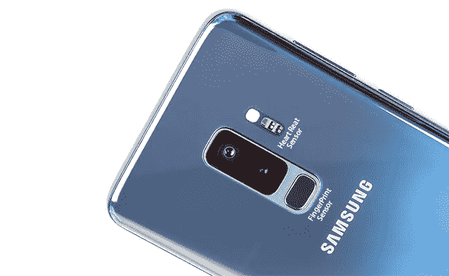

心率传感器— [恢复](https://www.google.com/url?sa=i&url=https%3A%2F%2Fwww.forecovery.com%2Fandroid-tips%2Fsamsung-galaxy-note-9-fingerprint-and-heart-rate-sensor-gestures.html&psig=AOvVaw0aF8AWMy-OmXR04mBGqNzL&ust=1629547556699000&source=images&cd=vfe&ved=0CAoQjRxqFwoTCLiVxe7Hv_ICFQAAAAAdAAAAABAS)

使用心率传感器，您可以使用光学 LED 光源和测量光线的传感器来测量心率。一束光束穿过你的皮肤，反射光由传感器测量。你的皮肤对光的反射会根据流经皮肤的血液量而改变。光反射的这些变化被解释为心跳。

## 其他传感器

还有几个额外的传感器，如温度传感器[用于测量空气温度]，IR blaster[用于操作其他设备]，湿度传感器[给出大气中存在的水蒸气量]，Soli 传感器[用于 Pixel 4 以检测手机移动并改善面部解锁功能]，Lidar 传感器[用于 iPhone 12，类似于雷达使用激光检测深度和距离]，NFC[用于在 10 厘米范围内的设备之间传输数据的近场通信传感器]，当然，我们的相机也有许多传感器，但这值得单独一篇文章。

> 感谢我所有亲爱的读者，请随时留下反馈或建议&虚拟鼓掌不会让你筋疲力尽😇纳伦德拉·贾纳帕提