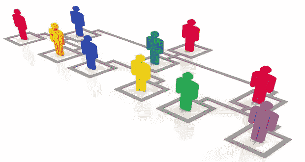
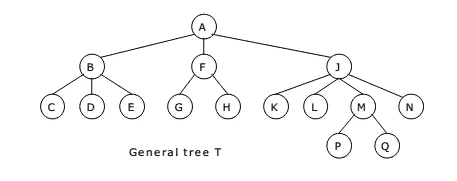
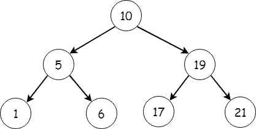
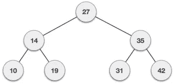
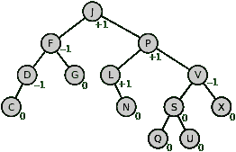
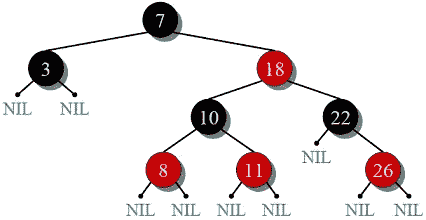

# 让我们来谈谈树 d:

> 原文：<https://medium.com/nerd-for-tech/lets-talk-about-tree-ds-2f9ebad303ac?source=collection_archive---------1----------------------->

# 简介:

它是一种非线性数据结构，用于表示分层数据。我们有不同的数据结构，在选择数据结构之前，当检查以下几点时，会出现使用哪一个的问题:

1.  需要储存什么？？
2.  使用哪种数据结构会使常用操作的成本最小化？？
3.  哪种方式需要的内存最少？？
4.  易于实施..

**在深入探讨之前，让我们先来看看树形数据结构在我们日常生活中的一些应用:**

I)我的计算机中的信息是按层次顺序存储的。

ii)动态拼写检查(字典)

iii)网络路由算法

iv)公司员工的组织及其他..

## 与树形数据结构相关的术语:

来源谷歌图片

→ **根**节点没有任何父节点。

→ **叶**节点没有任何子节点

→ **同一个父节点的子节点**被称为**兄弟节点**

→在有 n 个节点的树中，将有 n-1 条边或链接

→ **任意节点 x 的深度**是从根到 x 的路径长度。

→**根**节点的**深度**为 **0**

→ **任意节点 x 的高度**是从 x 到一个叶节点的最长路径中的边数。所以叶节点的高度为 0。

## 树形数据结构的类型:

a) **一般树**:它可以有无限多个子树。它是所有其他类型树的超集。

源-检查雷达

b) **二叉树**:二叉树的任何节点最多可以有两个子节点。

源代码级升级编码

c) **二叉查找树**:就像二叉树一样，它的任何节点都不能有两个以上的子节点。与二叉查找树的情况一样，左子码的值总是小于或等于父节点，而右节点的值大于或等于父节点。它也被称为搜索树，因为借助上述属性，它可以帮助我们进行比较和相应的搜索。

来源-教程点

d) **AVL 树:N** 以发明者**A**delson-**V**elsky 和 **L** 命名，是第一棵动态平衡树。在该树中，任何节点的两个子子树的高度最多相差 1，即对于任何节点的子子树:

`-1 ≤ height of left subtree — height of right subtree ≤1`

如果执行任何违反上述条件的操作，就会发生重新排序。

来源-维基百科

e) **红黑树**:这是另一种自平衡树，节点被涂上红色和黑色，以保持树的平衡。因为它应该遵循某些规则:根节点是黑色的，没有两个相邻的节点可以是红色的，叶节点是黑色的，一个节点到它的任何子代空节点的每条路径必须具有相等数量的黑色节点。

来源-极客的极客

f) **N 叉树**:这里任何节点最多可以有 N 个子节点。在全 N 元树的情况下，每个节点可以有 0 或 N 个子节点。在完整的 N 元树的情况下，所有的叶节点都在同一层。Trie 是 N 元树最常见的实现。例如，二叉树就是二叉树的一个例子。

g) **B 树**:也是一种自平衡树数据结构。它概括了一个二叉查找树，因为它可以有两个以上的孩子。

我希望上面的文章能够很好地概述树数据结构。我将尝试就这些不同类型的树的细节和实现写单独的文章。

文章结尾。

希望有帮助:)

谢谢你，读者...

快乐编码...