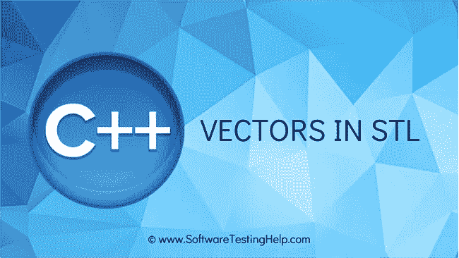
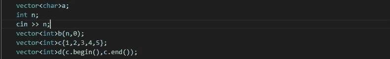
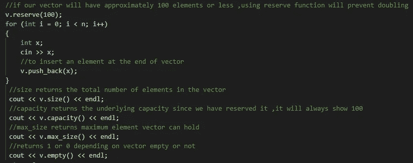
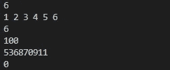
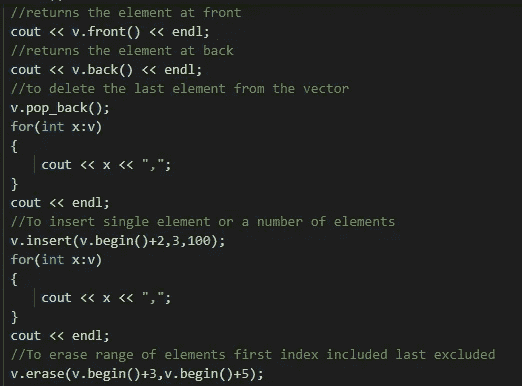
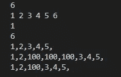
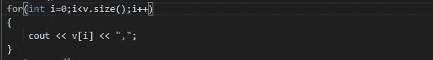
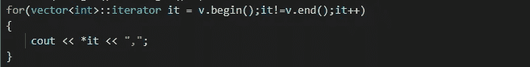
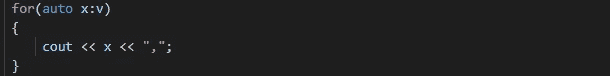

# 我们来谈谈 C++中的 vector

> 原文：<https://medium.com/nerd-for-tech/lets-talk-about-vector-in-c-cfd90c1a6a60?source=collection_archive---------1----------------------->

# 简介:

vector 是一个动态数组，其大小可以根据需要而增长和收缩。它是一个标准的模板库，为了包含它，我们必须通过`#include<vector>`来包含库向量

图片来自软件测试帮助

# 创建和初始化向量的不同方式:

1.  向量<type of="" element="" this="" vector="" is="" going="" to="" hold="">向量的名称。例如在向量中存储整数值。→ `vector<int>a`</type>
2.  在声明的同时我们也要初始化向量。例如，如果我们想在一个向量中存储 n 个元素，并将其初始化为 0。→ `vector<int>b(n,0)`
3.  我们甚至可以在创建向量时直接提供元素。例如→ `vector<int>c{1,2,3,4,5}`
4.  将一个向量的内容复制到另一个向量中。例如，如果我们想把向量 c 的内容复制到一个新的向量中→ `vector<int>d(c.begin(),c.end())`

初始化向量的不同方式

# 向量上的不同函数:

表来自[https://gist.github.com/Devanshi-123](https://gist.github.com/Devanshi-123)

## 上述功能的图示:

1.  与向量大小相关的函数:

功能说明

上面的代码给出了这样的输出

2.插入和删除操作:

上面代码的输出

# 遍历向量的不同方式:

1.  使用向量的大小和我们用来遍历数组的一样..其中 v[i]将表示向量的第 I 个元素。

使用向量的长度遍历

2.我们甚至可以使用 vector 类中定义的迭代器来遍历向量。迭代器的数据类型是`vector<int>::iterator`，或者我们可以编写 auto。这里迭代器指向的值在解引用后打印出来。

使用迭代器遍历

3.使用 for each 循环是最简单的遍历方式之一。除了提到数据类型，我们甚至可以使用 auto。

遍历使用 for each 循环

我希望这篇文章对读者有所帮助..

感谢阅读

快乐编码..