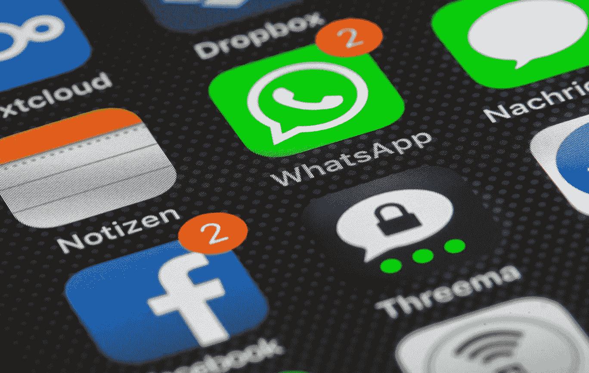
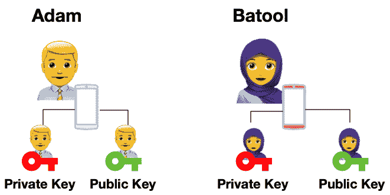
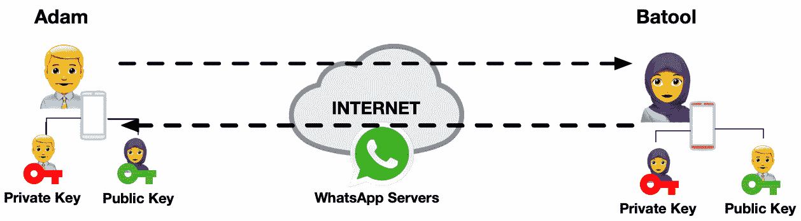
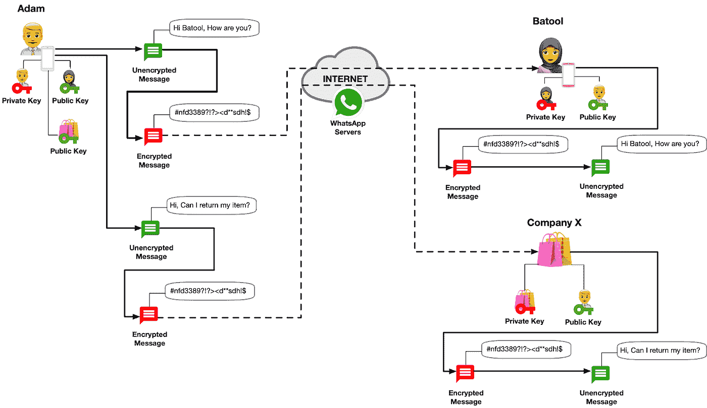
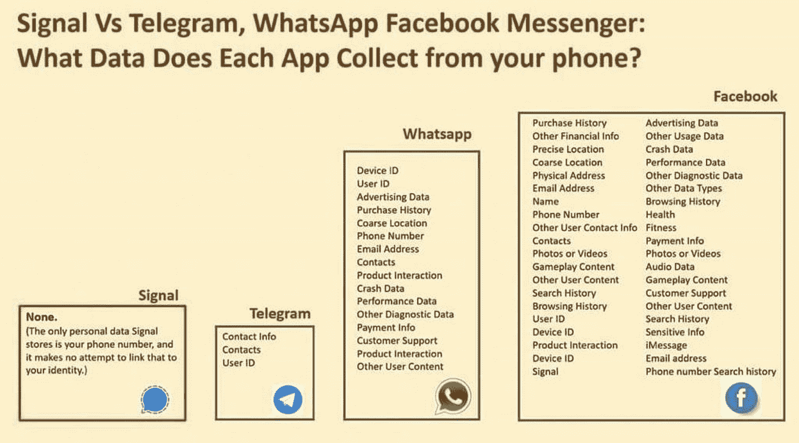

# 再来说说 WhatsApp

> 原文：<https://medium.com/nerd-for-tech/lets-talk-about-whatsapp-cbad47a5946?source=collection_archive---------5----------------------->

## 这篇文章解决了最近 WhatsApp 的隐私问题，看看它的消息是如何保密的，以及它收集的关于你的数据。

【WhatsApp 怎么了

WhatsApp 最近更新了他们的隐私政策，这让每个人都在谈论，一些团体被要求迁移到 Telegram 或 Signal，甚至[埃隆马斯克](https://twitter.com/elonmusk/status/1347165127036977153)也支持 Signal。

脸书拥有 WhatsApp，2014 年[收购了它](https://www.bbc.co.uk/news/business-26266689)，这不是它第一次受到审查。2016 年，[信息专员办公室(ICO)写信给脸书](https://www.theguardian.com/technology/2016/nov/08/facebook-pauses-whatsapp-data-sharing-after-ico-intervention)，谈及分享 WhatsApp 用户数据的计划，并对缺乏透明度表示担忧。

2017 年，脸书因误导欧盟被罚款[1.1 亿美元](https://www.theguardian.com/business/2017/may/18/facebook-fined-eu-whatsapp-european-commission)，因为有消息称脸书可以识别脸书用户的 WhatsApp 电话号码，这后来被脸书描述为一个无意的错误。

**什么在变？**

脸书为企业提供购物功能，并希望与 WhatsApp 分享购买历史或产品互动等内容。这将使企业能够通过 WhatsApp 与你互动。例如，你可以通过脸书购买一些东西，然后使用 WhatsApp 进行交易，这就是为什么你可能会看到如下所示的隐私弹出窗口。

WhatsApp 隐私政策弹出窗口

这不会影响您与朋友和家人的聊天和互动。

**这是否意味着 WhatsApp 可以看到我的消息？**

不，聊天信息使用加密保护，这意味着您的信息不能被 WhatsApp 或除了接收信息的人以外的任何人看到。这是通过一种叫做端到端加密的技术来实现的。

**端到端加密是如何工作的？**

您的手机会生成一个私人和公共密钥。私人密钥对您的手机保密，用于解密收到的信息，这个密钥永远不会离开您的手机。公钥与您的联系人共享，这是用来加密别人发送给您的消息，只有您的私钥可以用来解密。

你的朋友和家人都将拥有私人和公共密钥，以确保信息的私密性。把它想象成一个邮箱，每个人都知道你的邮政地址(公钥)，可以发送消息，但只有你有能力使用你的私钥打开和阅读。

消息流经 WhatsApp 服务器，但由于它们是加密的，WhatsApp 无法读取你的消息，它们没有私钥，因此无法解密传递的消息。

**告诉我更多关于端到端加密的信息。**

为了进一步了解信息是如何保密的，让我们看看亚当和巴图尔，他们都在手机上安装了 WhatsApp，这反过来会生成他们的私钥和公钥，下面是幕后发生的事情。

***图 1*** *亚当和 Batool 安装 WhatsApp 生成他们的私有&公钥*

Adam 和 Batool 通过互联网上的 WhatApp 服务器共享彼此的公钥；

***图 2*** *亚当和 Batool 共享彼此的公钥*

然后，Adam 给 Batool 写了一条消息，他的消息在后台使用 Batool 的公钥加密，该公钥是她之前与他共享的。

加密的信息通过 WhatsApp 服务器传输，到达 Batool 的手机，Batool 然后使用她的秘密私钥解密和阅读信息。如下所示；

***图 3*** *亚当向 Batool 和 X 公司发送消息*

亚当还询问了他最近与 X 公司的交易，X 公司使用脸书销售商品，并通过 WhatsApp 提供支持。

消息以与 Adam 与 Batool 聊天相同的方式加密，它们是独立的，不会影响 Adam 与 Batool 的私人消息。

**WhatsApp 掌握了我哪些数据？**

虽然 WhatsApp 无法读取你的私人对话，但它确实会收集你的信息，包括:

*   电话号码和移动设备 ID。
*   选择的配置文件名。
*   关于应用程序如何在您的手机上运行的信息，即应用程序是否一直崩溃。
*   GPS 数据当您在聊天中分享您的位置时，估计位置也可以通过您的公共 IP 和电话区号来识别，例如+44(英国)
*   您的联系人电话号码。

更详细的信息可以在 WhatsApp 的隐私页面[这里](https://www.whatsapp.com/legal/updates/privacy-policy/?lang=en)找到。

**WhatsApp 一直在收集这些数据吗？**

是的。

那么，为什么 WhatsApp 会出现在新闻中呢？

这可能是因为它传达变化的方式不好，出现一个可怕的弹出窗口，强迫用户在给定的日期前同意，这无疑会造成焦虑。

如上所述，这些变化是针对使用脸书的企业的，现在 WhatsApp 推迟了这些变化，让用户有更多时间考虑这些变化。此外，WhatsApp 一直在努力澄清这些变化，因为用户大量转向信号和电报。

请记住，脸书在数据隐私方面并没有好名声，剑桥分析公司丑闻就是证明，数百万个人数据在未经同意的情况下被使用。

下面重点介绍了 Signal、Telegram、WhatsApp 和脸书在数据收集方面的差异。

摘自 Signal 的 Twitter 句柄[此处](https://twitter.com/signalapp/status/1349058005241720832)

**GDPR 和 WhatsApp**

通用数据保护条例(GDPR)是由欧盟和英国共同制定的一套安全和隐私法律。它概述了公司如何处理您的数据的措施，目标是用户的安全和隐私。

可以识别个人身份的数据受到严格的法律和安全措施的限制，例如，数据处理者(即 WhatsApp)必须遵循既定的指导方针，否则将面临严厉的罚款。

这就是 WhatsApp 在“WhatsApp 爱尔兰有限公司”下为欧盟和英国用户运营的原因，也是为什么一些[隐私变更不适用于欧盟和英国用户](https://www.bbc.co.uk/news/technology-55573149)的原因。

**我应该转向信号还是电报？**

选择权完全在你，这取决于你自己的风险偏好，也就是说，你有多在乎数据存储在哪里以及如何共享。但是，如果您要移动，那么 Signal 将是更好的选择，因为它收集的数据量最少。默认情况下，Telegram 不加密信息，您必须明确选择“秘密聊天”。

实际上，这将归结于用户需求，最近的这一事件只会对竞争有利，但 WhatsApp 仍然是最受欢迎的工具，你的朋友和家人不会很快全部迁移，因此你可能会处于一个拥有 WhatsApp +另一个即时通讯工具的世界。

*感谢* [*乔尔缪*](https://medium.com/u/56830c5b7389?source=post_page-----cbad47a5946--------------------------------) *为同行评审。*