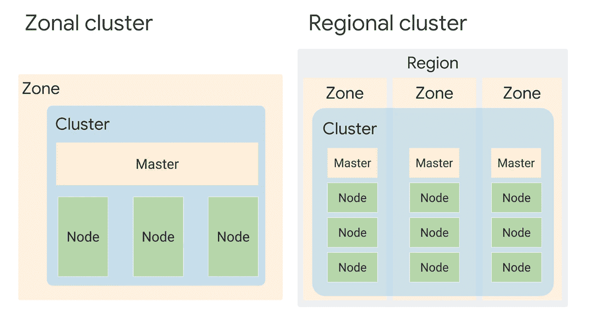
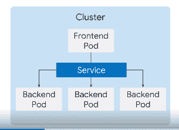
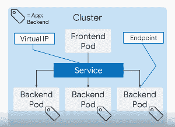

# 让我们来谈谈:Google 云平台中的容器和 Kubernetes 第二部分

> 原文：<https://medium.com/nerd-for-tech/lets-talk-containers-and-kubernetes-in-google-cloud-platform-part-2-c240295481d0?source=collection_archive---------11----------------------->


参考 P [art 1](https://samuelarogbonlo.medium.com/containers-and-kubernetes-in-google-cloud-platform-c178aae0cb35) ，我们能够理解 Kubernetes 在容器编排领域的需求。在旅程的这一阶段，我们将谈一谈节点、kubectl、部署和许多其他有趣的 Kubernetes 概念。

## **节点**

关于节点到底是什么有很多想法，但是很清楚。一个**节点**是一个 **Kubernetes** 中的工作机，根据集群的不同，它可以是一个虚拟的或者物理的。集群管理员创建节点并将它们添加到 Kubernetes。此外，GKE 通过将计算引擎实例部署和注册为节点来管理操作。

有一些节点池是主节点的子节点(它们共享工作负载和其他资源，与 Kubernetes 相比，它更像是 GKE 的一个功能)。同时，有两种类型的集群格式；Z **国家和地区**。在上下文中，区域群集有一个包含群集、主节点和应用程序功能节点的区域，如果群集或区域关闭，应用程序可能会停止运行，但对于区域群集，则包括这样的问题，因为群集跨同一区域的三个区域，因此如果群集的任何部分出现故障，其他部分会继续运行。**附言:*也有机会做一个私有集群，它只能使用 GCP 服务或授权网络进行私有访问，但不能对互联网开放。***



地带和区域集群

## **Kubernetes 对象管理**

所有 K8s 对象都由唯一的名称和标识符维护。对象可以在 YAML 或 JSON 文件中定义，但 YAML 更容易阅读和理解，如下所示:

```
apiVersion: apps/v1
kind: Pod
metadata:
  name: nginx
  labels:
    app: nginx
spec:
  containers:
  - name: nginx
    image: nginx:latest
```

**最佳实践:学习将 YAML 文件保存在存储库中，以便从云中进行版本控制，当然，您还可以跟踪和管理变更**。此外，对象必须有唯一的名称，可以是字符串，并且必须是唯一的。对于集群的整个生命周期，还有一个唯一的 ID。**标签**有助于识别物体和物体的子集，可以这样取样:

```
apiVersion: apps/v1
kind: Pod
metadata:
  name: nginx
  labels:
    app: nginx
    env: dev
    stack: frontend
spec:
  replicas: 3
  selector:
    matchLabels
    app: nginx
```

## **豆荚**

**吊舱**是 **Kubernetes 中最小、最基本的可展开物体——更像是 Kubernetes** 的原子。一个 **Pod** 代表集群中正在运行的进程的一个实例。将三个 Nginx 实例放在一起的一种方法是将它们放在单独的 pod 中，并使用相应的 YAML 配置。**现在请记住，由于其短暂的状态**，**pod 不会永远存在，它们有生命周期，而且在有数百个实例的情况下，为每个实例创建 pod 将是令人难以容忍的，这就是为什么我们引入控制器对象来管理 pod 的状态，并检查其不同类型，如部署、有状态集、守护集和作业。**

## 部署和命名空间

pod 中可以有不同的节点，但是如果其中一个节点关闭，**部署管理器**会确保其重新创建并比较当前状态和期望状态。还有**名称空间**用于命名 pod、集群和节点，以便识别和引用，并且它们必须始终是唯一的。但是你可以使用**标签**来代替名称空间，但是你应该根据因素来使用**。在应用名称空间时，请在命令行级别使用它们，因为它们使您的 YAML 文件在扩展和弹性应用程序中更加灵活。部署为您管理副本集，它会自动创建副本集。**

```
apiVersion: apps/v1
kind: Deployment
metadata:
  name: nginx-deploement
  labels:
    app: nginx
spec:
  replicas: 3
  template"  
   metadata:
     labels
       app: nginx
   spec:
     Containers:
     - name: nginx
       image: nginx:latest
```

***最佳实践:创建资源时，可以使用命令行名称空间标志将资源应用到名称空间。或者，您可以在 YAML 文件中为资源指定一个命名空间。尽可能在命令行级别应用名称空间。这种做法使您的 YAML 文件更加灵活。例如，有一天您可能希望为您的一个部署创建两个相同但完全独立的实例，每个实例都有自己的名称空间。如果您希望在部署到生产环境之前部署到单独的名称空间中进行测试，就可能会出现这种情况。如果您选择在 YAML 文件中嵌入名称空间名称，这是很困难的。***

## **服务**

服务代表集群中的一组 pod、结构或功能。它可以用于将后端连接到前端，并维护可伸缩性和资源功能。



它与一个标签选择器一起工作，用于 pod 的通信，并在某种程度上回避了 pods IP 的短暂性质。此外，还会创建端点资源，然后使用虚拟 IP 地址。

**如果您希望在一个容器内的两个机架/集群之间共享存储，那么由于集群的性质，这可能是一个问题。Kubernetes 卷是一个可由 pod 中的所有容器访问的目录，其要求可以使用 pod 规范来决定，您必须将这些卷专门安装在 pod 中的每个容器上，并且您可以从 pod 外部的外部存储设置卷，以获得持久的存储真实性。**



**最佳实践:卷是短暂的**因为如果 pod 被删除，它们也可能被删除，因此您可以在 pod 之外配置基于网络的存储的卷。

还有其他的概念和定义需要解决，但在后面的一些主题中会更好，因为它将直接关系到该部分的重点。现在，请记住，这篇文章不仅仅是为云领域的专家准备的，即使是新手也可以加入并学到很多东西，这就是为什么我用外行和专业的术语把一切都讲清楚了，所以如果你有任何问题，可以通过 [**Twitter**](https://twitter.com/SamuelArogbonlo) **联系我，或者通过**[**Github**](https://github.com/samuelarogbonlo)**找到我。**

**感谢阅读❤️**

如果你对这个话题有任何想法，请留下评论——我乐于学习和探索知识。

# 我可以想象这个帖子有多有用，请留下掌声👏下面几次以示对作者的支持！