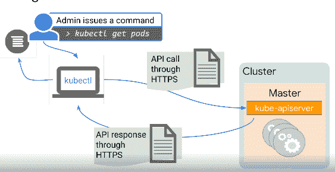
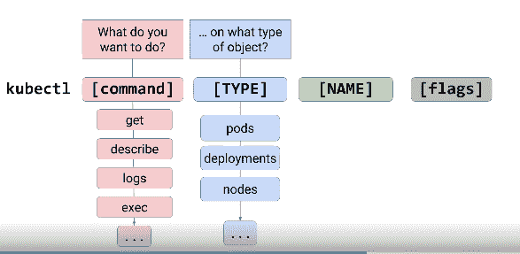
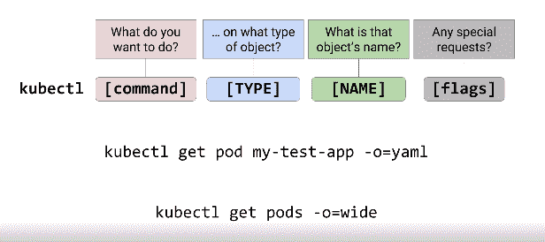
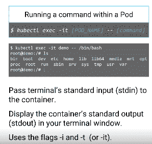

# 让我们来谈谈:Google 云平台中的容器和 Kubernetes 第 3 部分

> 原文：<https://medium.com/nerd-for-tech/lets-talk-containers-and-kubernetes-in-google-cloud-platform-part-3-d3c990883287?source=collection_archive---------12----------------------->


在理解概念和系统如何运行的基础知识后，我们学习如何使用 GKE 设计工作负载是有利的，但同时，如果您没有阅读我的第一篇文章，请查看此处的[](https://samuelarogbonlo.medium.com/containers-and-kubernetes-in-google-cloud-platform-c178aae0cb35)**和此处的[](https://samuelarogbonlo.medium.com/lets-talk-containers-and-kubernetes-in-google-cloud-platform-part-2-c240295481d0)**

****Google 将处理 kubectl 命令，检查集群和 pod，查看 pod 的控制台输出，并以交互方式登录 pod。 **Kubectl** 命令是用来控制 Kubernetes 集群的。在任何进一步的工作之前，必须用集群的位置和 API 服务器配置 kubectl。如果管理员想要知道集群中的 pod 数量，管理员可以使用命令与集群通信****

```
**kubectl get pods**
```

****此类流程的生命周期如下所示:****

********

****Kubectl 通过主目录将配置存储在文件中:****

```
***$HOME/.kube/config***
```

****它包含集群名称和集群的凭据。要查看配置，您可以使用****

```
***kubectl config view*** 
```

****在采取任何重要步骤之前，您必须首先检索集群的凭证。首先检索特定集群的凭据。这两个工具都默认安装在云外壳中。默认情况下，G Cloud Gate Credentials 命令会将配置信息写入主目录中 Dock Cube 目录下的配置文件中，如果您为不同的群集重新运行此命令，将使用新群集中的凭据更新冲突文件。您只需要在您的云 shell 中对每个集群执行一次这个配置过程。****

```
**$gcloud container clusters
get-credentials w-sandbox \
 — zone oregon \**
```

******你能弄清楚为什么命令是 Gcloud 获取凭证而不是 kubectl 获取凭证吗？**这是因为 kubectl 命令需要凭证才能工作。G Cloud 命令是授权用户从命令行与 G C P 交互的方式。如果获得授权，G cloud get credentials 命令会为您提供连接 G K E 集群所需的凭证。一般来说，QC TL 是管理现有集群内部状态的工具，但是 kubectl 不能创建新的集群或者改变现有集群的形状。为此，你需要 G K E 控制平面，也就是 G Cloud 命令，G C P 控制台也是你的界面。****

******ku bectl 语法******

****它的语法有几个部分:命令、类型、名称和可选标志。**命令**指定您打算做什么，例如获取、欺骗、记录和执行，而其他命令允许您更改集群配置。**类型**告诉你想要在什么类型的对象上执行命令动作，比如 pod、nodes 等等。**名称**是你想要执行动作的对象名称，如果你不输入名称，它将返回所有的 pod。您可以使用**标志**以更宽的格式查看更多信息。Kubectl 用于创建 k8s 对象、视图、工作和配置。****

****************

******自省******

****它是在运行 kubectl 命令之后，收集有关集群中运行的服务、容器、pod 和其他引擎的信息的行为。您可以使用 Kubectl 来****

```
*****get (kubectl get pods)******describe (kubectl describe my-pod-d )******exec (kubectl exec my-pod-d)

logs to know what happens inside the pod; it’s useful when you want to know better info about the containers.*****
```

## ******Pod 阶段(获取)******

```
**PendingRunning (starting, restarting or running)SucceededFailedUnknownCrashLoopBackoff (if the pod is not configured correctly)**
```

******Pod 阶段(描述)******

```
**NameNamespaceNode nameLabelsStatusIP address etc**
```

******执行******

1.  ****对连接性进行故障排除，并且您可以在您的云 shell 中运行一个命令并显示结果。从这里你可以进入工作舱内部。****

********

****您可以使用上述过程在容器中执行参数。您可以使用-c 来检查特定的容器。****

****不要惊慌，在理解了必要的术语后，解决问题就不是问题了，尽管我计划在所有的理论部分完成后进行实践学习。还有其他的概念和定义需要解决，但在后面的一些主题中会更好，因为它将直接关系到该部分的重点。现在，请记住，这篇文章不仅面向云领域的专家，即使是新手也可以加入并学到很多东西，这就是为什么我用外行和专业术语将一切都讲得很清楚，所以如果您有任何问题，也可以通过[**Twitter**](https://twitter.com/SamuelArogbonlo)**联系我，或者通过**[**Github**](https://github.com/samuelarogbonlo)**找到我。******

******感谢阅读❤️******

****如果你对这个话题有任何想法，请留下评论——我乐于学习和探索知识。****

# ****我可以想象这个帖子有多有用，请留下掌声👏下面几次以示对作者的支持！****