# 让我们扔硬币来分散注意力

> 原文：<https://medium.com/nerd-for-tech/lets-toss-in-a-distraction-coin-4032fe1cc42c?source=collection_archive---------18----------------------->

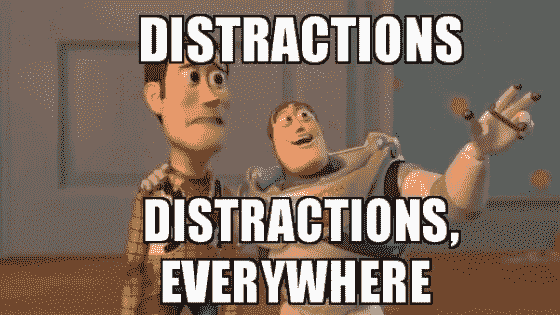

由于我们的守卫能够探测到玩家，让我们想办法制造一个硬币扔进场景中来暂时分散我们守卫的注意力，这样我们就可以从他们身边走过。首先，我们需要对我们的玩家脚本做一些补充，这样我们就可以有一个方法来触发硬币的使用。由于我们要将它绑定到我们的右键单击，我们可以创建一组新的代码来使用。首先，我们需要处理几个变量:

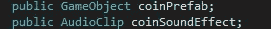

从这里，我们可以创建一个新的 if 语句来实例化我们的硬币，并将音频剪辑附加到它:

当我们使用导航网格代理时，我们将使用光线投射，这样我们的硬币就能正确地粘在地板上。我们使用 RaycastHit hitInfo 来表示鼠标点击时的位置。有了这些代码，我们可以测试硬币是否出现在场景中:

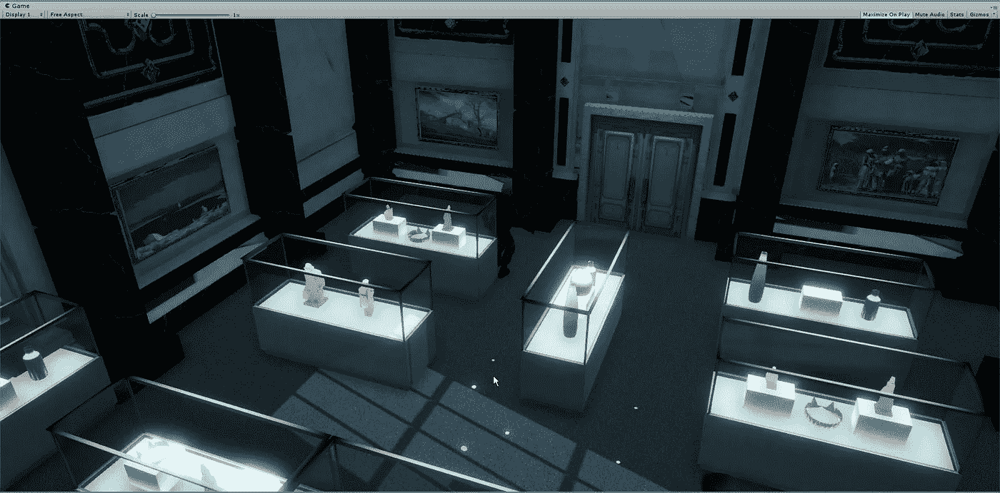

我们可以看到一堆硬币散落在地板上，所以我们知道点击会起作用。然而，拥有无限的硬币供应会使这太容易通过，所以让我们开始限制它，每次游戏只有 1 个硬币。
为了限制使用，我们可以使用几个方法。如果我们想让玩家有多次机会，我们可以将其设置为整数值，并给玩家一定数量的硬币。然而，我们只是将我们的玩家限制为 1 个硬币，所以在这种情况下，我们可以将其设置为 bool。首先，我们需要在脚本中创建新变量:

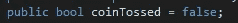

从这里开始，我们可以在脚本的硬币部分添加一些东西:

现在我们已经设置好了，我们可以在游戏中进行测试，看看当我们发送垃圾邮件时，单击鼠标右键是否只能得到 1 枚硬币:

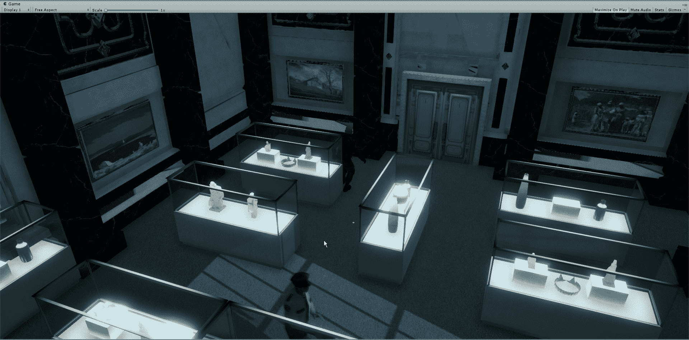

既然我们对硬币设置了一个限制，是时候让硬币分散守卫的注意力了。
要设置这个，我们需要玩家脚本的一部分，这是硬币的一部分，与我们的 GuardAI 脚本进行交互。首先，我们将创建一个新的空白，并附加我们需要与之交互的防护部件:

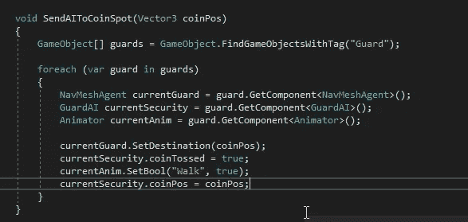

首先，我们需要通过他们的标签链接到我们所有的警卫。从这里，我们需要创建一个 foreach 语句，并连接到警卫 NavMesh、脚本和动画。这允许我们告诉我们的守卫移动到硬币的位置，并覆盖守卫当前的移动轨迹，同时让他们走向目标。接下来，我们将检查需要添加到 GuardAI 脚本中的更改:

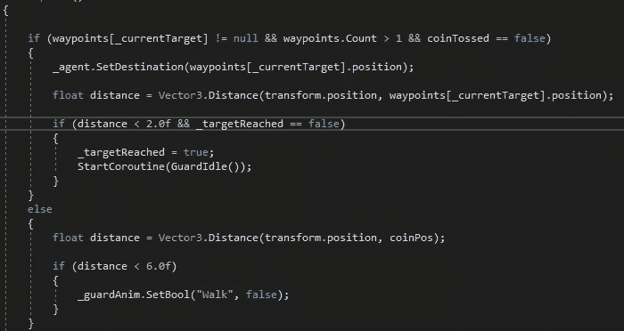

在我们的警卫脚本中，我们需要添加一个 bool 来阻止我们的警卫协程将他们从每个路点移走。然后，我们将创建一个很长的距离，让警卫变得无所事事，这样我们的警卫就不会只是为了一个小点而打架。同样，为了防止这个问题发生，我们需要对我们的防护网做一些调整:

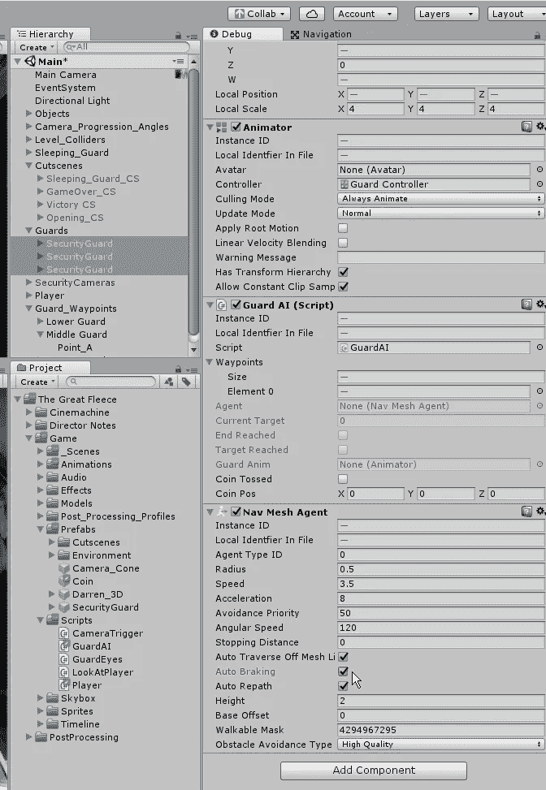

我们要做的是关闭自动刹车，这样警卫就不会为了一个小点而打架。如果我们觉得需要对距离进行一些调整，我们也可以在这里调整停车距离:

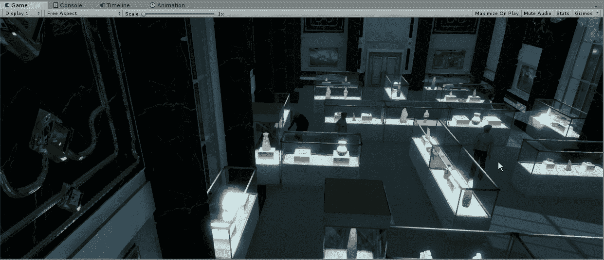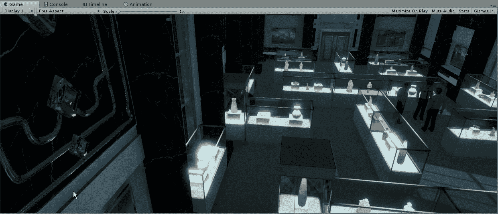

现在我们有了一个分散注意力的方法来吸引守卫的注意力，让我们快速添加一个玩家投掷硬币的动画。为此，我们需要为播放器调整控制器:

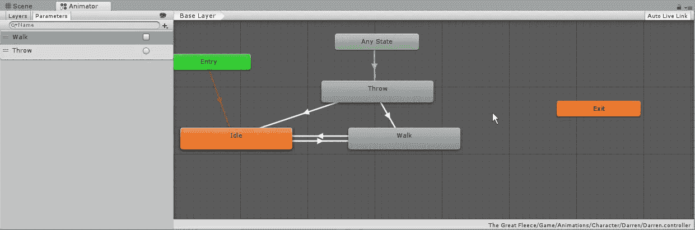

我们能够做的是将 throw 连接到任何状态，然后通过适当的转换参数将其连接到 walk 和 idle。接下来，我们只需在脚本的掷硬币部分添加一行代码:

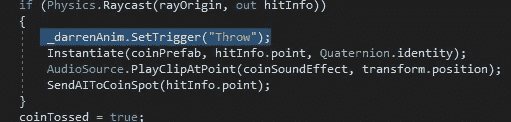

准备就绪后，让我们在游戏中测试一下:

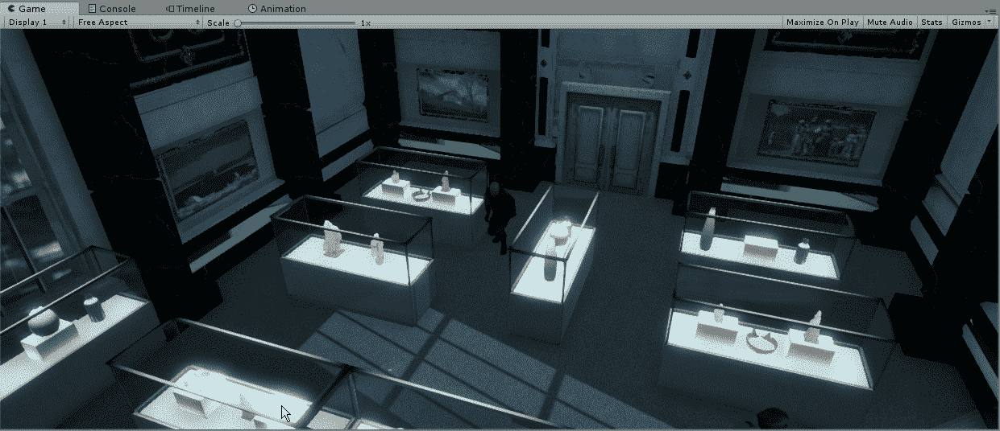

最后，我们将学习如何添加一个一旦触发就会激活的语音剪辑。这是一个类似于摄像机更换的过程，但使用音频代替。首先，我们需要创建一个新脚本，并让它从音频源中提取剪辑:

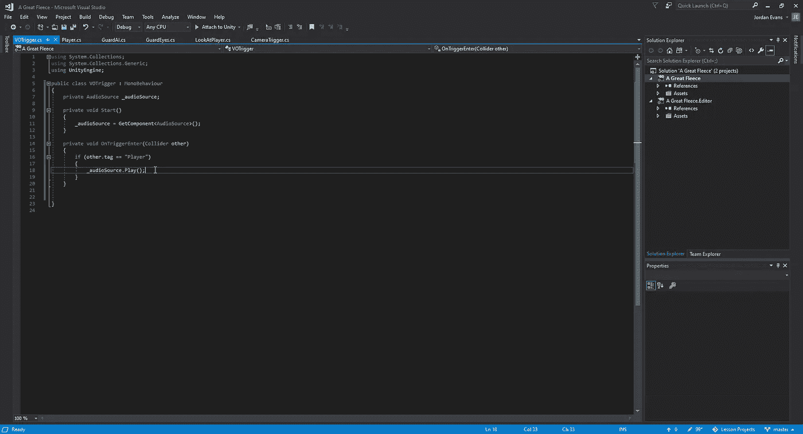

一旦我们设置好了，我们就可以返回到我们的触发器，并将脚本和音频源都连接到它们。从这里开始，我们将把每个触发器所需的音频剪辑附加到它们各自的音频源:

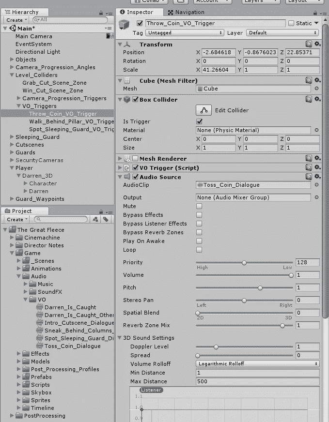

既然我们已经设置好了分散注意力的硬币，我们就可以在游戏中制造更多的障碍了。