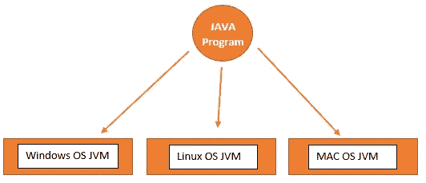
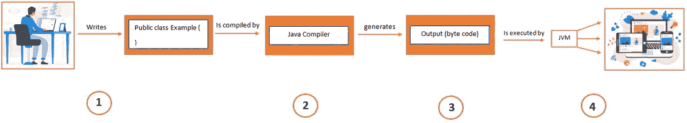
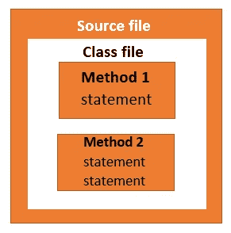
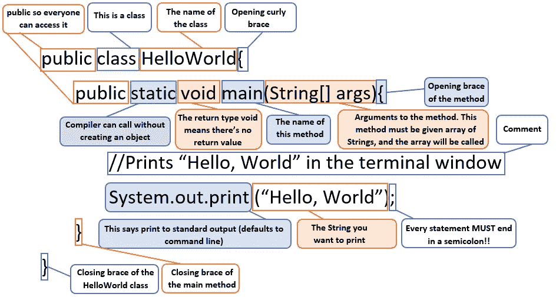
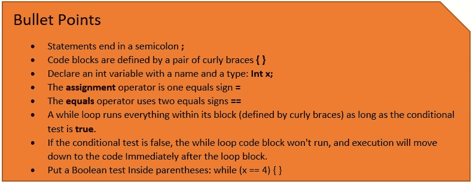

# 让我们来了解 Java

> 原文：<https://medium.com/nerd-for-tech/lets-understand-java-261b2e6bcf2e?source=collection_archive---------2----------------------->

# Java 是如何工作的？

对于大多数编程语言，程序被翻译(编译)成机器语言程序。然后，可以执行(或运行)机器语言程序。

Java 也是这样工作的，先把源代码编译成字节码。然后，Java 虚拟机可以将字节码编译成机器码(JVM)。JVM 允许 Java 的字节码在任何设备上执行，这就是它被称为“一次编写，随处运行”语言的原因。

当然，这是 Java 工作方式的一个稍微简化的版本。实际上还有更多。

Java 程序

在上图中，您可以看到每个操作系统都有一个 Java 虚拟机，这是运行 Java 程序所必需的。因为每个操作系统都有自己的 Java 虚拟机，所以它是一个独立于平台的环境，只是将 Java 转换成计算机可以理解的代码。如果你想更深入地了解 JVM 架构，可以点击这里的 查看我的博客。

让我们通过下面这个简单的例子来理解这一点。我们的目标是编写一个应用程序(一个交互式聚会邀请)，并让它在您朋友的任何设备上都能工作。

Java 工作流程

**来源**:制作一个将被用作来源的文档。利用一个成熟的过程(在这种情况下，是 Java 语言)

编译器:使用源代码编译器来编译你的文档。编译器会检查错误，直到确信一切正常运行时才会让你编译。

**输出/字节码:**编译器创建一个新文档，编码成 Java 字节码。任何可以运行 Java 的设备都能够解释这个文件，并将其转换成它可以使用的东西。编译后的字节码是独立于平台的。

**JVM** :你的朋友没有物理的 Java 机器，但是他们都有一个虚拟的 Java 机器(在软件中实现)运行在他们的电子小工具内部。虚拟机读取并执行字节码。

# Java 中的代码结构

Java 代码结构

**源文件** : 一个 java 源文件可以有几个类。这些类中只有一个可以被声明为公共的。如果源文件包含公共类，则源文件名必须是带有. java 后缀的公共类名。java 编译器为源文件中的每个类创建一个. class 文件。

**类文件**:一个类有一个或多个方法。

**语句** : 方法有多个语句。

# 剖析一个班级

Java 剖析

简短注释

# 参考

[1] Head first java，第二版-由 Kathy Sierra 和 Bert Bates 编写的电子书。链接-[https://github . com/fasrinaleem/programming-ebooks/tree/master/Java](https://github.com/fasrinaleem/programming-ebooks/tree/master/Java)