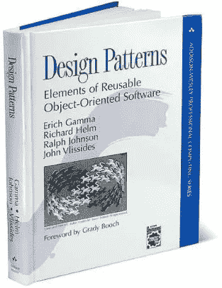
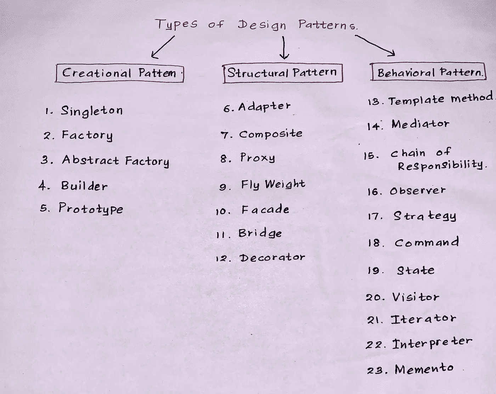
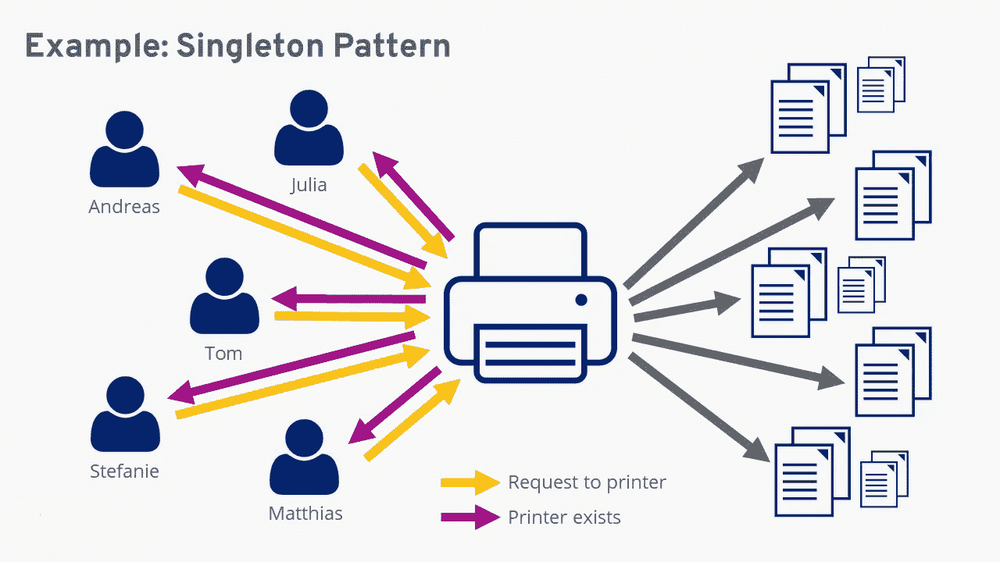
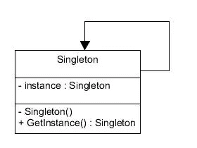
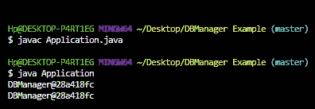
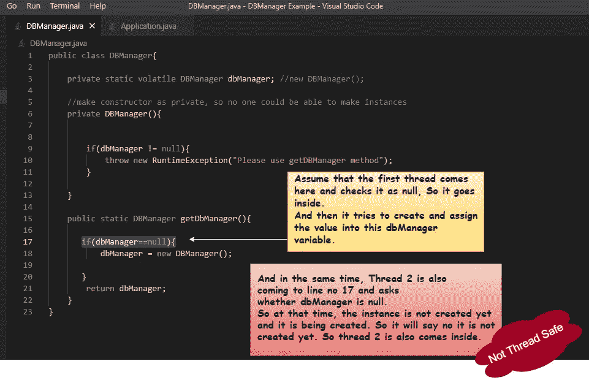
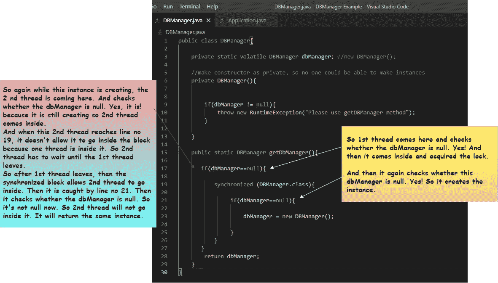
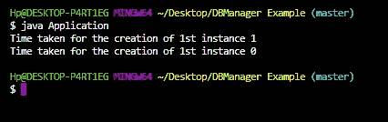

# 让我们了解一下设计模式和单例设计模式的威力🤓✨😎

> 原文：<https://medium.com/nerd-for-tech/lets-understand-the-design-patterns-and-the-power-of-singleton-design-pattern-aba13bdc32f?source=collection_archive---------15----------------------->

在进入设计模式之前，先考虑下面提到的场景。

> 如果你去看医生，你一定会看到医生总是问你一系列相同的问题(比如，你头疼吗？你发烧了吗？你有视力问题吗？你吃饭有困难吗？你咳嗽吗？医生不停地问这类问题是因为，在他的经历中，他对疾病数据和这些疾病的模式进行了分析。所以通过问这类问题，他可以很容易地查出病人的病情。

所以同样的理论也可以应用到我们身上，相应地，上面的场景对于软件工程师也是有效的。作为软件工程师，我们也有同样的问题和同样的解决方案，我们总是在处理这些问题。所有这些都属于模式。

🔊所以我们可以说，这些设计模式将是一般常见问题的解决方案。它不是图书馆。所以我们不能下载或安装这些设计模式。这些设计模式并不特定于某个特定的领域，无论什么时候你需要实现某个东西，如果你知道这些设计模式，那么你就会确切地知道更容易实现它的方法。

根据四人组于 1994 年推出的《设计模式——可重用面向对象软件的要素》一书。

这四位作者分别是 ***埃里希·伽马、理查德·赫尔姆、拉尔夫·约翰逊、*** *和* ***约翰·维里西德斯*** 。他们将这些完整的设计模式分为如下三类。

**✷创作模式**

**✷构造格局**

**✷的行为模式**

🟡 **创造设计模式** —这种设计模式涉及到创建对象的方式。当在实例化一个类时必须做出结论时，这种创造性的设计模式就会被利用。

六种创造性设计模式是 ***工厂方法模式、抽象工厂模式、单例模式、原型模式、构建器模式和对象池模式。***

🟡 **结构设计模式**——这种设计涉及如何组合类和对象，以构建更大的结构。这种模式主要关注类如何相互继承，以及它们与其他类的组合方式

七种结构设计模式是 ***适配器模式、桥接模式、复合模式、装饰模式、外观模式、轻量级模式和代理模式***

🟡 **行为设计模式** —这可以定义为对象的责任和交互。

十二种行为设计模式是 ***责任链模式、模式、解释器模式、迭代器模式、策略模式、模板模式、访问者模式、空对象中介模式、命令模式、备忘录模式、观察者模式和状态模式。***

## 设计模式的优势

下面是我们在使用设计模式时可以获得的一些优势。

◼️加快发展进程。

◼️有助于解决那些会造成巨大问题的问题。

◼️帮助升级开发者交流。

◼️提高了效率。

◼️允许不同层次的抽象。

让我们来看看 Pattern➜的单体设计

# 单一设计模式

📣Singleton 属于**创造性的**设计模式。它确保类只有一个实例，并提供对它的全局访问点。所以我们可以说，在单例设计模式中，每个容器只创建一个实例。(例如，如果它是一个 java 程序，那么每个 JVM 一个实例)

## 下图展示了单一设计模式的 UML 表示

类图—单例设计模式

📣如果你使用单例实现，你**不应该**在创建实例时带任何参数。

📣另一个重要的事实是，Singleton 很难进行单元测试，因为没有实例变量和引用需要创建。所以我们不应该过分强调 Singleton，我们应该在任何需要的地方使用 Singleton 设计模式。

***例 1:***

让我们转到下面关于单例设计 pattern☛的例子

上述程序的输出是➜

✦:根据上面的例子，虽然我们分配了两个不同的对象，并在两个不同的时间调用它们，但它给了我们相同的实例，因为它是 Singleton 的设计模式。

✦，但是根据这个，限制了我们对这个例子的处理。所以让我们转到下面的第二个例子，看看我们如何扩展这些限制。

***例二:***

这里的输出将与前面的示例相同。

所以为了摆脱这个问题，有一个原则叫做**【双检单例】**

下面的代码片段显示了使用双重检查单例原则后的实现。

因此，我们在第 19 行使用了“synchronized”关键字。当使用 synchronized block 时，它实际上一次只允许一个线程在其中执行，并阻止其他线程进入。简单地说，我们可以说它将作为一把锁。

下图将详细解释之前的 example☛

✵✵✵✵:一个重要的事实是，我们不应该在方法级别使用 synchronized 关键字，因为它会影响性能。(如果你在方法层使用同步的关键字，那么你将阻塞一切。)

让我们来看另一个例子。

***例 3:***

如果我们像上面那样修改主类，它的输出会像 below➙

因此，创建第一个实例需要一秒钟，而获得第二个实例则不需要一毫秒，只需要零秒钟。发生这种情况是因为已经先创建了实例。

# 关于单例的重要注意事项📣

✹ **单件设计模式可以被描述为在软件工程中将一个类的实例化限制为一个对象的设计模式。当我们只需要一个对象来协调整个系统的动作时，这是非常有用的。**

**✹在 Singleton 中，它需要有一个私有的构造函数来阻塞多个实例。**

✹ **单例设计模式主要用于驱动对象、线程池、日志对象、配置设置和缓存。(也是数据库和多线程应用中最常用的单例设计模式)**

**✹同样，在单例设计模式中，对象不是在每次请求时创建的。所以我们可以说它节省了内存。(因为在这个单例模式中，只有一个实例被反复使用)**

**✹这种模式有助于避免错误从多个实例中出现。**

**✹在对象创建耗时的时代，我们不需要随时创建新对象。我们可以访问已经创建的对象。**

# 方案

> **假设您需要为斯里兰卡警察局的飞机建模，该飞机在您的软件中称为“SL 飞机 P01”。**
> 
> **SL aircraft P01 只能有一个实例，我们可以理解，singleton 设计模式是该场景最合适的表示。**
> 
> **👁‍🗨所以请点击下面的 GitHub 链接来查看上面场景“SL 飞机 P01”的源代码。**

 [## irushinie/设计模式

### 在 GitHub 上创建一个帐户，为 Irushinie/设计模式开发做出贡献。

github.com](https://github.com/Irushinie/Design-Patterns.git) 

> **👁‍🗨请点击下面的 GitHub 链接，查看另一个关于单例设计模式的源代码(线程安全)。**

 [## irushinie/Krish-LP-培训

### 在 GitHub 上创建一个帐户，为 Irushinie/Krish-LP-Training 的发展做出贡献。

github.com](https://github.com/Irushinie/Krish-LP-Training/tree/main/SingletonDesignPattern) 

# 参考

行为设计模式—Java point”，[*www.javatpoint.com*，](http://www.javatpoint.com,)【在线】。可用:【https://www.javatpoint.com/behavioral-design-patterns.】T4

设计模式——单例模式——Tutorialspoint”，*Tutorialspoint.com*。【在线】。可用:[https://www . tutorialspoint . com/design _ pattern/singleton _ pattern . htm](https://www.tutorialspoint.com/design_pattern/singleton_pattern.htm.)

软件设计模式— GeeksforGeeks”， *GeeksforGeeks* ，2021。【在线】。可用:[https://www.geeksforgeeks.org/software-design-patterns/.](https://www.geeksforgeeks.org/software-design-patterns/.)

《mkejeiri/Java-Design-Pattern》， *GitHub* ，2021。【在线】。可用:[https://github . com/mkejeiri/Java-Design-Pattern/blob/master/Design % 20 patterns，% 20 elements % 20 of % 20 reusable % 20 object-Oriented % 20 software . pdf .](https://github.com/mkejeiri/Java-Design-Pattern/blob/master/Design%20Patterns,%20Elements%20of%20Reusable%20Object-Oriented%20Software.pdf.)