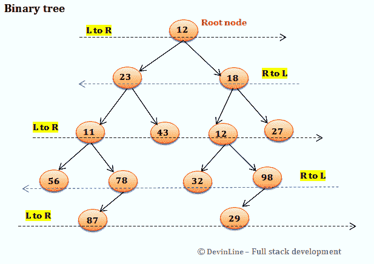
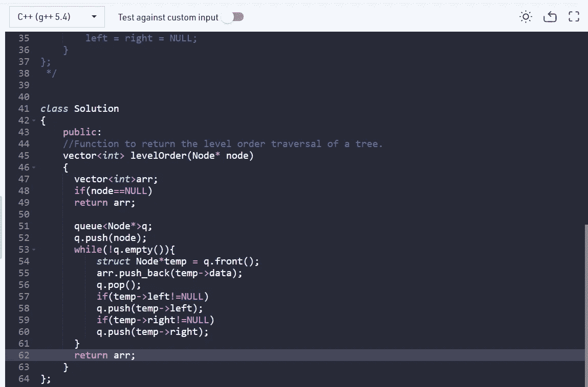

# 层次顺序遍历

> 原文：<https://medium.com/nerd-for-tech/level-order-traversal-2e4261175a85?source=collection_archive---------10----------------------->

给定一棵二叉树，求其层次顺序遍历。

**例 1:**

```
**Input:
**    1
  /   \ 
 3     2
**Output:**1 3 2
```

# **例二:**

```
**Input:
**        10
     /      \
    20       30
  /   \
 40   60
**Output:**10 20 30 40 60 N N
```

**任务**:完成以根节点为输入参数的函数 **levelOrder()** ，返回包含给定二叉树层次顺序遍历的整数列表。

**期望时间复杂度:** O(N)
**期望辅助空间:** O(N)

**约束:**
1 ≤节点数≤ 10^5
1 ≤一个节点的数据≤ 10^5

让我们先了解一下什么是层次顺序遍历？



正如我们在上面的图中看到的，这里 12 是根节点，位于第 0 层，所以我们首先从左到右遍历它。

对于第一层，我们有元素 23 和 18。这里我们从右向左遍历。类似的交替模式将在 2 级、3 级和 4 级中遵循。

因此遍历将采用以下形式:

**12**->**18**->**23**->**11**->**43**->**12**->**27**->**98**->**32**->

看上面的问题

```
**Input:
**    1
  /   \ 
 3     2
**Output:**1 3 2
```

1.  我们首先初始化一个向量数组，按照遍历级别的顺序返回元素:

```
**vector<int>arr;**
```

2.然后我们检查节点，如果它是空的，我们返回空的向量数组:

```
**if(node==NULL) 
 return arr;**
```

3.如果节点不为空，我们初始化一个队列，并将第一个节点推入队列:

```
**queue<Node*>q;
q.push(node); //**here push is a built-in function
```

4.当队列不为空时，我们创建一个 Node*类型的临时变量，它指向队列中的前一个元素。现在，我们将临时节点中的数据放入向量数组。然后，我们从队列中弹出该元素，表示该节点已经被访问过。然后，我们检查左边的节点是否为空，如果不是，我们将该节点元素推入队列，右边的节点元素也是如此。
我们不断将元素添加到向量数组中，并不断从队列中弹出元素。一旦队列为空，意味着所有节点都已被访问。vector 数组返回按级别顺序遍历的元素。

```
 **while(!q.empty()){ 
 struct Node*temp = q.front(); 
 arr.push_back(temp->data); 
 q.pop();
 if(temp->left!=NULL) 
 q.push(temp->left);
 if(temp->right!=NULL)
 q.push(temp->right);
 }**
```

代码:



希望这有所帮助！订阅&敬请关注更多问题！

既然你喜欢看我的博客，为什么不请我喝杯咖啡，支持我的工作呢！！[https://www.buymeacoffee.com/sukanyabharati](https://www.buymeacoffee.com/sukanyabharati)☕