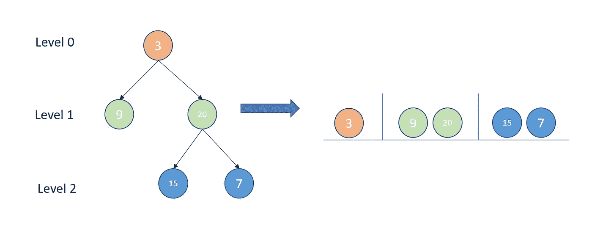
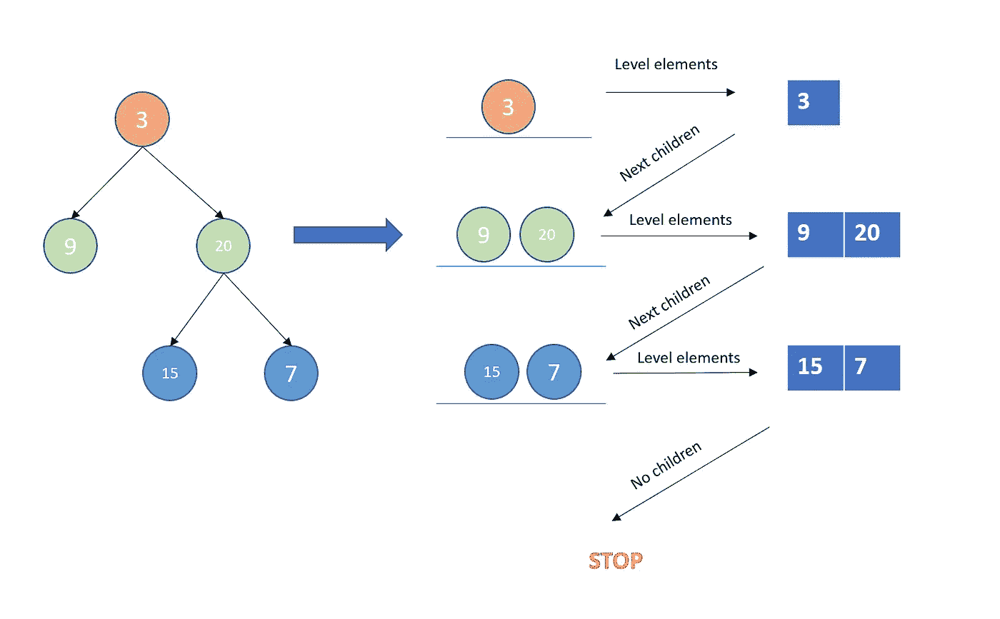

# 等级顺序遍历—每日挑战可能

> 原文：<https://medium.com/nerd-for-tech/level-order-traversal-daily-challenge-may-1e5a2ce56a16?source=collection_archive---------28----------------------->


由[卡米尔·米努夫莱特](https://unsplash.com/@caminouflet?utm_source=unsplash&utm_medium=referral&utm_content=creditCopyText)在 [Unsplash](https://unsplash.com/s/photos/stair?utm_source=unsplash&utm_medium=referral&utm_content=creditCopyText) 拍摄的照片

今天的问题来自每日 Leetcode 编码挑战赛——五月版。这是一个中等标签的问题。让我们看看问题陈述。

## [102。](https://leetcode.com/problems/binary-tree-level-order-traversal/)二叉树层次顺序遍历

给定二叉树的`root`，返回*其节点值*的层次顺序遍历。(即从左到右，逐层)。

## 示例:

```
**Input:** root = [3,9,20,null,null,15,7]
**Output:** [[3],[9,20],[15,7]]
```

## 理解问题:

等级顺序遍历类似于 BFS。在进入下一个级别之前，我们处理一个级别的所有节点。换句话说，首先，我们覆盖所有祖父母，然后是所有父母，然后是所有子女。



方法:

将当前级别的所有元素添加到列表中
获取上一步中元素的所有子元素
将当前级别的元素设置到上一个列表中
继续这样做，直到遍历完所有项目。



## 代码实现:

```
# Definition for a binary tree node.
# class TreeNode:
#     def __init__(self, val=0, left=None, right=None):
#         self.val = val
#         self.left = left
#         self.right = right
class Solution:
    def levelOrder(self, root: TreeNode) -> List[List[int]]:
        queue = [root]
        answer = []

        while queue:
            temp = []
            level = [ el.val for el in queue if el]
            if level:
                answer.append(level)

            for el in queue:
                if el:
                    if el.left != None:
                        temp.append(el.left)
                    if el.right != None:
                        temp.append(el.right)
            queue = temp

        return answer
```

# 复杂性分析:

*   时间复杂度:O(N)每个节点只处理一次。
*   存储级别的空间复杂度:O(N)

编码快乐！！