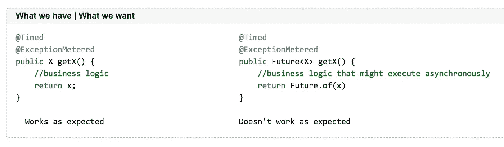
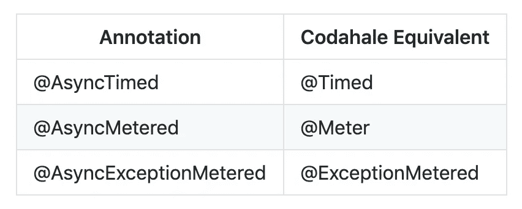
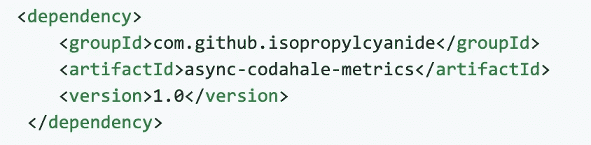
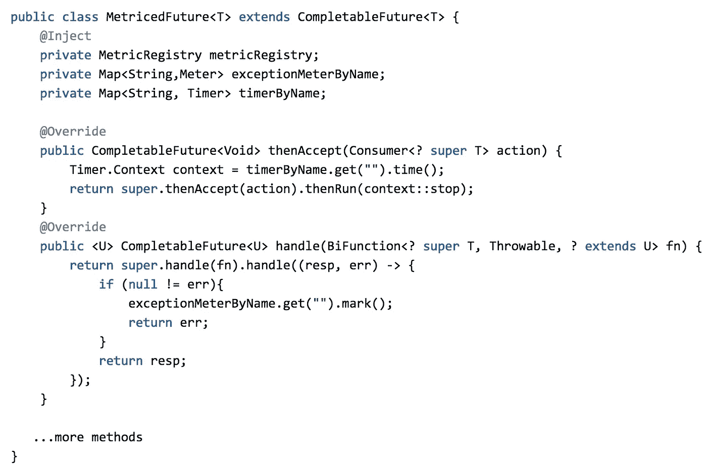
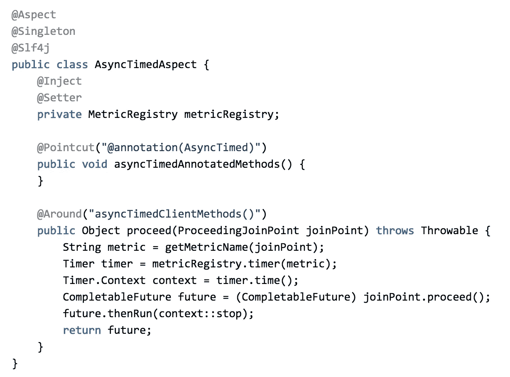
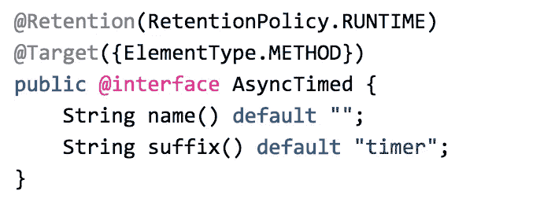
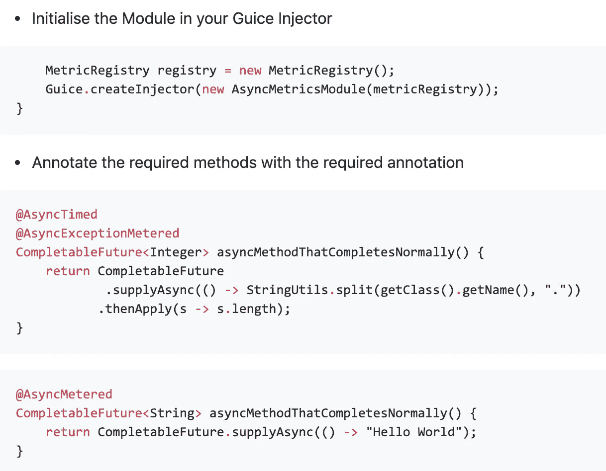
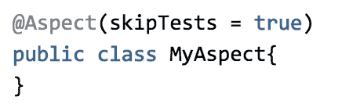
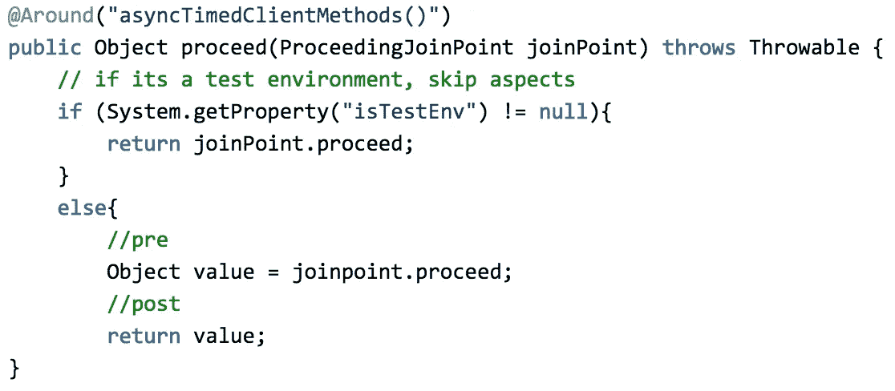
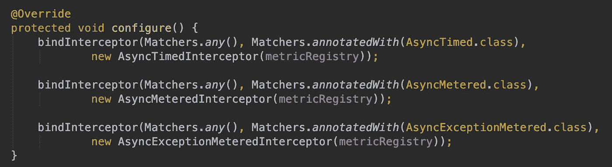

# 使用方面利用异步度量

> 原文：<https://medium.com/nerd-for-tech/leveraging-async-metrics-using-aspects-81838b9b887e?source=collection_archive---------0----------------------->

metrics 是一个了不起的库，它提供了各种工具。在`Dropwizard`应用程序中使用的默认度量注册表来自`Codahale metrics`。

我们希望利用 Dropwizard 指标进行异步回调。类似于返回期货的方法的`@Timed / @ExceptionMetered`。

这些用于标记带注释对象的方法的注释使得代码可读性更好，并且将标记度量的不必要样板文件与业务逻辑分开。

它在同步模式下如何工作，在异步模式下如何不工作

然而，第二种方法不会产生正确的结果，好像调用线程将工作分派给 fork-join 池中的另一个`thread`，然后这个**方法执行完成而不等待结果**。

理想情况下，我们希望标记我们的度量标准，并在回调解决`successfully`或`exceptionally`时找出一种方法来做事情。

> 我们正在寻找方法来模拟和创建标准和流行的度量注释的异步变体

我们正在寻找的变体

显而易见的处理方法如下。

琐碎的变通办法

然而，上面的解决方法通过注入`Metric Registry`和相应的`meters`污染了我们的逻辑。如果我们想要做的只是在回调解析上标记度量，这很快就会变得混乱。

> 因此，问题是在不污染业务逻辑的情况下，巧妙地标记这些未来的度量标准。沿着基于注释的解决方案的某个地方，它是可读的和声明性的。

GitHub 上的[这里](https://github.com/isopropylcyanide/async-metrics-codahale)有完整的源代码。该项目也可以在 Maven Central 上获得。

.

**替代解决方案**
按照领域驱动设计的范例，我们可以尝试在未来引入一个包装器，比如说`MetricedFuture`。`MetricedFuture`将提供挂钩，在成功/错误解析后将在其中填充指标

MetricedFuture。我们的完整包装

然而，这很快变得不可维护。这些挂钩只能确保当被覆盖的方法被调用时，度量会被填充。例如，在这种情况下，当调用`**thenApply()**`时，指标不会运行。

**优点**

*   我们更加明确地表示，我们将在完成后标记指标。
*   不涉及魔法。包装纸就在眼前。
*   没有外部依赖性

**缺点**

*   无法处理所有方法的挂钩
*   用包装器丢弃代码库
*   当涉及到排除某些指标时，就不是那么微不足道了
*   排除某些方法的度量标准并不简单

# **提议的解决方案**

关于我们试图解决的用例，我们注意到一件事。我们正在发布业务回访完成情况的指标。这是一个贯穿各领域的问题。

> 横切关注点是计划中影响其他关注点的方面。在设计和实现中，这些问题通常无法从系统的其余部分中清晰地分解出来，并且可能导致分散(代码重复)、缠结(系统之间的显著依赖性)，或者两者兼而有之。

上面清楚地提到了我们的替代解决方案的问题。好在这种问题之前已经解决了。`AspectJ`就是这样一种工具。

> AspectJ 支持横切关注点的清晰模块化，比如错误检查和处理、同步、上下文敏感行为、性能优化、监控和日志记录、调试支持和多对象协议

我们的用例在`AspectJ`提供的工具范围内。对于如何解决这个问题，我们也有一个大致的想法。

*   创建`Aspects`，保存当它们匹配特定的`pointcut`(最好是注释)时触发的通知
*   `Around`建议可以用来编织`joinpoint`的度量逻辑
*   标注或标记上述方法所建议的方法

下面的代码片段给出了实现的思路

示例方面:标记异步方法的度量

我们的自定义注释

如何使用这个注释

这正是我们想要的。只需一个注释，我们就能够将定制代码编织到业务逻辑中。

**权衡**
引入`AspectJ`也不简单。

**优点**

*   编织代码而不污染业务逻辑是一个 bug plus
*   要禁用某个方面，只需移除注释或触发器
*   度量逻辑可以独立变化。
*   不需要处理所有的钩子，因为方法保证在继续之后执行
*   方面可以单独测试
*   好的测试可以确保方面的误用。

**缺点**

*   `AspectJ library`需要介绍一下。随之而来的是一个新的构建插件`aspectj-rt`来编织类。
*   与`aspect`相关的次要学习曲线。然而，任何新概念都是如此
*   虽然我们确保只处理实用程序代码(metrics | logs ),但这看起来似乎很神奇
*   成为`misused`的可能性。一点改变任何未来的决心。最大的缺点是需要有好的测试。
*   Lombok + AspectJ 有点乱。`Load`需要做时间编织而不是`compile`时间

# **用途**

我介绍了`Timers`、`Exception Meters`和`Meters`标准的基本情况。为了便于安装，它们被绑定在一个 Guice 模块中。

**跳过方面编织代码的单元测试**

将方面与业务逻辑结合在一起非常好。然而，这也扰乱了测试。单元测试方法不应该经过`advices`。那违背了目的。我们多么希望存在以下注释

理想世界中的注解

然而，事实并非如此。因此，在执行建议时，我们需要快速判断我们是否来自测试环境。这看起来很复杂，但这是我在写作时唯一知道的方法。此外，没有简单的方法可以清晰地识别测试环境。

现在必须在正确的环境中过滤的方面。

如果 **isTestEnv** 被设置，方面简单地让方法在没有任何逻辑的情况下继续进行。否则，我们做我们的逻辑。

# Guice AOP

在阅读了这本[书](https://learning.oreilly.com/library/view/dependency-injection-design/9781933988559/)之后，我意识到方法拦截也可以通过类似堆栈的方法(因为我们有多个`advices`)毫不费力地通过 Guice AOP 来完成。Guice 是一个流行的依赖注入框架。

虽然我们上面的异步方法是正确的，但是有一些限制

*   对`**Aspect-J library**`的依赖
*   依赖于`**ajc**` java 编译器来编织方面
*   如上所示，在单元测试模式下运行时， `**skip advices**`出现难看的代码
*   `**Special build plugins**`编织类

`Guice AOP`使用`AOP Alliance`，而我们使用`AspectJ`作为主要依赖项。如果你们想看 Guice 口味的版本，请在下面的评论中告诉我。

大大简化了创建**方法拦截器**的过程。事实上，在生产中成功使用`AspectJ`一年多之后，我决定继续使用`Guice AOP`来实现

最好的部分是，除了一些方法签名之外，捕获指标的逻辑保持不变。这就是接口标准化的力量。两个明显不同的 AOP 提供者，但是他们仍然有很多共同点。

绑定拦截器

我们已经平稳地运行了`Guice AOP`版本一段时间了。不过也有一些警告。在下列情况下，Guice 无法截获这些方法:

*   `**Guice did not create the target instance**`
    这是显而易见的。使用`new ..()`创建的对象不在 Guice 的权限之内，因此它们的方法不能被告知。
*   `**Method or class is final**`如果你知道代理是如何工作的，你就能猜出这个。没有一些混乱的字节码操作(`PowerMockito`或增强的库，如`CGLIB`)，类和方法不能被代理/窥探/模仿
*   `**Method is private**`
    私有方法不能被拦截，除非 AOP 层重置了可见性修饰符。安全地说，不要建议私有方法

至此，我们结束了关于为异步完成的方法提供度量的讨论。我们看了以下内容。

*   强力设计
*   包装/委托设计
*   **面向方面设计**(以及后来的 GuiceAOP，一个专门的版本)

根据你的里程，你可以选择一个浮动你的船。