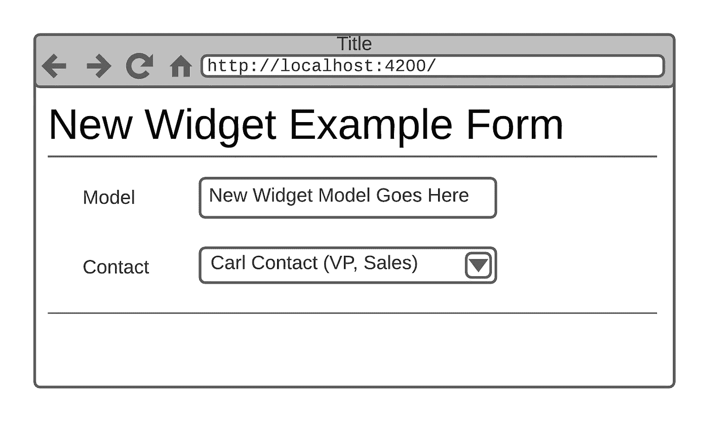
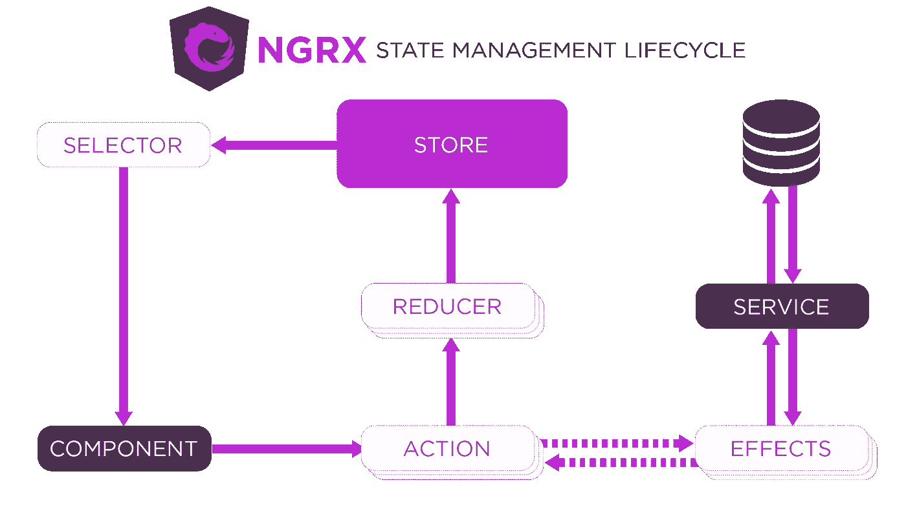
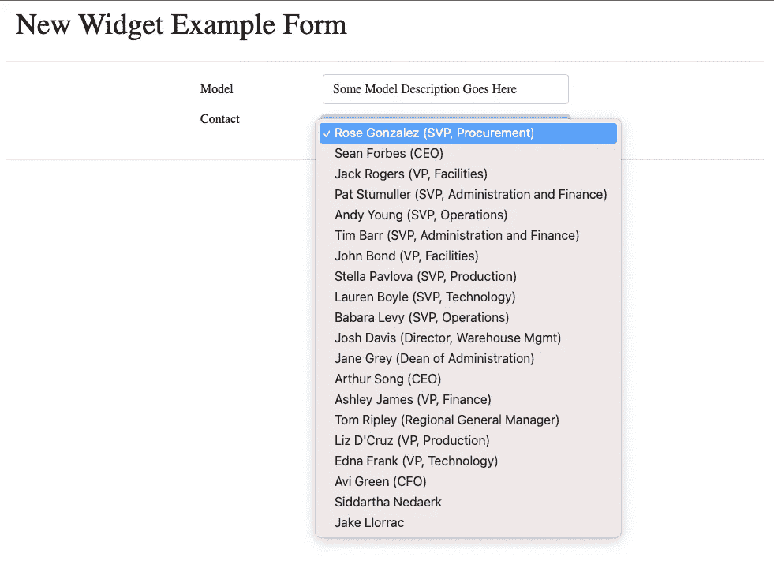
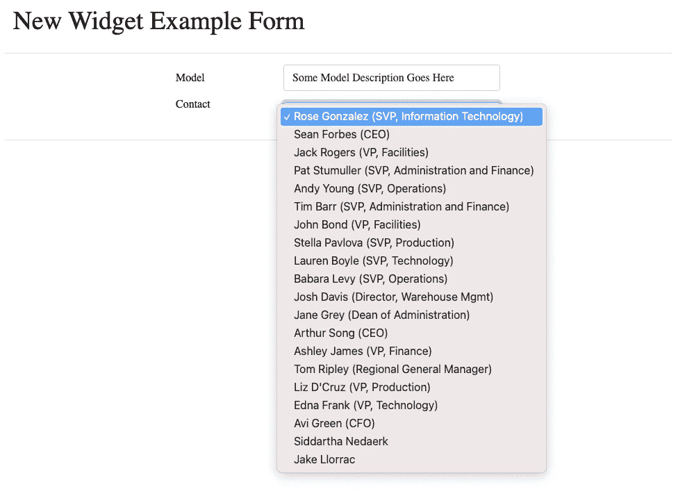

# 使用用 Angular 编写的客户端利用 Salesforce

> 原文：<https://medium.com/nerd-for-tech/leveraging-salesforce-using-a-client-written-in-angular-36fe949ef69b?source=collection_archive---------4----------------------->


在[“使用 Spring Boot 利用 sales force](https://dzone.com/articles/leveraging-salesforce-without-using-salesforce)”文章中，我介绍了引入 Spring Boot 服务的过程，该服务将利用成熟的 Salesforce RESTful API。该服务的目标是充当中间件层；这样，未在 Salesforce 中编写的客户可以检索和更新存储在 Salesforce 中的联系人数据。该后端服务实现了自己的缓存层，以提供更快的响应时间，并减少了调用 Salesforce 的次数。

在“[使用用 Svelte 编写的客户端利用 Salesforce](https://dzone.com/articles/leveraging-salesforce-using-a-client-written-in-sv)”中，我介绍了一个用 Svelte 编写的简单客户端，它使得使用内嵌编辑器更新 Salesforce 数据成为可能—同样，不需要实际使用 sales force 客户端。

“[使用 Vue.js 编写的客户端利用 Salesforce】”文章介绍了一个使用 Vue.js 框架的客户端应用程序，以进一步与 Spring Boot 服务进行交互。使用 Vue.js，最终的客户端不仅能够从 Salesforce 读取数据，还能够通过服务器发送的事件(SSE)实现处理和显示对 Salesforce 数据的更新。](https://dzone.com/articles/leveraging-salesforce-using-a-client-written-in-vu)

本系列的第四篇文章“[利用使用 React Native 编写(一次)的移动应用程序的 Salesforce】”介绍了利用 React Native 编写的单一源代码库的 Android 和 iOS 设备的原生移动应用程序。这种新的客户端产品允许高级管理人员监控 Salesforce 数据的进度。](https://dzone.com/articles/leveraging-salesforce-using-mobile-applications-wr)

在本文中，我们将使用 Angular 框架来完成一个新的特性请求。在本例中，来自 Salesforce 的相同联系人数据将在下拉列表中使用，以避免具有不同的联系人数据来源。

# 重温示例用例

让我们简要回顾一下我们的示例用例:业务呼叫中心即将发起一场大型营销活动。然而，他们最近发现，为联系人列表生成的标题大约 90%都是不正确的。

一个实习生团队一直在使用 Svelte 客户端更新联系人，管理团队一直在使用 Vue.js 客户端监控更新，包括服务器发送的显示为 toast 消息的事件。高管们一直在使用他们的 Android 和 iOS 设备从已经部署的本地客户端监控进度。

负责新 widget 产品线的功能团队已经意识到他们也可以从存储在 Salesforce 中的联系信息中受益。小部件应用程序中添加了以下要求:

1.  新的小部件表单需要一个联系人字段。
2.  联系人字段的选择选项将是一个下拉列表。
3.  源数据将是来自 Salesforce 的联系人的动态列表。
4.  每个选项都将显示联系人的全名以及括号中的头衔(如果有的话)。
5.  随着对 Salesforce 中的联系人进行更改，联系人选择选项列表应自动更新(包括职位值)。

小部件产品线的特性团队正计划马上开始这项工作，并且应该根据本系列之前完成的工作的结果准备好他们需要的一切。

作为参考，下面是整个系列中使用的 Spring Boot 服务的链接:

[https://git lab . com/johnj vester/sales force-integration-service](https://gitlab.com/johnjvester/salesforce-integration-service)

# 为什么有棱角？

[Angular](https://angular.io/) 是一个基于类型脚本的 web 客户端框架，由 [Google](https://en.wikipedia.org/wiki/Google) 领导，由一个非常大的开源社区提供支持。在我在本系列中使用的所有框架中，Angular 无疑是最大的——几乎到了称它为平台可能更好的地步。

使用角度的一些好处如下:

1.  旨在处理企业 web 应用程序，适应下一代设计模式，包括[渐进式 web 应用程序](https://en.wikipedia.org/wiki/Progressive_web_application)。
2.  继续与专门的开源社区一起发展。这导致了一个令人印象深刻的 bug/解决时间框架和一个第三方解决方案或依赖项的大型库，可以添加到任何现代 Angular 项目中。
3.  由谷歌支持，作为技术巨头的主要网络客户端框架，包括 [Gmail](https://en.wikipedia.org/wiki/Gmail) 、[微软 Office](https://en.wikipedia.org/wiki/Microsoft_Office) 、 [PayPal](https://en.wikipedia.org/wiki/PayPal) 、 [Upwork](https://en.wikipedia.org/wiki/Upwork) (自由职业程序)和[三星](https://en.wikipedia.org/wiki/Samsung)。

就我个人而言，从 2014 年初开始，我就参与了同时在 AngularJS 和 Angular 上运行的企业 web 应用程序。虽然 Angular 是为处理大规模应用程序而设计的，但我在使用相同的框架处理小而简单的应用程序方面也同样成功。

# Angular 入门

对于本文，我决定走出自己的舒适区，尝试 Angular 的第 12 版。(作为一个参考点，我最后一次使用版本 9 是去年在我的“[使用 Heroku 快速构建多租户 SaaS 产品](https://dzone.com/articles/using-heroku-to-quickly-build-a-multi-tenant-saas)系列”中为我嫂子编写的健身应用程序。)

因为我的 Angular 命令行界面(CLI)仍然是版本 9，所以我需要使用以下命令来升级到版本 12 的 Angular CLI:

`npm install -g @angular/cli`

第一次使用的用户也可以使用这个命令。

发出一个`ng version`命令为我提供了以下结果:

```
_                      _                 ____ _     ___
    / \   _ __   __ _ _   _| | __ _ _ __     / ___| |   |_ _|
   / △ \ | '_ \ / _` | | | | |/ _` | '__|   | |   | |    | |
  / ___ \| | | | (_| | |_| | | (_| | |      | |___| |___ | |
 /_/   \_\_| |_|\__, |\__,_|_|\__,_|_|       \____|_____|___|
                |___/Angular CLI: 12.2.0
Node: 14.15.5
Package Manager: npm 6.14.11
OS: darwin x64Angular:
...Package                      Version
------------------------------------------------------
[@angular](http://twitter.com/angular)-devkit/architect    0.1202.0 (cli-only)
[@angular](http://twitter.com/angular)-devkit/core         12.2.0 (cli-only)
[@angular](http://twitter.com/angular)-devkit/schematics   12.2.0 (cli-only)
[@schematics/angular](http://twitter.com/schematics/angular)          12.2.0 (cli-only)
```

为了创建新的 Angular 12 应用程序，我发出了以下 Angular CLI 命令:

`ng new salesforce-integration-angular`

Angular CLI 在名为 salesforce-integration-angular 的新文件夹中创建了该应用程序。下面是该命令的一些输出的摘要:

```
? Would you like to add Angular routing? No
? Which stylesheet format would you like to use? CSS
...
✔ Packages installed successfully.
```

此时，我使用 ng serve 命令来显示新创建的 Angular 应用程序:


当然，这并不多，但至少 Angular 应用程序在几秒钟内就开始了。

# 添加一些依赖项

小部件应用程序的需求包含一个有趣的业务规则。为了避免不得不滚回页面顶部，我捕获了以下信息:

> *随着 Salesforce 中联系人的更改，联系人选择选项列表应自动更新(包括职位值)*

这一要求转化为窗口小部件应用程序必须维护联系人对象的当前状态。也就是说，联系人列表信息总是需要是最新的。

在“利用使用 Vue.js 编写的客户端的 Salesforce”文章中，当存储在 Salesforce 中的联系人的状态发生变化时，Spring Boot 服务被更新为广播 SSE。角度应用程序也需要监听这些相同的 SSE。

然而，对于 Angular 应用程序，我决定使用 [@ngrx/store](https://ngrx.io/guide/store) ，这是一个受 Redux 启发的用于 Angular 应用程序的全局状态管理——由 [RxJS](https://rxjs.dev/) 提供支持。这意味着我将从 Spring Boot 连接 SSEs 来维护浏览器中 Salesforce 联系人的状态。然后，小部件组件可以采用一种反应式设计，以总是获得最新的更改——而不必再次调用 Spring Boot 服务。

将 ngrx/store 依赖项添加到 Angular 12 应用程序需要一个简单的命令:

`npm install @ngrx/store --save`

将这个依赖项添加到项目中后，我就可以专注于在 Angular 中创建小部件组件了。

# 创建小部件组件

对于这个简单的例子，启动 Angular 12 应用程序将呈现一个新的小部件表单。因为我们保持事情简单，所以表单看起来像这样:



模型字段将是自由格式的文本字段，联系人字段将包含 Salesforce 联系人的动态列表，通过与 NgRx 通信的 SSE 监听器保持最新。

使用 Angular CLI 创建新组件需要以下命令:

`ng generate component widget`

Angular CLI 响应以下状态更新:

```
CREATE src/app/widget/widget.component.css (0 bytes)
CREATE src/app/widget/widget.component.html (21 bytes)
CREATE src/app/widget/widget.component.spec.ts (626 bytes)
CREATE src/app/widget/widget.component.ts (275 bytes)
UPDATE src/app/app.module.ts (727 bytes)
```

因此，已经创建了一个小部件组件，并可以在 Angular 12 应用程序的/src/app/widget 文件夹中使用。

# 配置 NgRx

这里没有包括所有关于配置 NgRx 的必要信息，下面的 NgRx 网站链接提供了大量的细节:

[https://ngrx.io/guide/store#ngrxstore](https://ngrx.io/guide/store#ngrxstore)

本文档的一部分包括下图:



概括地说，我们将向 Angular 12 应用程序添加以下元素:

1.  ContactService:对 Spring Boot 进行 API 调用，允许我们接收联系人。
2.  EventService:连接到在 Spring Boot 服务中运行的 SSE URI。
3.  ContactEffect:注册事件侦听器并从 Spring Boot 服务加载原始联系人。
4.  ContactAction:描述从 ContactService 调度的事件。
5.  ContactReducer:确保正在处理状态更改。
6.  ContactSelector:从商店中选择并获取联系信息。
7.  WidgetComponent:侦听 ContactAction 并从 ContactSelector 接收数据。

让我们深入代码，看看这在 TypeScript 中是什么样子。

# 联系服务

ContactService 处理对本系列中一直使用的 Spring Boot 服务的基本 API 调用。Angular 12 客户端将简单地调用 `/contacts` URI，并返回一个包含联系对象列表的“observable ”:

```
export class ContactService {
  constructor(private http: HttpClient) { }getContacts(): Observable<Contact[]> {
    return this.http.get<Contact[]>( environment.api + '/contacts')
      .pipe(
        retry(1),
        catchError(this.handleError)
      )
  }
}
```

# 事件服务

EventService 建立了与 Spring Boot URI 的连接，后者正在广播 SSE 更新。我添加了`getServerSentEvent()` 方法来建立连接:

```
getServerSentEvent(): Observable<any> {
    return Observable.create((observer: { next: (arg0: any) => void; error: (arg0: any) => void; }) => {
      const eventSource = this.setSource();
      eventSource.onmessage = event => {
        this.zone.run(() => {
          observer.next(event);
        });
      };
      eventSource.onerror = error => {
        this.zone.run(() => {
          observer.error(error);
        });
      };
    });
  }
```

当一个 SSE 到达时，调用`_onMessage()`方法:

```
private _onMessage(e: MessageEvent): void {
    const message = JSON.parse(e.data);
    if (message) {
      this.dispatchActionInNgZone(processSseUpdate(message));
    }
  }
```

这又会将操作分派到 NgZone 中:

```
private dispatchActionInNgZone(action: Action): void {
    this.zone.run(() => this.store.dispatch(action));
  }
```

# 接触效应

ContactEffect 向 EventService 注册一个事件侦听器，根据收到的 SSE 消息更新联系人，并从 Spring Boot 服务加载原始联系人。

```
registerEventListener$ = createEffect(
    () =>
      this.actions$.pipe(
        ofType(ContactActionTypes.AllContactsLoaded),
        tap(action => {
          this.eventListenerService.register();
        }),
        repeat()
      ),
    { dispatch: false }
  );updateContactFromSSE$ = createEffect(() =>
    this.actions$.pipe(
      ofType(processSseUpdate),
      map( payload => {
        const anyContact:any = (payload as any);
        const contact = (anyContact as Contact);
        const updatedAction:Update<Contact> = {
          id: contact.id,
          changes: { ...contact }
        };
        return new ContactUpdated({contact: updatedAction});
      })
    )
  );loadAllContacts$ = this.actions$.pipe(
      ofType<AllContactsRequested>(ContactActionTypes.AllContactsRequested),
      mergeMap(() => this.contactService.getContacts()),
      map(contacts => { new AllContactsLoaded({ contacts })} )
    );
```

# 接触动作

ContactAction 描述从 ContactService 调度的事件。

```
export enum ContactActionTypes {
  AllContactsRequested = '[Contact API] All Contacts Requested',
  AllContactsLoaded = '[Contact API] All Contacts Loaded',
  ContactUpdated = '[Contact API] Contact Updated'
}export class AllContactsRequested implements Action {
  readonly type = ContactActionTypes.AllContactsRequested;
}export class AllContactsLoaded implements Action {
  readonly type = ContactActionTypes.AllContactsLoaded;
  constructor(public payload: { contacts: Contact[] }) { }
}export class ContactUpdated implements Action {
  readonly type = ContactActionTypes.ContactUpdated;
  constructor(public payload: { contact: Update<Contact> }) { }
}export type ContactActions = AllContactsRequested |  AllContactsLoaded | ContactUpdated;
```

# 接触还原剂

ContactReducer 确保状态更改得到处理。

```
export function contactReducer(state = initialContactsState, action: ContactActions): ContactsState {
  switch(action.type) {
    case ContactActionTypes.AllContactsLoaded:
      return adapter.setAll(action.payload.contacts, {...state, allContactsLoaded: true });
    case ContactActionTypes.ContactUpdated:
      return adapter.updateOne(action.payload.contact, state);
    default: {
      return state;
    }
  }
}
```

# WidgetComponent

最后，WidgetComponent 利用所有 NgRx 状态管理元素，通过 Spring Boot 服务和 SSE URI 提供来自 Salesforce 的动态和自我更新的联系信息列表。

`ngOnInit()`方法连接到 NgRx 存储，然后接收联系人的原始列表:

```
ngOnInit(): void {
    this.widget.model = "Some Model Description Goes Here";this.contactService.getContacts().subscribe((data) => {
      this.store.dispatch(new AllContactsLoaded({ contacts: data }));
      this.loading = false;
    });
  }
```

NgRx 实施就绪后，更新将在通过 SSE URI 从 Spring Boot 服务收到时进行处理。

为了确保小部件组件在 Angular 启动时显示，我将 app.component.html 文件缩减为一行:

`<widget></widget>`

# 使用角度应用程序

使用 Angular CLI 中的`ng serve`,我们启动 Angular 12 应用程序，上面的所有更改都已就绪。

这将显示小组件表单，在下拉列表中显示来自 Salesforce 的联系人数据:



使用下面的 cURL 命令，我将 Rose Gonzales 的标题从“SVP，采购”更新为“SVP，信息技术”

```
curl --location --request PATCH '[http://localhost:9999/contacts/0035e000008eXq0AAE'](http://localhost:9999/contacts/0035e000008eXq0AAE') \
--header 'Content-Type: application/json' \
--data-raw '{
    "Title": "SVP, Information Technology"
}'
```

PATCH 命令产生了 HTTP 状态代码 202(已接受),并返回了以下有效负载:

```
{
    "attributes": {
        "type": "Contact",
        "url": "/services/data/v52.0/sobjects/Contact/0035e000008eXq0AAE"
    },
    "id": "0035e000008eXq0AAE",
    "Name": "Rose Gonzalez",
    "Title": "SVP, Information Technology",
    "Department": "Procurement"
}
```

无需对小部件表单进行任何更改，下拉列表选项现在如下所示:



请注意 Rose Gonzalez 的联系人头衔是如何自动更改的。

# 结论

从 2021 年开始，我一直努力按照以下使命宣言生活，我觉得这可以适用于任何 IT 专业人士:

> *“将您的时间集中在提供扩展您知识产权价值的特性/功能上。将框架、产品和服务用于其他一切。”*
> 
> *-j·维斯特*

在本文中，我使用 Angular 12 创建了一个 widgets 组件，其中包括一个联系人下拉列表，该列表中填充了来自 Salesforce 实现的数据。我添加了 NgRx 状态管理功能来监听来自 Spring Boot 的 SSE 消息，以便保持联系人列表是最新的。在这种情况下，我利用了强大的 NgRx 状态管理框架来完成这项工作——只需要对小部件组件做很少的修改。

与我使用 Svelte、Vue.js 和 React Native 的经历类似，创建一个随时可以部署的组件的时间非常快，以分钟而不是小时来衡量。就像在本系列的所有文章中一样，我们已经能够使用 Salesforce 而不实际使用 Salesforce 客户端。

当然，生产就绪的场景需要做一些额外的工作来准备这个应用程序供“黄金时间”使用。

如果您对用于 Angular 客户端的源代码感兴趣，只需导航到 GitLab 上的以下存储库:

[https://git lab . com/johnj vester/sales force-integration-angular](https://gitlab.com/johnjvester/salesforce-integration-angular)

在本系列的下一篇文章中，我计划将事情转变 180 度，在 Salesforce 生态系统之外使用 Lightning Web Components (LWC)。

祝你今天过得愉快！