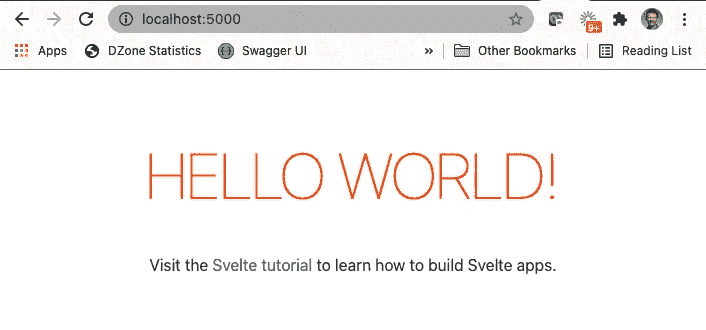
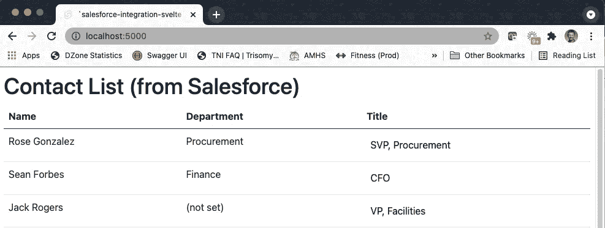
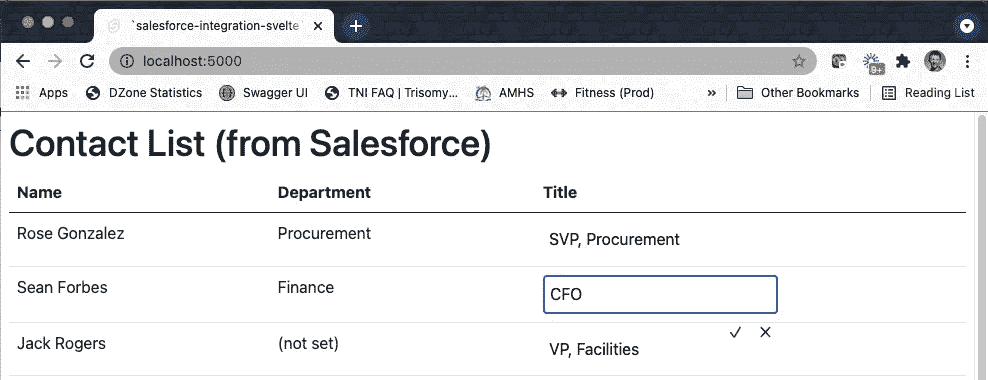
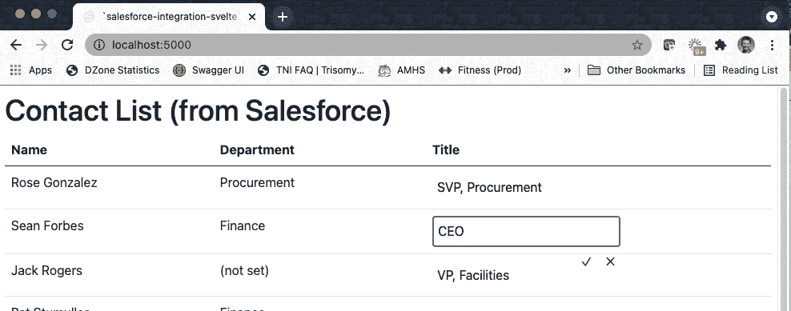
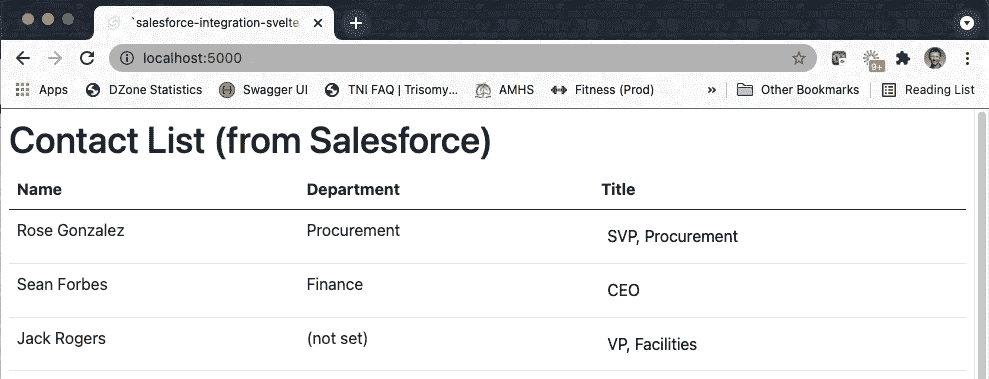

# 利用 Salesforce 使用苗条的客户端编写

> 原文：<https://medium.com/nerd-for-tech/leveraging-salesforce-using-a-client-written-in-svelte-93b431a15bf4?source=collection_archive---------7----------------------->


在“[利用 Salesforce 而不使用 Salesforce](/nerd-for-tech/leveraging-salesforce-without-using-salesforce-8ed8c2556926) ”一文中，我介绍了引入 Spring Boot 服务的过程，该服务将利用成熟的 Salesforce RESTful API。该服务的目标是作为一个中间件层，允许未在 Salesforce 中编写的客户端检索和更新存储在 Salesforce 中的联系人数据。该后端服务实现了自己的缓存层，以提供更快的响应时间，并减少了调用 Salesforce 的次数。

在本文中，我将介绍一个使用[框架与 Spring Boot 服务交互的客户端应用程序。](https://svelte.dev/)

# 为什么苗条？

当我计划这个系列时，我知道我将利用 Spring Boot 作为我设计中的中间件层。我还知道我想使用 Angular、React 和 Vue.js 提供示例客户端应用程序，因为它们代表了当前使用的大多数基于 JavaScript 的客户端。

同时，我想鞭策自己，使用一个对我来说完全陌生的基于 JavaScript 的框架。事实上，我想用一个我从来没有听说过的。*这不是什么大任务，因为我主要是服务层开发人员。*

我联系了我的好朋友迈克尔·博根，他提出了用苗条身材的想法。当然，我甚至在谷歌搜索之前就已经同意了这个想法。

当我在谷歌中执行“苗条”搜索时，我很兴奋地尝试了一个 JavaScript 框架，它提供了以下优势:

1.  Svelte 建立在互联网的 API 之上。它没有引入任何新的东西(比如 JSX ),并且被设计成可以运行基本的 JavaScript、CSS 和 HTML。正因为如此，大多数开发人员准备在几分钟内开始构建应用程序，并且在仅仅一个小时后就感到舒适。
2.  Svelte 速度极快(已被证明优于 Angular、React 和 Vue.js ),并且可以投入生产。该框架的当前用户包括 GoDaddy、IBM、Square 和纽约时报。
3.  没有(是的，没有)客户端依赖性。

如果你想了解更多，可以看看罗伯特·豪尔的这篇精彩文章。

```
public class Contact {
    private String id;
    private String name;
    private String title;
    private String department;private SalesforceAttributes attributes;
}public class SalesforceAttributes {
    private String type;
    private String url;
}
```

如果你想看 Spring Boot 服务，你可以在这里访问 Spring Boot 服务源代码:

[](https://gitlab.com/johnjvester/salesforce-integration-service) [## John Vester /销售力量-集成-服务

### sales force-integration-service repository 是非常基本的 Spring Boot RESTful API，旨在充当…

gitlab.com](https://gitlab.com/johnjvester/salesforce-integration-service) 

# 变得苗条并跑步

创建并运行一个新的客户端非常简单。事实上，在我的 MacBook Pro 上执行了以下终端命令来创建一个名为“salesforce-integration-svelte”的新实例:

```
npx degit sveltejs/template salesforce-integration-svelte
cd salesforce-integration-svelte
npm install
npm run dev
```

这些命令会产生以下输出:

```
╭─john.vester@john ~/projects/salesforce-integration-svelte 
╰─$ npm run dev> svelte-app@1.0.0 dev /projects/salesforce-integration-svelte
> rollup -c -wrollup v2.52.7
bundles src/main.js → public/build/bundle.js...
LiveReload enabled on port 35730
created public/build/bundle.js in 466ms[2021-07-04 17:09:15] waiting for changes...> svelte-app@1.0.0 start /projects/salesforce-integration-svelte
> sirv public --no-clear "--dev"Your application is ready~!- Local:      [http://localhost:5000](http://localhost:5000)
- Network:    Add `--host` to expose────────────────── LOGS ──────────────────
```

将我的浏览器导航到`localhost:5000`显示了“hello world”消息:



# 添加一些依赖项

下一步，我想看看是否有可能为我的新应用程序利用 Bootstrap。毕竟，我不擅长 UI/UX，感觉 Bootstrap 提供了一些快捷易用的东西，不像 Web 1.0。

几分钟之内，我找到了[sveletstrap](https://github.com/bestguy/sveltestrap)依赖项，然后使用以下命令将它添加到我的项目中:

```
npm install --save svelte sveltestrap
```

接下来，我简单地在`public/index.html`文件中添加了下面的`<link>`:

```
<link rel="stylesheet" href="[https://cdn.jsdelivr.net/npm/bootstrap@5.0.1/dist/css/bootstrap.min.css](https://cdn.jsdelivr.net/npm/bootstrap@5.0.1/dist/css/bootstrap.min.css)">
```

现在，引导类可以用在我的新的苗条应用程序中。

接下来，我从谷歌搜索结果列表中随机选择了[苗条内嵌编辑](https://github.com/PaulMaly/svelte-inline-edit)内嵌编辑器。我不知道这是不是最好的选择，但它似乎满足了我的基本需求。我使用以下命令添加了第二个自定义依赖项:

```
npm install svelte-inline-edit --save-dev
```

此时，我已准备好集中处理 Salesforce 中的 Contacts 对象。

# 创建联系人组件

我剩下的工作集中在项目的`/src`文件夹中的一个文件上，叫做`Contacts.svelte`。将所有东西放在一个文件中通常被认为是采用瘦框架的另一个好处。

## 添加视图

知道了 Contact 对象的有效负载，我在`Contacts.svelte`文件中添加了以下视图逻辑:

```
{#if contacts}
    <table class="table">
        <thead class="thead-dark">
            <tr>
                <th scope="col">Name</th>
                <th scope="col">Department</th>
                <th scope="col">Title</th>
            </tr>
        </thead>
        <tbody>
            {#each contacts as contact }
                <tr>
                    <td>{contact.Name}</td>
                    <td>{contact.Department ? contact.Department : "(not set)"}</td>
                    <td><InlineInput length="2" bind:value={contact.Title} on:save={patchContact(contact)} ></InlineInput></td>
                </tr>
            {/each}
        </tbody>
    </table>
{:else}
    <p class="loading">loading ...</p>
{/if}
```

这里真的没有什么高科技，但是有一个特殊的规则，当联系人的部门为空时显示“(未设置)”。此外，我们添加了 InlineInput 标记，以确保标题列直接从视图中更新。

## 添加服务

接下来，我创建了组件的服务端:

```
<script>
    import { onMount } from "svelte";
    import InlineInput from 'svelte-inline-edit';

    export let contacts;

    onMount(async () => {
        await fetch(`http://localhost:9999/contacts`)
            .then(r => r.json())
            .then(data => {
                contacts = data;
            });
    });

    async function patchContact(contact) {
        console.log('contact', contact);

        const headers = {
            "Content-type": "application/json"
        }

        const res = await fetch('http://localhost:9999/contacts/' + contact.id, {
            method: 'PATCH',
            body: JSON.stringify({
                "Title": contact.Title
            }),
            headers: headers
        })

        const json = await res.json()
        console.log(JSON.stringify(json));
    }
</script>
```

`onMount()` 事件通过对 RESTful 服务的 GET 调用加载数据，而`patchContact()`函数执行对 RESTful 服务的补丁调用。

## 最后的步骤

准备好 Contact 组件后，我需要更新`App.svelte`文件以包含 Contacts 组件并删除“hello world”示例代码。

```
<svelte:head>
  <title>`salesforce-integration-svelte` App</title>
</svelte:head><h1>Contact List (from Salesforce)</h1><main>
  <Contacts {contacts} ></Contacts>
</main>
```

最后，我清理了`main.js`文件，删除了最后的“hello world”代码:

```
import App from './App.svelte';const app = new App({
 target: document.body,
 props: { }
});export default app;
```

# 使用苗条客户端

修改完成后，我再次执行了`npm run dev`命令。在确保 Spring Boot RESTful 服务正在运行并连接到 Salesforce 后，导航到 `localhost:5000`会显示以下信息:



单击 Sean Forbes(第二行)的标题会将单元格置于编辑模式:



肖恩·福布斯的头衔从“首席财务官”更新为“首席执行官”:



当我单击复选标记时，客户端在补丁请求中将新值发送到 Spring Boot RESTful 服务，然后传递到 Salesforce。重新加载页面会显示更新的信息:



因此，我们能够满足业务需求并更新 Salesforce 数据，而无需实际使用 Salesforce 客户端。

# 结论

从 2021 年开始，我一直努力实践以下使命宣言，我觉得这适用于任何 IT 专业人士:

> *“将您的时间集中在提供扩展您知识产权价值的特性/功能上。将框架、产品和服务用于其他一切。”*
> 
> *- J. Vester*

在这个例子中，我第一次使用了 Svelte。事实上，在很短的时间内(对我来说不到两个小时)，我从一个空文件夹变成了一个在 Salesforce 中读取和更新联系信息的功能应用程序…而没有实际使用 Salesforce 客户端。

当然，生产就绪的场景需要做一些额外的工作来准备这个应用程序供“黄金时间”使用。然而，苗条的框架当然允许我将我的时间集中在满足示例用例中陈述的业务需求上。

如果您对用于 Svelte 客户端的源代码感兴趣，只需导航到 GitLab 上的以下存储库:

[https://git lab . com/johnj vester/sales force-integration-svelte](https://gitlab.com/johnjvester/salesforce-integration-svelte)

我们还计划为以下其他基于 JavaScript 的客户端撰写后续文章:

*   vue . j
*   反应(自然反应)
*   有角的
*   Lightning Web 组件(在 Salesforce 生态系统之外)

祝你今天过得愉快！