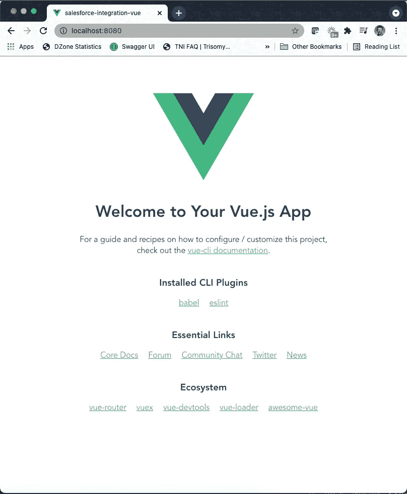
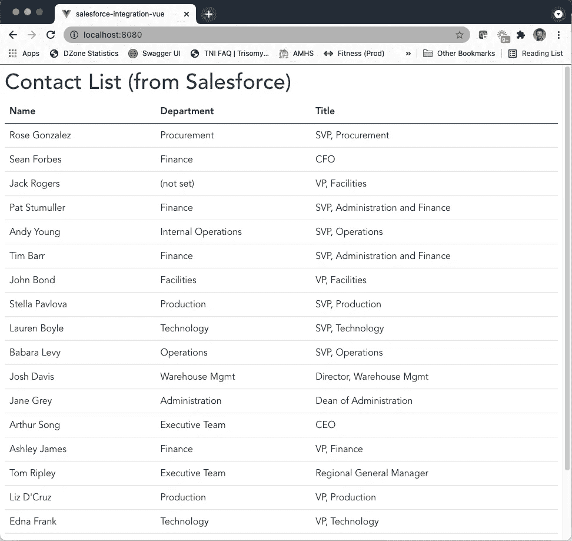
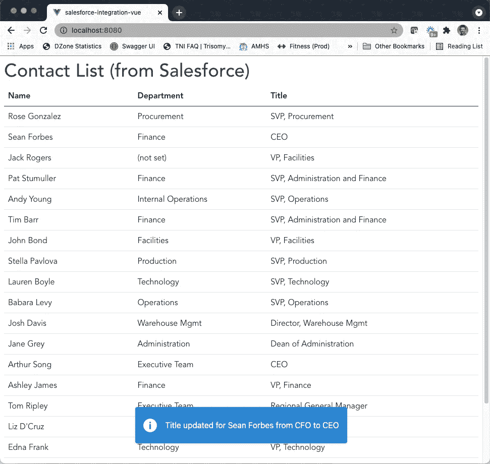
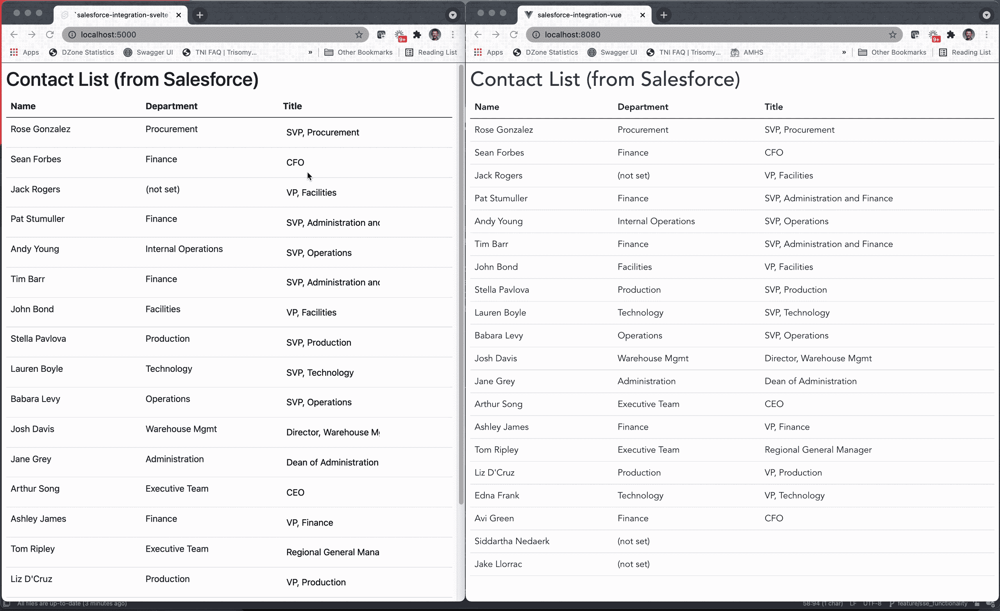

# 使用 Vue.js 编写的客户端利用 Salesforce

> 原文：<https://medium.com/nerd-for-tech/leveraging-salesforce-using-a-client-written-in-vue-js-e94dc0e19057?source=collection_archive---------9----------------------->


照片由[picjumbo.com](https://www.pexels.com/@picjumbo-com-55570?utm_content=attributionCopyText&utm_medium=referral&utm_source=pexels)从[派克斯](https://www.pexels.com/photo/woman-on-rock-platform-viewing-city-196667/?utm_content=attributionCopyText&utm_medium=referral&utm_source=pexels)拍摄

在“[利用 Spring Boot 的 sales force](/nerd-for-tech/leveraging-salesforce-without-using-salesforce-8ed8c2556926)”文章中，我介绍了引入 Spring Boot 服务的过程，该服务将利用成熟的 Salesforce RESTful API。该服务的目标是作为一个中间件层，允许未在 Salesforce 中编写的客户端检索和更新存储在 Salesforce 中的联系人数据。该后端服务实现了自己的缓存层，以提供更快的响应时间，并减少了调用 Salesforce 的次数。

在“[使用用 Svelte 编写的客户端利用 Salesforce](/nerd-for-tech/leveraging-salesforce-using-a-client-written-in-svelte-93b431a15bf4)”一文中，我介绍了一个用 Svelte 编写的简单客户端，它提供了使用内嵌编辑器更新 sales force 数据的能力。同样，无需实际使用 Salesforce 客户端。

在本文中，我将介绍一个使用 Vue.js 框架的客户端应用程序，以进一步与 Spring Boot 服务交互，不仅从 Salesforce 读取数据，还通过服务器发送事件(SSE)实现处理和显示对 Salesforce 数据的更新。

# 为什么是 Vue.js？

除了继续成为三大 JavaScript 客户端框架之一，Vue.js 还提供了以下优势:

1.  专注的公司(阿里巴巴和百度)和在中国的高采用率，帮助推动了持续的开发和采用，尽管没有得到任何大公司的资助。
2.  Vue.js 的架构培养了一个较小的学习曲线，同时还提供了创建灵活组件的能力。
3.  由于运行时较小(约 20 KB)，Vue.js 无疑是一个比大多数竞争框架执行速度都快得多的框架。

# 重温示例用例

回顾一下我们的示例用例，业务呼叫中心即将发起一场大型营销活动。然而，他们最近发现联系人列表中的标题大约 90%都是不正确的。

在“利用 Salesforce 使用苗条的客户端”一文中，我介绍了一个简单的客户端，允许一组实习生对联系人视图进行内联更新。虽然在 Vue.js 中重新引入这个逻辑很容易，但是让我们考虑一个额外的用例，在这个用例中，一个集中的团队需要知道何时应用标题更改。

因此，Vue.js 客户端应用程序将需要以下功能:

1.  检索 Salesforce 中所有联系人的列表。
2.  每当 RESTful API(和瘦客户端)中的标题改变时，收听广播的服务器发送事件(SSEs)。
3.  标题更改时自动更新联系人列表。
4.  显示一条简单的 toast 消息来总结标题更改事件。
5.  在客户端确认之前，toast 消息将一直显示在屏幕上。

出于本文的目的，下面是一个 toast 消息内容的示例:

> John Doe 的职位从销售经理更新为销售总监

# Vue.js 入门

类似于 Svelte 框架，Vue.js 入门相当简单。在本例中，我通过`npm`安装了 Vue.js 命令行界面(CLI ),但也可以使用`yarn`:

`npm install -g @vue/cli`

Vue.js CLI 提供了以下选项:

```
Vue CLI v4.5.13
? Please pick a preset:
❯ Default ([Vue 2] babel, eslint)
  Default (Vue 3) ([Vue 3] babel, eslint)
  Manually select features
```

对于这个例子，我决定继续使用版本 2，因为此时我对版本 3 不太熟悉。

完成后，我只需要切换到新创建的文件夹并启动客户端:

```
cd salesforce-integration-vue
npm run serve
```

几秒钟后，我的终端会话中显示了以下输出:

```
DONE  Compiled successfully in 2288ms                                                                                                    1:43:50 PMApp running at:
 - Local:   [http://localhost:8080/](http://localhost:8080/)
 - Network: [http://192.168.1.212:8080/](http://192.168.1.212:8080/)Note that the development build is not optimized.
 To create a production build, run npm run build.
```

导航到 localhost:8080 显示了 Vue.js 应用程序:



# 添加一些依赖项

为了使 Vue.js 客户机满足示例用例的需求，我想定位现有的插件，以使我的工作更容易。我想在以下方面寻求帮助:

*   类似引导程序的样式(因为我不是 UI/UX 专家)
*   HTTP 客户端功能
*   SSE 处理
*   Toast 消息处理

## 自举 vue

几分钟后，我找到了 [bootstrap-vue](https://bootstrap-vue.org/) 依赖项，然后使用以下命令将其添加到我的项目中:

`npm install vue bootstrap bootstrap-vue`

接下来，我更新了`main.js`文件以包含以下内容:

```
import BootstrapVue from 'bootstrap-vue'import 'bootstrap/dist/css/bootstrap.css'
import 'bootstrap-vue/dist/bootstrap-vue.css'Vue.use(BootstrapVue)
```

现在，标准的引导类，如下所示，将使我的应用程序看起来更好:

```
<table class="table">
      <thead class="thead-dark">
```

## axios

找到一个可靠的 HTTP 客户端也很快很容易。我简单地添加了 [axios](https://www.npmjs.com/package/axios) 依赖关系:

`npm install --save axios`

安装完成后，我在下面定义的`./src`文件夹中创建了一个简单的联系人服务，从 Spring Boot RESTful 服务中检索联系人列表:

```
import axios from 'axios'const SERVER_URL = '[http://localhost:9999'](http://localhost:9999');const instance = axios.create({
    baseURL: SERVER_URL,
    timeout: 1000
});export default {
    getContacts: () => instance.get('/contacts', {
        transformResponse: [function (data) {
            return data ? JSON.parse(data) : data;
        }]
    })
}
```

## vue-sse

[vue-sse](https://www.npmjs.com/package/vue-sse) 依赖项将处理 SSEs 的处理，并使用以下 CLI 命令添加到应用程序中:

`npm install --save vue-sse`

接下来，`main.js`文件被更新为包括以下项目:

```
import VueSSE from 'vue-sse';Vue.use(VueSSE)
```

vue-sse 依赖项现在已经可以使用了，将在本文的后面进一步记录。

## 提示提示通知

[vue-toast-notification](https://www.npmjs.com/package/vue-toast-notification) 依赖项将用于示例用例中提到的所需 toast 消息。向应用程序添加 toast 通知功能需要以下 CLI 命令:

`npm install vue-toast-notification`

接下来，`main.js`文件被更新为包括以下项目:

```
import VueToast from 'vue-toast-notification';import 'vue-toast-notification/dist/theme-sugar.css';Vue.use(VueToast);
```

此时，toast 通知逻辑已经就绪，可以使用了。

# 更新 Spring Boot RESTful 服务

最初在“[利用 Salesforce 而不使用 Salesforce](https://dzone.com/articles/leveraging-salesforce-without-using-salesforce) ”文章中创建的 Spring Boot RESTful 服务需要进行修改，以便为 Vue.js 客户端提供一个 URI 来进行 SSE 处理。当然，Spring Boot RESTful 服务也需要更新，以实际创建和广播存储在 Salesforce 中的联系人的标题更改。

这一节将讨论 Spring Boot 存储库所需的 Java 更新。如果您对所需的服务层更新不感兴趣，并计划简单地下载最新的服务层代码，只需向下滚动到“创建联系人组件”部分。

提醒一下，服务层代码可以在 GitLab 的以下存储库中找到:

[https://git lab . com/johnj vester/sales force-integration-service](https://gitlab.com/johnjvester/salesforce-integration-service)

# 介绍联系人事件发布者

因为 SSE 消息将包含来自 Contact 实例的更新信息，所以我为示例用例创建了一个简单的 [ContactEvent](https://gitlab.com/johnjvester/salesforce-integration-service/-/blob/master/src/main/java/com/gitlab/johnjvester/salesforceintegrationservice/events/ContactEvent.java) :

```
[@NoArgsConstructor](http://twitter.com/NoArgsConstructor)
[@AllArgsConstructor](http://twitter.com/AllArgsConstructor)
[@Data](http://twitter.com/Data)
public class ContactEvent {
    private Contact contact;
}
```

利用 Spring Boot 已经存在的应用程序事件发布者，一个简单的 [ContactEventPublisher](https://gitlab.com/johnjvester/salesforce-integration-service/-/blob/master/src/main/java/com/gitlab/johnjvester/salesforceintegrationservice/events/ContactEventPublisher.java) 被添加到服务中:

```
[@RequiredArgsConstruc](http://twitter.com/RequiredArgsConstruc)tor
[@Component](http://twitter.com/Component)
public class ContactEventPublisher {
    private final ApplicationEventPublisher applicationEventPublisher;public void publishContactEvent(Contact contact) {
        applicationEventPublisher.publishEvent(new ContactEvent(contact));
    }
}
```

最后，补丁事件的 [updateContact()](https://gitlab.com/johnjvester/salesforce-integration-service/-/blob/master/src/main/java/com/gitlab/johnjvester/salesforceintegrationservice/services/ContactService.java#L85) 方法被更新以发布联系人更改:

```
Contact contact = getContact(id);
contactEventPublisher.publishContactEvent(contact);
return contact;
```

# 提供流控制器

更新 Spring Boot 服务以发布事件后，下一步是提供一个控制器[和](https://gitlab.com/johnjvester/salesforce-integration-service/-/blob/master/src/main/java/com/gitlab/johnjvester/salesforceintegrationservice/controllers/StreamController.java)，Vue.js 客户端可以连接到这个控制器以监听联系人的变化。

为了区分不同的客户端会话，我决定最好包含一个会话标识符来跟踪每个侦听器。因此，我创建了以下类来跟踪每个监听联系人更改的客户端:

```
[@Data](http://twitter.com/Data)
[@RequiredArgsConstruc](http://twitter.com/RequiredArgsConstruc)tor
static class WebClient {
   private final String sessionId;
   private final SseEmitter emitter;
}
```

有了这样的设计，就有可能将 SSE 消息定向到给定的客户端会话。但是，在本系列的这一部分，我们不会执行该功能。

接下来，创建了`/stream/{sessionId}`来为 Vue.js 客户端提供 URI，以便订阅基于联系人的更新:

```
[@GetMapping](http://twitter.com/GetMapping)(value = "/stream/{sessionId}", produces = MediaType.TEXT_EVENT_STREAM_VALUE)
public SseEmitter contactEvents([@PathVariable](http://twitter.com/PathVariable)("sessionId") String sessionId, HttpServletResponse response) {
    response.setHeader("Cache-Control", "no-store");
    log.info("Creating emitter for sessionId={}", sessionId);WebClient webClient = new WebClient(sessionId, new SseEmitter(ONE_HOUR));Set<WebClient> webClientsForDocument = EMITTERS.computeIfAbsent(sessionId,
            key -> Collections.newSetFromMap(new ConcurrentReferenceHashMap<>()));
    webClientsForDocument.add(webClient);webClient.getEmitter().onCompletion(() -> {
        log.info("Removing completed emitter for sessionId={}", sessionId);
        removeWebClientEmitter(sessionId, webClient);
    });webClient.getEmitter().onTimeout(() -> {
        log.warn("Removing timed out emitter for sessionId={}", sessionId);
        removeWebClientEmitter(sessionId, webClient);
    });return webClient.getEmitter();
}
```

在很高的层次上，`contactEvents()`方法完成了以下任务:

1.  为提供的 sessionId 建立新的 WebClient
2.  当接触事件到达时，添加到要广播到的发射器列表
3.  超时或完成时移除发射器

最后，需要介绍事件处理。在 Spring Boot，`@EventListener`可以用一种简单的方法加以注释:

```
[@EventListener](http://twitter.com/EventListener)
public void onDocumentEvent(ContactEvent contactEvent) {
    processEvent(contactEvent);
}
```

当发布 ContactEvents 时，`processEvent()`方法简单地将更改广播给每个监听客户端:

```
protected void processEvent(ContactEvent contactEvent) {
    Collection<WebClient> matchingEmitters = EMITTERS.values().stream()
            .flatMap(Collection::stream)
            .collect(toCollection(HashSet::new));matchingEmitters.parallelStream().forEach(webClient -> {
            if (webClient != null) {
                try {
                    log.debug("Sending contact={} to WebClient sessionId={}", contactEvent.getContact(), webClient.getSessionId());
                    webClient.emitter.send(contactEvent.getContact());
                } catch (IOException e) {
                    e.printStackTrace();
                }
            }
        });
}
```

随着 Spring Boot 服务的更新和重启，我们可以继续关注 Vue.js 客户端更新。

# 创建联系人组件

和 Svelte 一样，Vue.js 允许单文件组件存在。使用 IntelliJ IDEA 和 Vue.js 插件，我创建了 Contacts.vue 组件文件，并为视图数据添加了一个简单的部分——包括标准化的引导标记:

```
<template>
  <div v-if="loading">
    <p class="loading">loading ...</p>
  </div>
  <div v-else>
    <table class="table">
      <thead class="thead-dark">
      <tr>
        <th scope="col">Name</th>
        <th scope="col">Department</th>
        <th scope="col">Title</th>
      </tr>
      </thead>
      <tbody>
      <tr v-for="contact in contacts" :key="contact.id">
        <td>{{contact.Name}}</td>
        <td>{{contact.Department ? contact.Department : "(not set)"}}</td>
        <td>{{contact.Title}}</td>
      </tr>
      </tbody>
    </table>
  </div>
</template>
```

contacts 组件的脚本部分的核心非常简单:建立 SSE 客户机、一个联系人数组和一个加载布尔值:

```
import contactService from '../contact-service';let sseClient;export default {
  name: "Contacts",data() {
    return {
      loading: true,
      contacts: []
    };
  },
```

添加`mounted()`功能是为了从 Spring Boot RESTful API 中检索联系人列表，并为 SSE 功能建立一个监听器:

```
mounted() {
    contactService.getContacts()
        .then(response => {
          console.log('contacts', response.data);
          this.contacts = response.data;
        })
        .catch(error => {
          console.error(error)
        })
        .finally(() => this.loading = false);sseClient = this.$sse.create({
      url: '[http://localhost:9999/stream/'](http://localhost:9999/stream/') + uuidv4(),
      format: 'json',
      withCredentials: false,
      polyfill: true,
    });sseClient.on('message', this.handleMessage);sseClient.connect()
        .then(sse => {
          console.log('Listening for SSEs on sse', sse);setTimeout(() => {
            sseClient.off('message', this.handleMessage);
            console.log('Stopped listening');
          }, 60000);
        })
        .catch((err) => {
          console.error('Failed to connect to server', err);
        });
  }
```

为了在 SSE URI 上为每个监听器生成一个惟一的 ID，在 contacts 组件中添加了一个简单的函数:

```
function uuidv4() {
  return 'xxxxxxxx-xxxx-4xxx-yxxx-xxxxxxxxxxxx'.replace(/[xy]/g, function(c) {
    let r = Math.random() * 16 | 0, v = c === 'x' ? r : (r & 0x3 | 0x8);
    return v.toString(16);
  });
}
```

最后，组件中添加了处理创建 toast 消息和 SSE 客户端断开连接的方法:

```
handleMessage(message) {
      console.info('Received message', message);if (message.id && this.contacts) {
        let foundIndex = this.contacts.findIndex(x => x.id === message.id);if (foundIndex >= 0) {
          let contact = this.contacts[foundIndex];let toastMessage = 'Title updated for ' + contact.Name + ' from ' + contact.Title + ' to ' + message.Title;console.info(toastMessage);this.$toast.info(toastMessage, {
            position : "bottom",
            duration : 0
          });contact.Title = message.Title;
        }
      }
    }
  },
  beforeDestroy() {
    sseClient.disconnect();
  }
```

要查看 Contacts 组件的最终版本，其中包括一个空的

[https://git lab . com/johnj vester/sales force-integration-vue/-/blob/master/src/components/contacts . vue](https://gitlab.com/johnjvester/salesforce-integration-vue/-/blob/master/src/components/Contacts.vue)

# 使用 Vue.js 客户端

更新了“App.vue”组件，删除了 hello world 方面，产生了以下设计:

```
<template>
  <div id="app">
    <h1>Contact List (from Salesforce)</h1>
    <Contacts />
  </div>
</template>

<script>
import Contacts from "./components/Contacts";

export default {
  name: 'App',
  components: {
    Contacts
  },
  data: () => {
    return {
    }
  }
}
</script>
```

有了这些更改，导航到 localhost:8080 显示了更新的 Vue.js 应用程序:



接下来，使用一个简单的 cURL 命令，我将 Sean Forbes 的头衔从 CFO 更新为 CEO。此事件更新了 Vue.js 应用程序，如下所示:



请注意上面列表中的标题变化和 toast 消息。

# 并排演示

使用到目前为止在这个系列中创建的所有东西，我创建了一个动画 GIF，在左边显示了 Svelte 客户端，在右边显示了 Vue.js 客户端。



在动画演示中，标题使用 Svelte 中的内嵌编辑功能进行更新。在 Svelte 客户端中更新标题后不久，Vue.js 客户端会收到带有更新的联系人信息的 SSE，并动态更新更新的联系人的数据。同时，显示 toast 消息，该消息会一直显示在屏幕上，直到最终用户确认。

# 结论

从 2021 年开始，我一直努力实践以下使命宣言，我觉得这适用于任何 IT 专业人士:

> *“将您的时间集中在提供扩展您知识产权价值的特性/功能上。将框架、产品和服务用于其他一切。”*
> 
> *- J. Vester*

在本文中，我利用现有的客户端框架和以 laser 为中心的依赖项来创建满足示例用例中提供的业务需求的组件。就像我使用苗条客户端的练习一样，完成这项工作的端到端时间实际上是用几分钟来衡量的。

当然，生产就绪的场景需要做一些额外的工作来准备这个应用程序供“黄金时间”使用。

如果您对用于 Vue.js 客户端的源代码感兴趣，只需导航到 GitLab 上的以下存储库:

[https://gitlab.com/johnjvester/salesforce-integration-vue](https://gitlab.com/johnjvester/salesforce-integration-vue)

我们还计划为以下其他基于 JavaScript 的客户端撰写后续文章:

*   反应(自然反应)
*   有角的
*   Lightning Web 组件(在 Salesforce 生态系统之外)

祝你今天过得愉快！