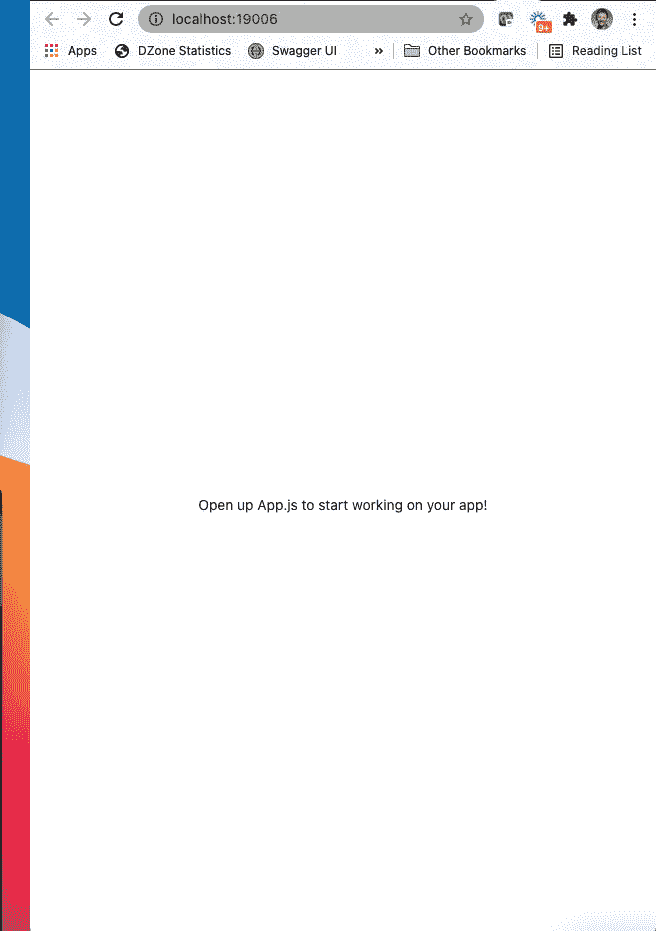
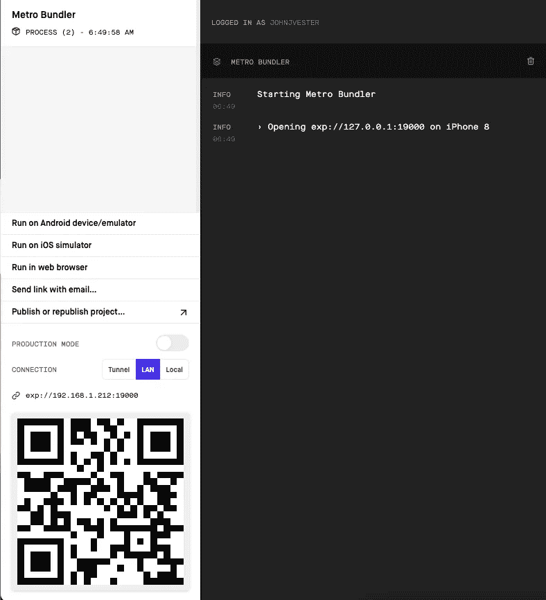
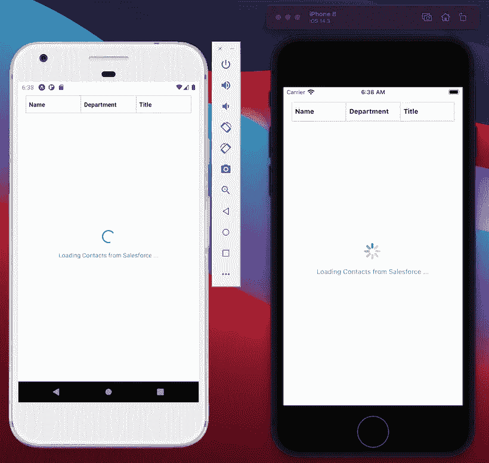
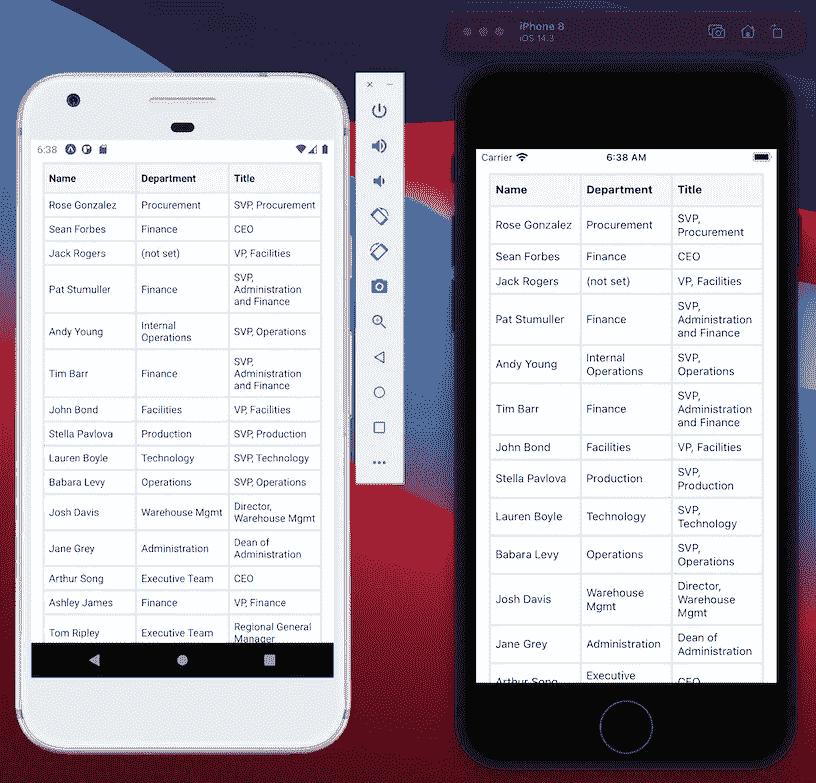

# 使用在 React Native 中编写(一次)的移动应用程序利用 Salesforce

> 原文：<https://medium.com/nerd-for-tech/leveraging-salesforce-using-mobile-applications-written-once-in-react-native-8f646a82774?source=collection_archive---------6----------------------->


在“[使用 Spring Boot 利用 sales force](/nerd-for-tech/leveraging-salesforce-without-using-salesforce-8ed8c2556926)”一文中，我介绍了引入 Spring Boot 服务的过程，该服务将利用成熟的 Salesforce RESTful API。该服务的目标是作为一个中间件层，允许未在 Salesforce 中编写的客户端检索和更新存储在 Salesforce 中的联系人数据。该后端服务实现了自己的缓存层，以提供更快的响应时间，并减少了调用 Salesforce 的次数。

在“[使用用 Svelte 编写的客户端利用 Salesforce](/nerd-for-tech/leveraging-salesforce-using-a-client-written-in-svelte-93b431a15bf4)”文章中，我介绍了一个用 Svelte 编写的简单客户端，它提供了使用内嵌编辑器更新 Salesforce 数据的能力——同样，不需要实际使用 sales force 客户端。

“[使用 Vue.js 编写的客户端利用 Salesforce】”文章介绍了一个使用 Vue.js 框架的客户端应用程序，以进一步与 Spring Boot 服务进行交互。使用 Vue.js，生成的客户端不仅能够从 Salesforce 读取数据，还能够通过服务器发送事件(SSE)实现处理和显示对 Salesforce 数据的更新。](https://medium.com/p/e94dc0e19057/edit?source)

在本文中，我们将使用 React Native 为 Android 和 iOS 设备提供本机客户端应用程序，利用单一代码库。

# 重温示例用例

回顾一下我们的示例用例，业务呼叫中心即将发起一场大型营销活动。然而，他们最近发现联系人列表中的标题大约 90%都是不正确的。

一个实习生团队一直在使用 Svelte 客户端更新联系人，管理团队一直在使用 Vue.js 客户端监控更新，包括服务器发送的显示为 toast 消息的事件。

最近我们注意到，首席管理人员也希望了解联系信息。当然，高管们每天都在使用手机。在移动设备上查看了使用浏览器的现有客户端后，高管们希望提供一个可以在 Android 和 iOS 设备上运行的原生应用程序。

因此，以下用例已被批准开发:

1.  运行在 Android 和 iOS 设备上的原生应用程序(基于浏览器的应用程序是不可取的)
2.  显示联系人的简单列表
3.  目前不希望编辑联系信息
4.  目前没有搜索联系人的预期

正如人们所料，这项工作至关重要，需要尽快完成。

# 为什么反应原生？

[React Native](https://reactnative.dev/) 是一个基于 JavaScript 的客户端框架，提供一次编写的方法来设计可以在 Android 和 iOS 设备上运行的原生应用。React Native 由脸书创建，已被 Instagram、比特币基地、Shopify、Uber Eats 甚至 Salesforce 等科技巨头采用。

使用 React Native 的一些好处如下:

1.  在需要多个本机应用程序的情况下，加快上市速度。
2.  无需掌握多种语言的技能，只需关注 Javascript 和一些原生 API。
3.  将网页转换成原生应用程序比试图在 Android Studio 和 Xcode 中完成同样的任务要容易得多。

在我们的示例用例中，选择 React Native 的所有三个好处将是提供这一新功能的主要优势。

# React Native 入门

有几种方法可以开始[设置您的环境](https://reactnative.dev/docs/environment-setup)以使用 React Native 进行开发:

*   React Native CLI Quickstart(适用于 Android Studio 和 Xcode)
*   Expo CLI 快速入门(只需要 Node.js 和一部电话或模拟器)

因为 React 原生文档表明 Expo CLI 是最简单的入门方式，所以这是我为本文选择的途径。

我首先需要使用以下命令安装 Expo CLI:

`npm install -g expo-cli`

安装 Expo CLI 后，我使用 Expo CLI 创建了一个新的 React 本地项目:

`expo init SalesforceIntegrationReactNative`

执行这个命令为我提供了一个基于命令的向导:

```
? Choose a template: › - Use arrow-keys. Return to submit.
    ----- Managed workflow -----
❯   blank               a minimal app as clean as an empty canvas
    blank (TypeScript)  same as blank but with TypeScript configuration
    tabs (TypeScript)   several example screens and tabs using react-navigation and TypeScript
    ----- Bare workflow -----
    minimal             bare and minimal, just the essentials to get you startedYour project is ready!To run your project, navigate to the directory and run one of the following npm commands.- cd SalesforceIntegrationReactNative- npm start # you can open iOS, Android, or web from here, or run them directly with the commands below.
    - npm run android
    - npm run ios
    - npm run web
```

在我继续之前，我决定将该文件夹从默认值“SalesforceIntegrationReactNative”重命名为“sales force-integration-react-native”。我不确定这是否违反了 React 开发规则，但我想遵循我自己为 GitLab 上的项目设定的命名约定。

此时，我能够使用“npm run web”命令来显示 React 本机应用程序:



当然，这并不多，但至少 React 本机应用程序在几秒钟内就启动了。

# 添加一些依赖项

对于这个简单的移动应用程序，为了满足业务需求，我只需要包含两个依赖项:

*   [react-Native-table-component](https://www.npmjs.com/package/react-native-table-component)—使 React 本机应用程序能够轻松使用表格。
*   axios —浏览器和 Node.js 的基于 promise 的 HTTP 客户端。

我能够使用 npm 非常快速地安装这些组件:

`npm i axios react-native-table-component --save`

有了所有必要的元素，我可以专注于在 React Native 中创建联系人视图。

# 创建联系人组件

在启动移动应用程序时，我想向用户提供反馈，告诉他们正在从 Spring Boot RESTful API 中检索联系人。我在 React Native 中使用 ActivityIndicator 在访问数据时显示了一个微调器。

因为我将在本地运行，而 Spring Boot 缓存将更快地提供结果，所以我设计的 Contacts 组件利用了硬编码的两秒钟延迟来确保用户可以看到活动指示器。

首先，我使用 IntelliJ IDE 创建了一个联系人组件:

`export default class Contacts extends Component { }`

接下来，我建立了一些基本的样式，为生成的数据视图添加了一些特色:

```
const styles = StyleSheet.create({
    container: { flex: 1, padding: 16, paddingTop: 30, backgroundColor: '#fff' },
    head: { height: 40, backgroundColor: '#f1f8ff' },
    headerText: { margin: 6, fontWeight: 'bold' },
    text: { margin: 6 },
    loadingText: { color: '#1798c1', marginTop: 15 }
});
```

对于应用程序状态，我希望跟踪加载的布尔属性，以及表格标题和表格数据的列表。我填充了默认的构造函数，如下所示:

```
constructor(props) {
        super(props);
        this.state = {
            loading: true,
            tableHead: ['Name', 'Department', 'Title'],
            tableData: []
        }
    }
```

对于这个简单的应用程序，我决定使用`componentDidMount()`内部函数来调用 Spring Boot RESTful 服务:

```
componentDidMount() {
        this.setState({
            loading: true,
            tableData: []
        });axios.get("[http://192.168.1.212:9999/contacts](http://192.168.1.212:9999/contacts)")
            .then(response => {
                setTimeout(() => {
                    this.setState({
                        tableData: this.createTableData(response.data),
                        loading: false
                    })
                }, 2000)
            })
            .catch(error => {
                console.log(error);
            });
    }
```

如您所见，一旦数据到达，loading boolean 被设置为 false。此外，您会注意到两秒钟的硬编码`setTimeout()`延迟是如何迫使活动指示器加载的。

为简单起见，我创建了一个函数来转换 Salesforce 数据，以匹配 react-native-table-component 预期的格式:

```
createTableData = (contacts) => {
        let tableData = [];
        if (contacts) {
            for (let i = 0; i < contacts.length; i++) {
                tableData.push([contacts[i].Name,
                    contacts[i].Department ? contacts[i].Department : "(not set)",
                    contacts[i].Title ? contacts[i].Title : "(not set)"]);
            }
        }return tableData;
    }
```

最后，我添加了内置的`render()` 函数来为最终用户提供视图数据:

```
render() {
        const state = this.state;
        return (
                <View style={styles.container}>
                    <Table borderStyle={{borderWidth: 2, borderColor: '#c8e1ff'}}>
                        <Row data={state.tableHead} style={styles.head} textStyle={styles.headerText}></Row>
                        <Rows data={state.tableData} textStyle={styles.text}></Rows>
                    </Table>{ state.loading &&
                        <View style={{ flex: 1, alignItems: 'center', justifyContent: 'center', padding: 30 }}>
                            <ActivityIndicator size='large' color='#1798c1' ></ActivityIndicator>
                            <Text style={ styles.loadingText }>Loading Contacts from Salesforce ...</Text>
                        </View>
                    }
                </View>
        )
    }
```

我们需要做的最后一件事是将 Contacts 组件连接到 React 本地应用程序。我更新了`App.js` 文件如下图所示:

```
import React from 'react';
import Contacts from "./Contacts";const App = () => {
  return (
      <>
        <Contacts ></Contacts>
      </>
  );
};export default App;
```

# 在移动设备上使用 React 本机组件

Contacts 组件准备就绪后，我使用以下命令在 iOS 仿真模式下启动 React 本地应用程序:

`npm run ios`

Metro bundler 启动并使用了我在本地系统上设置的 iPhone 模拟器。



我还使用了“在 Android 设备/模拟器上运行”链接来启动一个 Android 设备。在我的第二台显示器上，以下模拟器展示了活动指示器微调器:



在硬编码的两秒钟延迟后，两个设备都在本机应用程序中显示联系人列表:



# 结论

从 2021 年开始，我一直努力按照以下使命宣言生活，我觉得这可以适用于任何 IT 专业人士:

> *“将您的时间集中在提供扩展您知识产权价值的特性/功能上。将框架、产品和服务用于其他一切。”*
> 
> *-j·维斯特*

在本文中，我利用 React Native 创建了一个 Contacts 组件，它可以用来构建一个可以在 Android 和 iOS 设备上运行的本机应用程序。与我在 Svelte 和 Vue.js 上的经历类似，创建一个随时可以部署的组件的时间非常快，以分钟而不是小时来衡量。就像在本系列的所有文章中一样，我们已经能够使用 Salesforce 而不实际使用 Salesforce 客户端。

当然，生产就绪的场景需要做一些额外的工作来准备这个应用程序供“黄金时间”使用。

如果您对用于 React Native client 的源代码感兴趣，只需导航到 GitLab 上的以下存储库:

[https://git lab . com/johnj vester/sales force-integration-react-native](https://gitlab.com/johnjvester/salesforce-integration-react-native)

我们还计划为以下其他基于 JavaScript 的客户端撰写后续文章:

*   有角的
*   Lightning Web 组件(在 Salesforce 生态系统之外)

祝你今天过得愉快！