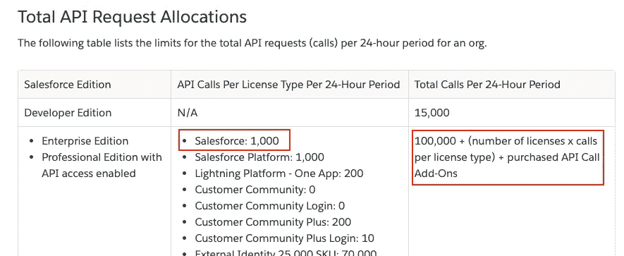
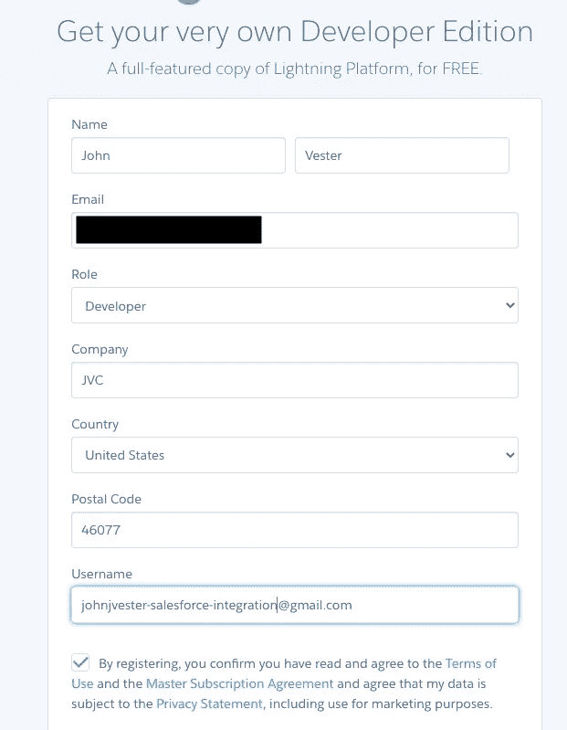
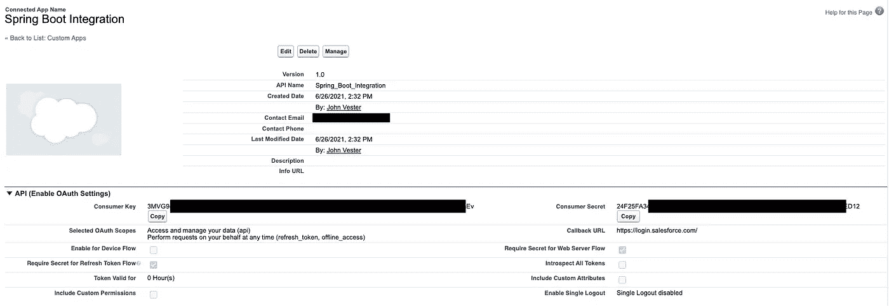
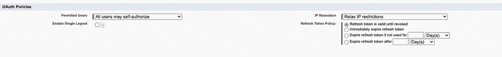
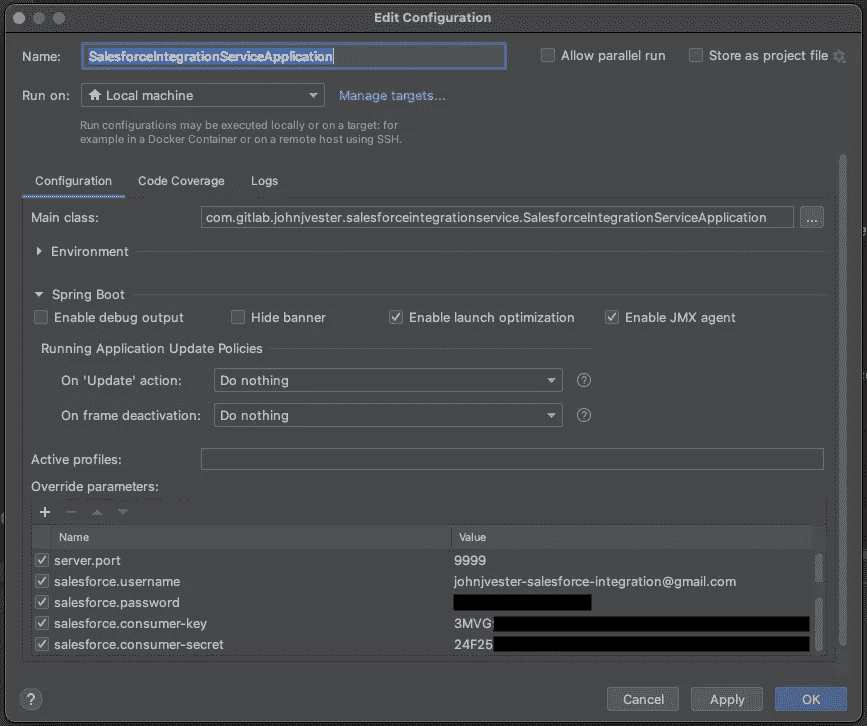
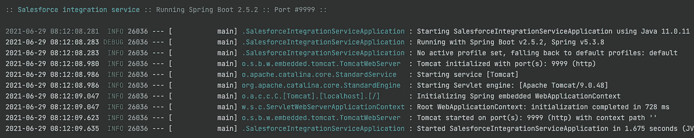
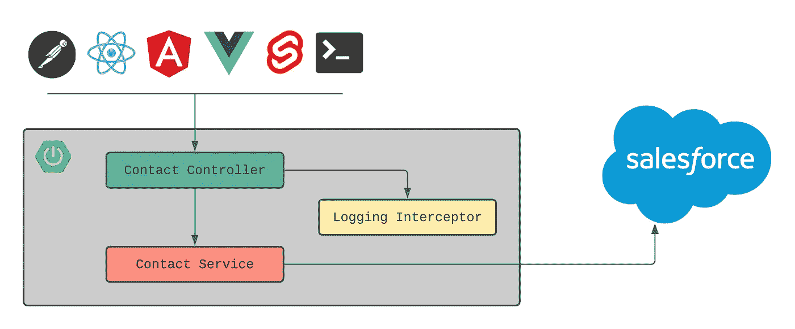

# 利用 Salesforce 而不使用 Salesforce

> 原文：<https://medium.com/nerd-for-tech/leveraging-salesforce-without-using-salesforce-8ed8c2556926?source=collection_archive---------9----------------------->


早在 2008 年的一次 Gartner 企业架构峰会上，我第一次接触到 Salesforce。这里完全透明:我参加发布会的主要原因是一件看起来很酷的 force.comt 恤的承诺，它在最后等待着我们每个人。

这件衣服没有让我失望，因为我有几张度假照片，其中包括我穿这件衣服的照片。这是 2010 年我和儿子埃里克最喜欢的一张照片:


同样没有让我失望的是基于当时的 force.com 平台的技术。那些日子有点混乱，因为有 force.com 和 Salesforce.com。我很快就明白了它们之间的区别，如下所示:

> salesforce.com 通常用于指代 CRM 功能(销售、服务和营销应用程序)，而 force.com 通常用于指代底层平台(构建所有应用程序的数据库、代码和用户界面)

TechTarget 还提供了如下定义【此处】([https://searchcustomerexperience . TechTarget . com/definition/force com](https://searchcustomerexperience.techtarget.com/definition/Forcecom))。随着时间的推移，Salesforce 已经停用了 force.com 品牌，将其平台产品简称为“Salesforce Platform”不过，那件 t 恤看起来很酷，对吧？

几年后，我仍在那家派我参加 2008 年 Gartner 峰会的公司工作。就在那时，他们决定使用 Salesforce 来跟踪与租赁业务相关的项目。我对 Salesforce 的基本了解有助于建立通过内部 SendMail 网关传递的自定义电子邮件路由规则。然而，这确实是我唯一参与的 Salesforce 生态系统。

# 2015 年和早期出版

快进七年到 2015 年。我现在是一名全职的功能开发人员，为一家非常大的汽车集团工作。在 sprint 的功能设计引入了轻量级 CRM 解决方案之后，我们的团队收到了来自公司办公室的指示，我们应该采用 Salesforce。

在接下来的六个月里，我们的敏捷团队——显然处于“[执行](https://blog.trello.com/form-storm-norm-perform-stages-of-team-productivity)阶段——成功地从现有的 CRM 解决方案转移到利用 Salesforce。这项工作激发了我在 DZone.com 上的第一批出版物:

[进入开发时间机器](https://dzone.com/articles/getting-into-the-development-time-machine)

事实上，从那时起，我已经发表了几篇关于 Salesforce 的文章，其中一些如下:

*   [与 Salesforce 的持续集成](https://dzone.com/articles/continuous-integration-with-salesforce)
*   [使用 Atlassian Bitbucket 管道构建 Salesforce】](https://dzone.com/articles/building-salesforce-using-atlassian-bitbucket-pipe)
*   [Salesforce 提供 JavaScript 编程模型](https://dzone.com/articles/salesforce-offering-javascript-programming-model)
*   [使用 Salesforce 和 Heroku 规划扑克](https://dzone.com/articles/planning-poker-using-salesforce-and-heroku)
*   [将传统云开发与 Salesforce 集成](https://dzone.com/articles/integrating-traditional-cloud-development-with-sal)
*   [Salesforce:围墙花园不复存在](https://dzone.com/articles/salesforce-walled-garden-no-more)

# 使用 Salesforce 作为服务

虽然 Salesforce 是一种极好的体验，但引入另一种用户界面并不总是一种理想的情况。事实上，早在 2015 年，当我们向习惯于反应式 web 设计的消费者展示(现在称为“Salesforce Classic”)用户界面时，我们的团队感觉我们在倒退。

从那时起，Salesforce 发展了他们的用户界面，首先发布了他们专有的 Aura 框架，然后推出了[Lightning web Components]([https://lwc.dev/](https://lwc.dev/))，这是一个 Web 组件标准的实现，可以在其平台上运行，也可以用于您自己的 Web 应用程序。然而，要求消费者在他们的日常技术解决方案组合中采用另一种应用仍然是一个挑战。

另一种方法是简单地利用 Salesforce 作为服务。毕竟，Salesforce 已经提供了一个健壮的 RESTful API 超过 10 年了，它允许 access 根据需要获取、发布、上传和删除对象数据。

本出版物的重点是提供如何利用 Salesforce API 的选项，同时回避 Salesforce 客户端的使用。

# 我们的场景

为了将事情放入使用 Salesforce RESTful API 的上下文中，考虑一个现有应用程序已经就位的示例。该应用程序提供了其用户所需的大部分日常功能。然而，一个主要的缺口是关于当前和潜在客户的联系信息。

功能团队最近发现 Salesforce 中存在所有必要的信息，并且已经有了维护这些联系人的流程。早期迹象表明，现有应用程序只需要对给定联系人进行少量更新。

本文将着重于完成一个研究高峰，以完成以下项目:

1.  创建 Salesforce 实例以构建解决方案原型。
2.  建立在 Salesforce 中检索和更新联系人的机制。
3.  确定身份验证的工作方式。
4.  使用 Postman 或简单的 cURL 命令验证功能。

# 你需要知道的是

在我们开始之前，我觉得在走这条路之前应该知道一些事情。你知道，我在介绍中提到的关于 force.comt 恤的“完全透明”的事情。

## 存在 API 限制

我的功能团队在 2015 年面临的最大挑战是 Salesforce 允许每个客户端进行的 RESTful API 调用的数量。下面是来自 [API 请求限制和分配](https://developer.salesforce.com/docs/atlas.en-us.salesforce_app_limits_cheatsheet.meta/salesforce_app_limits_cheatsheet/salesforce_app_limits_platform_api.htm)页面的屏幕截图:



在我们的例子中，上面提到的两个项目是我们团队非常关心的。事后看来，鉴于对 Salesforce 的了解和缓存数据的能力，我相信最终的 Salesforce 实例不会超出这些限制。然而，我希望这篇文章为那些决定何时使用这种方法的人强调这一点。

## 认证选项

本文考虑了两种身份验证方法:

*   使用 OAuth2 的基于用户的身份验证
*   使用 OAuth2 的基于服务的身份验证

决定何时使用其中一个与作为 Salesforce 中的给定用户提出请求的愿望(或需求)直接相关。备选方案是使用基于服务的方法，其中所有请求都来自 Salesforce 中的单个用户。

对于本例，将使用基于服务的方法。因此，所有请求将在 Salesforce 中基于服务的帐户身份下完成。

## 集成选项

当连接到 Salesforce 时，有几个选项。在过去的六年里，我已经能够利用以下集成选项:

*   MuleSoft
*   Heroku 连接
*   通过客户端框架直接连接到 Salesforce RESTful API
*   Spring Boot 和 Salesforce RESTful API

使用 MuleSoft 和 Heroku Connect 将提供连接器和对 Salesforce data domain 的深入了解。虽然两者都是优秀的解决方案，但它们需要额外的投资，因为它们是基于订阅的。

直接连接选项是可能的，但是存在一些挑战。首先，基于服务的身份验证不太可能成为一种选择，因为以安全的方式保存登录凭据存在挑战。其次，随着 Salesforce 数据被重新格式化以便于理解，客户端将变得更重。

如您所料(并考虑到我的出版历史)，对于这个例子，我将利用 Spring Boot 选项并利用 Salesforce RESTful API。我对这种方法非常满意。

# 创建 Salesforce 实例

第一步是创建 Salesforce 的免费开发人员实例。我可以使用以下 URL 开始使用:

[https://developer.salesforce.com/signup](https://developer.salesforce.com/signup)

这导致了一个我必须在线填写的简单表格:



表格提交后，我在上述地址收到了以下电子邮件:


这封电子邮件的内容非常有用，因为它提供了我的 Salesforce 开发人员实例的 URL，以及我的用户名。

验证我的帐户后，我被要求设置密码。

由于开发人员实例中已经有联系人，Salesforce 的基本设置就完成了。

## 添加连接的应用程序

要从 Spring Boot 服务连接到 Salesforce，需要创建新的连接应用程序。

以下步骤是使用我的 Salesforce 开发人员实例完成的:

1.  导航至设置链接
2.  导航至左侧菜单上的应用程序→应用程序管理器部分
3.  选择新连接的应用程序按钮
4.  填充以下属性:
5.  将应用程序名称与“Spring Boot 集成”联系起来
6.  API 名称(计算值应该没问题)
7.  联系电子邮件(您的电子邮件地址)
8.  API →启用 OAuth 设置= true
9.  将回拨网址设置为“【https://login.salesforce.com/】T2
10.  使用 OAuth 作用域“访问和管理您的数据(api)”和“随时代表您执行请求(refresh_token，offline_access)”(目前)
11.  使用“放宽 IP 限制”(目前)
12.  使用“刷新令牌在被撤销前有效”(目前)
13.  保存新连接的应用程序

下面是我创建的联网应用的一个例子:



为了澄清，下面是我使用的 OAuth 策略的一个例子:



请务必注意以下事项，以供日后参考:

*   消费者关键价值
*   消费者秘密价值

## 配置网络访问

原型阶段的一个可选(但推荐)步骤是创建可信 IP 范围。这既可用于您的 Salesforce 客户端实例，也可用于 Spring Boot 服务。

创建一个新的可信 IP 地址范围只需要知道[你当前的 IP 地址](https://whatismyipaddress.com/)并遵循下面列出的步骤。

1.获取您的 IPv4 地址(例如:45.67.100.27)
2。在 Salesforce 设置
3 中导航至安全→网络访问。创建一个新的可信 IP 范围，其中包括您当前的 IP 地址(我使用的起始地址是 45.1.1.1 和 45.255.255.255)

此时，Salesforce 应该已经设置好，可以供 Spring Boot 服务使用了。

# 创建 Spring Boot 服务

使用 IntelliJ IDEA 中的 Spring Initializr，创建了一个名为“salesforce-integration-service”的新 Spring Boot 服务，具有以下依赖关系:

```
<dependency>
   <groupId>org.springframework.boot</groupId>
   <artifactId>spring-boot-starter-cache</artifactId>
</dependency><dependency>
   <groupId>org.springframework.boot</groupId>
   <artifactId>spring-boot-starter-jersey</artifactId>
</dependency><dependency>
   <groupId>org.springframework.boot</groupId>
   <artifactId>spring-boot-starter-web</artifactId>
</dependency><dependency>
   <groupId>org.apache.httpcomponents</groupId>
   <artifactId>httpclient</artifactId>
   <version>4.5.13</version>
</dependency><dependency>
   <groupId>org.apache.commons</groupId>
   <artifactId>commons-lang3</artifactId>
   <version>3.12.0</version>
</dependency><dependency>
   <groupId>org.apache.commons</groupId>
   <artifactId>commons-collections4</artifactId>
   <version>4.4</version>
</dependency><dependency>
   <groupId>org.springframework.boot</groupId>
   <artifactId>spring-boot-configuration-processor</artifactId>
   <optional>true</optional>
</dependency><dependency>
   <groupId>org.projectlombok</groupId>
   <artifactId>lombok</artifactId>
   <optional>true</optional>
</dependency>
```

Spring Boot 服务将利用以下两个功能:

*   RESTful 功能
*   简单抽象缓存

使用上述值，创建了如下所示的运行配置:



启动 Spring Boot 服务将在控制台中显示以下信息:



随着 Salesforce 服务的启动，是时候添加必要的集成类和方法了。

## 与 Salesforce 集成

由于本文的用例以联系人为中心，所以在 Spring Boot 创建了以下数据转换对象(dto ):

```
[@AllArgsConstructor](http://twitter.com/AllArgsConstructor)
[@NoArgsConstructor](http://twitter.com/NoArgsConstructor)
[@JsonIgnoreProperties](http://twitter.com/JsonIgnoreProperties)(ignoreUnknown = true)
[@Data](http://twitter.com/Data)
public class Contact {
   public static final String CONTACT_QUERY = "SELECT Name, Title, Department FROM Contact";[@JsonProperty](http://twitter.com/JsonProperty)(value = "Name")
   private String name;[@JsonProperty](http://twitter.com/JsonProperty)(value = "Title")
   private String title;[@JsonProperty](http://twitter.com/JsonProperty)(value = "Department")
   private String department;private SalesforceAttributes attributes;public String getId() {
       if (attributes != null && attributes.getUrl() != null) {
           return StringUtils.substringAfterLast(attributes.getUrl(), "/");
       }return null;
   }
}[@AllArgsConstructor](http://twitter.com/AllArgsConstructor)
[@NoArgsConstructor](http://twitter.com/NoArgsConstructor)
[@JsonIgnoreProperties](http://twitter.com/JsonIgnoreProperties)(ignoreUnknown = true)
[@Data](http://twitter.com/Data)
public class SalesforceAttributes {
   private String type;
   private String url;
}
```

因此，当返回一个“Contact”对象时，它将包括一个类似于下面显示的有效负载:

```
{
    "attributes": {
        "type": "Contact",
        "url": "/services/data/v52.0/sobjects/Contact/0035e000008eXq0AAE"
    },
    "id": "0035e000008eXq0AAE",
    "Name": "Rose Gonzalez",
    "Title": "SVP, Procurement",
    "Department": "Procurement"
}
```

基于这些对象，Spring Boot RESTful 服务的设计如下所示:



## 介绍缓存

为了减少检索数据所需的 API 调用次数，我这样配置了 Spring Boot 中包含的抽象缓存:

```
[@Cacheable](http://twitter.com/Cacheable)("contacts")
public List<Contact> getContacts() throws Exception {
    …
}[@CacheEvict](http://twitter.com/CacheEvict)(value = "contacts", allEntries = true)
public Contact updateContact(String id, PatchUpdates patchUpdates) throws Exception {
    …
}
```

检索联系信息的方法使用` [@Cacheable](http://twitter.com/Cacheable) '注释在可能的情况下设置/检索缓存。为了简单起见，在这个例子中，当一个联系人被更新时，使用`[@ cache evit](http://twitter.com/CacheEvict)'注释来驱逐整个缓存。

# 添加日志拦截器

为了深入了解 Spring Boot RESTful 服务的性能，我创建了一个简单的日志拦截器，在处理 API 调用时将消息写入控制台。

第一步是建立“LoggingInterceptor”类:

```
[@Slf4j](http://twitter.com/Slf4j)
public class LoggingInterceptor implements HandlerInterceptor {
   private final String loggedStartTimeKey = "_loggedStartingTime";

   [@Override](http://twitter.com/Override)
   public boolean preHandle(HttpServletRequest request, HttpServletResponse response, Object handler) {
       long startTime = System.currentTimeMillis();
       request.setAttribute(loggedStartTimeKey, startTime);
       log.info("Request Started: method={} path={}", request.getMethod(), request.getRequestURI());
       return true;
   }[@Override](http://twitter.com/Override)
   public void afterCompletion(HttpServletRequest request, HttpServletResponse response, Object handler, [@Nullable](http://twitter.com/Nullable) Exception ex) {
       long loggedStartTime = (long) request.getAttribute(loggedStartTimeKey);
       long endTime = System.currentTimeMillis();
       long timeTakenMs = endTime - loggedStartTime;
       log.info("Request Completed: method={} path={} timeTaken={} (milliseconds)", request.getMethod(), request.getRequestURI(), timeTakenMs);
   }
}
```

接下来，我更新了“WebConfig”类以使用拦截器:

```
[@Configuration](http://twitter.com/Configuration)
public class WebConfig implements WebMvcConfigurer {
   [@Override](http://twitter.com/Override)
   public void addInterceptors(InterceptorRegistry registry) { registry.addInterceptor(getLoggingInterceptor()).addPathPatterns("/**"); }[@Bean](http://twitter.com/Bean)
   public LoggingInterceptor getLoggingInterceptor() {
       return new LoggingInterceptor();
   }[@Bean](http://twitter.com/Bean)
   public ObjectMapper objectMapper() {
       return new ObjectMapper().enable(SerializationFeature.INDENT_OUTPUT);
   }[@Bean](http://twitter.com/Bean)
   public CloseableHttpClient closeableHttpClient() {return HttpClients.createDefault();}
}
```

在验证部分，下面显示的日志事件将包含在结果中。

# 验证功能

随着 Spring Boot 服务的使用和运行，下一步是验证我们预期的功能。

## 获取 Salesforce 联系人

可以使用以下 cURL 命令通过 Spring Boot RESTful 服务从 Salesforce 检索联系人列表:

```
curl --location --request GET '[http://localhost:9999/contacts'](http://localhost:9999/contacts')
```

提交后，我们会收到一个 HTTP 200 (OK)响应，其中包含使用在 Spring Boot 创建的“联系人”DTO 的完整联系人列表:

```
[
    {
        "attributes": {
            "type": "Contact",
            "url": "/services/data/v52.0/sobjects/Contact/0035e000008eXq0AAE"
        },
        "id": "0035e000008eXq0AAE",
        "Name": "Rose Gonzalez",
        "Title": "SVP, Procurement",
        "Department": "Procurement"
    },
    {
        "attributes": {
            "type": "Contact",
            "url": "/services/data/v52.0/sobjects/Contact/0035e000008eXqJAAU"
        },
        "id": "0035e000008eXqJAAU",
        "Name": "Jake Llorrac",
        "Title": null,
        "Department": null
    }
]
```

请注意:为了保持结果集的简洁，上面只显示了两个联系人项目。

查看 Spring Boot RESTful 服务日志会显示以下信息:

```
2021-06-29 09:03:46.945  INFO 27343 --- [nio-9999-exec-1] c.g.j.s.interceptors.LoggingInterceptor  : Request Started: method=GET path=/contacts
2021-06-29 09:03:48.079  INFO 27343 --- [nio-9999-exec-1] 
2021-06-29 09:03:47.667 DEBUG 27343 --- [nio-9999-exec-1] c.g.j.s.utils.BearerTokenUtilities       : salesforceLoginResult=SalesforceLoginResult(data_goes_here)
2021-06-29 09:03:48.041 DEBUG 27343 --- [nio-9999-exec-1] c.g.j.s.services.ContactService          : contacts=[contact_data_goes_here]
c.g.j.s.interceptors.LoggingInterceptor  : Request Completed: method=GET path=/contacts timeTaken=1134 (milliseconds)
```

最初的请求需要一秒多一点的时间来处理。为了验证抽象缓存是否正常工作，我再次执行了相同的 cURL 命令。

第二次，结果快得多，并且不需要呼叫“BearerTokenUtilities”或“ContactService ”:

```
2021-06-29 09:10:04.928  INFO 27343 --- [nio-9999-exec-5] c.g.j.s.interceptors.LoggingInterceptor  : Request Started: method=GET path=/contacts
2021-06-29 09:10:04.930  INFO 27343 --- [nio-9999-exec-5] c.g.j.s.interceptors.LoggingInterceptor  : Request Completed: method=GET path=/contacts timeTaken=2 (milliseconds)
```

## 获得单个 Salesforce 联系人

要从 Salesforce 检索有关单个联系人的信息，需要该联系人的 ID，并执行原始 cURL 命令的类似版本:

```
curl --location --request GET '[http://localhost:9999/contacts/0035e000008eXq0AAE'](http://localhost:9999/contacts/0035e000008eXq0AAE')
```

提交后，我们收到一个 HTTP 200 (OK)响应，其中提供了 DTO 在 Spring Boot 创建的单一“联系人”:

```
{
    "attributes": {
        "type": "Contact",
        "url": "/services/data/v52.0/sobjects/Contact/0035e000008eXq0AAE"
    },
    "id": "0035e000008eXq0AAE",
    "Name": "Rose Gonzalez",
    "Title": "SVP, Procurement",
    "Department": "Procurement"
}
```

当只需要一个联系人时，此 URI 很有用。

## 更新联系信息

在我们的使用案例中，只需要对 Salesforce 中的联系人数据进行微小的更改。一个例子是改变联系人的头衔值。为了更新联系人的 title 属性，我们将使用以下 cURL 命令:

```
curl --location --request PATCH '[http://localhost:9999/contacts/0035e000008eXq0AAE'](http://localhost:9999/contacts/0035e000008eXq0AAE') \
--header 'Content-Type: application/json' \
--data-raw '{
    "Title": "SVP, Procurement 2"
}'
```

在本例中，我们只是将标题从“SVP，采购”更改为“SVP，采购 2”

提交此请求后，我们会收到一个 HTTP 202(已接受)响应，以及更新的“联系”DTO:

```
{
    "attributes": {
        "type": "Contact",
        "url": "/services/data/v52.0/sobjects/Contact/0035e000008eXq0AAE"
    },
    "id": "0035e000008eXq0AAE",
    "Name": "Rose Gonzalez",
    "Title": "SVP, Procurement 2",
    "Department": "Procurement"
}
```

由于缓存被完全收回，如果我们运行原始 cURL 来检索 Salesforce 中的所有联系人，将会出现以下日志:

```
2021-06-29 09:18:39.853  INFO 27343 --- [nio-9999-exec-5] c.g.j.s.interceptors.LoggingInterceptor  : Request Started: method=GET path=/contacts
2021-06-29 09:18:40.314 DEBUG 27343 --- [nio-9999-exec-5] c.g.j.s.utils.BearerTokenUtilities       : salesforceLoginResult=SalesforceLoginResult(data_goes_here)
2021-06-29 09:18:40.416 DEBUG 27343 --- [nio-9999-exec-5] c.g.j.s.services.ContactService          : contacts=[contact_data_goes_here]
2021-06-29 09:18:40.418  INFO 27343 --- [nio-9999-exec-5] c.g.j.s.interceptors.LoggingInterceptor  : Request Completed: method=GET path=/contacts timeTaken=565 (milliseconds)
```

# 结论(展望未来)

从 2021 年开始，我一直努力实践以下使命宣言，我觉得这适用于任何 IT 专业人士:

> “将您的时间集中在提供扩展您知识产权价值的特性/功能上。将框架、产品和服务用于其他一切。”—j·维斯特

就像我的功能团队在 2015 年发现的那样，Salesforce 提供了一个令人惊叹的 CRM 解决方案，它当时满足了我们项目的需求，今天仍能满足该公司的需求。但是，有时使用整个 Salesforce 生态系统并不可取。

在本文中，我们创建了一个 Spring Boot 服务示例，构建在成熟的 Salesforce RESTful API 之上，使用简单的 cURL 命令验证功能。在可能的情况下，缓存结果，以最大限度地减少对底层 Salesforce API 的 API 调用。

如果您对用于 Spring Boot 服务的源代码感兴趣，只需导航到 GitLab 上的以下存储库:

[https://git lab . com/johnj vester/sales force-integration-service](https://gitlab.com/johnjvester/salesforce-integration-service)

未来的文章将提供如何为以下基于 JavaScript 的客户端利用这一 Spring Boot 服务的示例:

*   苗条的
*   vue . j
*   反应(自然反应)
*   有角的
*   Lightning Web 组件(在 Salesforce 生态系统之外)

这些文章将提供如何将 Salesforce 集成到您当前应用程序中的高级示例，而无需用户登录 Salesforce。

祝你今天过得愉快！