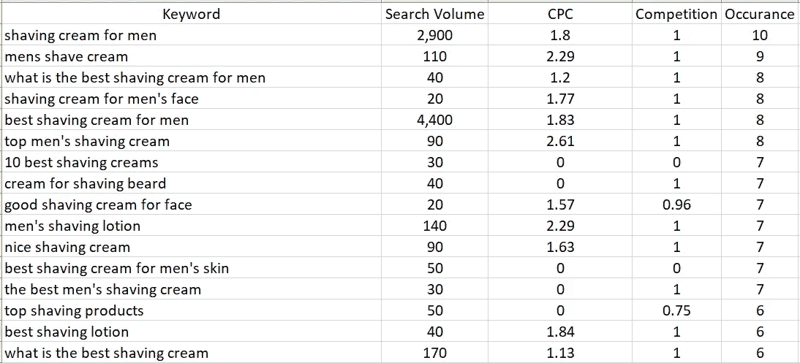

# 利用语义关键词研究加速你的搜索引擎优化

> 原文：<https://medium.com/nerd-for-tech/leveraging-semantic-keyword-research-to-expedite-your-seo-2b0a2f4861e3?source=collection_archive---------2----------------------->

你很少会发现一个网页上某个令人垂涎的关键词排在首位，而类似的排名关键词却不会同时排在不同的位置。作为 SEOs，我们希望创建针对特定查询的内容，同时吸引与核心关键字相似的术语。为了找到这些相互关联的关键词，我们经常不得不去搜索 SERP 的“人们也搜索”部分，或者利用第三方平台的关键词研究工具。但是，这些方法范围有限，缺乏可扩展性，并且会让我们对这些数据有更多的需求。相反，我们可以利用 Python 为我们提供一个更简化的解决方案。

这个剧本的想法是在我的两个前同事的一次谈话中产生的，我碰巧偷听了他们的谈话。在围绕“ADHD 测验”讨论搜索时，我们旨在解释用户搜索的真实意图，并找出用户寻求理解 ADHD 症状的其他方式。用户可以搜索“ADHD 测验”,以查看他们是否患有 ADHD。话说回来，搜索“多动症测验”可以被看作是围绕你的多动症知识的搜索，如果你正在寻找诊断别人，或者如果你试图了解更多关于多动症的信息，而自己却没有。我们如何区分查询以了解它们的相关性，以及我们如何量化这些学习以加速关键字研究和关键字洞察收集？我把那次谈话更多地看作是一次挑战，并开始尝试。

为此，我们的目标是模仿谷歌对关键词的解释，以及它们如何将多个查询连接到一个结果。通过输入核心术语，我们将收集排名靠前的结果，我们将收集与 SERP 列表相关联的排名靠前的关键词，寻找与这些结果相关联的排名靠前的列表结果，然后量化与原始第一输入的相关性。换句话说，让我们创建一个主要术语到其他相关术语的蜘蛛网，看看 Google 在我们的搜索中还有哪些相关查询。

## 入门指南

为了做到这一点，我们将使用 SEMRush API(我是这个 API 的一个巨大的、没有报酬的拥护者)。注意，在这个脚本中，API 信用的使用可能会根据所使用的原始输入关键字而有所不同。在函数中已经放置了安全措施来限制信用使用，但是我已经看到这个脚本为更密集的项目消耗了许多 API 信用。

我们将从导入必要的库和函数开始。

*   build_seo_urls():允许我们 ping SEM rush API 并返回关键字的前 10 个结果。
*   parse_response():用于从 SEMRush API 调用中提取数据的解析器。
*   url _ org():ping SEM rush API，为我们提供给定 URL 的位置 1-10 的每个关键字。
*   secondary_later():贯穿我们的整个过程，通过 url_org()在我们的 URL 集合中收集关键字。
*   third_layer_setup():进行第二阶段，并将其与核心结果进行比较，通过出现次数计算语义相似的关键字的相关性。

## 运行脚本

您需要将您的 SEMRush API 键添加到 *api_key* 变量中，并将 *build_seo_urls* 中的“数据库”键设置为您希望搜索的任何市场。

该脚本的核心大约有 15 行，其中每个函数将以类似蜘蛛的方式执行。当您运行脚本时，通过输入开始输入您的起始关键字。一旦脚本运行，它将告诉您它可以找到多少语义相似的关键字，并将文件导出到一个 CSV 文件中，相关搜索量和出现分数为 1 到 10。您的起始查询将始终得到 10 分(10 个 URL 中的 10 个对您的原始输入进行排名，因为…您知道…那是我们开始的地方)。从那里，它会用同样的概念给你一个分数。

我在这个脚本中利用的经验法则是，任何出现分数高于 7 的关键字都与您的源高度相关。6 到 3 提供了更多的内容机会或新的探索领域。2 到 1 让您对原始查询的整体空间中的其他相关搜索有一个很好的了解。

## 结论

这个脚本有许多超越传统 SEO 研究的用例。从快速关键字探索(新业务计划、企业级关键字研究和对您来说全新的研究查询经常需要)、内容构思、围绕特定搜索子集测量消费者情绪以及为训练聚类模型收集数据，世界都是您的！完整的脚本，请通过[我的 GitHub](https://github.com/DerekHawkins/semantic_keyword_research_tool/tree/main) 查看！

考虑更多自动化的关键字研究方式？查看我关于通过 API 自动化关键词搜索的文章，或者通过我的 [LinkedIn](https://www.linkedin.com/in/derek-hawkins-seo/) 或 [Twitter](https://twitter.com/Derek_M_Hawk) 联系我！