# 漂浮的中国灯笼

> 原文：<https://medium.com/nerd-for-tech/levitating-chinese-lantern-99da0fc7a463?source=collection_archive---------18----------------------->

新年快樂 — Happy New Year!

在 T3ch 电影公司，我们不能在没有一点科技转折的情况下过农历新年…所以我们做了一个漂浮的中国灯笼！这是一个非常新奇的项目，有点取悦大众。这将是任何农历新年庆祝活动，甚至中秋节庆祝活动的一个精彩有趣的补充！

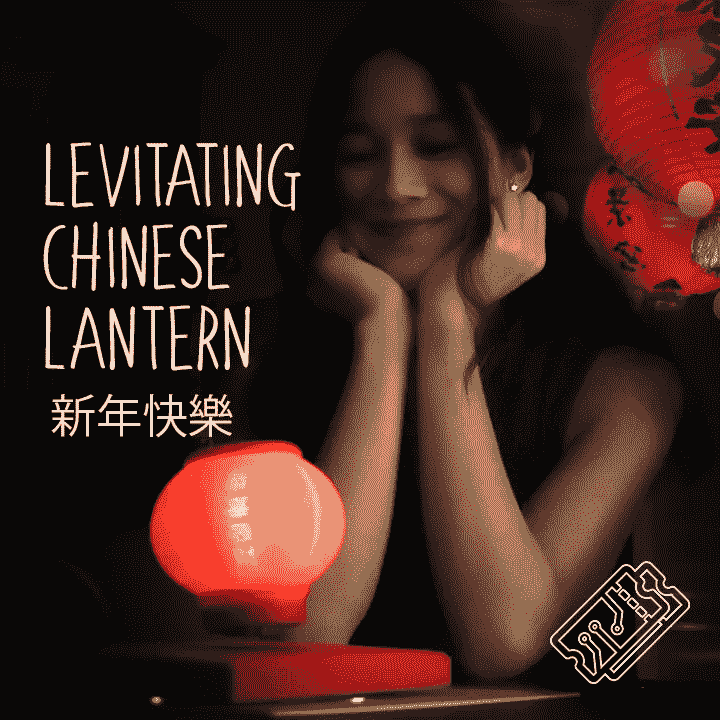

# 供应品:

*   n 沟道金属氧化物半导体场效应晶体管
*   2X100 欧姆电阻器
*   [电线](http://rover.ebay.com/rover/1/710-53481-19255-0/1?ff3=4&pub=5575540948&toolid=10001&campid=5338601033&customid=&mpre=https%3A%2F%2Fwww.ebay.co.uk%2Fitm%2F1-x-Rapid-22m-Single-Core-Wire-Pack-11-x-2m-Each-Colour-Breadboard-Wire-Solid%2F323642257045%3Fhash%3Ditem4b5a94ee95%3Ag%3AzHsAAOSwzFhcNjdZ)
*   电源
*   [磁悬浮模块和磁铁](http://rover.ebay.com/rover/1/710-53481-19255-0/1?ff3=4&pub=5575540948&toolid=10001&campid=5338601033&customid=&mpre=https%3A%2F%2Fwww.ebay.co.uk%2Fitm%2F1Magnetic-Levitation-Machine-Core-DIY-Kit-Magnetic-Levitation-Module-w-LED-Lamp%2F283427479483%3Fhash%3Ditem41fd981fbb%3Ag%3AXsQAAOSwwFlclZe7)
*   [红色 LED](http://rover.ebay.com/rover/1/710-53481-19255-0/1?ff3=4&pub=5575540948&toolid=10001&campid=5338601033&customid=&mpre=https%3A%2F%2Fwww.ebay.co.uk%2Fitm%2F1W-3W-High-Power-PCB-Star-LED-Aquarium-Grow-Light%2F254365146830%3Fvar%3D553933196976%26hash%3Ditem3b39581ece%3Ag%3A6TIAAOSw8t5dhJi3)
*   [3D 打印零件](https://www.thingiverse.com/thing:4125557)
*   [3D 打印机](https://amzn.to/2RTU64m)

> [🔗在 Github 上获取漂浮的中国灯笼文件📔](https://github.com/sk-t3ch/levitating-chinese-lantern)

# 辅导的

# 无线供电的 LED

我们从解决无线供电的 LED 开始，这是我确信我的 GCSE 物理老师会喜欢的东西。

我们制作了两个线圈，一个是 18 匝，另一个是 21 匝，方法是将电线缠绕在一支笔上，然后用胶水喷涂到位，这样它们就能保持形状。

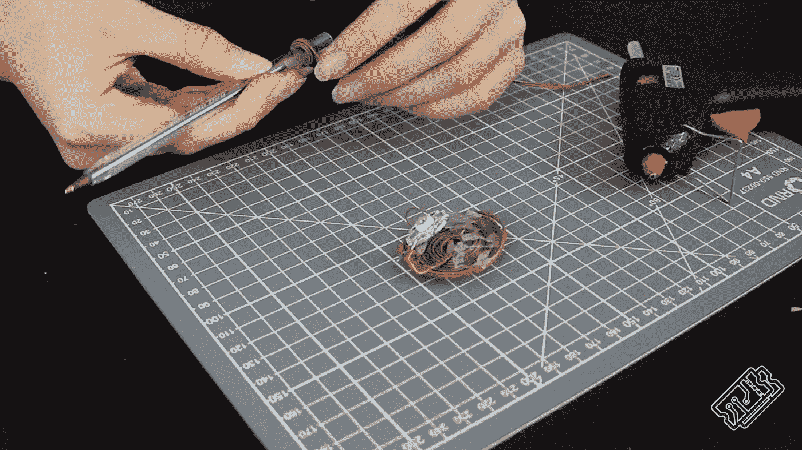

然后，我们将 18 匝线圈连接到 mosfet 和电阻，如图所示。

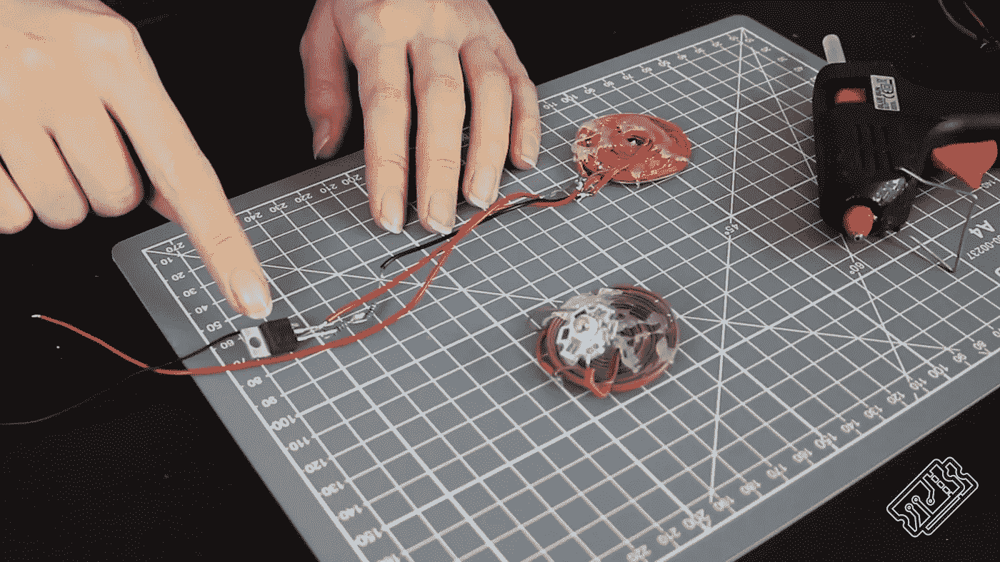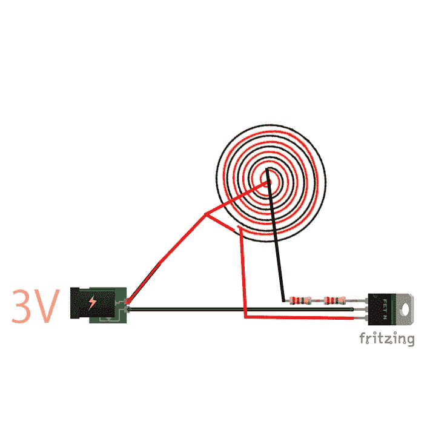

接下来，我们将另一个线圈连接到 LED，如下所示。

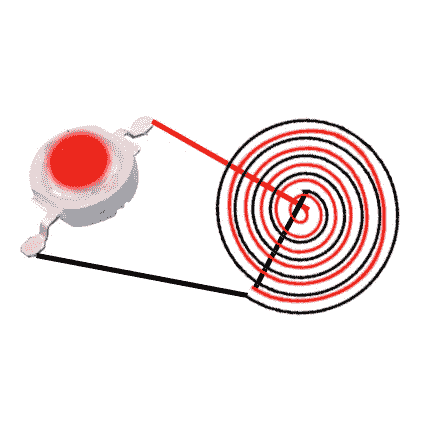

当你把一个线圈靠近另一个线圈，并打开电源，发光二极管通电。

**注意:**这种充电器耗电量大(3V 时为 2.5A)，但传输距离比市面上的 QI 无线手机充电器要远得多。其他产品的用电量似乎要低得多，因此有更高效的方法来为其供电，但我们选择了一种有趣的概念验证方法，而不是您所能获得的最佳方法。

# 灯笼

我们 3D 打印了我们自己的中国灯笼，上面印有两个短语:

*   新年快樂 — Sun neen fai lok (Happy New Year)

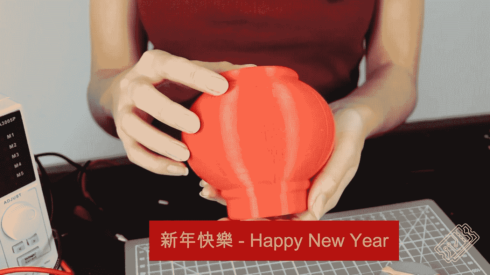

*   恭喜發財 — Gong hai fat choi (Wish you prosperity)

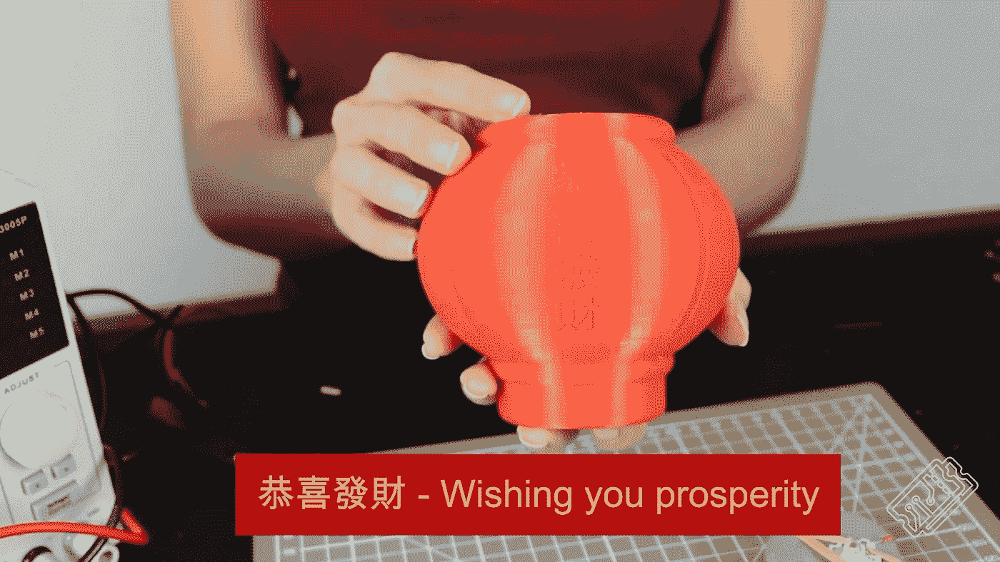

当灯笼内部有 LED 时，浮雕字母和线条会显得更亮。

# 放在一起

我们用橡皮筋把线圈绑在磁铁上，然后把它放进灯笼的底部。

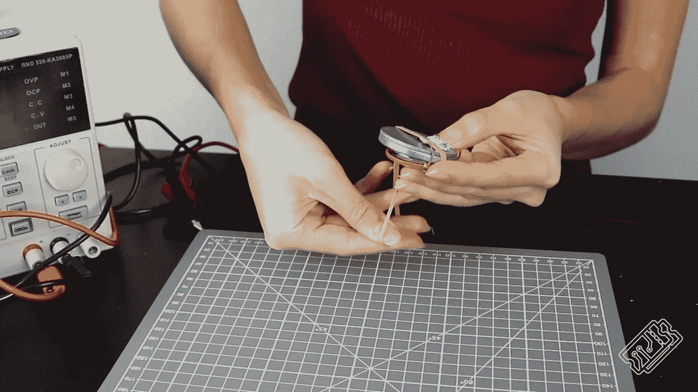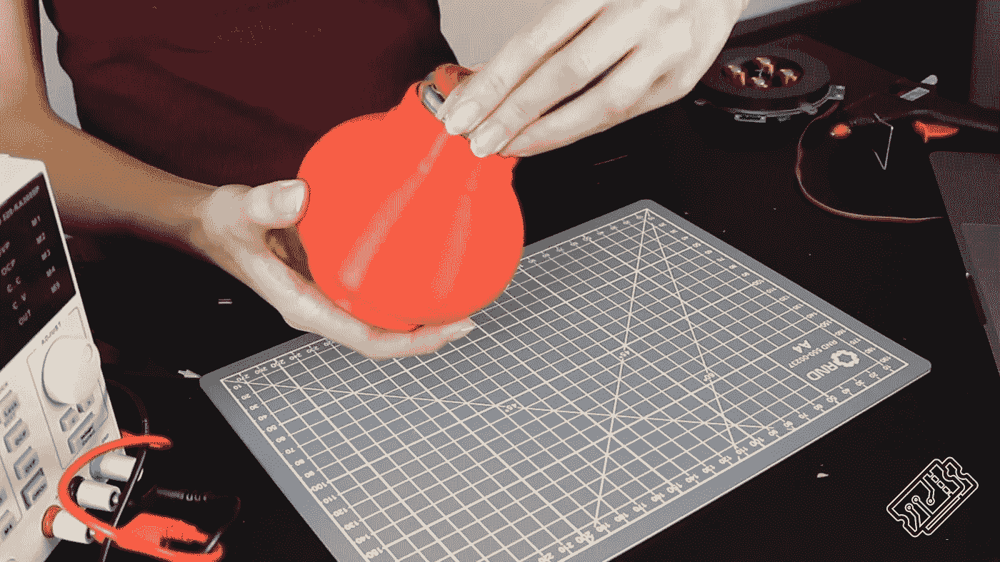

我们用绝缘胶带牢牢固定了无线电力发射器。

我们还 3D 打印了一个基础件来覆盖磁悬浮模块和发射器。

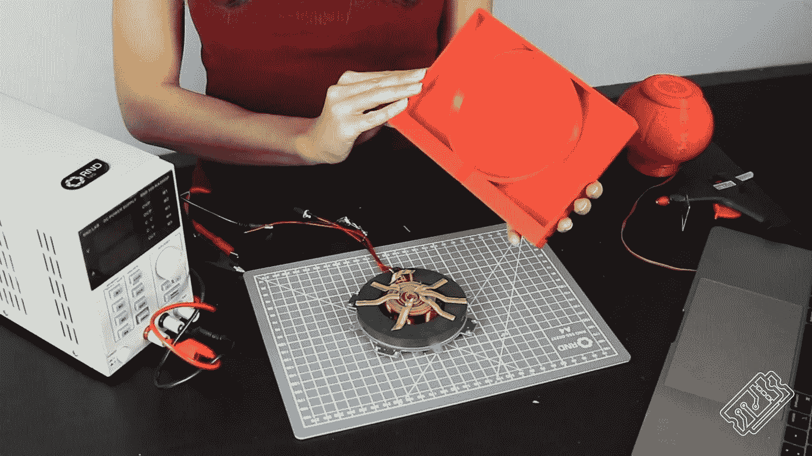

# 欣赏

所以现在，如果我们把所有的东西都通电…你会看到美丽的灯笼在漂浮！真实生活悬浮！！

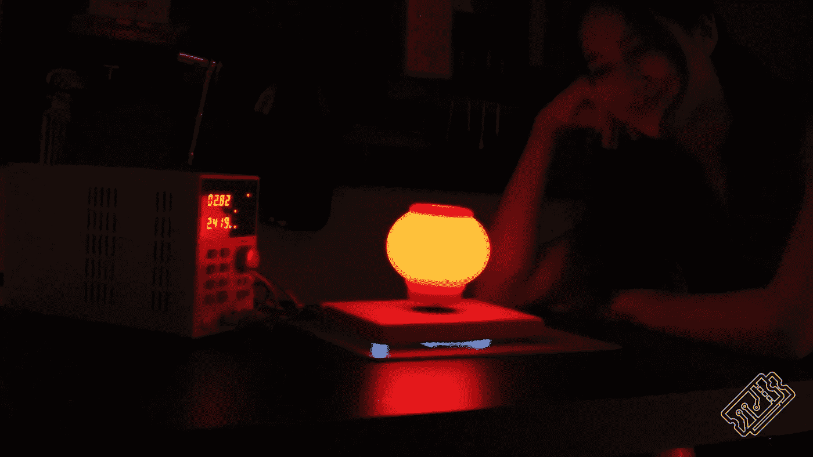

> [🔗在 Github 上获取漂浮的中国灯笼文件📔](https://github.com/sk-t3ch/levitating-chinese-lantern)

# 感谢阅读

我希望你喜欢这篇文章。如果你喜欢这种风格，请查看 T3chFlicks.org 的，获取更多以科技为重点的教育内容( [YouTube](https://www.youtube.com/channel/UC0eSD-tdiJMI5GQTkMmZ-6w) 、 [Instagram](https://www.instagram.com/t3chflicks/) 、[脸书](https://www.facebook.com/t3chflicks)、 [Twitter](https://twitter.com/t3chflicks) )。