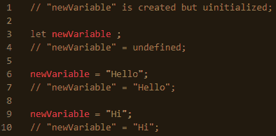
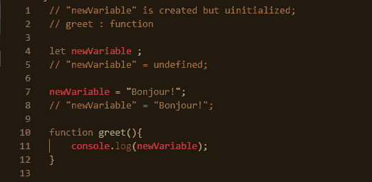
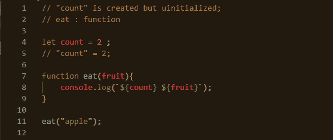

# 词法环境:闭包之前的必读内容

> 原文：<https://medium.com/nerd-for-tech/lexical-environment-6b4363f38db?source=collection_archive---------0----------------------->

在 JavaScript 中，你一定多次听说过术语**词法环境**。

> **那么这个词法环境是什么呢？**

"**词法环境"**基本上是一个规范对象，它存储了标识符与其函数和变量的关联。

每个变量、函数和代码块都有自己的*词汇环境*。

把词法环境考虑成两部分:
1。 ***环境*** :存储**的所有局部变量和值。
2。 ***引用*** :对其被创造的外部环境的引用。**

**让我们更详细地研究变量和函数。**

# **案例 A:变量**

**在下图中，注释解释了*词汇环境。***

****

***变量*的词法环境示例**

*   **当脚本开始运行时，全局*词法环境*被预先填充了内部声明的变量，但是所有变量都没有初始化，所有变量对外部环境的引用为空。**
*   **当它到达第`let newVariable ;`行时，我们可以用这个变量初始化它，因为它现在是`undefined`。**
*   **现在我们给`newVariable = "Hello";`赋值，并且*词汇环境*也得到更新。**
*   **然后，我们再次将值更改为`newVariable = "Hello";`，从而更新*词汇环境*。**

# **案例 B:功能**

> **函数甚至在声明之前就可以使用了，因为它们在脚本运行时会被立即初始化。**

****

***变量* *和函数*的词法环境示例**

**当一个函数运行时，一个*词法环境*被创建来存储它的局部变量和它们的值，并且*引用*到它被创建的外部环境。**

**函数首先在内部词法环境中搜索变量，如果没有找到，就移动到外部环境，以此类推，直到找到全局环境。**

****

***输出:***

**这里，函数`eat`在其*词法环境*中有变量`fruit`，但是在其*词法环境*中没有找到`count`，所以它利用*对外部*词法环境*的引用*来搜索`count`，并最终找到了它。因此，输出是`2 apple`。**

***注意:使用函数表达式语法，函数不会被立即初始化，直到脚本为它们点击“* `let` *”关键字后才能使用。*
`let eat = function(fruit){console.log(`Eat ${fruit}!`);}`**