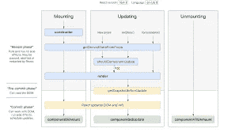

# 反应的生命周期

> 原文：<https://medium.com/nerd-for-tech/life-cycle-of-react-82089aa28b74?source=collection_archive---------24----------------------->

Muo 适马班级| Piyush Bajpai

嗨，伙计们，我希望你们做得很好。在这个博客中，我们将学习一个非常重要的话题，即 react native | react 的生命周期。

什么是生命周期？
好的，这是一个非常令人惊讶的问题。生命周期意味着一个循序渐进的过程。

意味着什么？

一个生命周期是一系列事件的过程，这些事件使一个新产品出现，并跟随它成长为一个成熟的产品，并最终达到临界质量和衰退。产品生命周期中最常见的步骤包括产品开发、市场引入、成长、成熟和衰退/稳定。

react 的生命周期？
React 中的每个组件都有一个生命周期，您可以在它的三个主要阶段对其进行监控和操作。

这三个阶段是:安装、更新和卸载。

让我们来理解 react 中的生命周期。

当一个组件的实例被创建并插入到 DOM 中时，这些方法按以下顺序被调用:

*   构造函数()
*   静态 getDerivedStateFromProps()
*   渲染()
*   componentDidMount()

> *注:*
> 
> *这些方法被认为是遗留的，你应该在新代码中避免使用它们:*

UNSAFE_componentWillMount()

## 更新

属性或状态的更改可能会导致更新。当组件被重新渲染时，按以下顺序调用这些方法:

*   静态 getDerivedStateFromProps()
*   `shouldComponentUpdate()`
*   **render()**
*   getSnapshotBeforeUpdate()
*   **componentDidUpdate()**

> *注:*
> 
> *这些方法被认为是遗留的，你应该在新代码中避免它们:*

*   UNSAFE_componentWillUpdate()
*   UNSAFE _ componentWillReceiveProps()

## 卸载

当组件从 DOM 中移除时，调用此方法:

*   **componentWillUnmount()**

## 错误处理

当呈现过程中、生命周期方法中或任何子组件的构造函数中出现错误时，将调用这些方法。

*   静态 getDerivedStateFromError()
*   componentDidCatch()

要了解更多关于 react native 的信息，请访问我的 youtube 频道并点击这里。

 [## Muo sigma 类

### 喜欢分享和订阅这个频道你好技术爱好者，这里是我的频道，这将帮助你学到很多东西…

www.youtube.com](https://www.youtube.com/c/Muosigmaclasses) 

谢谢