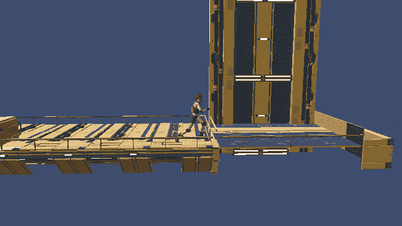
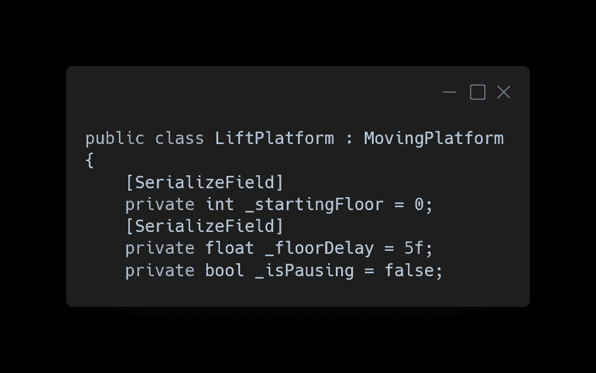
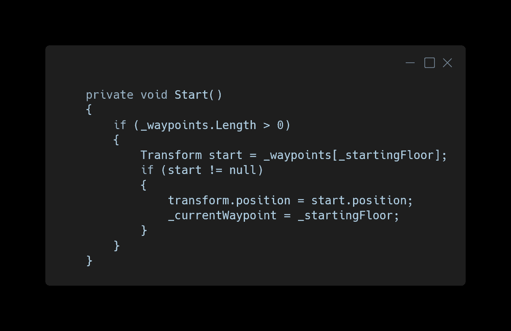
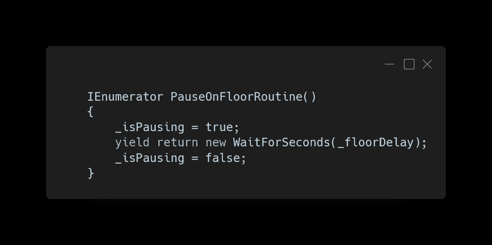
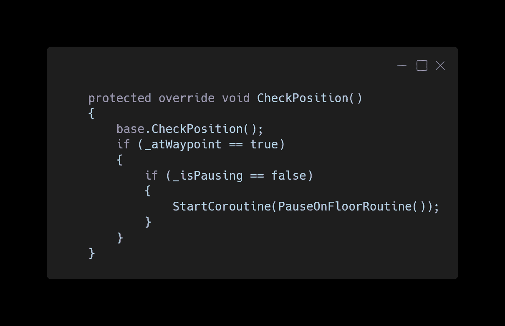
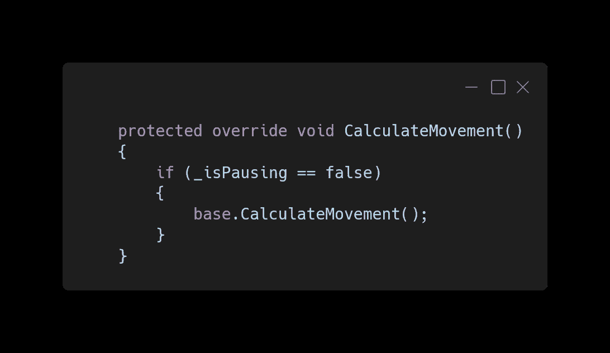
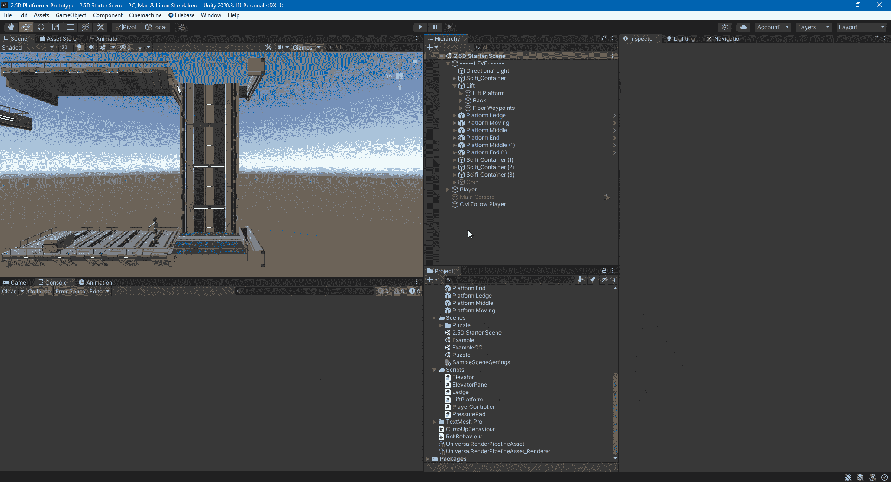
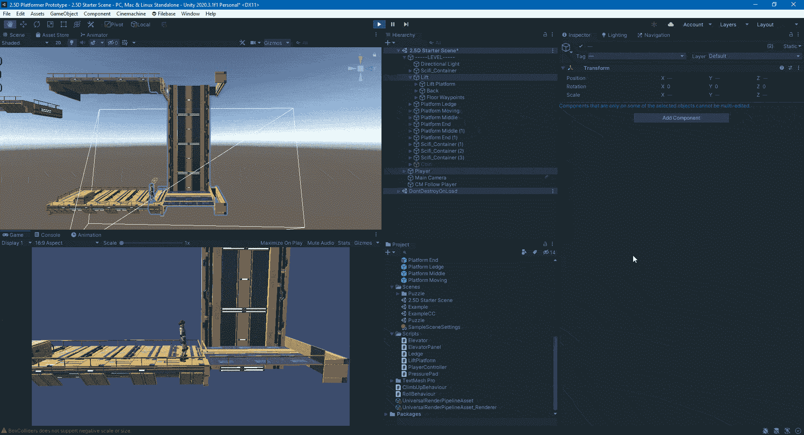
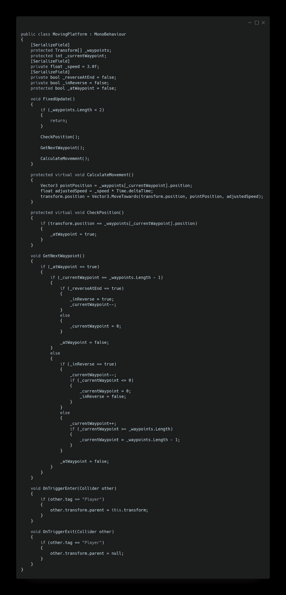

# 升降机平台

> 原文：<https://medium.com/nerd-for-tech/lift-platform-19c9d704cd49?source=collection_archive---------13----------------------->

本文将展示如何制作一个升降平台，它可以从一个楼层移动到另一个楼层，并在每个楼层停留一段时间。因为这个功能类似于前一篇文章中的[的移动平台，所以 Lift 将继承那个脚本。](/nerd-for-tech/moving-platform-refactor-61cc572d4ea6)

LiftPlatform 脚本需要一些变量来改变继承的 MovingPlatform 的功能。

1.  游戏开始时电梯将开始的楼层航路点。
2.  移动到下一楼层前的延迟时间。
3.  用于知道电梯当前是否停在到达的楼层。

在 Start 中，我们将电梯设置为起始楼层航点，如果有航点并且航点存在，则将当前航点索引更改为起始楼层。

为了让电梯在到达某一楼层时暂停，我们需要一个简单的协程程序，将暂停 bool 更改为 true，然后在延迟后返回 false。

接下来，我们通过覆盖 CheckPosition 方法来添加它，并且在基本方法运行以启动协程之后，如果升降机在当前航路点，则暂停升降机的移动。

然后，如果协程正在运行，为了阻止升降机移动，我们覆盖 CalculateMovement 方法，并且只允许基本方法在升降机没有暂停时运行。

升降台有一个箱式碰撞器，它被设置成一个类似移动平台的刚体触发器。但是，楼层航点是平台的边缘部分，所以当电梯到达该楼层时会很好地排列。

电梯现在在楼层之间移动，并在每个楼层暂停。

这是继承的 MovingPlatform 脚本，供参考。关于继承的更多内容，你可以看[上一篇文章](https://kwpowers.medium.com/converting-the-enemy-to-an-abstract-class-9bc2759d4990)。

