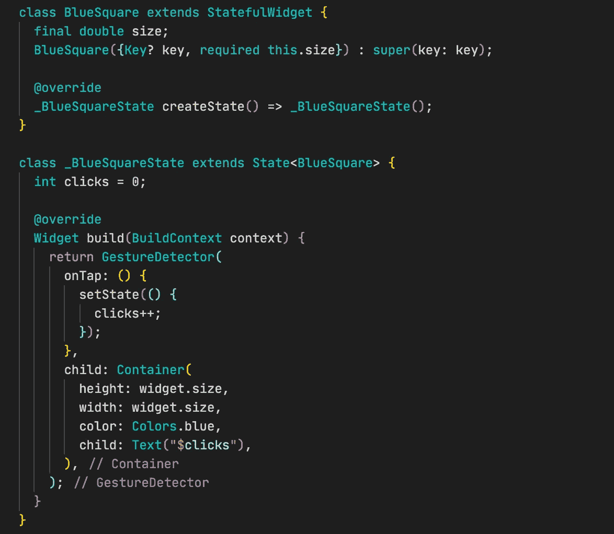
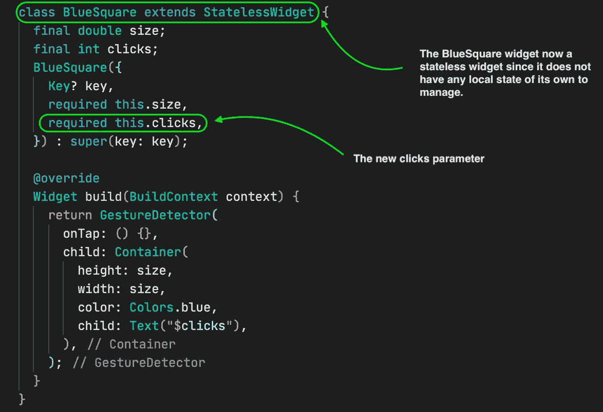
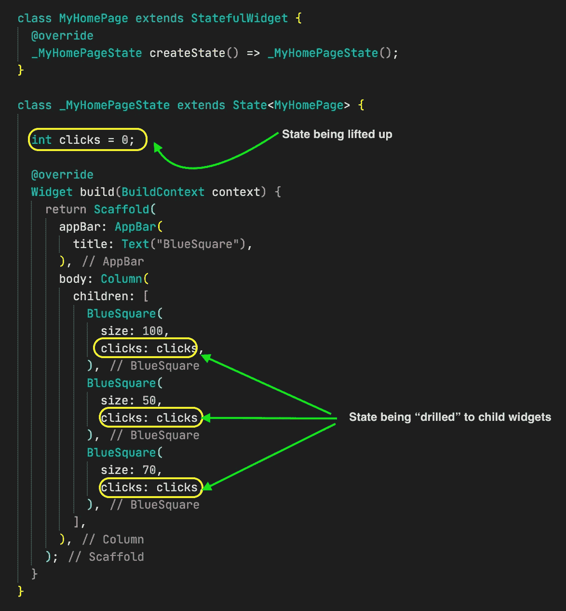
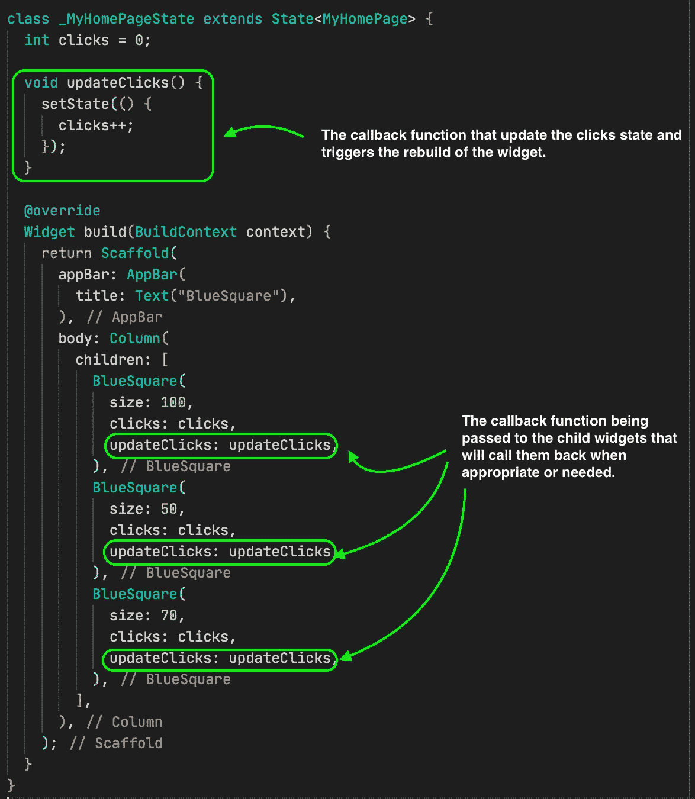
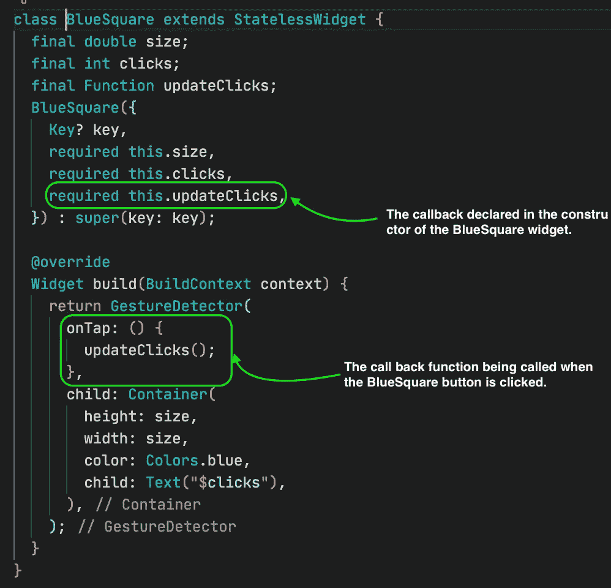

# 提升状态和回调

> 原文：<https://medium.com/nerd-for-tech/lifting-state-up-and-callbacks-7a19d0bdbe53?source=collection_archive---------1----------------------->

# 颤振状态管理编年史 4

所以我今天想写关于继承的窗口小部件，但是意识到提升状态和回调的概念对于更好地理解继承的窗口小部件和为继承的窗口小部件打下适当的基础可能是至关重要的，所以我从这里开始。

状态管理有点有趣，它给我们的代码带来了更多的活力，使我们的编程更具反应性。

> 然而，使用有状态小部件和 flutter 钩子的状态管理更多地处理本地状态；其中改变的状态或信息仅被绑定到一个小部件，并且在任何其他地方都没有用(需要)，因此对该状态的改变仅影响它所绑定的那个小部件的重建。

但是如果我们需要一个依赖于多个小部件的状态呢？如果我们想要一个状态，当它改变时，触发依赖它的所有小部件的重建，那该怎么办？

比方说，我们有一个显示点击次数的 BlueSquare 小部件，定义如下

其中方块上的每一次点击都自动用该方块上更新的总点击次数来更新所显示的文本。假设我们想要一组蓝色方块，当其中任何一个被点击时，该组中的所有蓝色方块显示用户点击的累计次数。

这意味着，点击次数不仅仅是一个单独的 blueSquare 对象的局部状态，而是一个依赖于许多其他对象的状态，也可以被多个对象操纵。

***那么我们该如何着手呢？***

> 在 flutter 中，我们有提升状态的概念，这意味着，我们获取一组小部件所依赖的状态，并将其放置在与包含所有这些小部件的父小部件一样高的位置，以便您可以将该状态传递给所有需要它的小部件(这类似于对来自 react 的小部件进行适当钻探的概念)。

修改我们的 BlueSquare 小部件以接受状态“drill ”,这使得小部件不那么复杂，并且它不需要成为有状态的小部件(因为它没有自己的本地状态需要管理)。

然后我们将点击状态转移到父窗口小部件，父窗口小部件自动需要有状态，因为它将管理状态。

到目前为止，这看起来相当不错，我们所有的蓝方都有一个共同的点击量来源，这太神奇了。但是测试代码，很明显，点击任何 blueSquare 对象，我们都没有观察到任何变化。

再看一下代码，我们发现每个 blueSquare 对象的 ontap 函数都没有任何功能，我们不能就这样给它添加一个设置状态，因为它现在是一个无状态小部件。

***实际上，我们正在寻找的是一种能够在有新信息时(例如点击；这将更新轻敲的次数)。***

***那么我们现在如何确保在每个 blueSquare 对象中的点击更新点击状态并触发所有其他 blueSquare 对象的重建呢？***

简单地说，我们如何将信息传递给父小部件？

我们使用回调函数，是的回调函数

这里，我们在父窗口小部件中创建一个函数，并将该函数作为参数传递给子窗口小部件，这些函数使用其参数作为注入信息的手段。或者当从子部件回调时，它在父部件的范围内执行在其中定义的代码，并且它可以访问和控制父部件中的变量、参数和状态。

基本上，我们已经在主父窗口小部件中创建了一个函数来保存我们所有的 BlueSquare 窗口小部件，该函数被定义为更新 setState 方法中的 clicks 变量的值，这样它就可以触发父类的重新构建，并随之重新构建所有脏的子窗口小部件。

我们将函数作为参数传递给所有 BlueSquare 函数，在 BlueSquare 小部件中使用时，它位于 onTap 函数中，等待用户点击它以便调用它。

这非常有效，有助于我们处理这样的情况:一个父窗口小部件包含了它的几个子窗口小部件所依赖和修改的数据，这依赖于它们的布局，因此需要重新构建。

正如我们所看到的，试图以这种方式实现非本地化状态管理的小部件之间存在很强的耦合，例如，如果将来发生了什么事情，我们不需要 BlueSquare 对象来显示点击次数，我们需要修改 BlueSquare 小部件，我们还需要修改父小部件的实现，如果我们在一个大项目中有一些复杂的状态和多个级别，这将是一项非常繁琐的工作。

也

我们可以看到开始有太多的钻取，假设我们在 BlueSquare 小部件中有一个小部件，它也需要修改和访问点击次数，如果它也需要，有时一些中间小部件可能不需要点击值，但如果一个子小部件需要，我们将需要通过中间值钻取点击值(即使它不需要)，直到我们找到真正需要它的小部件。这就成了问题。

在我们的下一篇文章中，我们将研究如何用继承的小部件解决这样的问题。