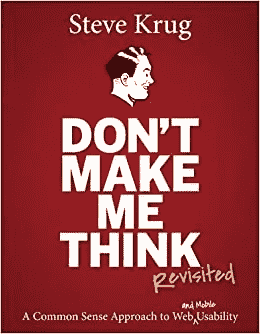
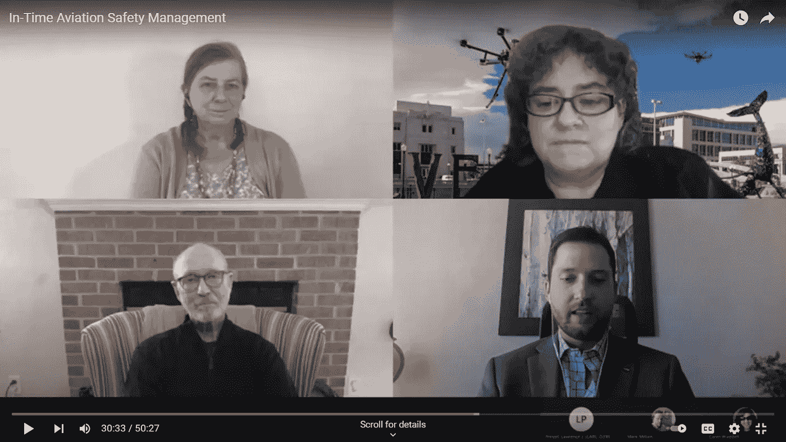

# 像 Misty 一样，专业人士说他们需要的技术功能

> 原文：<https://medium.com/nerd-for-tech/like-misty-professionals-say-the-tech-enabled-features-they-need-4c2c3a5f8a2c?source=collection_archive---------11----------------------->

## 用户体验和特征发现方法的例子

用户在使用一个应用程序自然地完成他们的工作时，经常会说出他们需要的特性。用户筛选不是把潜在用户带到实验室，看他们使用你的技术产品或服务，而是当他们在自己的环境中使用时，从他们那里获得洞察力。我想这也是专业的 UX 专家说的，比如我读过的史蒂夫·克鲁格。

[大卫·克鲁格别让我思考](https://www.amazon.com/Dont-Make-Me-Think-Usability/dp/0321344758)

这就是[米丝蒂·戴维斯](https://twitter.com/MistyDavies)在下面的视频中给出的例子

因为在与同行讨论航空安全并与我们分享以供学习时，她同时指出了她用于在线会议的平台的一个必要功能。她立即表示，这对我们来说很不幸，因为我们无法点击她提供的链接，因为她向我们展示的幻灯片是视频流，可能使用了 Zoom conference 应用程序。我不确定平台，但这里是截图

Misty Davies 是完全正确的会议应用程序，它应该可以，而且必须流式传输真实的幻灯片，这样我们观众就可以直接复制内容，点击其中的链接，或者做任何我们想做的事情。但是大多数会议平台只是向我们展示幻灯片的视频。

然后 Misty 向您强调了一个功能或整个会议平台，以构建一个将呈现允许这些 CRUD 操作的幻灯片的平台。

我认为没有团队会议平台允许这个功能，但如果有，请让我知道和学习。

此外，你应该让发言者的名字总是很容易地打印在他们的视频盒上，因为我花了很多时间来寻找 Misty 的名字，她是一个专业知识的人，像我这样的学习者，你可能很容易找到并与她的工作联系起来。

及时的航空安全管理

最后，我知道 Mistie 为美国国家航空航天局工作，她是一名博士和新妈妈。

【https://www.youtube.com/watch?v=rbnZYYN7p8A 

我希望并祝愿 Misty 事业成功，为人父母愉快，因为这两者与用户体验同等重要，而用户体验正是本文的主题，也可以被视为 Greyio Heart Experiment 的一篇文章，这是一项旨在突出女性工作(主要是软件工程师)的出版实验。

更多关于 Greyio 心脏实验的信息[请点击](https://mkrdiop.medium.com/list/greyio-heart-experiement-6676cc9f1f96)

PS: 在 youtube 这样的视频平台上观察用户，你会获得许多技术支持功能的想法，这些功能可以构建到你的平台中，或者作为一个独立的平台。